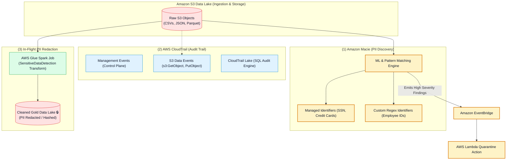
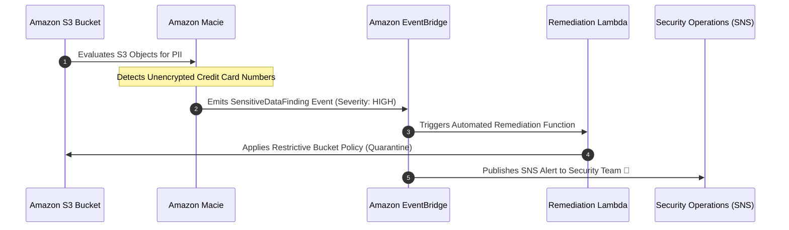
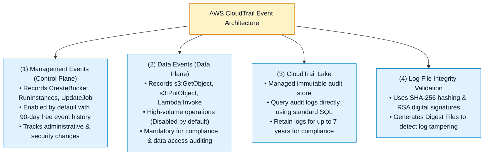
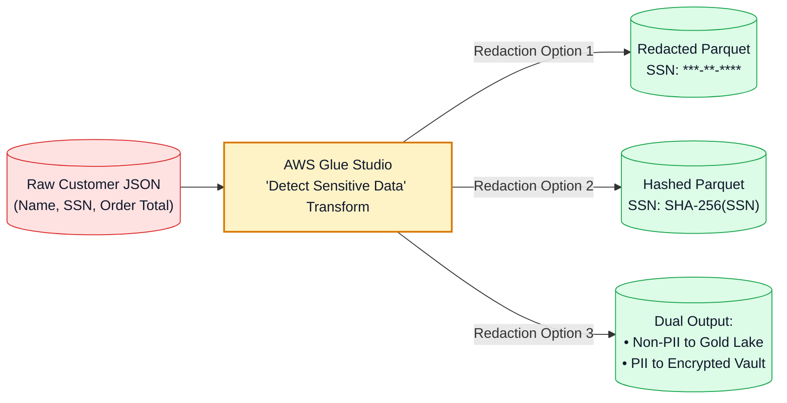

# 🔍 Amazon Macie, AWS CloudTrail & PII Compliance Governance

- **Category**: Security, Identity, & Compliance / Sensitive Data Discovery, Audit Logging & PII Governance
- **Language / ဘာသာစကား**: [English (Original)](/en/02-services/security-governance/macie-and-cloudtrail) | **မြန်မာဘာသာ (Burmese)**
- **Primary Use Case**: Amazon S3 အတွင်းရှိ ထိခိုက်လွယ်သော Personally Identifiable Information (PII) များကို အလိုအလျောက် ရှာဖွေဖော်ထုတ်ခြင်း (Amazon Macie)၊ API လုပ်ဆောင်ချက်များနှင့် data access များကို ပြင်ဆင်ပြောင်းလဲ၍မရအောင် audit မှတ်တမ်းတင်ခြင်း (AWS CloudTrail)၊ နှင့် data pipeline စီးဆင်းနေစဉ်အတွင်း PII များကို mask ပြုလုပ်ခြင်း (AWS Glue Sensitive Data Detection)။
- **Slide Reference**: `[AWSCertifiedDataEngineerSlides.pdf](/docs/AWSCertifiedDataEngineerSlides.pdf)` ရှိ စာမျက်နှာ 630–670
- **Hub Links**: `[[mm/index|index]]` | `[[mm/00-hub/service-catalog|service-catalog]]` | `[[mm/01-domains/domain-4-data-security-and-governance|domain-4-data-security-and-governance]]` | `[[mm/02-services/storage/s3/s3|s3]]` | `[[mm/02-services/analytics-streaming/glue/glue|glue]]` | `[[mm/02-services/networking-monitoring/cloudwatch-and-eventbridge|cloudwatch-and-eventbridge]]`

---

## 1. High-Level Summary (အကျဉ်းချုပ်)

လုပ်ငန်းသုံး (Enterprise) data engineering pipeline များသည် တင်းကျပ်သော စည်းမျဉ်းစည်းကမ်း လိုက်နာမှုဆိုင်ရာ compliance framework များ (ဥပမာ- **GDPR, HIPAA, PCI-DSS, နှင့် SOC 2**) ကို မဖြစ်မနေ လိုက်နာရမည်ဖြစ်သည်။ 

**AWS Certified Data Engineer - Associate (DEA-C01)** စာမေးပွဲအတွက် compliance governance သည် အပြန်အလှန် အထောက်အကူပြုသော အဓိက စွမ်းဆောင်ရည် ၃ ခုအပေါ်တွင် အဓိက အခြေခံထားသည်-
1. **Automated Sensitive Data Discovery (Amazon Macie)**: Machine learning ကို အသုံးပြု၍ Amazon S3 data lake များကို scan ဖတ်ပြီး encrypt လုပ်မထားသော PII၊ ဘဏ္ဍာရေးဆိုင်ရာ ဒေတာများနှင့် credentials များကို ရှာဖွေဖော်ထုတ်ခြင်း။
2. **Operational & Data Plane Auditing (AWS CloudTrail)**: AWS account တစ်ခုလုံးရှိ data resource များကို မည်သူက access လုပ်ခဲ့သည်၊ ပြင်ဆင်ခဲ့သည် သို့မဟုတ် ဖျက်ပစ်ခဲ့သည်ကို ခြေရာခံ audit မှတ်တမ်းတင်ခြင်း။
3. **In-Pipeline PII Redaction & Masking**: ဒေတာများသည် analytics data store များသို့ မရောက်ရှိမီ **AWS Glue Sensitive Data Detection** နှင့် **Amazon AppFlow** တို့ကို အသုံးပြု၍ ထိခိုက်လွယ်သော attribute များကို ဖယ်ထုတ်ခြင်း သို့မဟုတ် ဖုံးကွယ် (mask) ပေးခြင်း။

---

## 2. Amazon Macie Deep Dive (Sensitive Data Discovery)

**Amazon Macie** သည် **Amazon S3** အတွင်းရှိ ထိခိုက်လွယ်သော sensitive data များကို ရှာဖွေဖော်ထုတ်ခြင်း (discover)၊ အမျိုးအစားခွဲခြားခြင်း (classify) နှင့် ကာကွယ်ခြင်း (protect) တို့အတွက် machine learning နှင့် pattern matching တို့ကို အသုံးပြုသည့် fully managed data security နှင့် privacy ဝန်ဆောင်မှုတစ်ခု ဖြစ်သည်။

### Discovery Modes (ရှာဖွေဖော်ထုတ်သည့် ပုံစံများ):
1. **Automated Sensitive Data Discovery**: ကုန်ကျစရိတ် သက်သာစွာဖြင့် သင်၏ S3 bucket အားလုံးကို အချိန်နှင့်တစ်ပြေးညီ စဉ်ဆက်မပြတ် စစ်ဆေးပေးပြီး interactive sensitive data heat map တစ်ခုကို တည်ဆောက်ပေးသည်။
2. **Sensitive Data Discovery Jobs**: သတ်မှတ်ထားသော bucket များ၊ object prefix များ သို့မဟုတ် S3 tag များပေါ်တွင် ပစ်မှတ်ထား၍ အသေးစိတ် နက်ရှိုင်းစွာ scan ဖတ်ပေးသည့် jobs များဖြစ်သည် (ဥပမာ- လွန်ခဲ့သော ၂၄ နာရီအတွင်း upload ပြုလုပ်ထားသော Parquet file အသစ်အားလုံးကို scan ဖတ်ခြင်း)။

### Detection Types (စစ်ဆေးဖော်ထုတ်သည့် အမျိုးအစားများ):
- **Managed Data Identifiers (MDIs)**: အောက်ပါတို့အတွက် ထည့်သွင်းပေးထားပြီးဖြစ်သော built-in detection algorithm များဖြစ်သည်-
  - *PII*: Social Security Numbers (SSN)၊ နိုင်ငံကူးလက်မှတ်များ (passports)၊ နိုင်ငံသားစိစစ်ရေးကတ်များ (national IDs)၊ ယာဉ်မောင်းလိုင်စင်များ (driver's licenses)။
  - *Financial Information*: Credit card နံပါတ်များ၊ ဘဏ်စာရင်းနံပါတ်များ (IBAN)၊ အခွန်ဆိုင်ရာ ID များ (tax IDs)။
  - *Credentials*: AWS secret access keys များ၊ private encryption keys များ၊ API tokens များ။
- **Custom Data Identifiers (CDIs)**: လုပ်ငန်းအဖွဲ့အစည်းဆိုင်ရာ သီးသန့် proprietary data များကို ဖော်ထုတ်ရန် Data Engineer မှ သတ်မှတ်ပေးထားသော custom regular expression (regex) pattern များဖြစ်သည် (ဥပမာ- `EMP-[0-9]{6}` ပုံစံဖြင့် ဝန်ထမ်းကတ် ID များ)။

### Event-Driven Remediation Architecture (Event အခြေခံ အလိုအလျောက် ဖြေရှင်းဆောင်ရွက်မှု ဗိသုကာ):

---

## 3. AWS CloudTrail Deep Dive (Audit Logging & Governance)

**AWS CloudTrail** သည် သင်၏ AWS infrastructure တစ်ခုလုံးတွင် user များ၊ IAM role များ သို့မဟုတ် AWS service များက ပြုလုပ်သော API လုပ်ဆောင်ချက် (actions) အားလုံးကို မှတ်တမ်းတင်ထားပေးသည်။

### Management Events vs. Data Events နှိုင်းယှဉ်ချက်:

| Dimension (ရှုထောင့်) | Management Events (Control Plane) | Data Events (Data Plane) |
| :--- | :--- | :--- |
| **What It Records (မှတ်တမ်းတင်သည့်အရာ)** | Configuration လုပ်ဆောင်ချက်များ (ဥပမာ- `glue:CreateJob`, `s3:CreateBucket`, `iam:CreateRole`)။ | Object-level လုပ်ဆောင်ချက်များ (ဥပမာ- `s3:GetObject`, `s3:PutObject`, `dynamodb:GetItem`)။ |
| **Default Setting (မူလသတ်မှတ်ချက်)** | AWS account အားလုံးတွင် **Enabled by default** ဖြစ်သည်။ | **Disabled by default** ဖြစ်သည် (သီးသန့် enable ပြုလုပ်ပေးရမည်)။ |
| **Cost (ကုန်ကျစရိတ်)** | ရက် ၉၀ event history အတွက် အခမဲ့ (single trail delivery သည် အခမဲ့ဖြစ်သည်)။ | ပေးပို့သော events ၁၀၀,၀၀၀ လျှင် ကျသင့်ငွေကောက်ခံသည် (\$0.10 / 100k events)။ |
| **Data Engineering Use Case (အသုံးပြုပုံ ဥပမာ)** | Glue Crawler schedule ကို မည်သူက ပြင်ဆင်ခဲ့သည် သို့မဟုတ် S3 bucket ကို မည်သူက ဖျက်ခဲ့သည်ကို ခြေရာခံခြင်း။ | S3 ထဲမှ သီးခြား financial Parquet file တစ်ခုကို မည်သည့် user က download ရယူခဲ့သည်ကို တိကျစွာ audit စစ်ဆေးခြင်း။ |

### CloudTrail Log File Integrity (Log File ခိုင်မာမှု စစ်ဆေးခြင်း):
- မသမာသူများက audit logs များကို ဖျက်ပစ်ခြင်း သို့မဟုတ် ပြင်ဆင်ပြောင်းလဲခြင်းမှ ကာကွယ်ရန် **Log File Integrity Validation** ကို enable လုပ်ရမည်။
- CloudTrail သည် ပေးပို့လိုက်သော log file တိုင်း၏ SHA-256 hash များ ပါဝင်သည့် cryptographic **Digest Files** များကို ရေးသားပေးသည်။ Log ဖိုင်များ မသမာသော ပြင်ဆင်မှု မရှိကြောင်း သချာင်္နည်းအရ သက်သေပြရန် AWS CLI command `aws cloudtrail validate-logs` ကို အသုံးပြုနိုင်သည်။

---

## 4. In-Pipeline PII Detection & Masking Transforms (Pipeline အတွင်း PII ဖော်ထုတ်ခြင်းနှင့် Mask ပြုလုပ်ခြင်း)

ဒေတာများ S3 သို့ ရောက်ရှိပြီးမှ PII ကို စစ်ဆေးခြင်းသည် ဖြစ်ပြီးမှ အရေးယူသော reactive ချဉ်းကပ်မှု ဖြစ်သည်။ Data engineer များသည် data စီးဆင်းနေစဉ်အတွင်း ကြိုတင်ကာကွယ်သော **in-flight proactive PII redaction** ကိုလည်း ထည့်သွင်းတည်ဆောက်ရမည်-

### AWS Glue Sensitive Data Detection:
- AWS Glue Studio နှင့် PySpark (`DetectSensitiveData`) တွင် ပါဝင်သော built-in visual transform ဖြစ်သည်။
- Dataset အတန်း (rows) များကို scan ဖတ်ပြီး PII field များကို အောက်ပါနည်းလမ်းများဖြင့် အစားထိုး/ကိုင်တွယ်ပေးသည်-
  - **Redaction** (ဥပမာ- SSN ကို `***-**-6789` ဖြင့် mask ပြုလုပ်ခြင်း)။
  - **Cryptographic Hashing** (ဥပမာ- deterministic entity matching အတွက် SHA-256 hash ပြုလုပ်ခြင်း)။
  - **Row Exclusion** (ထိခိုက်လွယ်သော အချက်အလက်များ ပါဝင်သည့် rows များကို ပယ်ဖျက်/ဖယ်ထုတ်ခြင်း)။
  - **Entity Extraction** (ထိခိုက်လွယ်သော အချက်အလက်များကို သီးသန့် high-encryption လုံခြုံရေး bucket သို့ လမ်းကြောင်းလွှဲပို့ခြင်း)။

---

## 5. Amazon Redshift Dynamic Data Masking (DDM) & Row-Level Security

Data warehouse များကို query ပြုလုပ်သော SQL analyst များအတွက်-
1. **Dynamic Data Masking (DDM)**:
   - Disk ပေါ်ရှိ physical data ကို ပြောင်းလဲခြင်းမရှိဘဲ query runtime အချိန်တွင် ထိခိုက်လွယ်သော column တန်ဖိုးများကို mask ပြုလုပ်ပေးသည်။
   - *ဥပမာ*: Marketing analyst များအတွက် `XXXX-XXXX-XXXX-1234` အဖြစ် အပြည့်အဝ mask လုပ်ပြပြီး payroll manager များအတွက် မူရင်း plaintext တန်ဖိုးအပြည့်အစုံကို မြင်တွေ့စေခြင်း။
2. **Row-Level Security (RLS)**:
   - သီးခြား view များ သို့မဟုတ် table များ ဖန်တီးရန်မလိုဘဲ SQL session context နှင့် user role များပေါ် မူတည်၍ row များကို ကြည့်ရှုခွင့် ကန့်သတ်ပေးခြင်း။

---

## 6. DEA-C01 စာမေးပွဲအတွက် မဖြစ်မနေသိသင့်သောအချက်များ (DEA-C01 Exam Essentials)

> [!IMPORTANT]
> **Macie & CloudTrail ဆိုင်ရာ အဓိက စာမေးပွဲ အဖြေရွေးချယ်မှု သော့ချက်များ (Key Exam Decision Triggers)**:
>
> - **"Amazon S3 data lake တစ်ခုလုံးရှိ encrypt လုပ်မထားသော PII (credit cards, SSNs) များကို အလိုအလျောက် ရှာဖွေဖော်ထုတ်လိုလျှင်"** $\rightarrow$ **Amazon Macie** ကို ရွေးချယ်ပါ။
> - **"Compliance audit အတွက် S3 data lake ထဲမှ သီးခြား object တစ်ခုကို မည်သည့် IAM role က download လုပ်ခဲ့သည်ကို ခြေရာခံလိုလျှင်"** $\rightarrow$ **AWS CloudTrail S3 Data Events** (`s3:GetObject`) ကို enable လုပ်ပါ။
> - **"Athena သို့မဟုတ် Glue infrastructure များကို maintain လုပ်စရာမလိုဘဲ standard SQL ဖြင့် နှစ်ရှည် audit logs များကို query လုပ်လိုလျှင်"** $\rightarrow$ **AWS CloudTrail Lake** ကို အသုံးပြုပါ။
> - **"S3 ထဲတွင် သိမ်းဆည်းထားသော audit logs များကို ခွင့်ပြုချက်မရှိသော user တစ်ဦးက ပြင်ဆင်ခြင်း သို့မဟုတ် ဖျက်ပစ်ခြင်း မရှိစေရန် သေချာစေလိုလျှင်"** $\rightarrow$ **CloudTrail Log File Integrity Validation** ကို enable လုပ်ပါ။
> - **"S3 သို့ မရေးသားမီ AWS Glue Spark ETL job အတွင်း data စီးဆင်းနေစဉ် (in-flight) ထိခိုက်လွယ်သော PII field များကို mask ပြုလုပ်လိုလျှင်"** $\rightarrow$ **AWS Glue Sensitive Data Detection transform** ကို အသုံးပြုပါ။
> - **"Public S3 bucket တစ်ခုတွင် ထိခိုက်လွယ်သော PII ကို တွေ့ရှိသည့်အခါ automated quarantine လုပ်ဆောင်ချက်ကို trigger ပြုလုပ်လိုလျှင်"** $\rightarrow$ AWS Lambda remediation function ကို ခေါ်ယူရန် **Amazon Macie findings များကို Amazon EventBridge သို့ ပို့ဆောင် (route)** ပါ။

---

## 📌 ဆက်စပ်မှတ်စုများ (Related Notes)
- `[[mm/02-services/security-governance/iam|iam]]` — IAM Policy Evaluation & Audit Tracking
- `[[mm/02-services/storage/s3/s3|s3]]` — Amazon S3 Data Lake Storage & Security
- `[[mm/02-services/analytics-streaming/glue/glue|glue]]` — AWS Glue ETL & Sensitive Data Detection Transform
- `[[mm/02-services/networking-monitoring/cloudwatch-and-eventbridge|cloudwatch-and-eventbridge]]` — EventBridge Rules for Security Remediation
- `[[mm/01-domains/domain-4-data-security-and-governance|domain-4-data-security-and-governance]]` — DEA-C01 Domain 4 Study Guide
