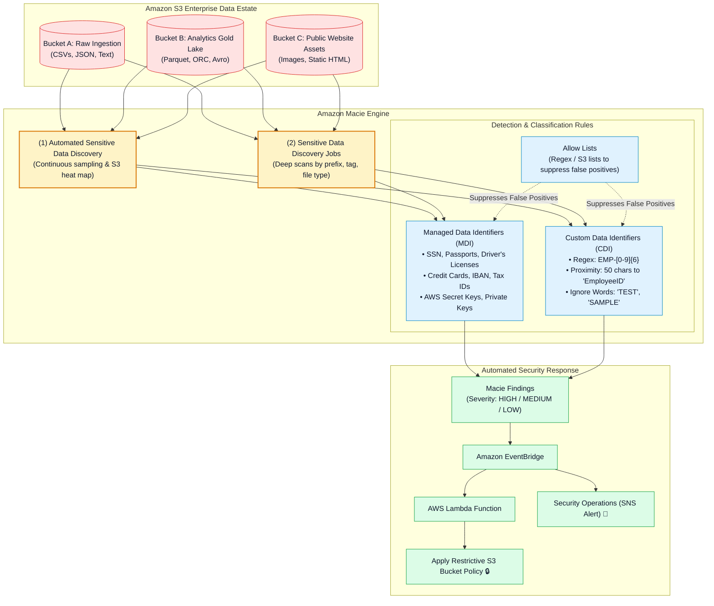
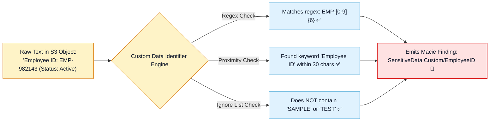
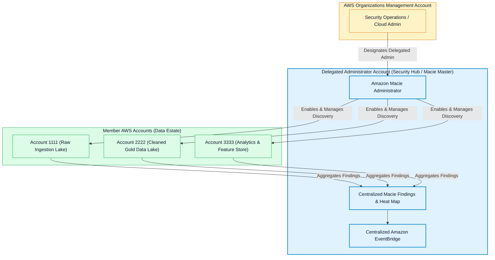
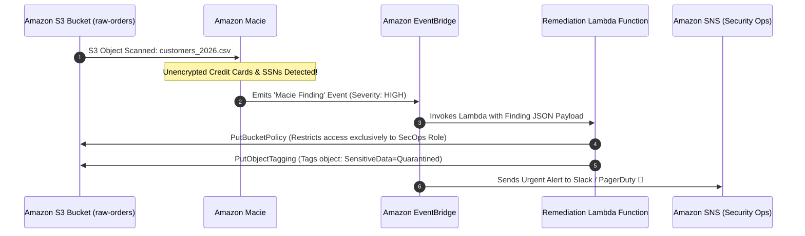

# 🔎 Amazon Macie Deep Dive & PII Discovery Architecture

- **Category**: Security, Identity, & Compliance / Automated Sensitive Data Discovery & Classification
- **Language / ဘာသာစကား**: [English (Original)](/en/02-services/security-governance/macie) | **မြန်မာဘာသာ (Burmese)**
- **Primary Use Case**: Amazon S3 data lakes များအနှံ့တွင် ထိခိုက်လွယ်သော Personally Identifiable Information (PII)၊ ဘဏ္ဍာရေးမှတ်တမ်းများ (financial records)၊ credentials များနှင့် custom proprietary data များကို machine learning ဖြင့် အလိုအလျောက် စဉ်ဆက်မပြတ် ရှာဖွေဖော်ထုတ်ခြင်း (continuous discovery)၊ အမျိုးအစားခွဲခြားခြင်း (classification) နှင့် ကာကွယ်စောင့်ရှောက်ခြင်း။
- **Slide Reference**: `[AWSCertifiedDataEngineerSlides.pdf](/docs/AWSCertifiedDataEngineerSlides.pdf)` မှ Pages 635–655
- **Hub Links**: `[[mm/index]]` | `[[service-catalog]]` | `[[domain-4-data-security-and-governance]]` | `[[s3]]` | `[[cloudwatch-and-eventbridge]]` | `[[macie-and-cloudtrail]]`

---

## 1. High-Level Summary

**Amazon Macie** သည် **Amazon S3** တွင် သိမ်းဆည်းထားသော sensitive data များကို ရှာဖွေဖော်ထုတ်ခြင်း (discover)၊ အမျိုးအစားခွဲခြားခြင်း (classify)၊ စာရင်းပြုစုခြင်း (inventory) နှင့် ကာကွယ်စောင့်ရှောက်ခြင်း (protect) ပြုလုပ်ရန် **machine learning (ML)** နှင့် **pattern matching algorithms** များကို အသုံးပြုသည့် fully managed data security နှင့် privacy service တစ်ခု ဖြစ်သည်။

**AWS Certified Data Engineer - Associate (DEA-C01)** စာမေးပွဲအတွက် အဓိကကျသော Macie သဘောတရားများမှာ အောက်ပါအတိုင်း ဖြစ်သည်:
1. **Automated Discovery vs. Targeted Jobs**: Organization တစ်ခုလုံးရှိ S3 estate ကို စဉ်ဆက်မပြတ် စစ်ဆေးခြင်း (continuous evaluation) နှင့် သတ်မှတ်ထားသော prefix အလိုက် စစ်ထုတ်၍ deep scan ပြုလုပ်ခြင်း (targeted, prefix-filtered deep scans) နှိုင်းယှဉ်ချက်။
2. **Managed vs. Custom Identifiers**: AWS မှ built-in ပေးထားသော PII/credential detection နှင့် proximity constraints ပါဝင်သော custom regex rules များ နှိုင်းယှဉ်ချက်။
3. **Allow Lists**: Internal testing data များနှင့် test credit cards များကြောင့် ဖြစ်ပေါ်လာသော false positives များကို ပယ်ဖျက်ခြင်း။
4. **Event-Driven Automated Remediation**: Finding များကို **Amazon EventBridge** သို့ ပေးပို့ပြီး **AWS Lambda** ကို trigger လုပ်ကာ bucket policy ဖြင့် quarantine ပြုလုပ်ခြင်းနှင့် tagging များကို အလိုအလျောက် ဆောင်ရွက်ခြင်း။



---

## 2. Automated Discovery vs. Targeted Discovery Jobs

| သတ်မှတ်ချက် (Dimension) | Automated Sensitive Data Discovery | Sensitive Data Discovery Jobs |
| :--- | :--- | :--- |
| **Execution Mode** | S3 bucket များအားလုံးအနှံ့ စဉ်ဆက်မပြတ် အလိုအလျောက် sample ယူ၍ စစ်ဆေးခြင်း (Continuous, automated sampling)။ | သတ်မှတ်ထားသော scope များအပေါ် တစ်ကြိမ်တည်း (one-time) သို့မဟုတ် အချိန်ဇယားသတ်မှတ်ထားသော recurring scans များ ပြုလုပ်ခြင်း။ |
| **Configuration** | **Zero configuration** (Macie ကို enable လုပ်သည်နှင့် default အနေဖြင့် အလုပ်လုပ်သည်)။ | အသေးစိတ် စိတ်ကြိုက်ပြင်ဆင်နိုင်သည် (bucket names, prefixes, object age, size, tags)။ |
| **Coverage** | **Interactive data sensitivity heat map** ဖန်တီးရန် S3 object များ၏ representative sample တစ်ခုကို စစ်ဆေးသည်။ | သတ်မှတ်ထားသော scope အတွင်းရှိ ကိုက်ညီသည့် object အားလုံးကို **100% full scan** ဖတ်ရှုစစ်ဆေးသည်။ |
| **Cost Profile** | စုစုပေါင်း S3 bucket volume ပေါ် မူတည်၍ ပုံသေဖြစ်ပြီး ခန့်မှန်းရလွယ်ကူသော ကုန်ကျစရိတ်သက်သာသည့် ပုံစံဖြစ်သည် (Fixed, low predictable cost)။ | စစ်ဆေးခဲ့သည့် data ပမာဏ GB အလိုက် ကောက်ခံသည် (ပထမ 50,000 GB/month အတွက် \$1.00 / GB)။ |
| **Data Engineering Use Case** | အဆင့်မြင့် compliance posture ကို ထိန်းသိမ်းခြင်းနှင့် အသစ်ဖန်တီးလိုက်သော public သို့မဟုတ် unencrypted bucket များကို ရှာဖွေဖော်ထုတ်ခြင်း။ | Analyst များကို access မပေးမီ ETL pipeline မှ ရောက်ရှိလာသော financial dataset အသစ်များကို audit စစ်ဆေးခြင်း။ |

---

## 3. Managed Data Identifiers vs. Custom Data Identifiers

### 1. Managed Data Identifiers (MDIs):
AWS မှ စီမံထိန်းသိမ်းပေးထားသော pre-configured ဖြစ်ပြီး machine learning နှင့် regex-driven detection patterns များ ဖြစ်သည်:
- **Personal Information**: USA Social Security Numbers (SSN), passports (multi-national), ယာဉ်မောင်းလိုင်စင်များ (driver's licenses), နိုင်ငံသားစိစစ်ရေးကတ်များ (national ID cards)။
- **Financial Information**: Credit card နံပါတ်များ (Visa, Mastercard, Amex), International Bank Account Numbers (IBAN), US bank routing numbers။
- **Credentials & Secrets**: AWS Secret Access Keys, RSA/OpenSSH private keys, JSON Web Tokens (JWT), API tokens များ။
- **Healthcare & Medical**: US Health Insurance Claim Numbers (HICN), National Provider Identifier (NPI), ဆေးဘက်ဆိုင်ရာမှတ်တမ်းနံပါတ်များ (medical record numbers)။

### 2. Custom Data Identifiers (CDIs):
အသုံးပြုသူကိုယ်တိုင် သတ်မှတ်ထားသော proprietary data patterns များ ဖြစ်သည်။ CDI သတ်မှတ်ချက်တစ်ခုတွင် အောက်ပါတို့ ပါဝင်သည်:
1. **Regular Expression (Regex)**: အဓိက pattern matching logic (ဥပမာ - ဝန်ထမ်းကတ်နံပါတ် `EMP-[0-9]{6}`)။
2. **Keywords (Optional)**: Match ဖြစ်သည့် စာသားအနီးတွင် ပါဝင်ရမည့် သီးခြားစကားလုံးများ (ဥပမာ - `Employee ID`, `Badge Number`, `Staff ID`)။
3. **Maximum Match Distance**: Keyword သည် regex match နှင့် မည်မျှနီးကပ်ရမည်ကို သတ်မှတ်ခြင်း (ဥပမာ - စာလုံး 50 လုံးအတွင်း / within 50 characters)။
4. **Ignore Words (Optional)**: False positives များကို ဖယ်ရှားရန်အတွက် တွေ့ရှိပါက ချက်ချင်းပယ်ဖျက်စေမည့် စကားလုံးများ (ဥပမာ - `SAMPLE`, `TEST-EMP`)။



---

## 4. Macie Allow Lists

Production testing environments များတွင် mock credit card နံပါတ်များ (ဥပမာ - `4111-1111-1111-1111`) သို့မဟုတ် dummy SSN များကြောင့် compliance dashboards များတွင် false-positive noise အများအပြား ထွက်ပေါ်လာတတ်သည်။

**Allow Lists** သည် data engineer များအား ကင်းလွတ်ခွင့်များ (exceptions) သတ်မှတ်နိုင်ရန် ခွင့်ပြုပေးသည်:
- **Regex-based Allow Lists**: သီးခြား patterns များကို findings အဖြစ် မထုတ်ပေးစေရန် ပယ်ဖျက်ခြင်း (ဥပမာ - `000-00-.*` နှင့် ကိုက်ညီသော မည်သည့် SSN ကိုမဆို ပယ်ဖျက်ခြင်း)။
- **S3 Predefined Text File Lists**: ကုမ္ပဏီတွင်း ဝန်ထမ်းအမည်များ သို့မဟုတ် dummy test account နံပါတ်များပါဝင်သော plain text list ကို S3 သို့ upload တင်ထားနိုင်ပြီး Macie သည် ထို list ထဲရှိ အချက်အလက်များနှင့် တိုက်ဆိုင်တွေ့ရှိမှုများကို လျစ်လျူရှုမည် (ignore) ဖြစ်သည်။

---

## 5. Multi-Account AWS Organizations Architecture

ခေတ်သစ် enterprise data platform များတွင် data lake များသည် AWS account အများအပြား (Ingestion, Raw Lake, Gold Lake, Analytics) ပေါ်တွင် ပျံ့နှံ့တည်ရှိနေကြသည်။



- **Delegated Administrator**: Member account များအားလုံးအနှံ့ discovery jobs များ၊ custom identifiers များနှင့် suppressions များကို ဗဟိုမှ စီမံခန့်ခွဲရန် သီးသန့် Security Account တစ်ခုကို သတ်မှတ်ပေးခြင်း (Designate)။
- **Automated Account Enrollment**: AWS Organizations အတွင်း အသစ်ဖန်တီးလိုက်သော AWS account များအတွက် Macie ကို အလိုအလျောက် enable ပြုလုပ်ပေးခြင်း။

---

## 6. Event-Driven Automated Remediation Architecture

Macie သည် ခွင့်ပြုချက်မရှိသော S3 bucket တစ်ခုအတွင်း unencrypted PII များကို တွေ့ရှိသောအခါ လူကိုယ်တိုင် ဖြေရှင်းရန် စောင့်ဆိုင်းခြင်းသည် compliance ချိုးဖောက်မှုများ ဖြစ်ပေါ်စေနိုင်သည်။ **Automated Event-Driven Remediation** သည် data များကို real-time အလိုအလျောက် quarantine ပြုလုပ်ပေးသည်:



### Sample EventBridge Rule Pattern:
```json
{
  "source": ["aws.macie"],
  "detail-type": ["Macie Finding"],
  "detail": {
    "severity": {
      "description": ["High"]
    },
    "type": [
      "SensitiveData:S3Object/Financial",
      "SensitiveData:S3Object/Personal"
    ]
  }
}
```

---

## 7. Amazon Macie vs. Other AWS Security Services

| Service | အဓိက ရည်ရွယ်ချက် (Primary Purpose) | စစ်ဆေးသည့် အတိုင်းအတာ (Scope of Inspection) | Data Engineering Role |
| :--- | :--- | :--- | :--- |
| **Amazon Macie** | **Data Discovery & Classification** | **Amazon S3 Object Contents** (PII, Financial, Credentials, Health)။ | Data lake များအတွင်းရှိ data at rest ထဲမှ sensitive data များကို ရှာဖွေဖော်ထုတ်ခြင်း။ |
| **Amazon GuardDuty** | **Threat Detection & Anomaly Monitoring** | CloudTrail, VPC Flow Logs, DNS Logs, EKS Logs, S3 Data Events။ | Compromised ဖြစ်နေသော credentials များ သို့မဟုတ် ခွင့်ပြုချက်မရှိဘဲ data ခိုးယူထုတ်ယူမှု (unauthorized data exfiltration) များကို ရှာဖွေထောက်လှမ်းခြင်း။ |
| **AWS Security Hub** | **Centralized Security Posture Management** | Macie, GuardDuty, Inspector, IAM Access Analyzer တို့ထံမှ findings များကို စုစည်းပေးခြင်း။ | တစ်နေရာတည်းမှ ကြည့်ရှုနိုင်သော (Single-pane-of-glass) compliance dashboard (CIS, PCI-DSS)။ |
| **Amazon Inspector** | **Vulnerability Management** | EC2 instances, ECR container images, Lambda code။ | ETL container images များနှင့် compute instances များကို CVEs (vulnerabilities) များအတွက် scan ဖတ်စစ်ဆေးခြင်း။ |

---

## 8. DEA-C01 Exam Essentials

> [!IMPORTANT]
> **Amazon Macie အတွက် အဓိက စာမေးပွဲ Decision Triggers များ**:
>
> - **"Amazon S3 data estate တစ်ခုလုံးအနှံ့ unencrypted PII၊ credit card နံပါတ်များ သို့မဟုတ် AWS secrets များကို စဉ်ဆက်မပြတ် ရှာဖွေဖော်ထုတ်ရန်"** $\rightarrow$ **Amazon Macie Automated Sensitive Data Discovery** ကို ရွေးချယ်ပါ။
> - **"S3 raw landing zone ထဲသို့ အသစ် upload တင်ထားသော Parquet files များကို အချိန်ဇယားဖြင့် deep scan ဖတ်ရှုစစ်ဆေးရန်"** $\rightarrow$ S3 prefix နှင့် date filtering ပါဝင်သော **Targeted Sensitive Data Discovery Job** တစ်ခုကို ဖန်တီးပါ။
> - **"S3 data files များအတွင်း EMP-XXXXXX ပုံစံဖြင့် ရေးသားထားသော proprietary employee ID နံပါတ်များကို ရှာဖွေဖော်ထုတ်ရန်"** $\rightarrow$ Regular expression pattern နှင့် proximity keywords များပါဝင်သော **Custom Data Identifier (CDI)** တစ်ခုကို ဖန်တီးပါ။
> - **"Mock test data များကြောင့် Macie တွင် false-positive PII alerts များ ထွက်ပေါ်မလာစေရန် ကာကွယ်ရန်"** $\rightarrow$ **Amazon Macie Allow List** တစ်ခုကို configure လုပ်ပါ။
> - **"Macie မှ sensitive data ကို တွေ့ရှိသည်နှင့် ချက်ချင်း S3 bucket ကို အလိုအလျောက် quarantine လုပ်ရန် သို့မဟုတ် restrictive policies များ သတ်မှတ်ရန်"** $\rightarrow$ **Macie Findings များကို Amazon EventBridge** သို့ ပို့ပေးပြီး **AWS Lambda remediation function** ကို trigger လုပ်ပါ။
> - **"AWS account ပေါင်း 50 အနှံ့ sensitive data discovery policies များကို ဗဟိုမှ စီမံခန့်ခွဲရန်"** $\rightarrow$ **AWS Organizations တွင် Delegated Administrator Account** တစ်ခုကို configure လုပ်ပါ။

---

## 📌 Related Notes
- `[[macie-and-cloudtrail]]` — AWS CloudTrail Audit Logging & PII Governance
- `[[data-masking-anonymization-and-salting]]` — In-Flight Masking & Salting
- `[[s3]]` — Amazon S3 Data Lake Security & Encryption
- `[[cloudwatch-and-eventbridge]]` — Amazon EventBridge Security Automation
- `[[domain-4-data-security-and-governance]]` — DEA-C01 Domain 4 Study Guide
