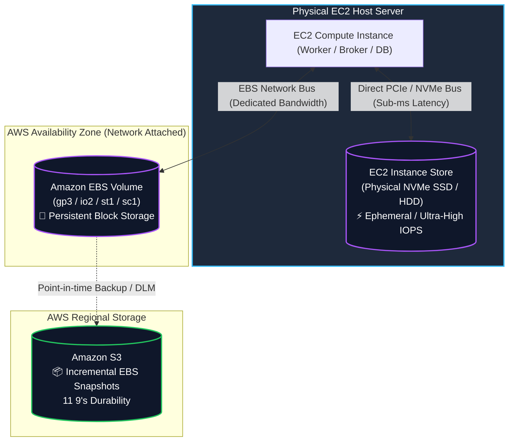
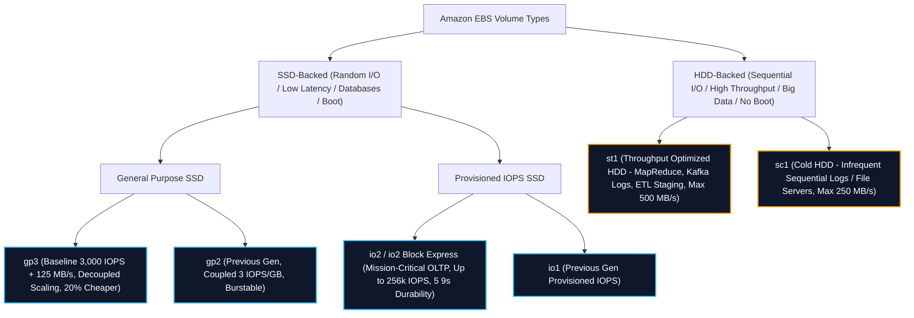
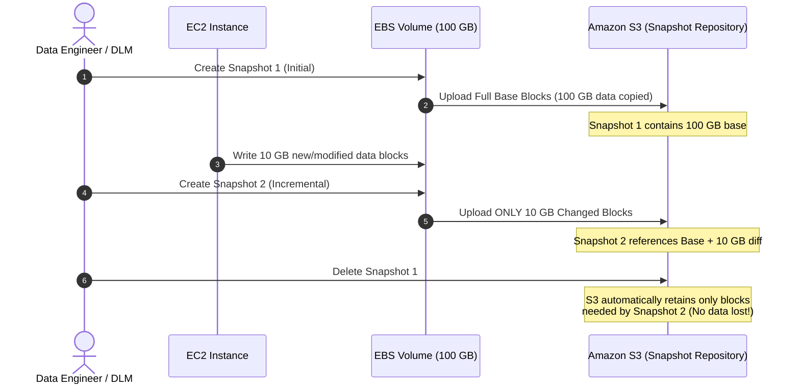
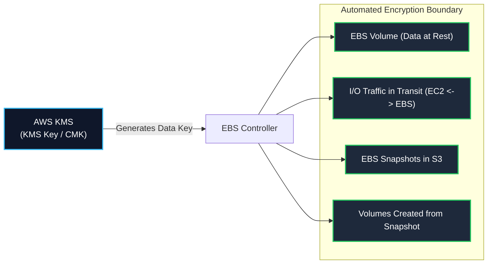
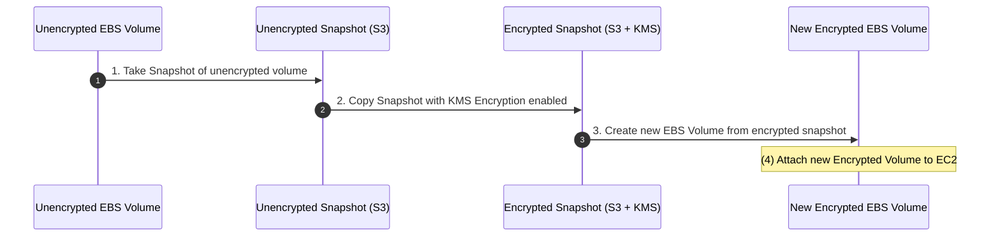
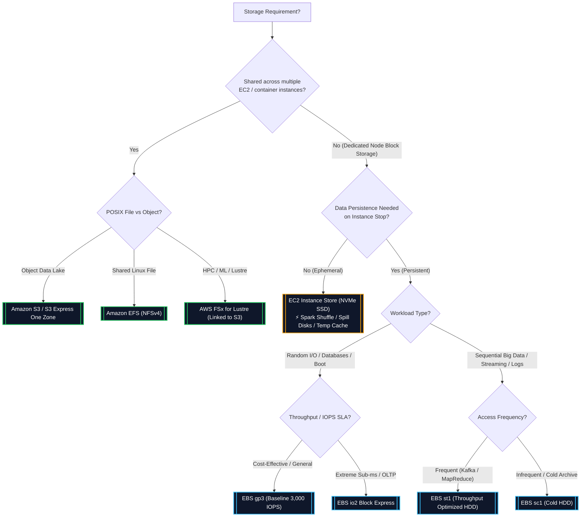

# 💾 Amazon EBS & EC2 Instance Store

- **Category**: Storage (Block Storage)
- **Language / ဘာသာစကား**: [English Version](file:///home/monetine/Workspace/Wathon/aws-dea-c01/content/en/02-services/storage/ebs-and-instance-store.md) | **မြန်မာဘာသာ (Burmese)**
- **Primary Use Case**: EC2 compute instance များအတွက် Block-level storage၊ big data processing လုပ်ဆောင်ရန်အတွက် high-throughput ရှိသော ကြားခံ scratch storage၊ database များအတွက် persistent volume များနှင့် streaming broker storage အဖြစ် အသုံးပြုပါသည်။
- **Slide Reference**: Pages 139–154 in [[AWSCertifiedDataEngineerSlides.pdf]]
- **Hub Links**: [[mm/index]] | [[service-catalog]] | [[domain-2-data-store-management]] | [[s3]] | [[efs-and-fsx]]

---

## 1. High-Level Summary

Block storage သည် compute instance များ ([[ecr-ecs-eks]] / EC2) သို့ တိုက်ရိုက်ချိတ်ဆက်ထားသော dedicated, low-latency disk volume များကို ထောက်ပံ့ပေးသည်။ ခေတ်သစ် AWS Data Engineering architecture များတွင် block storage သည် data processing engine များ၊ distributed streaming broker များနှင့် self-hosted database များအတွက် အလုပ်လုပ်ရာ storage layer (working storage layer) အနေဖြင့် ဆောင်ရွက်ပေးသည်။

Data engineer များသည် **EC2 Instance Store** (ရုပ်ပိုင်းဆိုင်ရာတိုက်ရိုက်ချိတ်ဆက်ထားသော၊ ခေတ္တသာခံသော၊ အမြင့်ဆုံး IOPS/throughput ရရှိသော) နှင့် **Amazon EBS** (network မှတစ်ဆင့်ချိတ်ဆက်သော၊ အမြဲတမ်းသိမ်းဆည်းပေးသော၊ snapshot ဖြင့် backup ယူနိုင်သော block storage) တို့အကြား အားသာချက်/အားနည်းချက်များကို သေချာနားလည်ရမည့်အပြင်၊ မိမိတို့ workload ၏ access pattern နှင့် ကိုက်ညီမည့် အတိအကျဖြစ်သော EBS volume type (`gp3`, `io2`, `st1`, `sc1`) ကိုလည်း မှန်ကန်စွာ ရွေးချယ်နိုင်ရမည်။

---

## 2. Technical Comparison: EBS vs. EC2 Instance Store

Persistent ဖြစ်သော Amazon EBS နှင့် ephemeral ဖြစ်သော EC2 Instance Store တို့ကို မည်သည့်အချိန်တွင် ရွေးချယ်အသုံးပြုရမည်ကို နားလည်ခြင်းသည် အဓိက **DEA-C01** စာမေးပွဲ ခေါင်းစဉ်တစ်ခုဖြစ်သည်။

| Architectural Dimension             | Amazon EBS (Elastic Block Store)                                          | EC2 Instance Store                                                                |
| :---------------------------------- | :------------------------------------------------------------------------ | :-------------------------------------------------------------------------------- |
| **Physical Architecture**           | Network မှတစ်ဆင့် ချိတ်ဆက်ထားသော virtual block device (AWS network ပေါ်ရှိ SAN)              | Host server တွင် ရုပ်ပိုင်းဆိုင်ရာ တိုက်ရိုက်ချိတ်ဆက်ထားသော NVMe SSD သို့မဟုတ် SATA HDD             |
| **Data Persistence**                | **Persistent**: Instance lifecycle နှင့်မသက်ဆိုင်ဘဲ data များကို ဆက်လက်သိမ်းဆည်းပေးသည်          | **Ephemeral (Temporary)**: Instance ကို stop သို့မဟုတ် terminate လုပ်သည့်အခါ data များ ပျောက်ဆုံးသွားမည်         |
| **Survives Instance Reboot?**       | ✅ Yes                                                                    | ✅ Yes (OS reboot လုပ်သော်လည်း data များ မပျောက်ပါ)                                      |
| **Survives Instance Stop?**         | ✅ Yes                                                                    | ❌ **No (STOP လုပ်ပါက data များ အပြီးတိုင် ပျက်စီးသွားမည်)**                                   |
| **Survives Instance Terminate?**    | ✅ Yes (Configurable: `DeleteOnTermination` flag)                         | ❌ **No (Data များ အပြီးတိုင် ပျက်စီးသွားမည်)**                                             |
| **Survives Host Hardware Failure?** | ✅ Yes (EBS network ပေါ်တွင် volume အကောင်းအတိုင်း ကျန်ရှိနေမည်)                             | ❌ **No (ရုပ်ပိုင်းဆိုင်ရာ host server ပျက်သွားပါက data များ ပျောက်ဆုံးသွားမည်)**                            |
| **Performance & Latency**           | Low latency (single-digit ms မှစ၍ `io2 Block Express` ဖြင့် sub-ms အထိ)     | **Ultra-low latency (Sub-millisecond), IOPS သန်းချီရရှိနိုင်, အမြင့်ဆုံး raw throughput** |
| **Availability & Scope**            | **Availability Zone (AZ) တစ်ခုတည်း** တွင်သာ ကန့်သတ်ထားသည်                              | ထို AZ အတွင်းရှိ **သတ်မှတ်ထားသော ရုပ်ပိုင်းဆိုင်ရာ host machine** ၌သာ ကန့်သတ်ထားသည်                        |
| **Backup Mechanism**                | **Amazon S3 သို့ အလိုအလျောက် EBS Snapshots** ဖြင့် incremental backup ယူသည်                      | S3 / EBS / အခြား remote storage များသို့ data replication script များဖြင့် manual backup လုပ်ရသည်                      |
| **Elasticity & Resizing**           | **Elastic Volumes** မှတစ်ဆင့် storage size နှင့် type ကို လိုအပ်သလို အလွယ်တကူ ပြောင်းလဲနိုင်သည်      | ရွေးချယ်ထားသော EC2 instance type အပေါ် မူတည်၍ capacity သတ်မှတ်ချက် ပုံသေဖြစ်သည်                       |
| **Multi-Attach Support**            | ✅ Yes (AZ တစ်ခုတည်းရှိ EC2 node ၁၆ ခုအထိ Nitro instance များဖြင့် `io1` / `io2` ကို အသုံးပြုနိုင်သည်) | ❌ No (Host instance တစ်ခုတည်းအတွက်သာ သီးသန့်ဖြစ်သည်)                                |
| **Primary Data Engineering Role**   | Database များ (RDS / self-hosted PostgreSQL), Kafka logs, persistent ဖြစ်ရန်လိုသော node များ    | **Spark shuffle space, MapReduce spill disks, intermediate cache, temp buffer များ**  |

---

## 3. EBS Volume Types Deep Dive

EBS volume များကို အဓိက storage နည်းပညာ နှစ်မျိုးခွဲခြားထားသည်: **SSD-backed** (transactional၊ random I/O နှင့် IOPS များများလိုအပ်သော အလုပ်များအတွက် အထူးကောင်းမွန်သည်) နှင့် **HDD-backed** (large, sequential ဖြစ်ပြီး throughput များများလိုအပ်သော big data workload များအတွက် အထူးကောင်းမွန်သည်)။

### Complete EBS Volume Specification Matrix

| Volume Type                        | Volume Code             | Storage Tech | Max IOPS / Volume | Max Throughput / Volume | Max Volume Size | Boot Disk? | Ideal Data Engineering Use Case                                                           |
| :--------------------------------- | :---------------------- | :----------- | :---------------- | :---------------------- | :-------------- | :--------- | :---------------------------------------------------------------------------------------- |
| **General Purpose SSD (Latest)**   | **`gp3`**               | SSD          | **16,000 IOPS**   | **1,000 MB/s**          | 16 TiB          | ✅ Yes     | Data processing node များ၊ dev/test၊ မျှတမှုရှိသော database workload များအတွက် မူလရွေးချယ်မှုဖြစ်သည်             |
| **General Purpose SSD (Legacy)**   | `gp2`                   | SSD          | 16,000 IOPS       | 250 MB/s                | 16 TiB          | ✅ Yes     | Legacy workload များ၊ ကုန်ကျစရိတ်သက်သာစေရန်နှင့် decoupled performance အတွက် `gp3` သို့ ပြောင်းလဲအသုံးပြုပါ။            |
| **Provisioned IOPS Block Express** | **`io2 Block Express`** | SSD          | **256,000 IOPS**  | **4,000 MB/s**          | 64 TiB          | ✅ Yes     | အရေးပါသော high-throughput OLTP (Oracle, SAP HANA, high-load Cassandra/Postgres) များ။   |
| **Provisioned IOPS SSD**           | **`io2`**               | SSD          | 64,000 IOPS       | 1,000 MB/s              | 16 TiB          | ✅ Yes     | အဆက်မပြတ် I/O အသုံးပြုမှုများသော relational နှင့် 99.999% durability လိုအပ်သော NoSQL database များ။          |
| **Provisioned IOPS SSD (Legacy)**  | `io1`                   | SSD          | 64,000 IOPS       | 1,000 MB/s              | 16 TiB          | ✅ Yes     | Legacy high-IOPS application များ။                                                            |
| **Throughput Optimized HDD**       | **`st1`**               | HDD          | 500 IOPS          | **500 MB/s**            | 16 TiB          | ❌ **No**  | **Big Data, MapReduce, Apache Kafka commit logs, log processing, streaming ETL staging များ။** |
| **Cold HDD**                       | **`sc1`**               | HDD          | 250 IOPS          | **250 MB/s**            | 16 TiB          | ❌ **No**  | မကြာခဏအသုံးမပြုသော cold log များ၊ backup volume များနှင့် ကုန်ကျစရိတ်အသက်သာဆုံး block storage။               |

---

### Detailed Volume Type Characteristics

#### 1. General Purpose SSD (`gp3` vs. `gp2`)

- **`gp3` (Recommended Default)**:
  - မည်သည့် volume size တွင်မဆို baseline performance အဖြစ် **3,000 IOPS နှင့် 125 MB/s throughput အခမဲ့ပါဝင်သည်**။
  - မလိုအပ်ဘဲ storage နေရာကို ထပ်ဝယ်စရာမလိုဘဲ storage capacity, IOPS (၁၆,၀၀၀ အထိ) နှင့် throughput (၁,၀၀၀ MB/s အထိ) တို့ကို လွတ်လပ်စွာ သတ်မှတ်ပေးနိုင်သည် (decoupled scaling)။
  - `gp2` ထက် **GB အလိုက် စျေးနှုန်း ၂၀% ခန့် ပိုမိုသက်သာ**သည်။
- **`gp2` (Previous Generation)**:
  - IOPS သည် volume size အပေါ် တိုက်ရိုက်မှီခိုသည် (၁ GB လျှင် ၃ IOPS နှုန်း၊ အနည်းဆုံး ၁၀၀ IOPS၊ အများဆုံး ၁၆,၀၀၀ IOPS)။
  - ၁ TiB အောက်ရှိ volume များသည် 3,000 IOPS ရရှိရန် I/O burst credit bucket စနစ်ကို အသုံးပြုသည်။

#### 2. Provisioned IOPS SSD (`io2` & `io2 Block Express`)

- Sub-millisecond latency နှင့် အာမခံချက်ရှိသော I/O performance ကို အဆက်မပြတ်လိုအပ်သည့် workload များအတွက် ဖန်တီးထားသည်။
- **`io2 Block Express`**:
  - AWS Nitro System ပေါ်တွင် အလုပ်လုပ်သည်။
  - **Sub-millisecond latency**, **256,000 IOPS**, **4,000 MB/s throughput**, နှင့် **64 TiB capacity** အထိ ရရှိနိုင်သည်။
  - **1,000:1 IOPS-to-GB ratio** နှင့် **99.999% (5 nines)** annual volume durability ပေးစွမ်းသည်။
- **EBS Multi-Attach**:
  - `io1` သို့မဟုတ် `io2` volume တစ်ခုတည်းကို **Availability Zone တစ်ခုတည်း** ၌ရှိသော **Nitro-based EC2 instances ၁၆ ခုအထိ** တစ်ချိန်တည်းမှာပင် တွဲဖက် (attach) လုပ်ထားနိုင်သည်။
  - **Requirement**: တစ်ချိန်တည်း write လုပ်ခြင်းကြောင့် data ပျက်စီးမှုမဖြစ်စေရန် cluster-aware file system (ဥပမာ- GFS2, OCFS2) ကို အသုံးပြုရမည်။

#### 3. Throughput Optimized HDD (`st1`)

- ကြီးမား၍ အစဉ်လိုက် read/write လုပ်ဆောင်မှုများရှိသော **မကြာခဏအသုံးပြုသည့် throughput-intensive workload များ** အတွက် အထူးဖန်တီးထားသည်။
- Burst-bucket credit model ကို အသုံးပြုသည်: baseline throughput အနေဖြင့် ၁ TiB လျှင် ၄၀ MB/s နှုန်းဖြင့် ၂၅၀ MB/s အထိရရှိပြီး၊ ၅၀၀ MB/s အထိ burst လုပ်နိုင်သည်။
- **Data Engineering Key Fit**:
  - EC2 / [[emr]] ပေါ်ရှိ Apache Spark / Hadoop cluster များ။
  - Distributed Kafka broker logs ([[msk-kafka]]).
  - Data warehouse staging နှင့် log aggregation pipeline များ။
- **Limitation**: **OS boot volume အဖြစ် အသုံးမပြုနိုင်ပါ**။

#### 4. Cold HDD (`sc1`)

- AWS ၏ ကုန်ကျစရိတ်အသက်သာဆုံး block storage ဖြစ်ပြီး **မကြာခဏအသုံးမပြုသော အစဉ်လိုက် dataset များ** အတွက် အထူးကောင်းမွန်သည်။
- Baseline throughput အနေဖြင့် ၁ TiB လျှင် ၁၂ MB/s ရရှိပြီး၊ ၂၅၀ MB/s အထိ burst လုပ်နိုင်သည်။
- **Limitation**: **OS boot volume အဖြစ် အသုံးမပြုနိုင်ပါ**။

---

## 4. EBS Operations, Snapshots & Lifecycle Management

### EBS Snapshots Architecture & Mechanics

EBS Snapshots များသည် point-in-time, crash-consistent (သို့မဟုတ် VSS ဖြင့် application-consistent) ဖြစ်သော backup များဖြစ်ပြီး **Amazon S3** တွင် အလိုအလျောက် သိမ်းဆည်းထားသည်။

### Key Snapshot Features for DEA-C01

1. **Incremental Backup Nature**:
   - ပထမဆုံး snapshot သည် volume တစ်ခုလုံးကို ကူးယူသည်; နောက်ပိုင်း snapshot များသည် **ပြောင်းလဲသွားသော block (deltas) များကိုသာ** ကူးယူသည်။
   - Chain ထဲရှိ အစောပိုင်း snapshot များကို ဖျက်လိုက်သော်လည်း၊ ကျန်ရှိနေသော snapshot များအတွက် လိုအပ်မည့် block များကို AWS မှ အလိုအလျောက် ဆက်လက်သိမ်းဆည်းပေးထားသောကြောင့် data ပျောက်ဆုံးမှု မရှိဘဲ ၁၀၀% အပြည့်အဝ restore လုပ်နိုင်သည်။

2. **Fast Snapshot Restore (FSR)**:
   - S3 snapshot မှ restore လုပ်ထားသော သာမန် volume များသည် block များကို S3 မှ လိုအပ်မှသာ ဆွဲယူသောကြောင့် (lazy loading) ပထမဆုံးဖတ်သည့်အချိန်တွင် ကြန့်ကြာမှု (latency penalty) ရှိသည်။
   - **FSR သည် ထိုကြန့်ကြာမှုကို ဖယ်ရှားပေးပြီး** volume ဖန်တီးပြီးသည်နှင့်တပြိုင်နက် full-provisioned performance ကို ချက်ချင်းရရှိစေသည်။ AZ တစ်ခုစီရှိ DSU (Data Services Unit) အလိုက် တစ်နာရီစာနှုန်းဖြင့် ကုန်ကျစရိတ်ရှိသည်။

3. **EBS Snapshot Archive**:
   - Full snapshot များကို ရေရှည်သိမ်းဆည်းရန်အတွက် (compliance/audit) သီးသန့် low-cost storage tier ဖြစ်သည်။
   - Standard snapshot tier နှင့် နှိုင်းယှဉ်ပါက snapshot သိမ်းဆည်းမှုစရိတ်ကို **၇၅%** အထိ လျှော့ချပေးသည်။
   - Data ပြန်လည်ရယူချိန် (Retrieval time): **၂၄ မှ ၇၂ နာရီ** ကြာနိုင်သည် (Glacier Flexible Retrieval နှင့် ဆင်တူသည်)။

4. **Amazon Data Lifecycle Manager (DLM) & AWS Backup**:
   - DLM သည် resource tag များပေါ်အခြေခံ၍ snapshot ဖန်တီးခြင်း၊ သိမ်းဆည်းထားခြင်း၊ အခြား account နှင့် မျှဝေခြင်း၊ အခြား Region သို့ ပွားယူခြင်း စသည်တို့ကို policy ဖြင့် အလိုအလျောက် လုပ်ဆောင်ပေးသည်။
   - AWS Backup သည် service အသီးသီးမှ backup များကို စုစည်းစီမံပေးခြင်း၊ WORM compliance (AWS Backup Vault Lock) နှင့် cross-Region DR policy များကို ထောက်ပံ့ပေးသည်။

5. **Recycle Bin for EBS Snapshots**:
   - မတော်တဆဖြစ်စေ၊ တမင်ဖြစ်စေ ဖျက်လိုက်သော snapshot များကို ကာကွယ်ရန် သတ်မှတ်ထားသော ကာလ (၁ ရက်မှ ၁ နှစ်အထိ) အတွင်း ဆက်လက်သိမ်းဆည်းထားပေးသည်။

6. **Elastic Volumes (Live Dynamic Modification)**:
   - EBS သည် EC2 instance ကို **ရပ်တန့်စရာမလိုဘဲ (zero downtime)** သို့မဟုတ် volume ကို ဖြုတ်စရာမလိုဘဲ volume size တိုးခြင်း၊ volume type ပြောင်းခြင်း (ဥပမာ `gp2` မှ `gp3` သို့ ပြောင်းခြင်း)၊ သို့မဟုတ် IOPS/throughput ပြောင်းလဲခြင်းတို့ကို လုပ်ဆောင်ခွင့်ပေးသည်။
   - မှတ်ချက်: Volume size ကို **တိုးရန်သာ** လုပ်နိုင်သည်၊ လျှော့ချ၍မရပါ (volume size လျှော့ချလိုပါက volume အသစ်တစ်ခုဖန်တီးပြီး data များကို ကူးထည့်ရမည်)။

---

## 5. EBS Security & Encryption

Amazon EBS သည် [[kms-and-secrets]] (AWS KMS) နှင့် ချောမွေ့စွာပေါင်းစပ်ကာ end-to-end encryption ကို ထောက်ပံ့ပေးသည်။

### Encryption Scope & Guarantees

- **မည်သည့်အရာများကို encrypt လုပ်သနည်း?**:
  1. EBS volume အတွင်း သိမ်းဆည်းထားသော Data at rest။
  2. EC2 instance နှင့် ချိတ်ဆက်ထားသော EBS volume ကြား AWS network ပေါ်မှ ဖြတ်သန်းသွားသော disk I/O အားလုံး။
  3. Volume မှ ဖန်တီးထားသော point-in-time snapshot အားလုံး။
  4. ထို snapshot များမှတစ်ဆင့် အသစ်ဖန်တီးလိုက်သော EBS volume အားလုံး။
- **Performance Impact**: ခေတ်သစ် Nitro-based instance များအားလုံးတွင် encryption လုပ်ဆောင်မှုကြောင့် performance ကျဆင်းမှုမရှိပါ (encryption ကို သီးသန့် Nitro hardware မှ လုပ်ဆောင်ပေးသောကြောင့်)။
- **Default EBS Encryption**: Account-level နှင့် Region-level တွင် ကြိုတင်သတ်မှတ်ထားနိုင်ပြီး၊ အသစ်ဖန်တီးသမျှ EBS volume များနှင့် snapshot copy များကို ရွေးချယ်ထားသော KMS key ဖြင့် အလိုအလျောက် encrypt လုပ်ပေးသည်။

### Encrypting an Unencrypted EBS Volume (Classic Exam Pattern)

Encryption မလုပ်ထားသော ရှိပြီးသား EBS volume တစ်ခုကို တိုက်ရိုက် encrypt လုပ်၍မရပါ။ Encrypt လုပ်ရန် အောက်ပါ အဆင့် ၄ ဆင့်ကို လုပ်ဆောင်ရမည်:

---

## 6. Storage Decision Matrix for AWS Data Engineers

မှန်ကန်သော storage service ကို ရွေးချယ်နိုင်ခြင်းသည် DEA-C01 စာမေးပွဲ၏ Domain 2 တွင် အထူးမေးလေ့ရှိသည်။

### Comprehensive Storage Comparison Table

| Storage Service              | Protocol / Model                | Durability                | Latency                                         | Scalability                                 | Primary Data Engineering Use Case                                                       |
| :--------------------------- | :------------------------------ | :------------------------ | :---------------------------------------------- | :------------------------------------------ | :-------------------------------------------------------------------------------------- |
| **Amazon S3**                | Object (REST API / HTTPS)       | 11 9's                    | ~10–50 ms (Single-digit ms on Express One Zone) | Virtually Infinite                          | Central Data Lake storage, raw bronze landing zone, curated parquet tables.             |
| **Amazon EBS (`gp3`/`io2`)** | Block device (Network)          | 99.8% – 99.999%           | Single-digit ms (Sub-ms on `io2`)               | Up to 64 TiB per volume                     | Database storage (Postgres, RDS, Cassandra), persistent stateful compute disk များ။         |
| **Amazon EBS (`st1`)**       | Block device (Network)          | 99.8% – 99.9%             | Milliseconds (Up to 500 MB/s)                   | Up to 16 TiB per volume                     | **MapReduce sequential storage, Kafka commit logs, ETL staging directory များ။**           |
| **EC2 Instance Store**       | Block device (Direct Host NVMe) | Single disk (Ephemeral)   | **Sub-millisecond (Fastest)**                   | Instance type အပေါ်မူတည်သည် (TB ပေါင်းများစွာအထိ) | **Spark shuffle data, intermediate MapReduce spills, memory swap, temporary cache များ။**   |
| **Amazon EFS**               | POSIX File (NFSv4)              | 11 9's (Multi-AZ)         | Low ms                                          | Elastic (Petabytes)                         | EC2 / [[ecr-ecs-eks]] pod များစွာအကြား မျှဝေအသုံးပြုသော application storage။      |
| **AWS FSx for Lustre**       | POSIX High Performance File     | High (Integrated with S3) | **Sub-millisecond (Hundreds of GB/s)**          | Petabytes                                   | **HPC, high-throughput distributed ML model training, massive parallel S3 processing.** |

---

## 7. Data Engineering Architecture Patterns

### Pattern A: Apache Spark Shuffle Optimization on EC2 / EMR

- **Challenge**: Wide transformation များ (`groupByKey`, `reduceByKey`, `join`) ပြုလုပ်ချိန်တွင် Spark executor များသည် intermediate shuffle partition file များကို disk သို့ ရေးချ (spill) လေ့ရှိသည်။
- **Solution**: Spark shuffle နှင့် scratch directory (`spark.local.dir`) အတွက် **EC2 Instance Store (NVMe SSD)** ကို mount လုပ်ပါ။
- **Why?**: Instance store သည် အမြင့်ဆုံး IOPS ကို ပေးစွမ်းနိုင်ပြီး EBS network bandwidth လုခြင်းမှလည်း ကင်းဝေးစေသည်။ Node တစ်ခုခု ပျက်သွားပါကလည်း၊ Spark ၏ DAG scheduler က ပျောက်ဆုံးသွားသော partition များကို ခိုင်မာသော S3 source မှနေ၍ အလိုအလျောက် ပြန်လည်တွက်ချက်ပေးသည်။

### Pattern B: Self-Managed Apache Kafka Brokers on EC2

- **Challenge**: Kafka သည် အစဉ်လိုက်ရေးချနိုင်သော (sequential) disk write throughput မြင့်မားရန်နှင့် broker reboot လုပ်ချိန်တွင် data များ မပျောက်ရန် လိုအပ်သည်။
- **Solution**: Kafka topic partition commit log များအတွက် **EBS `st1` (Throughput Optimized HDD)** သို့မဟုတ် **EBS `gp3`** ကို တွဲဖက် (attach) အသုံးပြုပါ။
- **Why?**: Kafka ၏ disk အသုံးပြုမှုသည် နောက်ဆက်တွဲအနေဖြင့် အစဉ်လိုက်ရေးချခြင်း (sequential append-only) သာ ဖြစ်သည်။ `st1` သည် 500 MB/s sustained sequential throughput ကို သက်သာသော ကုန်ကျစရိတ်ဖြင့် ပေးစွမ်းနိုင်သည်။

### Pattern C: Decoupled Storage & Compute Architecture

- **Rule of Thumb**: ရေရှည်သိမ်းဆည်းရမည့် data lake asset များကို EBS သို့မဟုတ် Instance Store ပေါ်တွင် ဘယ်တော့မှ မသိမ်းဆည်းပါနှင့်။ ဒေတာများကို ပိုမိုခိုင်မာစေရန်၊ lifecycle tiering လုပ်နိုင်ရန်နှင့် [[athena]], [[glue]], နှင့် [[redshift]] ကဲ့သို့သော အင်ဂျင်အမျိုးမျိုးမှ စုံစမ်းစစ်ဆေးနိုင်ရန်အတွက် (query) EBS/Instance Store မှ **Amazon S3** သို့ အမြဲတမ်း stream သို့မဟုတ် stage လုပ်ပေးပါ။

---

## 8. DEA-C01 Exam Tips, Pitfalls & Scenarios

> [!IMPORTANT]
> **Key Exam Distinctions & Trigger Keywords**:
>
> - **"Ultra-high IOPS / Lowest latency temporary scratch storage for distributed processing"** $\rightarrow$ **EC2 Instance Store** (Instance store သည် ephemeral Spark shuffle disk များနှင့် temp cache များအတွက် အထူးသင့်လျော်သည်)။
> - **"Cost-effective sequential throughput for big data, MapReduce, or Kafka broker logs on EC2"** $\rightarrow$ **EBS `st1` (Throughput Optimized HDD)**.
> - **"Predictable IOPS and throughput scaled independently of volume storage capacity"** $\rightarrow$ **EBS `gp3`**.
> - **"Eliminate latency / lazy-loading penalty when initializing restored EBS snapshot volumes"** $\rightarrow$ **Fast Snapshot Restore (FSR)**.
> - **"Long-term, low-cost compliance archiving of rarely accessed EBS snapshots"** $\rightarrow$ **EBS Snapshot Archive**.
> - **"Attach a single block volume to multiple EC2 instances concurrently in the same AZ"** $\rightarrow$ **EBS Multi-Attach (`io1` / `io2` with a cluster-aware file system)**.

> [!WARNING]
> **Exam Traps & Pitfalls**:
>
> 1. **Instance Store Lifecycle**: Data များသည် OS **REBOOT** လုပ်ပါက မပျောက်သော် জ্ঞ၊ instance ကို **STOP**, **TERMINATION** လုပ်လိုက်လျှင်ဖြစ်စေ သို့မဟုတ် အောက်ခံ hardware ပျက်စီးသွားလျှင်ဖြစ်စေ အပြီးတိုင် ဖျက်ဆီးခံရမည်။ Stop လုပ်သည့်အခါ data ကျန်ရှိနေစေလိုပါက **EBS** ကို အသုံးပြုရမည်။
> 2. **HDD Boot Volumes**: **`st1`** နှင့် **`sc1`** နှစ်မျိုးစလုံးကို root/boot volume များအဖြစ် အသုံးမပြုနိုင်ပါ။ Boot volume များသည် **SSD** (`gp2`, `gp3`, `io1`, `io2`) ဖြစ်ရမည်။
> 3. **Availability Zone Boundary**: EBS volume များသည် AZ တစ်ခုတည်း၌သာ အတိအကျ ကန့်သတ်ထားသည်။ `us-east-1a` ရှိ EBS volume တစ်ခုကို `us-east-1b` ရှိ EC2 instance သို့ attach လုပ်၍မရပါ။ Volume ကို အခြား AZ သို့ ရွှေ့လိုပါက: **Volume ကို Snapshot ယူပါ $\rightarrow$ ထို snapshot မှတစ်ဆင့် ပစ်မှတ် AZ တွင် volume အသစ်တစ်ခု ဖန်တီးပါ**။
> 4. **Shrinking EBS Volumes**: Elastic Volumes သည် volume size ကို downtime မရှိဘဲ တိုးမြှင့်ခွင့်ပေးသော်လည်း **volume size ကို လျှော့ချ၍မရပါ**။
> 5. **Encrypting Unencrypted Volumes**: ရှိပြီးသား volume တစ်ခုကို ၎င်းနေရာ၌ပင် တိုက်ရိုက် encrypt လုပ်၍မရပါ။ ပြုလုပ်ရန်: Snapshot ယူပါ $\rightarrow$ KMS Encryption ဖြင့် Snapshot ကို Copy ကူးပါ $\rightarrow$ Encrypt လုပ်ထားသော snapshot မှ Volume ကို ဖန်တီးပါ $\rightarrow$ Attach လုပ်ပါ။

---

## 📌 Related Notes

- [[s3]] — Persistent object storage and Data Lake architecture
- [[efs-and-fsx]] — Amazon EFS & AWS FSx (Lustre, ONTAP, Windows)
- [[emr]] — Amazon EMR cluster node storage and EMRFS
- [[msk-kafka]] — Managed Streaming for Apache Kafka broker storage
- [[rds-and-aurora]] — Amazon RDS storage engines and Aurora distributed storage
- [[kms-and-secrets]] — AWS KMS encryption keys and EBS volume encryption
- [[service-comparisons]] — Service decision matrix (S3 vs EBS vs EFS vs FSx)
- [[ebs-vs-efs-vs-instance-store]] — Deep Dive: Amazon EFS vs. EBS vs. EC2 Instance Store
- [[domain-2-data-store-management]] — DEA-C01 Domain 2 Study Guide
