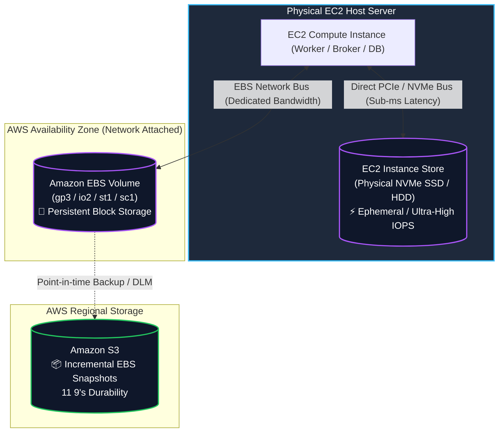
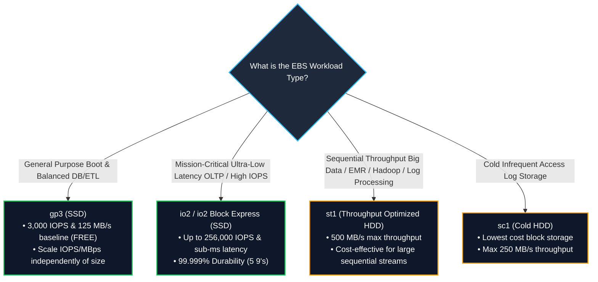

# 💾 Amazon EBS & EC2 Instance Store (Block Storage) (ဘလော့အဆင့် သိုလှောင်မှု စနစ်များ)

- **Category**: Storage (Block Storage)
- **Language / ဘာသာစကား**: [English Version](file:///home/monetine/Workspace/Wathon/aws-dea-c01/content/en/02-services/storage/ebs-and-instance-store.md) | **မြန်မာဘာသာ (Burmese)**
- **အဓိက အသုံးပြုမှု**: EC2 Compute Instances များအတွက် Block-level Storage၊ Big Data တွက်ချက်မှုများအတွက် မြန်ဆန်သော ယာယီ Scratch Storage၊ Databases များနှင့် Streaming Brokers များအတွက် Persistent Disk များ တပ်ဆင်ခြင်း။
- **Slide Reference**: Pages 139–154 in `[[AWSCertifiedDataEngineerSlides.pdf]]`
- **Hub Links**: `[[mm/index]]` | `[[en/index]]` | `[[s3]]` | `[[efs-and-fsx]]`

---

## ၁။ အကျဉ်းချုပ် (High-Level Summary)

Block Storage သည် EC2 Compute Instances များနှင့် တိုက်ရိုက်ချိတ်ဆက်အသုံးပြုနိုင်သော Low-latency Disk Volumes များကို ပေးဆောင်သည်။ Data Engineering စနစ်များတွင် Big Data Analytics Clusters၊ Distributed Streaming Brokers (Kafka) နှင့် Self-hosted Database များအတွက် အဓိက သိုလှောင်မှု အလွှာအဖြစ် အသုံးပြုသည်။

အင်ဂျင်နီယာများသည် **EC2 Instance Store** (Physical Server တွင် တိုက်ရိုက်တပ်ဆင်ထားသော Ephemeral၊ အမြင့်ဆုံး IOPS/Throughput) နှင့် **Amazon EBS** (Network ဖြင့် ချိတ်ဆက်ထားသော Persistent၊ Snapshot Backed Block Storage) တို့၏ ကွာခြားချက်များနှင့် သင့်လျော်သော EBS Volume Types (`gp3`, `io2`, `st1`, `sc1`) များကို ကျွမ်းကျင်စွာ ရွေးချယ်နိုင်ရမည်။

---

## ၂။ Amazon EBS vs. EC2 Instance Store နှိုင်းယှဉ်ချက်

| Feature | Amazon EBS (Elastic Block Store) | EC2 Instance Store (Ephemeral Storage) |
| :--- | :--- | :--- |
| **Physical Location** | **Network-attached Drive** (AZ အတွင်း Network ဖြင့် ချိတ်ဆက်ထားသည်) | **Direct-attached Drive** (EC2 Host Server ၏ Physical Motherboard တွင် တပ်ဆင်ထားသည်) |
| **Data Persistence** | ✅ **Persistent**: Instance ကို Stop/Start ပြုလုပ်သော်လည်း ဒေတာ မပျက်ပါ | ❌ **Ephemeral (ယာယီ)**: Instance ကို Stop သို့မဟုတ် Terminate လုပ်ပါက **ဒေတာ အားလုံး ပျက်စီးသည်** |
| **Max IOPS & Latency** | အများဆုံး 256,000 IOPS (io2 Block Express)၊ Single-digit ms Latency | **သန်းနှင့်ချီသော IOPS (Millions of IOPS)**၊ Sub-millisecond Latency (အမြန်ဆုံး) |
| **Backup & Snapshots** | **Amazon S3 Incremental Snapshots** ကို ထောက်ပံ့သည် | Built-in Snapshot မရှိပါ (Software အဆင့်မှ S3 သို့ Copy ကူးရသည်) |
| **Data Engineering အသုံးချမှု** | • Production Database Data Files (`[[rds-and-aurora]]`) • Kafka Broker Logs (`[[msk-kafka]]`) | • Spark Shuffle Storage / MapReduce Spillover • In-Memory Caches & Temporary Scratch Data |

---

## ၃။ Amazon EBS Volume Types နှိုင်းယှဉ်ချက်

---

## ၄။ DEA-C01 စာမေးပွဲ အဓိက အချက်အလက်များ (Exam Tips)

> [!IMPORTANT]
> **Key Exam Trigger Keywords**:
> - **"Maximum IOPS and throughput for temporary Spark shuffle or intermediate scratch data"** $\rightarrow$ **EC2 Instance Store (NVMe SSD)**.
> - **"Cost-effective storage for high-throughput sequential big data logging and Hadoop HDFS"** $\rightarrow$ **EBS Throughput Optimized HDD (`st1`)**.
> - **"Predictable baseline performance where IOPS can scale without adding disk capacity"** $\rightarrow$ **EBS General Purpose SSD (`gp3`)**.
> - **"Attach block volume to multiple EC2 instances simultaneously"** $\rightarrow$ **EBS Multi-Attach with `io1` / `io2` (Clustered Applications / GFS2)**.

---

## 📌 ဆက်စပ် မှတ်စုများ (Related Notes)

- `[[ebs-vs-efs-vs-instance-store]]` — Decision Matrix: EBS vs EFS vs Instance Store
- `[[efs-and-fsx]]` — Managed File Systems (EFS, FSx for Lustre)
- `[[s3]]` — Amazon S3 Object Storage
