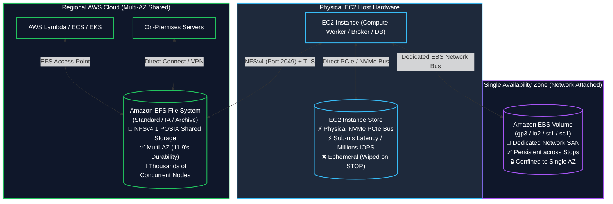
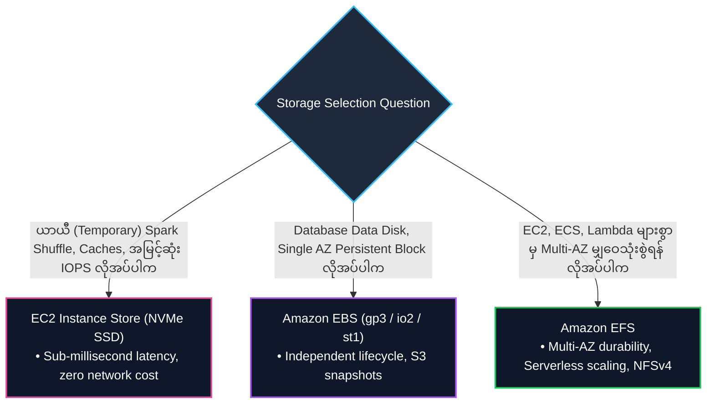

# ⚖️ Amazon EFS vs. Amazon EBS vs. EC2 Instance Store (သိုလှောင်မှု စနစ် ၃ မျိုး နှိုင်းယှဉ်ချက်)

- **Category**: Storage Architecture & Service Selection
- **Language / ဘာသာစကား**: [English Version](file:///home/monetine/Workspace/Wathon/aws-dea-c01/content/en/02-services/storage/ebs-vs-efs-vs-instance-store.md) | **မြန်မာဘာသာ (Burmese)**
- **အဓိက အသုံးပြုမှု**: **Amazon EFS** (Shared Multi-AZ File)၊ **Amazon EBS** (Persistent Network Block) နှင့် **EC2 Instance Store** (Ultra-High IOPS Ephemeral Block) တို့အကြား သင့်လျော်သော Storage အလွှာကို ရွေးချယ်နိုင်ရန် ဆုံးဖြတ်ချက် လမ်းညွှန်။
- **Slide Reference**: Pages 139–154 in `[[AWSCertifiedDataEngineerSlides.pdf]]`
- **Hub Links**: `[[mm/index]]` | `[[en/index]]` | `[[ebs-and-instance-store]]` | `[[efs-and-fsx]]` | `[[s3]]`

---

## ၁။ အကျဉ်းချုပ် (High-Level Architectural Summary)

DEA-C01 စာမေးပွဲ Domain 2 တွင် အမေးအများဆုံး အကြောင်းအရာတစ်ခုမှာ Workload အလိုက် သင့်လျော်သော Compute-attached Storage ကို ရွေးချယ်ခြင်း ဖြစ်သည်-

---

## ၂။ Master Comparative Matrix

| Feature | EC2 Instance Store | Amazon EBS | Amazon EFS |
| :--- | :--- | :--- | :--- |
| **Storage Type** | **Block Storage** | **Block Storage** | **File Storage (POSIX / NFSv4.1)** |
| **Physical Attachment** | Direct-attached NVMe PCIe | Network-attached virtual disk | Network-attached shared file system |
| **Persistence** | ❌ **Ephemeral** (Stop/Terminate လုပ်ပါက ဒေတာ ပျက်သည်) | ✅ **Persistent** (Independent of instance lifecycle) | ✅ **Persistent & Serverless Elastic** |
| **Scope / Boundary** | Single Host Server | **Single Availability Zone (AZ)** | **Regional (Multi-AZ by default)** |
| **Concurrency** | Single EC2 Instance သာ သုံးနိုင်သည် | Single Instance (io1/io2 Multi-Attach in same AZ) | **EC2, ECS, EKS, Lambda ထောင်သောင်းချီ တစ်ပြိုင်နက် သုံးနိုင်သည်** |
| **Max Performance** | **Millions of IOPS, Sub-ms latency** | Up to 256,000 IOPS (io2), Low-ms | Up to 10+ GB/s throughput, Low-ms |
| **အကောင်းဆုံး အသုံးချမှု** | Spark Shuffling, Temporary caches, Ingest buffers | Databases (`[[rds-and-aurora]]`), Kafka logs | Shared models, Container volumes, Web assets |

---

## ၃။ စာမေးပွဲ ဆုံးဖြတ်ချက် လမ်းညွှန် (Exam Decision Tree)

---

## 📌 ဆက်စပ် မှတ်စုများ (Related Notes)

- `[[ebs-and-instance-store]]` — Amazon EBS & Instance Store Deep Dive
- `[[efs-and-fsx]]` — Amazon EFS & FSx Deep Dive
- `[[s3]]` — Amazon S3 Object Storage
