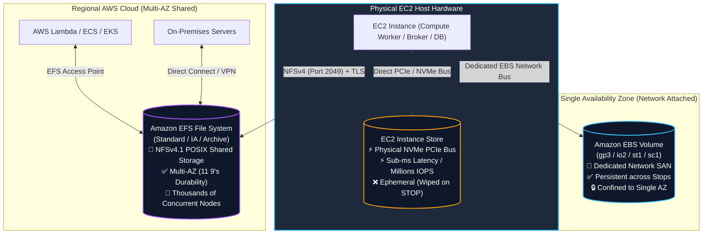
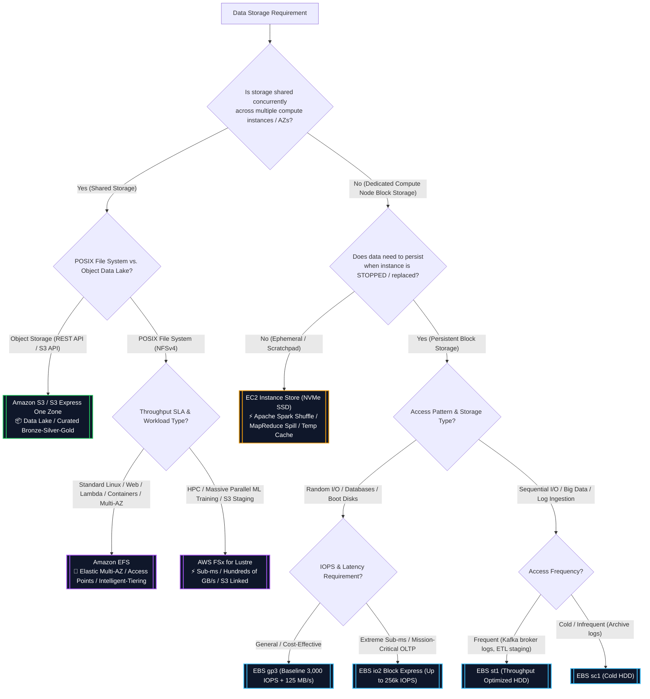
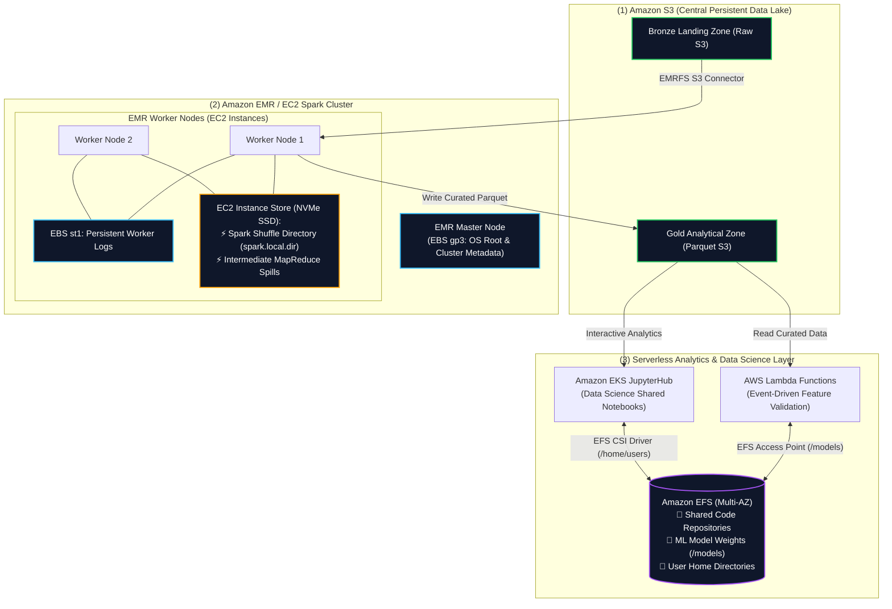

# ⚖️ Amazon EFS vs. Amazon EBS vs. EC2 Instance Store

- **Category**: Storage Architecture & Service Selection
- **Language / ဘာသာစကား**: [English (Original)](/en/02-services/storage/ebs-vs-efs-vs-instance-store) | **မြန်မာဘာသာ (Burmese)**
- **Primary Use Case**: **Amazon EFS** (Shared Multi-AZ File), **Amazon EBS** (Persistent Network Block), နှင့် **EC2 Instance Store** (Ultra-High IOPS Ephemeral Block) တို့အကြား တိကျသေချာသော ဆုံးဖြတ်ချက်လမ်းညွှန်နှင့် ဗိသုကာပိုင်းဆိုင်ရာ အားသာချက်/အားနည်းချက် (architectural trade-off) နှိုင်းယှဉ်ချက်။
- **Slide Reference**: Pages 139–154 in `[AWSCertifiedDataEngineerSlides.pdf](/docs/AWSCertifiedDataEngineerSlides.pdf)`
- **Hub Links**: [[mm/index|index]] | [[mm/00-hub/service-catalog|service-catalog]] | [[mm/01-domains/domain-2-data-store-management|domain-2-data-store-management]] | [[mm/04-exam-tips/service-comparisons|service-comparisons]] | [[mm/02-services/storage/ebs-and-instance-store|ebs-and-instance-store]] | [[mm/02-services/storage/efs-and-fsx|efs-and-fsx]] | [[mm/02-services/storage/s3/s3|s3]]

---

## 1. High-Level Architectural Summary

မှန်ကန်သော storage tier ကို ရွေးချယ်ခြင်းသည် AWS Certified Data Engineer – Associate (DEA-C01) စာမေးပွဲ၏ **Domain 2 (Data Store Management)** တွင် အများဆုံးစစ်ဆေးလေ့ရှိသော အကြောင်းအရာများထဲမှ တစ်ခုဖြစ်သည်။

AWS သည် မတူညီသော latency profiles, persistence guarantees, network boundaries, နှင့် concurrency လိုအပ်ချက်များအတွက် ဒီဇိုင်းထုတ်ထားသော အဓိက compute-attached storage solutions ၃ ခုကို ပံ့ပိုးပေးသည်:

1. **EC2 Instance Store (Ephemeral Block)**:
   - Host server တွင် တိုက်ရိုက်တပ်ဆင်ထားသော Physical NVMe SSDs / SATA HDDs များဖြစ်သည်။
   - Network bandwidth ကို မသုံးဘဲ **ultra-low sub-millisecond latency**, **millions of IOPS**, နှင့် **maximum sequential throughput** ကို ပေးစွမ်းသည်။
   - **Data သည် ephemeral ဖြစ်သည်**: Instance ကို **stopped**, **terminated** လုပ်လျှင် သို့မဟုတ် **host hardware failure** ကြုံတွေ့ရလျှင် (OS reboots လုပ်လျှင်သာ အချက်အလက်များ ကျန်ရှိမည်) အချက်အလက်များ အပြီးအပိုင် ပျောက်ဆုံးသွားမည်ဖြစ်သည်။
2. **Amazon EBS (Persistent Network Block)**:
   - Dedicated network bandwidth မှတဆင့် EC2 နှင့် ဆက်သွယ်သော Network-attached virtual block devices များဖြစ်သည်။
   - **Persistent & independent**: Data သည် instance stops, terminations, နှင့် host migrations များကို ကျော်လွန်၍ တည်ရှိသည်; [[mm/02-services/storage/s3/s3|s3]] သို့ point-in-time incremental snapshots များဖြင့် back up လုပ်ထားနိုင်သည်။
   - **Single-AZ boundary**: Single Availability Zone အတွင်းတွင်သာ ကန့်သတ်ထားသည် (Multi-Attach ကို တူညီသော AZ အတွင်းရှိ Nitro instances 16 ခုအထိ `io1`/`io2` တွင် ထောက်ပံ့ပေးသည်)။
3. **Amazon EFS (Elastic Shared Multi-AZ POSIX File)**:
   - **NFSv4** မှတဆင့် ထောင်ပေါင်းများစွာသော compute instances များက တပြိုင်နက်တည်း ဝင်ရောက်အသုံးပြုနိုင်သော Fully managed, serverless, elastic POSIX-compliant shared file system ဖြစ်သည်။
   - 3+ Availability Zones များတစ်လျှောက် **Regional Multi-AZ durability (11 9's)** ကို ရရှိသည်။
   - **EC2**, **Amazon ECS**, **Amazon EKS**, **AWS Fargate**, **AWS Lambda**, နှင့် AWS Direct Connect / VPN မှတဆင့် on-premises servers များမှ တပြိုင်နက်တည်း တပ်ဆင်အသုံးပြုနိုင်သည်။

---

## 2. Comprehensive Technical Comparison Matrix

| Architectural Dimension | EC2 Instance Store | Amazon EBS (Elastic Block Store) | Amazon EFS (Elastic File System) |
| :--- | :--- | :--- | :--- |
| **Storage Architecture** | Direct-attached physical NVMe SSD / HDD | Network-attached virtual block SAN | Distributed network-attached POSIX file system |
| **Access Protocol** | Block device (PCIe / direct NVMe bus) | Block device (Network bus over fabric) | **NFSv4.0 / NFSv4.1** (TCP Port 2049) |
| **Data Persistence** | ❌ **Ephemeral** (Stop/Terminate လုပ်လျှင် ပျက်မည်) | ✅ **Persistent** (Instance lifecycle နှင့် မသက်ဆိုင်ဘဲ သီးခြားတည်ရှိသည်) | ✅ **Persistent** (Serverless independent storage) |
| **Survives OS Reboot?** | ✅ **Yes** | ✅ **Yes** | ✅ **Yes** |
| **Survives Instance STOP?** | ❌ **No (Data ကို အပြီးတိုင် ဖျက်ပစ်မည်)** | ✅ **Yes** | ✅ **Yes** |
| **Survives Instance Terminate?** | ❌ **No (Data ကို အပြီးတိုင် ဖျက်ပစ်မည်)** | ✅ **Yes** (Configurable `DeleteOnTermination`) | ✅ **Yes** |
| **Survives Host Hardware Failure?** | ❌ **No (Host machine နှင့်အတူ Data ပျောက်ဆုံးမည်)** | ✅ **Yes** (Volume ကို instance အသစ်တွင် ပြန်တွဲနိုင်သည်) | ✅ **Yes** (11 9's Multi-AZ durability) |
| **Availability Domain** | Single physical host server | **Single Availability Zone (AZ)** | **Regional Multi-AZ** (သို့မဟုတ် Single-AZ One Zone) |
| **Client Concurrency** | Single EC2 instance only | Single EC2 instance (`io1`/`io2` Multi-Attach ဖြင့် AZ တစ်ခုတည်းတွင် ၁၆ ခုအထိ) | **AZ အများအပြားတစ်လျှောက်ရှိ concurrent clients ထောင်ပေါင်းများစွာ** |
| **Supported Compute Clients** | Specific EC2 instance types | EC2 instances | **EC2, ECS, EKS, Fargate, Lambda, On-Premises** |
| **Latency Profile** | **Sub-millisecond (အမြန်ဆုံး ဖြစ်နိုင်ခြေ)** | Single-digit ms မှ sub-ms အထိ (`io2 Block Express`) | Low ms (General Purpose တွင် < 1ms metadata) |
| **Max Throughput** | Multi-GB/s (Hardware bus ကန့်သတ်ချက်) | **4,000 MB/s** အထိ (`io2 Block Express`), 1,000 MB/s (`gp3`) | **3+ GB/s အထိ** (Elastic Mode) |
| **Max IOPS** | **Millions of IOPS** (Direct NVMe) | **256,000 IOPS** အထိ (`io2 Block Express`) | Tens of thousands of IOPS (Max I/O mode) |
| **Capacity Management** | EC2 instance hardware အပေါ်မူတည်၍ ပုံသေဖြစ်သည် | ကြိုတင်သတ်မှတ်ထားသော volume size (64 TiB အထိ) | **Elastic auto-scaling** (PBs; အလိုအလျောက် ကြီးထွား/ကျုံ့ဝင်သည်) |
| **OS Boot Volume Support** | ✅ Yes (ရွေးချယ်ထားသော instance types များတွင်) | ✅ **Yes** (SSD အမျိုးအစားအားလုံး: `gp2`, `gp3`, `io1`, `io2`) | ❌ **No** |
| **Backup Mechanism** | S3/EBS သို့ ကူးယူသည့် Manual scripts များ | အလိုအလျောက် incremental **EBS Snapshots to S3** | **AWS Backup** policies နှင့် native EFS Replication |
| **Security & Permissions** | OS-level file permissions | Rest တွင် AWS KMS + Transit တွင် Nitro encryption | **Rest တွင် KMS + TLS 1.2 + POSIX + EFS Access Points + IAM** |
| **Pricing Model** | EC2 hourly instance price တွင် ပါဝင်သည် | Provisioned GB/month + provisioned IOPS/MBps | Stored GB/month (Tiered: Standard, IA, Archive) + transfer |
| **Primary DEA-C01 Workload** | **Spark shuffle, MapReduce spills, temp cache** | **Databases (RDS/Postgres), Kafka logs, OS disks** | **Shared code/notebooks, Lambda state, container PVs** |

---

## 3. Lifecycle & Failure Scenario Matrix

Operational events များတစ်လျှောက် အတိအကျ data retention behavior ကို နားလည်ခြင်းသည် စာမေးပွဲတွင် အများဆုံး စစ်ဆေးလေ့ရှိသော ကွဲပြားချက်များထဲမှ တစ်ခုဖြစ်သည်။

```mermaid
graph TD
    Event["EC2 Instance Lifecycle / Failure Event"]
    
    Event --> E1["(1) Operating System Reboot<br/><code>sudo reboot</code>"]
    Event --> E2["(2) Instance STOP<br/><code>aws ec2 stop-instances</code>"]
    Event --> E3["(3) Instance TERMINATION<br/><code>aws ec2 terminate-instances</code>"]
    Event --> E4["(4) Host Hardware Failure<br/>(Physical Host Crash)"]
    Event --> E5["(5) Availability Zone Outage<br/>(Regional AZ Degradation)"]

    E1 --> IS_1["Instance Store:<br/>✅ <b>Preserved</b>"]
    E1 --> EBS_1["Amazon EBS:<br/>✅ <b>Preserved</b>"]
    E1 --> EFS_1["Amazon EFS:<br/>✅ <b>Preserved</b>"]

    E2 --> IS_2["Instance Store:<br/>❌ <b>PERMANENTLY WIPED</b>"]
    E2 --> EBS_2["Amazon EBS:<br/>✅ <b>Preserved (Ready to Reattach)</b>"]
    E2 --> EFS_2["Amazon EFS:<br/>✅ <b>Preserved (Unaffected)</b>"]

    E3 --> IS_3["Instance Store:<br/>❌ <b>PERMANENTLY WIPED</b>"]
    E3 --> EBS_3["Amazon EBS:<br/>⚠️ <b>Configurable (DeleteOnTermination)</b>"]
    E3 --> EFS_3["Amazon EFS:<br/>✅ <b>Preserved (Unaffected)</b>"]

    E4 --> IS_4["Instance Store:<br/>❌ <b>PERMANENTLY LOST</b>"]
    E4 --> EBS_4["Amazon EBS:<br/>✅ <b>Preserved (Reattach to New Node)</b>"]
    E4 --> EFS_4["Amazon EFS:<br/>✅ <b>11 9s Multi-AZ Intact</b>"]

    E5 --> IS_5["Instance Store:<br/>❌ <b>Unavailable in AZ</b>"]
    E5 --> EBS_5["Amazon EBS:<br/>❌ <b>Inaccessible (Tied to AZ)</b>"]
    E5 --> EFS_5["Amazon EFS:<br/>✅ <b>100% Available across Surviving AZs</b>"]

    classDef event fill:#1e293b,stroke:#38bdf8,stroke-width:2px,color:#fff;
    classDef pass fill:#0f172a,stroke:#22c55e,stroke-width:2px,color:#fff;
    classDef fail fill:#0f172a,stroke:#ef4444,stroke-width:2px,color:#fff;
    classDef warn fill:#0f172a,stroke:#f59e0b,stroke-width:2px,color:#fff;

    class Event,E1,E2,E3,E4,E5 event;
    class IS_1,EBS_1,EFS_1,EBS_2,EFS_2,EFS_3,EBS_4,EFS_4,EFS_5 pass;
    class IS_2,IS_3,IS_4,IS_5,EBS_5 fail;
    class EBS_3 warn;
```

### Event Retention Summary Matrix

| Lifecycle / Failure Event | EC2 Instance Store | Amazon EBS | Amazon EFS |
| :--- | :--- | :--- | :--- |
| **Operating System Reboot (`sudo reboot`)** | ✅ **Preserved** (OS reboots လုပ်သော်လည်း အချက်အလက်များ မပျက်စီးဘဲ ကျန်ရှိသည်) | ✅ **Preserved** (Volume ဆက်လက် တွဲဆက်ထားပြီး online ဖြစ်နေသည်) | ✅ **Preserved** (NFS connection အလိုအလျောက် ပြန်လည်စတင်သည်) |
| **Instance Stop (`aws ec2 stop-instances`)** | ❌ **PERMANENTLY WIPED** (Physical host release ဖြစ်သွားသဖြင့် NVMe ကို ဖျက်ပစ်သည်) | ✅ **Preserved** (AZ အတွင်း သီးခြားခွဲထုတ်ထားပြီး/ထိန်းသိမ်းထားသည်) | ✅ **Preserved** (Multi-AZ shared file system ကို မထိခိုက်ပါ) |
| **Instance Termination (`terminate-instances`)** | ❌ **PERMANENTLY WIPED** (Disks များကို pool ထံ ပြန်လည်ပေးပို့သည်) | ⚠️ **Configurable** (`DeleteOnTermination` flag) | ✅ **Preserved** (Compute မှ သီးခြားလွတ်လပ်စွာ စီမံခန့်ခွဲသည်) |
| **Physical Host Hardware Failure** | ❌ **PERMANENTLY LOST** (Custom backups မရှိပါက ပြန်လည်ရယူ၍ မရပါ) | ✅ **Preserved** (EBS volume ကို instance အသစ်တစ်ခုသို့ ပြန်တွဲပါ) | ✅ **Preserved** (11 9's Multi-AZ အလိုအလျောက် redundancy) |
| **Availability Zone (AZ) Outage** | ❌ **Unavailable** (Host သည် ပျက်စီးနေသော AZ တွင် ရှိသည်) | ❌ **Inaccessible** (EBS သည် single AZ တွင်သာ ကန့်သတ်ထားသည်) | ✅ **Fully Available** (Clients များသည် ကျန်းမာသော AZs များသို့ failover လုပ်သည်) |

---

### Detailed Operational Breakdown by Event

#### 1. Operating System Reboot
- **EC2 Instance Store**: Instance သည် ယခင် physical host အတိုင်း ဆက်လက်နေရာချထားသောကြောင့် soft/graceful operating system reboots များတစ်လျှောက် Data ကို **preserved** (ထိန်းသိမ်းထား) သည်။
- **Amazon EBS**: Volume သည် ဆက်လက်တွဲဆက်ထားပြီး block integrity ကို ထိန်းသိမ်းထားသည်။
- **Amazon EFS**: Network connection သည် boot တက်ချိန်တွင် VPC Mount Target မှတဆင့် ပြန်လည်ချိတ်ဆက်သည်။

#### 2. Instance Stop / Start (`aws ec2 stop-instances`)
- **EC2 Instance Store**: **Data သည် အပြီးအပိုင် ဖျက်ပစ်ခံရသည်**။ Instance ကို ရပ်တန့်လိုက်ခြင်းသည် underlying physical server hardware မှ VM ကို ဖယ်ရှားလိုက်ခြင်းဖြစ်သည်။ ပြန်လည်စတင်သောအခါ၊ instance သည် အသစ်စက်စက်၊ ရှင်းလင်းထားသော instance store volumes များပါရှိသည့် အခြား physical host တစ်ခုတွင် စတင်သည်။
- **Amazon EBS**: Volume data ကို **100% ထိန်းသိမ်းထားသည်**။ Volume ကို ဖြုတ်ထားနိုင်သည် သို့မဟုတ် တူညီသော AZ ရှိ အခြား EC2 instance တစ်ခုသို့ ပြန်လည်တွဲဆက်နိုင်သည်။
- **Amazon EFS**: မထိခိုက်ပါ။ Files များသည် 3+ Availability Zones များတစ်လျှောက် လုံခြုံစွာ သိမ်းဆည်းထားဆဲဖြစ်သည်။

#### 3. Instance Termination
- **EC2 Instance Store**: **Data သည် အပြီးအပိုင် ဖျက်ပစ်ခံရသည်**။
- **Amazon EBS**: `DeleteOnTermination=false` ကို အတိအလင်း မသတ်မှတ်ထားပါက root volumes များကို ဖျက်ပစ်မည်ဖြစ်ပြီး non-root volumes များအတွက် ပုံသေအားဖြင့် ထိန်းသိမ်းထားသည်။
- **Amazon EFS**: သီးခြားလွတ်လပ်သော serverless lifecycle ရှိသည်; compute clients များကို terminate လုပ်ခြင်းသည် EFS files များအပေါ် လုံးဝသက်ရောက်မှုမရှိပါ။

#### 4. Underlying Host Hardware Failure
- **EC2 Instance Store**: Physical NVMe SSD သို့မဟုတ် host motherboard သည် hardware failure ဖြစ်ပါက **Data သည် အပြီးအပိုင် ပျောက်ဆုံးသည်**။
- **Amazon EBS**: EBS သည် host hardware နှင့် မသက်ဆိုင်သော network SAN ဖြစ်သောကြောင့်၊ data မပျောက်ဆုံးဘဲ volume ကို ဖြုတ်ပြီး တူညီသော AZ အတွင်း အသစ်လွှင့်တင်ထားသော EC2 instance သို့ တွဲဆက်နိုင်သည်။
- **Amazon EFS**: Built-in 11 9's durability သည် individual hardware သို့မဟုတ် facility failures များမှ အချက်အလက်များကို အလိုအလျောက် ကာကွယ်ပေးသည်။

---

## 4. Workload Decision Tree for Data Engineers

မည်သည့် DEA-C01 architectural scenario အတွက်မဆို မှန်ကန်သော storage option ကို ဆုံးဖြတ်ရန် ဤ flowchart ကို အသုံးပြုပါ:

---

## 5. Deep Dive by Storage Service

### 1. EC2 Instance Store (Ephemeral Working Storage)

- **Architecture**: EC2 instance virtual machine အလုပ်လုပ်နေသော host motherboard slot တွင် ရုပ်ပိုင်းဆိုင်ရာတပ်ဆင်ထားသော Physical NVMe SSD သို့မဟုတ် magnetic disks များဖြစ်သည်။
- **Key Characteristics**:
  - **No network overhead**: EBS network interface bandwidth ကန့်သတ်ချက်များကို ဖယ်ရှားပြီး direct PCIe bus မှတဆင့် ဆက်သွယ်မှု စီးဆင်းသည်။
  - **Maximum I/O Performance**: အမြင့်ဆုံး IOPS (millions) နှင့် အနိမ့်ဆုံး latency (microseconds) တို့ကို ပေးစွမ်းသည်။
  - **Ephemeral Lifecycle**: Storage သည် instance အလုပ်လုပ်နေချိန်အတွင်းသာ ခွဲဝေပေးထားသည်။ Instance ကို **stopped** လုပ်လိုက်သောအခါ၊ virtual machine ကို physical host မှ ဖယ်ရှားလိုက်ပြီး underlying storage blocks များကို လုံခြုံရေးအတွက် cryptographically ဖျက်ပစ်သည်။
- **Top Data Engineering Use Cases**:
  1. **Apache Spark Shuffle Directory (`spark.local.dir`)**: Wide transformations (`join`, `groupByKey`) ပြုလုပ်နေစဉ်၊ executors များသည် intermediate partitions များကို Instance Store သို့ ရေးသားသည်။ အကယ်၍ node တစ်ခု ပျက်ကျသွားပါက၊ Spark ၏ DAG scheduler သည် ပျောက်ဆုံးနေသော partitions များကို S3 မှ ပြန်လည်တွက်ချက်ပေးသည်။
  2. **Hadoop / MapReduce Intermediate Spills**: Temporary mapper sorting နှင့် intermediate merge disks အဖြစ်အသုံးပြုသည်။
  3. **High-Speed Caching & Buffering**: ပျက်ကျသွားချိန်တွင် persistent database မှ data ကို ပြန်လည်တည်ဆောက်နိုင်သော Redis/Memcached cache layer အဖြစ်အသုံးပြုသည်။

---

### 2. Amazon EBS (Persistent Dedicated Block Storage)

- **Architecture**: Single Availability Zone အတွင်းရှိ High-availability, network-attached storage area network (SAN) ဖြစ်သည်။
- **Key Characteristics**:
  - **Decoupled Lifecycle**: EBS volumes များသည် EC2 instances များနှင့် သီးခြားစီ တည်ရှိသည်။ သင်သည် instance ကို ရပ်တန့်နိုင်သည်၊ volume ကို ဖြုတ်နိုင်ပြီး ၎င်းကို တူညီသော AZ ရှိ လုံးဝကွဲပြားသော EC2 instance တစ်ခုသို့ တွဲဆက်နိုင်သည်။
  - **Single-AZ Isolation**: `us-east-1a` ရှိ EBS volume တစ်ခုကို `us-east-1b` ရှိ EC2 instance တစ်ခုသို့ တိုက်ရိုက် mount လုပ်၍ မရပါ။ Cross-AZ migration ပြုလုပ်ရန် S3 သို့ **EBS Snapshot** ယူပြီး target AZ တွင် volume အသစ်တစ်ခု ဖန်တီးရန် လိုအပ်သည်။
  - **EBS Volume Types**:
    - `gp3`: အကြံပြုထားသော default SSD (3,000 IOPS + 125 MB/s baseline အခမဲ့ပါဝင်သည်၊ decoupled scaling ရှိသည်)။
    - `io2 Block Express`: Sub-millisecond, 256,000 IOPS အထိ၊ mission-critical OLTP အတွက် 5 9's durability ရှိသည်။
    - `st1`: Sequential big data နှင့် Kafka commit logs အတွက် Throughput Optimized HDD (500 MB/s အထိ)။
    - `sc1`: အသက်သာဆုံး sequential archiving အတွက် Cold HDD (250 MB/s အထိ)။
  - **EBS Multi-Attach**: Single `io1` သို့မဟုတ် `io2` volume တစ်ခုကို **တူညီသော AZ** အတွင်းရှိ Nitro EC2 instances ၁၆ ခုအထိ တပြိုင်နက်တည်း တွဲဆက်ခွင့်ပြုသည် (GFS2 ကဲ့သို့သော cluster-aware file system လိုအပ်သည်)။
- **Top Data Engineering Use Cases**:
  1. **Self-Managed Databases & Message Brokers**: EC2 ပေါ်ရှိ PostgreSQL, MySQL, Cassandra, နှင့် Apache Kafka brokers များ။
  2. **EC2 Operating System Boot Volumes**: SSD-backed volumes (`gp3`, `gp2`, `io1`, `io2`) များကို မဖြစ်မနေ အသုံးပြုရမည်။

---

### 3. Amazon EFS (Elastic Multi-AZ POSIX File System)

- **Architecture**: VPC subnet တိုင်းရှိ Mount Targets များမှတဆင့် NFSv4.1 interface ကို ဖော်ပြပေးသော၊ Availability Zones အများအပြားကို လွှမ်းခြုံထားသည့် Distributed network file system ဖြစ်သည်။
- **Key Characteristics**:
  - **True Multi-AZ Concurrency**: မတူညီသော AZs များတစ်လျှောက်ရှိ ထောင်ပေါင်းများစွာသော EC2 instances များ၊ Lambda functions များ၊ ECS containers များနှင့် EKS pods များသည် တူညီသော ဖိုင်တစ်ခုတည်းကို strong consistency ဖြင့် တပြိုင်နက်တည်း read နှင့် write ပြုလုပ်နိုင်သည်။
  - **Serverless & Elastic**: Storage capacity ကို gigabytes မှ petabytes အထိ အလိုအလျောက် ကြီးထွား/ကျုံ့ဝင်စေသည်; ကြိုတင် provision လုပ်ရန် မလိုအပ်ပါ။
  - **EFS Access Points**: POSIX user identities (`UID`/`GID`) ကို သတ်မှတ်ပြဋ္ဌာန်းပြီး clients များကို သတ်မှတ်ထားသော root directory paths များသို့သာ ကန့်သတ်ထားသည် (Lambda ဖြင့် ပေါင်းစပ်ရာတွင် မဖြစ်မနေ လိုအပ်သည်)။
  - **Automated Lifecycle Tiering**: အသုံးမပြုသော files များကို **Standard** မှ **Infrequent Access (IA)** (92% သက်သာသည်) နှင့် **Archive** tiers များသို့ ပွင့်လင်းမြင်သာစွာ ရွှေ့ပေးသည်။ **EFS Intelligent-Tiering** သည် အသုံးပြုသည့် files များကို Standard သို့ အလိုအလျောက် ပြန်လည်ပို့ဆောင်ပေးသည်။
- **Top Data Engineering Use Cases**:
  1. **Serverless ML Model Inference & ETL**: ကြီးမားသော model weights (> 10 GB) များကို EFS Access Points မှတဆင့် [[mm/02-services/compute-containers/lambda|lambda]] functions များသို့ mount လုပ်ခြင်း။
  2. **Multi-Tenant Container Storage**: [[mm/02-services/compute-containers/ecr-ecs-eks|ecr-ecs-eks]] (ECS/EKS) ပေါ်ရှိ data science notebooks (JupyterHub) အတွက် Shared persistent storage အဖြစ်အသုံးပြုခြင်း။
  3. **Shared Application & Enterprise Directories**: Multi-AZ web applications, ETL script repositories, နှင့် cross-AZ log aggregation.

---

## 6. End-to-End Big Data Architecture Pattern

ဤ reference architecture သည် production big data pipeline တစ်ခုတွင် စွမ်းဆောင်ရည် အမြင့်ဆုံးရရှိစေရန်နှင့် ကုန်ကျစရိတ် အနည်းဆုံးဖြစ်စေရန် **Instance Store**, **EBS**, **EFS**, နှင့် **S3** တို့ကို မည်သို့ပေါင်းစပ်ထားသည်ကို ပြသသည်:

### Architectural Roles Breakdown:
- **Amazon S3**: Raw နှင့် curated datasets များအတွက် အမြဲတမ်းတည်ရှိပြီး ကြာရှည်ခံသော data lake storage ဖြစ်သည်။
- **EC2 Instance Store**: Cluster အလုပ်လုပ်နေစဉ်အတွင်း intermediate Spark shuffle data နှင့် memory spills များအတွက် မြန်နှုန်းမြင့် ephemeral scratch space ဖြစ်သည်။
- **Amazon EBS (`gp3`/`st1`)**: EMR master/worker nodes များအတွက် Persistent boot disk နှင့် commit log storage ဖြစ်သည်။
- **Amazon EFS**: Amazon EKS ပေါ်ရှိ AWS Lambda နှင့် data science home directories များသို့ mount လုပ်ထားသော shared ML model weights များအတွက် Shared Multi-AZ persistent storage ဖြစ်သည်။

---

## 7. DEA-C01 High-Frequency Exam Patterns & Pitfalls

> [!IMPORTANT]
> **Exam Trigger Keywords & Exact Match Rules**:
>
> - **"Ultra-high IOPS / Lowest latency scratchpad for distributed data processing / Spark shuffle"** $\rightarrow$ **EC2 Instance Store**.
> - **"Cost-effective sequential throughput for Kafka broker logs or MapReduce staging on EC2"** $\rightarrow$ **EBS `st1` (Throughput Optimized HDD)**.
> - **"Predictable IOPS & throughput scaled independently of volume capacity"** $\rightarrow$ **EBS `gp3`**.
> - **"Shared POSIX file system across multiple Linux EC2 instances, Lambda functions, or ECS/EKS containers across Multi-AZ"** $\rightarrow$ **Amazon EFS**.
> - **"Serverless file system with automatic scaling and zero storage provisioning"** $\rightarrow$ **Amazon EFS with Elastic Throughput**.
> - **"Enforce POSIX identity, user jailing, or mount shared file system to AWS Lambda"** $\rightarrow$ **EFS Access Points**.
> - **"Sub-millisecond parallel file system linked directly to Amazon S3 for HPC / ML training"** $\rightarrow$ **AWS FSx for Lustre**.

> [!WARNING]
> **Exam Traps & Failure Modes**:
>
> 1. **The Instance Store Stop Trap**:
>    - အကယ်၍ စာမေးပွဲ မေးခွန်းတစ်ခုတွင် ကုန်ကျစရိတ်သက်သာစေရန် **stopped overnight** လုပ်သည် (သို့) **scaled down dynamically** လုပ်သည်ဟု ပါဝင်ပါက၊ **EC2 Instance Store ပေါ်ရှိ Data များသည် အပြီးအပိုင် ပျက်သွားပါမည် (PERMANENTLY WIPED)**။ အကယ်၍ data ကို stop လုပ်ပြီးနောက် ဆက်လက်ထိန်းသိမ်းထားရန် လိုအပ်ပါက **Amazon EBS** သို့မဟုတ် **Amazon EFS** ကို အသုံးပြုရမည်။
> 2. **EBS Multi-Attach vs. EFS**:
>    - EBS Multi-Attach (`io1`/`io2`) သည် တိကျစွာ **Single-AZ** ဖြစ်ပြီး Nitro instances ၁၆ ခု အများဆုံးအထိသာ ကန့်သတ်ထားသည်။ ၎င်းသည် Multi-AZ access ကို မပေးစွမ်းနိုင်သလို cluster-aware file system မရှိဘဲ standard POSIX concurrent writes ကို ပံ့ပိုးမပေးပါ။
>    - AZ များစွာ သို့မဟုတ် ထောင်ပေါင်းများစွာသော concurrent clients များ လိုအပ်ပါက၊ အဖြေမှာ **Amazon EFS** ဖြစ်သည်။
> 3. **EBS Single-AZ Constraint**:
>    - `us-east-1a` ရှိ EBS volume ကို `us-east-1b` ရှိ EC2 instance သို့ တွဲဆက်၍မရပါ။ EBS data ကို AZ များအကြား ရွှေ့ရန်: **Snapshot to S3 $\rightarrow$ target AZ တွင် Volume ဖန်တီးပါ $\rightarrow$ Attach လုပ်ပါ**။
> 4. **EFS Bursting Throughput Depletion**:
>    - Bursting Throughput ပေါ်ရှိ သေးငယ်သော EFS file systems (< 50 GB) များသည် ကြီးမားသော batch jobs များလုပ်ဆောင်ချိန်တွင် burst credits များ လျင်မြန်စွာ ကုန်ခမ်းသွားမည်ဖြစ်သည်။ စာမေးပွဲ အဖြေမှာ **Elastic Throughput** သို့မဟုတ် **Provisioned Throughput** ကို configure လုပ်ရန်ဖြစ်သည်။
> 5. **Boot Volume Restrictions**:
>    - **EBS `st1`**, **EBS `sc1`**, သို့မဟုတ် **Amazon EFS** မည်သည်ကိုမျှ EC2 boot/root volumes အဖြစ် အသုံးမပြုနိုင်ပါ။ Boot volumes များသည် **EBS SSD (`gp2`, `gp3`, `io1`, `io2`)** သို့မဟုတ် ရွေးချယ်ထားသော instance store AMI configurations များ ဖြစ်ရမည်။

---

## 📌 Related Notes

- [[mm/02-services/storage/ebs-and-instance-store|ebs-and-instance-store]] — EBS volume types (`gp3`, `io2`, `st1`, `sc1`), snapshots, နှင့် Instance Store အကြောင်း အသေးစိတ် လေ့လာချက်
- [[mm/02-services/storage/efs-and-fsx|efs-and-fsx]] — Amazon EFS (Access Points, Tiering) နှင့် AWS FSx (Lustre, ONTAP, Windows) အကြောင်း အသေးစိတ် လေ့လာချက်
- [[mm/02-services/storage/s3/s3|s3]] — Persistent object storage နှင့် Central Data Lake architecture
- [[mm/02-services/compute-containers/ecr-ecs-eks|ecr-ecs-eks]] — Container persistent volume claims နှင့် CSI drivers
- [[mm/02-services/compute-containers/lambda|lambda]] — Serverless data processing နှင့် EFS integration
- [[mm/02-services/analytics-streaming/emr/emr|emr]] — Big data processing clusters, EMRFS, နှင့် Spark shuffle storage
- [[mm/04-exam-tips/service-comparisons|service-comparisons]] — Master DEA-C01 Service Decision Matrix
- [[mm/01-domains/domain-2-data-store-management|domain-2-data-store-management]] — DEA-C01 Domain 2 Study Guide
