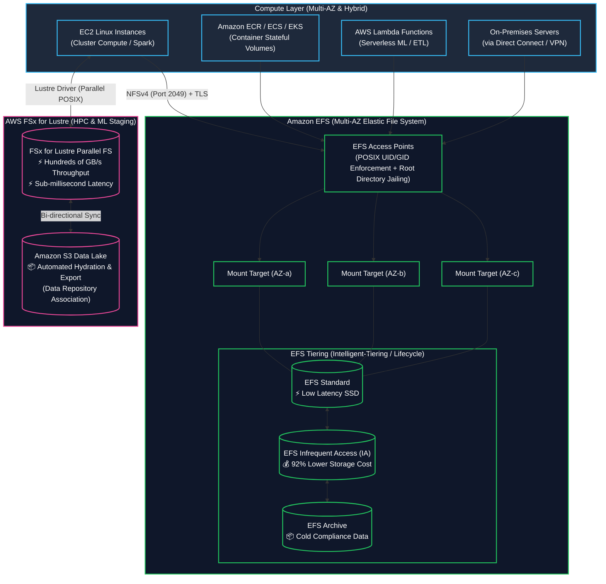
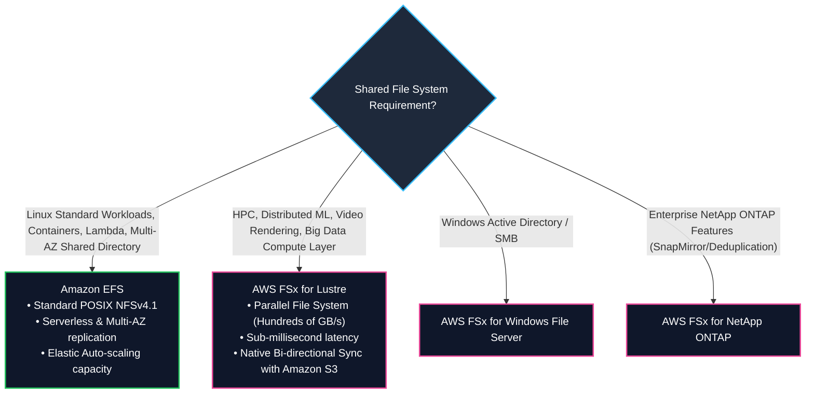

# 📁 Amazon EFS & AWS FSx (Lustre, ONTAP, Windows, OpenZFS) (မျှဝေသုံး ဖိုင်စနစ်များ)

- **Category**: Storage (Shared Managed File Systems)
- **Language / ဘာသာစကား**: [English Version](file:///home/monetine/Workspace/Wathon/aws-dea-c01/content/en/02-services/storage/efs-and-fsx.md) | **မြန်မာဘာသာ (Burmese)**
- **အဓိက အသုံးပြုမှု**: Linux Compute Clusters များအတွက် မျှဝေသုံး POSIX File Storage၊ Container Persistent Volumes (`[[ecr-ecs-eks]]`)၊ Serverless Functions (`[[lambda]]`)၊ နှင့် `[[s3]]` မှ HPC/Machine Learning Datasets များကို အလွန်မြန်ဆန်သော **AWS FSx for Lustre** ဖြင့် Parallel Staging ပြုလုပ်ခြင်း။
- **Slide Reference**: Pages 139–154 in `[[AWSCertifiedDataEngineerSlides.pdf]]`
- **Hub Links**: `[[mm/index]]` | `[[en/index]]` | `[[s3]]` | `[[ebs-and-instance-store]]`

---

## ၁။ အကျဉ်းချုပ် (High-Level Summary)

Shared File Storage သည် Compute Instances ရာထောင်ချီ (EC2, ECS Tasks, EKS Pods, Lambda Functions များနှင့် On-premise Servers) အား Single POSIX File System တစ်ခုတည်းကို Network မှတစ်ဆင့် တစ်ပြိုင်နက် ရယူအသုံးပြုခွင့် (Read/Write) ပေးသည်။

---

## ၂။ Amazon EFS vs. AWS FSx for Lustre (Core Exam Focus)

| Dimension | Amazon EFS | AWS FSx for Lustre |
| :--- | :--- | :--- |
| **Protocol** | **NFSv4.1 / NFSv4.0** | **Lustre Parallel Client** |
| **Architecture** | **Multi-AZ by default** (Regional Resilience) | **Single-AZ** (Scratch/Persistent) သို့မဟုတ် Multi-AZ |
| **S3 Integration** | DataSync ဖြင့် သီးခြား ကူးယူရသည် | **Native Direct S3 Link (Data Repository Association)** — S3 ရှိ Object များကို ဖိုင်အဖြစ် တိုက်ရိုက်ဖတ်/ရေးသည် |
| **Performance Profile** | အများဆုံး 10+ GB/s Throughput, Low-ms Latency | **Hundreds of GB/s Throughput, Millions of IOPS, Sub-ms Latency** |
| **Data Engineering အသုံးချမှု** | • Container Persistent Volumes (`[[ecr-ecs-eks]]`) • Lambda Functions (`[[lambda]]`) ကြီးမားသော ML Model မျှဝေရန် | • **Distributed Machine Learning (SageMaker / PyTorch)** • **High-Performance Big Data Simulations on S3 data** |

---

## ၃။ DEA-C01 စာမေးပွဲ အဓိက အချက်အလက်များ (Exam Tips)

> [!IMPORTANT]
> **Key Exam Trigger Keywords**:
> - **"Shared POSIX file system across multiple Availability Zones for Linux EC2, ECS, and Lambda"** $\rightarrow$ **Amazon EFS**.
> - **"Ultra-high-throughput parallel file system for machine learning / HPC with seamless bi-directional S3 data lake sync"** $\rightarrow$ **AWS FSx for Lustre**.
> - **"Restrict Lambda function file access to a specific POSIX directory with UID/GID enforcement"** $\rightarrow$ **EFS Access Points**.

---

## 📌 ဆက်စပ် မှတ်စုများ (Related Notes)

- `[[ebs-vs-efs-vs-instance-store]]` — Decision Matrix: EBS vs. EFS vs. Instance Store
- `[[s3]]` — Amazon S3 Data Lake Object Storage
- `[[lambda]]` — AWS Lambda with Mounted Amazon EFS
- `[[ecr-ecs-eks]]` — Containers Persistent Storage
