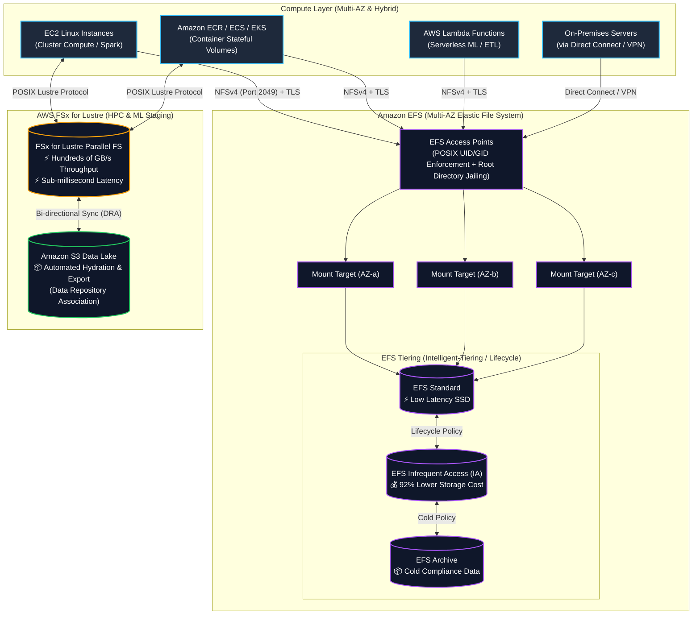
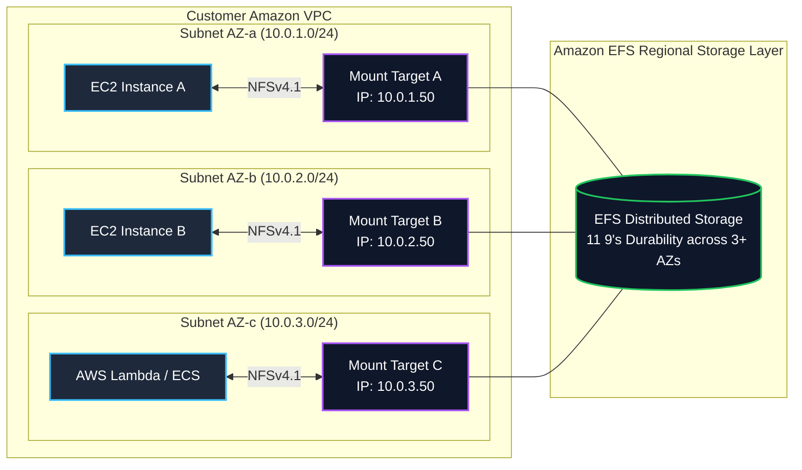
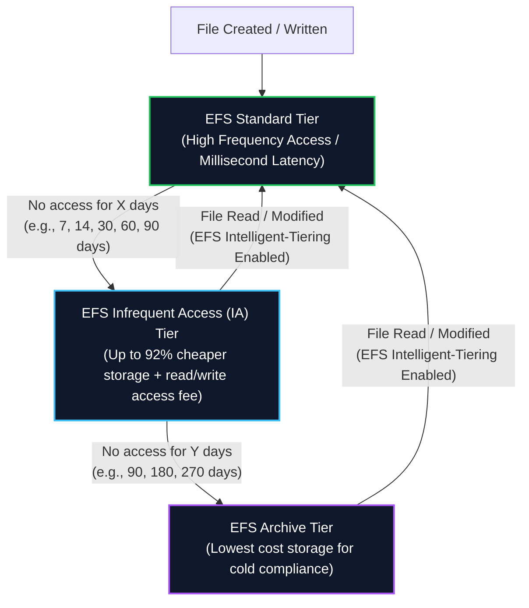
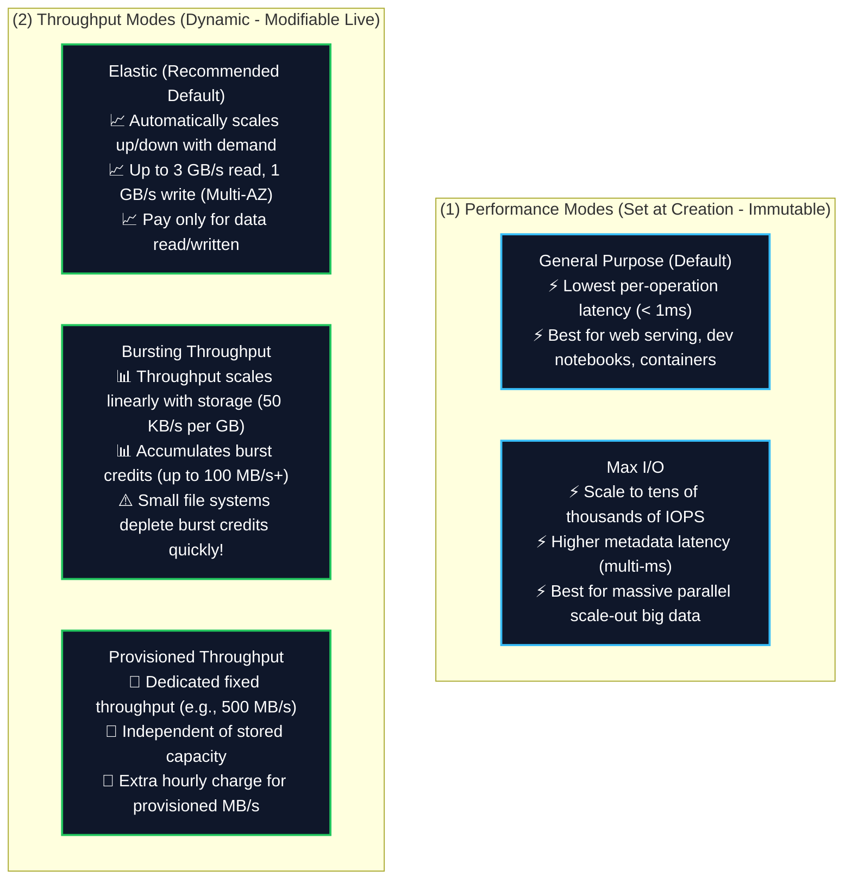
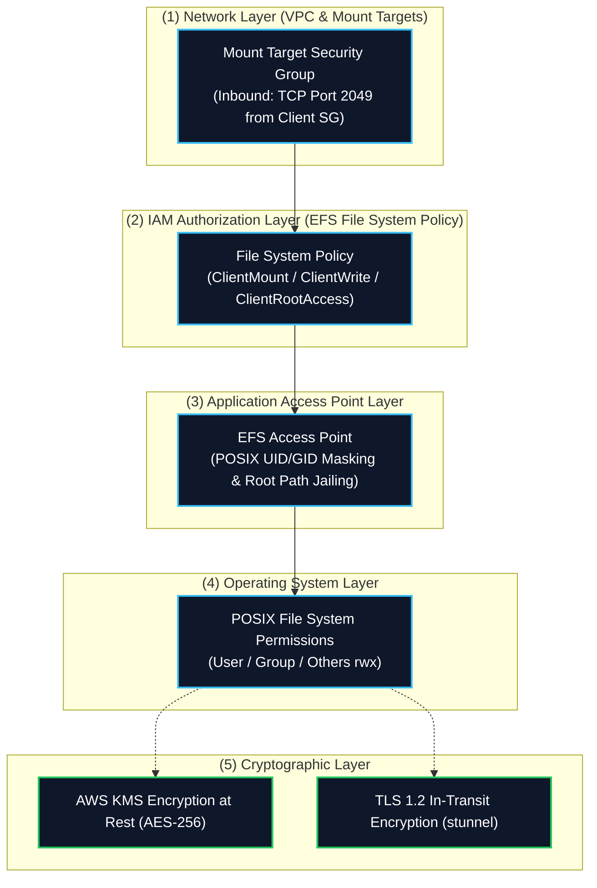
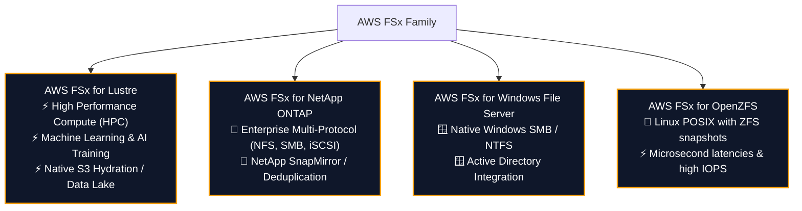
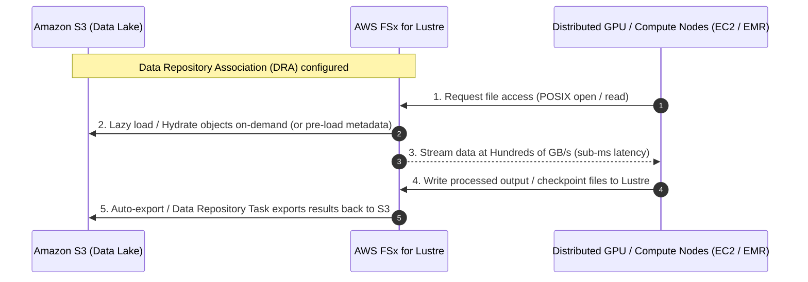
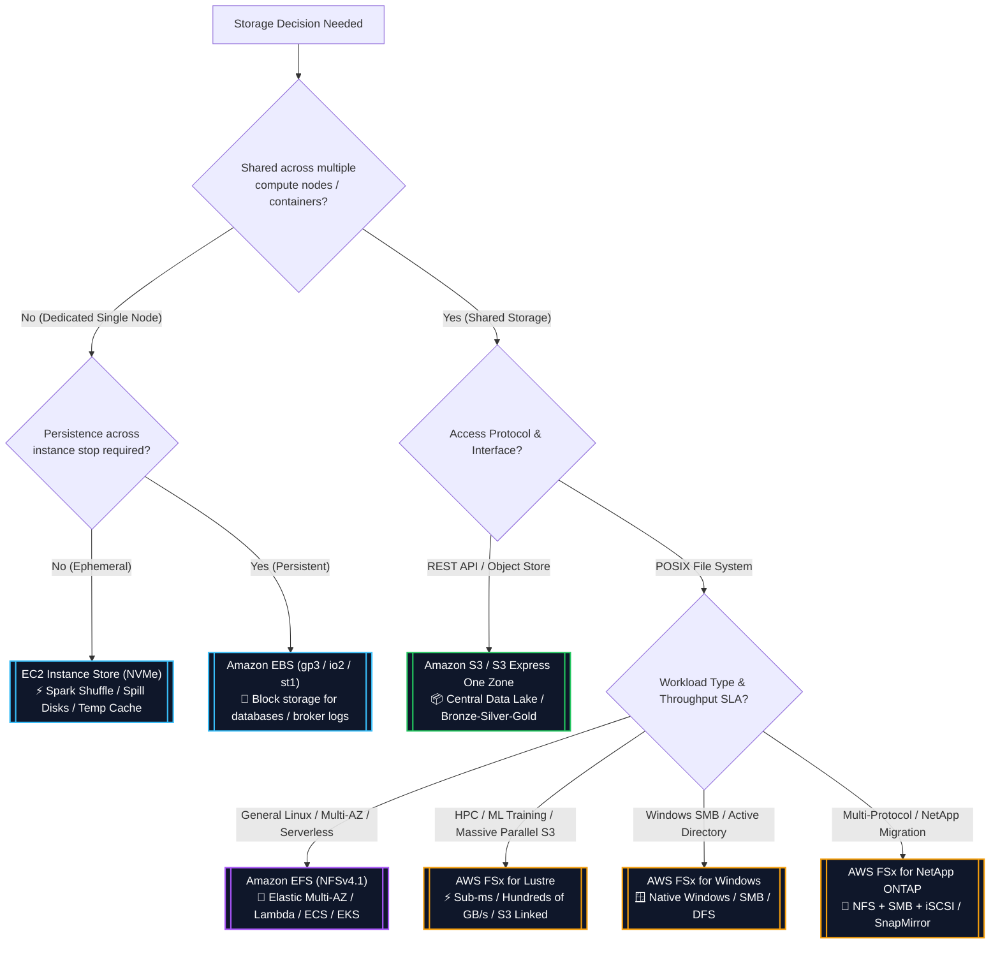
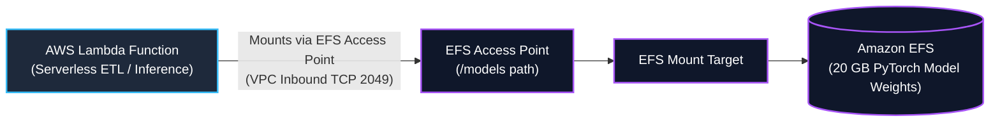

# 📁 Amazon EFS & AWS FSx (Lustre, ONTAP, Windows, OpenZFS)

- **Category**: Storage (Shared Managed File Systems)
- **Language / ဘာသာစကား**: [English (Original)](file:///home/monetine/Workspace/Wathon/aws-dea-c01/content/en/02-services/storage/efs-and-fsx.md) | **မြန်မာဘာသာ (Burmese)**
- **Primary Use Case**: Distributed Linux compute cluster များ၊ container persistent volume များ ([[ecr-ecs-eks]])၊ serverless function များ ([[lambda]]) နှင့် [[s3]] မှ ultra-high-throughput HPC / ML data staging အတွက် Shared POSIX file storage ဖြစ်သည်။
- **Slide Reference**: `[[AWSCertifiedDataEngineerSlides.pdf]]` မှ စာမျက်နှာ 139–154
- **Hub Links**: [[mm/index]] | [[service-catalog]] | [[domain-2-data-store-management]] | [[s3]] | [[ebs-and-instance-store]]

---

## 1. High-Level Summary

Shared file storage သည် concurrent compute instance ရာနှင့်ချီမှ ထောင်နှင့်ချီအထိ (EC2, ECS task များ, EKS pod များ, Lambda function များနှင့် on-premises server များ) အား တစ်ခုတည်းသော၊ မျှဝေထားသော၊ POSIX-compliant file system တစ်ခုသို့ standard network protocol များ (**EFS** အတွက် **NFSv4**; **FSx** အတွက် **Lustre / SMB / NFS**) မှတစ်ဆင့် တစ်ပြိုင်နက်တည်း ဝင်ရောက်အသုံးပြုခွင့်ပေးသည်။

**AWS Certified Data Engineer – Associate (DEA-C01)** စာမေးပွဲအတွက်၊ အောက်ပါတို့ကို မည်သည့်အချိန်တွင် အသုံးပြုရမည်ကို ခွဲခြားသိမြင်ရန် လိုအပ်သည်-
1. **Amazon EFS**: Standard Linux workload များ၊ container များ၊ Lambda နှင့် cross-AZ shared directory များအတွက် Fully managed, serverless, Multi-AZ elastic file storage ဖြစ်သည်။
2. **AWS FSx for Lustre**: **Amazon S3 ဖြင့် native, bi-directional synchronization** ပါဝင်သော compute-heavy workload များ (HPC, distributed machine learning, video rendering, big data analytics) အတွက် အထူးပြင်ဆင်ထားသည့် Ultra-high-performance parallel file storage ဖြစ်သည်။
3. **AWS FSx for NetApp ONTAP / Windows / OpenZFS**: Enterprise multi-protocol storage, native Windows SMB environment များနှင့် ZFS-powered workflow များဖြစ်သည်။



---

## 2. Amazon EFS Architecture & Core Components

Amazon EFS သည် ဖိုင်များထည့်သွင်းခြင်းနှင့် ဖယ်ရှားခြင်းများပြုလုပ်ရာတွင် အလိုအလျောက် ကြီးထွားနိုင်၊ ကျုံ့နိုင်သော elastic, serverless file storage ကို ပံ့ပိုးပေးပြီး၊ မည်သည့် storage provisioning သို့မဟုတ် management မှ ပြုလုပ်ရန်မလိုအပ်ပါ။



### Key Architectural Elements

1. **Mount Targets**:
   - EC2 instance, container သို့မဟုတ် Lambda function တစ်ခုမှ EFS file system ကို mount လုပ်ရန်၊ compute resource များရှိနေသော Availability Zone တစ်ခုစီတိုင်းတွင် **Mount Target** တစ်ခုကို ဖန်တီးရမည်ဖြစ်သည်။
   - Mount Target တစ်ခုစီသည် IP address တစ်ခုနှင့် DNS name တစ်ခု (ဥပမာ- `fs-12345678.efs.us-east-1.amazonaws.com`) ကို ပံ့ပိုးပေးသည်။
   - AZ-a ရှိ client များသည် cross-AZ data transfer fee များကို ရှောင်ရှားရန်နှင့် latency ကို အနည်းဆုံးဖြစ်စေရန် AZ-a ရှိ Mount Target နှင့်သာ ဆက်သွယ်ကြသည်။
   - **Security Group**: Mount Target တွင် တွဲထားသည်။ Compute security group သို့မဟုတ် subnet CIDR မှ inbound **TCP Port 2049 (NFS)** ကို ခွင့်ပြုထားရမည်။

2. **EFS Access Points (Crucial for Lambda & Containers)**:
   - Fine-grained access control, identity masking နှင့် directory isolation တို့ကို အသက်ဝင်စေသော EFS file system တစ်ခုအတွင်းသို့ application-specific entry point များဖြစ်သည်။
   - **POSIX Identity Enforcement**: Client မှ ပံ့ပိုးပေးသော identity ကို override လုပ်ပြီး access point မှတစ်ဆင့် တောင်းဆိုမှုအားလုံးကို တိကျသော POSIX user ID (`UID`), group ID (`GID`) နှင့် secondary GID များ အသုံးပြုရန် တွန်းအားပေးသည်။
   - **Root Directory Jailing**: တိကျသော sub-directory path တစ်ခုကို virtual root (ဥပမာ- `/export/app1`) အဖြစ် သတ်မှတ်ပြီး၊ client များအား အခြား application များမှ ပိုင်ဆိုင်သော parent directory များ သို့မဟုတ် ဖိုင်များထံသို့ ဝင်ရောက်ခွင့်ကို တားဆီးပေးသည်။
   - **Automatic Directory Creation**: Client မှ mount လုပ်ချိန်တွင် သတ်မှတ်ထားသော root directory မရှိပါက၊ သတ်မှတ်ထားသော owner permission များဖြင့် ၎င်းကို အလိုအလျောက် ဖန်တီးပေးသည်။
   - **Exam Significance**: **AWS Lambda** သို့ EFS ကို mount လုပ်ရာတွင် EFS Access Point များသည် **မဖြစ်မနေ (mandatory)** လိုအပ်ပြီး၊ multi-tenant **Amazon ECS / EKS** deployment များအတွက် အကြံပြုထားသည်။

3. **EFS Mount Helper (`amazon-efs-utils`)**:
   - `mount.efs` command ကို ပံ့ပိုးပေးသော open-source package တစ်ခုဖြစ်သည်။
   - File system ID ဖြင့် mount လုပ်ခြင်းကို အလိုအလျောက်လုပ်ဆောင်ပေးသည်၊ **TLS in-transit encryption** (`stunnel` မှတစ်ဆင့်) ကို လုပ်ဆောင်ပေးပြီး IAM authentication token များကို ထောက်ပံ့ပေးသည်။

---

## 3. EFS Storage Classes & Automated Lifecycle Tiering

EFS သည် performance နှင့် cost ကို ချိန်ညှိရန် storage class မျိုးစုံကို ပံ့ပိုးပေးသည်။ ဖိုင်များသည် **EFS Lifecycle Management** နှင့် **EFS Intelligent-Tiering** ကို အသုံးပြု၍ tier များတစ်လျှောက် အလိုအလျောက် migrate လုပ်နိုင်သည်။



### Storage Classes Comparison Matrix

| Storage Class | Availability / Durability | Redundancy Scope | Storage Cost (Approx.) | Access Fee | Optimal Workload |
| :--- | :--- | :--- | :--- | :--- | :--- |
| **EFS Standard** | 99.99% / 11 9's | **Multi-AZ** (3+ AZs) | ~$0.30 / GB-mo | None | Active data, web serving, ETL staging, container root volumes |
| **EFS Infrequent Access (IA)** | 99.99% / 11 9's | **Multi-AZ** (3+ AZs) | ~$0.025 / GB-mo (92% savings) | ~$0.01 / GB read | တစ်လလျှင် အကြိမ်အနည်းငယ်သာ အသုံးပြုသော ဖိုင်များ |
| **EFS Archive** | 99.99% / 11 9's | **Multi-AZ** (3+ AZs) | ~$0.008 / GB-mo (Lowest Multi-AZ) | ~$0.03 / GB read | Cold historical data, တစ်နှစ်လျှင် အကြိမ်အနည်းငယ်အောက်သာ အသုံးပြုသော regulatory archive များ |
| **EFS One Zone** | 99.9% / 11 9's (Single AZ) | **Single AZ** | ~$0.16 / GB-mo (47% savings vs Standard) | None | Non-critical dev/test, replicated build artifacts, single-AZ app များ |
| **EFS One Zone-IA** | 99.9% / 11 9's (Single AZ) | **Single AZ** | ~$0.0133 / GB-mo | ~$0.01 / GB read | မကြာခဏ အသုံးမပြုသော single-AZ dev/test dataset များ |

### Lifecycle Policies & Intelligent-Tiering

1. **Transition into IA / Archive**:
   - သတ်မှတ်ထားသော ကာလတစ်ခုအထိ (ဥပမာ- `1, 7, 14, 30, 60, 90, 180, 270, သို့မဟုတ် 365 ရက်`) read သို့မဟုတ် modify မလုပ်ထားသော ဖိုင်များကို ရွှေ့ပေးသည်။
2. **Transition out of IA / Archive (Intelligent-Tiering)**:
   - **Intelligent-Tiering မပါဘဲ**: IA ရှိ ဖိုင်တစ်ခုကို read လုပ်ခြင်းသည် ၎င်းကို IA တွင်သာ ဆက်လက်ထားရှိစေသည် (နောက်ပိုင်း read လုပ်မှုများတွင် ထပ်တလဲလဲ access charge များကို ကျသင့်စေသည်)။
   - **Intelligent-Tiering ဖြင့် (Recommended)**: IA သို့မဟုတ် Archive ရှိ ဖိုင်တစ်ခုကို read လုပ်ခြင်းသည် ၎င်းကို **EFS Standard သို့ အလိုအလျောက် restore လုပ်ပေးပြီး**၊ မမျှော်လင့်ထားသော burst read pattern များအတွင်း ကြီးမားလှသော access charge များမှ ကာကွယ်ပေးသည်။

---

## 4. EFS Performance Modes & Throughput Modes

မှန်ကန်သော **Performance Mode** နှင့် **Throughput Mode** ပေါင်းစပ်မှုကို ရွေးချယ်ခြင်းသည် DEA-C01 စာမေးပွဲတွင် pipeline performance နှင့် cost optimization နှစ်ခုစလုံးအတွက် အလွန်အရေးကြီးပါသည်။



### Performance Modes

- **General Purpose (Recommended Default)**:
   - File operation တစ်ခုချင်းစီအတွက် အနိမ့်ဆုံး latency ကို ပေးစွမ်းသည် (metadata နှင့် read operation များအတွက် sub-millisecond)။
   - Standard data workload အများစု၊ container shared disk များနှင့် interactive web server များအတွက် အကြံပြုထားသည်။
- **Max I/O**:
   - အကန့်အသတ်မရှိနီးပါး aggregate throughput နှင့် သောင်းနှင့်ချီသော IOPS အထိ scale လုပ်နိုင်သည်။
   - တစ်ဦးချင်းစီ metadata operation များအတွက် (`ls`, `stat`, `mkdir`) အနည်းငယ် latency တက်နိုင်သည် (multi-millisecond)။
   - ကြီးမားလှသော parallel scale-out compute cluster များအတွက်သာ အကြံပြုထားသည် (ရာနှင့်ချီသော parallel Spark / MapReduce node များက file system ကို တစ်ပြိုင်နက်တည်း query လုပ်ခြင်း)။

### Throughput Modes

| Throughput Mode | Scaling Model | Max Throughput Limits | Cost Structure | Best Data Engineering Use Case |
| :--- | :--- | :--- | :--- | :--- |
| **Elastic (Default)** | Read/write I/O အပေါ်အခြေခံ၍ ချက်ချင်း auto-scale လုပ်သည် | **3 GB/s Read, 1 GB/s Write** (Multi-AZ)<br/>(အချို့ region များတွင် 10 GB/s အထိ) | Data အသွားအလာ GB အလိုက် ပေးချေရသည် ($0.03/GB read, $0.06/GB write) + base storage | **Spiky, unpredictable ETL pipeline များ, periodic batch job များ, serverless function များ.** |
| **Bursting** | Baseline သည် သိုလှောင်မှုနှင့်အမျှ $50 \text{ KB/s per GB}$ ဖြင့် scale လုပ်သည်; burst credit များကိုသုံး၍ $100 \text{ MB/s}$ သို့ burst လုပ်နိုင်သည် | စုစုပေါင်း သိုလှောင်မှုပမာဏအပေါ် မူတည်သည် | Base storage စျေးနှုန်းတွင် ပါဝင်သည် | Baseline throughput လုံလောက်သော ကြီးမားသည့် storage ပမာဏ (> 1 TiB) ရှိသော ပုံမှန် workload များ။ |
| **Provisioned** | သတ်မှတ်ထားသော throughput ကို manual ဖြင့် provision လုပ်သည် (ဥပမာ- 200 MB/s) | 3,000 MB/s အထိ | Baseline ထက်ကျော်လွန်သော provisioned MB/s အတွက် ပေးချေရသည် | စဉ်ဆက်မပြတ် မြင့်မားသော throughput လိုအပ်သော (ဥပမာ- streaming ingest buffer) သေးငယ်သည့် storage ပမာဏ (< 50 GB)။ |

> [!WARNING]
> **Bursting Credit Exhaustion Trap**:
> အကယ်၍ file system သည် သေးငယ်ပါက (ဥပမာ- 10 GB)၊ ၎င်း၏ baseline throughput သည် $500 \text{ KB/s}$ သာဖြစ်သည်။ အကယ်၍ heavy ETL job တစ်ခုက ၎င်းကို အသုံးပြုပါက၊ file system သည် ၎င်း၏ burst credit များကို မိနစ်အနည်းငယ်အတွင်း ကုန်စင်သွားစေပြီး၊ pipeline ကို $500 \text{ KB/s}$ သို့ throttle လုပ်သွားမည်ဖြစ်သည်။ **Solution**: **Elastic Throughput** သို့မဟုတ် **Provisioned Throughput** သို့ ပြောင်းပါ။

---

## 5. EFS Security, Encryption & Access Control

EFS သည် network boundary များ၊ IAM permission များနှင့် POSIX file access များတစ်လျှောက်တွင် defense-in-depth security ကို ပံ့ပိုးပေးသည်။



### 1. Encryption
- **Encryption at Rest**: ဖန်တီးစဉ်အတွင်း [[kms-and-secrets]] (AWS KMS CMK သို့မဟုတ် AWS-managed key `aws/elasticfilesystem`) ကို အသုံးပြု၍ ဖွင့်နိုင်သည်။ Metadata နှင့် file content အားလုံးကို performance ထိခိုက်မှုမရှိဘဲ လုံခြုံစွာ encrypt လုပ်ထားသည်။
- **Encryption in Transit**: `amazon-efs-utils` ( `-o tls` mount flag ကို အသုံးပြု၍) မှတစ်ဆင့် mount လုပ်သောအခါ အလိုအလျောက် စီမံခန့်ခွဲပေးသော industry-standard **TLS 1.2** ကို အသုံးပြုသည်။

### 2. IAM Policies for NFS Clients
EFS သည် တိကျသောလုပ်ဆောင်မှုများကို ခွင့်ပြုရန် သို့မဟုတ် တားမြစ်ရန် IAM file system resource policy များကို ထောက်ပံ့ပေးသည်-
- `elasticfilesystem:ClientMount`: File system ကို read-only ဖြင့် mount လုပ်ခြင်းအား ခွင့်ပြုသည်။
- `elasticfilesystem:ClientWrite`: File system သို့ ရေးသားခြင်းအား ခွင့်ပြုသည်။
- `elasticfilesystem:ClientRootAccess`: Client သည် file system ကို `root` (UID 0) အနေဖြင့် ဝင်ရောက်နိုင်ခြင်း ရှိ/မရှိ သို့မဟုတ် anonymous user အဖြစ် ပြောင်းလဲခြင်း (squashed) ကို ထိန်းချုပ်သည်။

### Example EFS IAM File System Policy (Enforcing Read-Only and In-Transit Encryption)

```json
{
  "Version": "2012-10-17",
  "Id": "EFSReadOnlyAndSecurePolicy",
  "Statement": [
    {
      "Sid": "EnforceTLS",
      "Effect": "Deny",
      "Principal": "*",
      "Action": "*",
      "Resource": "arn:aws:elasticfilesystem:us-east-1:123456789012:file-system/fs-12345678",
      "Condition": {
        "Bool": {
          "aws:SecureTransport": "false"
        }
      }
    },
    {
      "Sid": "AllowMountAndWriteForRole",
      "Effect": "Allow",
      "Principal": {
        "AWS": "arn:aws:iam::123456789012:role/DataEngineeringETLRole"
      },
      "Action": [
        "elasticfilesystem:ClientMount",
        "elasticfilesystem:ClientWrite"
      ],
      "Resource": "arn:aws:elasticfilesystem:us-east-1:123456789012:file-system/fs-12345678"
    }
  ]
}
```

---

## 6. AWS FSx File Systems Family Deep Dive

AWS FSx သည် fully managed, purpose-built, high-performance third-party နှင့် open-source file system များကို ပံ့ပိုးပေးသည်။



### 1. AWS FSx for Lustre (Top Exam Focus for DEA-C01)

Lustre သည် sub-millisecond latency များ၊ တစ်စက္ကန့်လျှင် gigabyte ရာနှင့်ချီသော throughput များနှင့် သန်းနှင့်ချီသော IOPS လိုအပ်သည့် compute-intensive workload များအတွက် ဒီဇိုင်းထုတ်ထားသော open-source parallel file system ဖြစ်သည်။



#### Key FSx for Lustre Features

1. **Native Amazon S3 Integration (Data Repository Association - DRA)**:
   - FSx for Lustre ကို Amazon S3 bucket တစ်ခုနှင့် တိုက်ရိုက်ချိတ်ဆက်နိုင်သည်။
   - ဖန်တီးလိုက်သောအခါ၊ Lustre သည် S3 metadata များကို ယူဆောင်လာသည် (object key များကို POSIX ဖိုင်/ဖိုင်တွဲများအဖြစ် တွေ့မြင်ရသည်)။
   - **Lazy Loading**: Compute node များက ဖိုင်တစ်ခုကို read လုပ်သောအခါ၊ FSx သည် ပထမဆုံးအကြိမ် ဝင်ရောက်မှုတွင် S3 မှ byte များကို ဖုံးကွယ်၍ (transparently) load လုပ်ပေးသည်။
   - **Data Repository Tasks (DRT)**: FSx မှ ပြင်ဆင်ထားသော သို့မဟုတ် အသစ်ဖန်တီးထားသော ဖိုင်များကို S3 သို့ ပြန်လည် export လုပ်ပေးနိုင်သည် (export policy များမှတစ်ဆင့် အလိုအလျောက် သို့မဟုတ် API/CLI မှတစ်ဆင့် ကိုယ်တိုင်လုပ်ဆောင်ခြင်း)။
2. **Deployment Options**:
   - **Scratch File Systems**: ယာယီ၊ တိုတောင်းသော (ephemeral) compute workload များအတွက် ဒီဇိုင်းထုတ်ထားသည်။ Disk များအကြား ဒေတာပုံတူပွားခြင်း (replication) မရှိပါ (storage server တစ်ခု ကျသွားပါက၊ commit မလုပ်ရသေးသော ဒေတာများ ဆုံးရှုံးသွားမည်)။ အနည်းဆုံး ကုန်ကျစရိတ်ဖြင့် အမြင့်ဆုံး raw burst throughput ကို ရရှိသည်။
   - **Persistent File Systems**: ရေရှည်လုပ်ဆောင်ရမည့် workload များအတွက် ဒီဇိုင်းထုတ်ထားသည်။ ဒေတာများကို တူညီသော AZ အတွင်း ပုံတူပွားထားသည်; ကျသွားသော file server များကို အလိုအလျောက် အစားထိုးပေးသည်။ SSD storage သို့မဟုတ် HDD storage (ရွေးချယ်နိုင်သော SSD read cache များနှင့်အတူ) ရရှိနိုင်သည်။

### 2. AWS FSx for NetApp ONTAP
- NetApp ၏ လူသိများသော ONTAP file system အပေါ်တွင် တည်ဆောက်ထားသည့် Fully managed shared storage ဖြစ်သည်။
- တူညီသော data volume ကို တစ်ပြိုင်နက်တည်း ဝင်ရောက်အသုံးပြုရန် **multi-protocol access** (NFS, SMB, နှင့် iSCSI) ကို ပံ့ပိုးပေးသည်။
- Enterprise storage feature များဖြစ်သော instant snapshotting, deduplication, compression, thin provisioning နှင့် on-premises NetApp cluster များနှင့် **SnapMirror** မှတစ်ဆင့် replication များကို ပံ့ပိုးပေးသည်။
- အေးနေသောဒေတာ (cold data) ကို မြန်ဆန်သော SSD များမှ ကုန်ကျစရိတ်သက်သာသော capacity pool သို့ အလိုအလျောက် tier ပြောင်းပေးသည်။

### 3. AWS FSx for Windows File Server
- **SMB (Server Message Block)** protocol မှတစ်ဆင့် ဝင်ရောက်အသုံးပြုနိုင်သော Fully managed native Microsoft Windows file system ဖြစ်သည်။
- Microsoft Active Directory (AD), DFS Namespaces, နှင့် Windows Access Control Lists (ACLs) တို့နှင့် natively ပေါင်းစပ်အလုပ်လုပ်သည်။
- အလိုအလျောက် failover ပါဝင်သော Single-AZ သို့မဟုတ် Multi-AZ deployment များဖြင့် ရရှိနိုင်သည်။

### 4. AWS FSx for OpenZFS
- Linux application များအတွက် POSIX-compliant shared storage ကို ပံ့ပိုးပေးသော Managed OpenZFS file system ဖြစ်သည်။
- 1 million IOPS အထိနှင့် 0.5 millisecond အောက် latency များကို ရရှိစေသည်။
- Instant point-in-time ZFS snapshot များ၊ data cloning နှင့် on-the-fly compression များကို ပံ့ပိုးပေးသည်။

---

## 7. Storage Decision Matrix: S3 vs. EBS vs. EFS vs. FSx for Lustre

AWS storage solution များအကြား architectural အပိုင်းအခြားများကို နားလည်ခြင်းသည် **Domain 2 (Data Store Management)** တွင် များစွာစမ်းသပ်ခံရမည်ဖြစ်သည်။



### Comprehensive Storage Comparison Matrix

| Dimension | Amazon S3 | Amazon EBS | Amazon EFS | AWS FSx for Lustre | EC2 Instance Store |
| :--- | :--- | :--- | :--- | :--- | :--- |
| **Storage Type** | Object Storage | Block Storage | Distributed File System | Parallel File System | Ephemeral Host Block |
| **Protocol** | HTTPS (REST API) | Block device (PCIe/NVMe over fabric) | **NFSv4.0 / NFSv4.1** | **Lustre POSIX** | Direct PCIe / NVMe |
| **Multi-Node Concurrency** | Millions of clients | Single instance (`io2` Multi-Attach ဖြင့် တူညီသော AZ တွင် 16 ခုအထိ) | **Thousands of clients** | **Thousands of clients** | Single instance only |
| **Multi-AZ Availability** | Multi-AZ (Standard) သို့မဟုတ် Single-AZ (Express) | **Single AZ strictly** | **Multi-AZ (Standard)** သို့မဟုတ် Single-AZ (One Zone) | **Single AZ** (Multi-AZ S3 နှင့် ချိတ်ဆက်ထားသည်) | **Physical Host only** |
| **Latency** | ~10–50 ms (Express One Zone တွင် Single-digit ms) | Low ms မှ sub-ms အထိ (`io2`) | Low ms (GP တွင် < 1ms metadata) | **Sub-millisecond** | **Sub-millisecond (Fastest)** |
| **Throughput Capacity** | Virtually unlimited (prefix တစ်ခုလျှင် 3,500 PUT / 5,500 GET) | 4,000 MB/s အထိ (`io2 Block Express`) | **Up to 3+ GB/s (Elastic)** | **Hundreds of GB/s** | အမြင့်ဆုံး raw physical bus throughput |
| **Capacity Sizing** | Infinite auto-scaling | Pre-provisioned volume size (64 TiB အထိ) | **Elastic auto-scaling** (PBs) | Provisioned cluster size | EC2 instance အမျိုးအစားပေါ်မူတည်၍ သတ်မှတ်ထားသည် |
| **S3 Direct Integration** | Native | S3 သို့ Snapshot backup လုပ်ခြင်း | AWS DataSync / AWS Backup | **Native Lazy-Loading & Auto-Export** | Custom replication script များ |
| **Primary DEA-C01 Role** | Central Data Lake, Bronze/Silver/Gold tier များ | Database များ, Kafka broker log များ, stateful compute | Shared web/notebook dir များ, Lambda state, container PV များ | **HPC, ML model training, EMR high-speed staging** | Spark shuffle space, MapReduce spill များ, temp cache |

---

## 8. Data Engineering Architecture Patterns

### Pattern A: Serverless Machine Learning Inference with AWS Lambda & Amazon EFS

- **Challenge**: Machine learning inference model များ (ဥပမာ- PyTorch, Hugging Face NLP transformer များ) သည် 250 MB Lambda deployment package အကန့်အသတ်နှင့် 10 GB ephemeral `/tmp` storage အကန့်အသတ်များကို ကျော်လွန်နေသည်။
- **Solution**: **Amazon EFS** file system တစ်ခုကို **EFS Access Point** မှတစ်ဆင့် AWS Lambda function သို့ mount လုပ်ပါ။
- **Architecture**:
  - EFS Access Point သည် UID/GID ကို ကန့်သတ်ပေးပြီး `/models` သို့ map လုပ်ပေးသည်။
  - Lambda execution environment သည် cold start တွင် EFS directory ကို mount လုပ်သည်။
  - ကြီးမားသော pre-trained model weight များကို (ဥပမာ- 20 GB) စတင်ချိန်တွင် Lambda memory အတွင်းသို့ တိုက်ရိုက် load လုပ်သည်။



### Pattern B: Ultra-Fast Distributed ML Training & EMR Staging with FSx for Lustre + S3

- **Challenge**: Distributed deep learning model များကို သင်ကြားပေးခြင်း (training) သို့မဟုတ် heavy geospatial analytics များကို S3 သို့ တိုက်ရိုက်လုပ်ဆောင်ခြင်းသည် GET request များကို ပိတ်ဆို့စေပြီး (bottleneck) မြင့်မားသော network latency များကို ဖြစ်စေသည်။
- **Solution**: S3 Data Lake သို့ ညွှန်ပြထားသော Data Repository Association ပါဝင်သည့် **AWS FSx for Lustre** cluster တစ်ခုကို တည်ဆောက်ပါ။
- **Architecture**:
  - Compute worker node များသည် training image/tensor များကို တစ်စက္ကန့်လျှင် gigabyte ရာနှင့်ချီ၍ sub-millisecond latency များဖြင့် ဖတ်သည်။
  - Model checkpoint များနှင့် evaluation metric များကို Lustre သို့ တိုက်ရိုက်ရေးသားသည်။
  - **FSx Data Repository Task** တစ်ခုက ထွက်ပေါ်လာသော ဖိုင်များကို Amazon S3 သို့ အလိုအလျောက် ပြန်လည် sync လုပ်ပေးသည်။
  - Training ပြီးဆုံးသောအခါ၊ (ကုန်ကျစရိတ်သက်သာစေရန်) FSx for Lustre cluster ကို ဖျက်ပစ်ပြီး၊ အရေးကြီးသော ဒေတာများသည် S3 တွင် လုံခြုံစွာ ကျန်ရှိနေမည်ဖြစ်သည်။

### Pattern C: Multi-Tenant Analytics & JupyterHub on Amazon EKS

- **Challenge**: ရာနှင့်ချီသော data scientist များသည် သီးခြားစီဖြစ်သော home directory များနှင့် pod restart လုပ်တိုင်း ပျက်မသွားသော (persistent storage) မျှဝေသုံး dataset ဖိုင်တွဲများ လိုအပ်သည်။
- **Solution**: **Amazon EFS CSI Driver** ကို Amazon EKS တွင် **EFS Access Point** များဖြင့် dynamic volume provisioning အသုံးပြု၍ deploy လုပ်ပါ။
- **Architecture**:
  - Data scientist pod တစ်ခုစီသည် POSIX permission များ ချမှတ်ထားသော သီးသန့် Access Point root directory (`/users/user-123`) တစ်ခုကို ရရှိသည်။
  - အများသုံး read-only dataset များကို မျှဝေထားသော လမ်းကြောင်း (`/data/curated-features`) တစ်ခုမှ mount လုပ်ထားသည်။

---

## 9. DEA-C01 Exam Tips, Pitfalls & Scenarios

> [!IMPORTANT]
> **Key Exam Trigger Keywords**:
>
> - **"Shared POSIX file system across multiple Linux EC2 instances, Lambda functions, or ECS/EKS containers"** $\rightarrow$ **Amazon EFS**.
> - **"Serverless file system that automatically grows and shrinks without provisioning"** $\rightarrow$ **Amazon EFS with Elastic Throughput**.
> - **"High Performance Computing (HPC), distributed ML model training, or sub-millisecond parallel file system linked to Amazon S3"** $\rightarrow$ **AWS FSx for Lustre**.
> - **"Enforce POSIX identity, directory isolation, or mount shared file system to AWS Lambda"** $\rightarrow$ **EFS Access Points**.
> - **"Migrate Windows file share using SMB, NTFS, and Active Directory integration"** $\rightarrow$ **AWS FSx for Windows File Server**.
> - **"Multi-protocol (NFS + SMB + iSCSI) with NetApp SnapMirror migration"** $\rightarrow$ **AWS FSx for NetApp ONTAP**.

> [!WARNING]
> **Common Exam Traps & Pitfalls**:
>
> 1. **EFS vs. EBS Multi-Attach**:
>    - EBS Multi-Attach (`io1`/`io2`) သည် တင်းကြပ်စွာ **Single-AZ** ဖြစ်ပြီး Nitro instance 16 ခုအထိသာ ကန့်သတ်ထားကာ၊ cluster-aware file system (ဥပမာ GFS2) လိုအပ်သည်။
>    - အကယ်၍ multi-AZ sharing သို့မဟုတ် ထောင်နှင့်ချီသော concurrent Linux client များ လိုအပ်ပါက၊ အဖြေသည် **Amazon EFS** ဖြစ်ပြီး၊ EBS Multi-Attach မဟုတ်ပါ။
> 2. **EFS Network Mounting Trap**:
>    - Client များသည် EFS သို့ public Internet မှတစ်ဆင့် တိုက်ရိုက်ချိတ်ဆက်၍ မရပါ။ On-premises server များသည် VPC Mount Target မှတစ်ဆင့် **AWS Direct Connect** သို့မဟုတ် **AWS Site-to-Site VPN** ကို အသုံးပြု၍ ချိတ်ဆက်ရမည်။
>    - Mount Target security group သည် client security group များမှ inbound **TCP Port 2049** ကို ခွင့်ပြုထားရမည်။
> 3. **Bursting Mode Exhaustion**:
>    - **Bursting Throughput** ပေါ်ရှိ သေးငယ်သော EFS file system များသည် burst credit များ ကုန်ဆုံးသွားပါက throttle လုပ်ခံရမည်ဖြစ်သည်။ စာမေးပွဲ မေးခွန်းတစ်ခုတွင် သေးငယ်သော dataset များပေါ်၌ မမျှော်လင့်ထားသော I/O bottleneck များကို ဖော်ပြထားပါက၊ **Elastic Throughput** သို့မဟုတ် **Provisioned Throughput** သို့ ပြောင်းလဲရန် အကြံပြုပါ။
> 4. **FSx for Lustre Scratch vs. Persistent**:
>    - **Scratch**: S3 က durable data ကို သိမ်းဆည်းထားသော ယာယီ/batch compute အတွက် အကောင်းဆုံးဖြစ်သည်။
>    - **Persistent**: Intra-AZ disk replication နှင့် အလိုအလျောက် high availability လိုအပ်သော အချိန်ကြာမြင့်စွာ လုပ်ဆောင်ရမည့် job များအတွက် အကောင်းဆုံးဖြစ်သည်။
> 5. **EFS File Deletion & Resizing**:
>    - (ကြီးထွားရုံသာရှိသော) EBS နှင့်မတူဘဲ၊ EFS သည် ဖိုင်များကို ဖျက်လိုက်သောအခါ အလိုအလျောက် ကျုံ့သွားပြီး၊ သင်၏ လစဉ် storage ဘေလ်ကို အလိုအလျောက် လျှော့ချပေးသည်။

---

## 📌 Related Notes

- [[s3]] — Persistent object storage and Data Lake architecture
- [[ebs-and-instance-store]] — Amazon EBS volume types and EC2 Instance Store
- [[ecr-ecs-eks]] — Containerized compute and persistent volume mounting
- [[lambda]] — Serverless data processing and EFS integration
- [[emr]] — Big data processing clusters and storage options
- [[datasync-and-snow]] — AWS DataSync for NFS/EFS automated migrations
- [[kms-and-secrets]] — AWS KMS keys and file system encryption
- [[service-comparisons]] — Service decision matrix (S3 vs EBS vs EFS vs FSx)
- [[ebs-vs-efs-vs-instance-store]] — Deep Dive: Amazon EFS vs. EBS vs. EC2 Instance Store
- [[domain-2-data-store-management]] — DEA-C01 Domain 2 Study Guide
