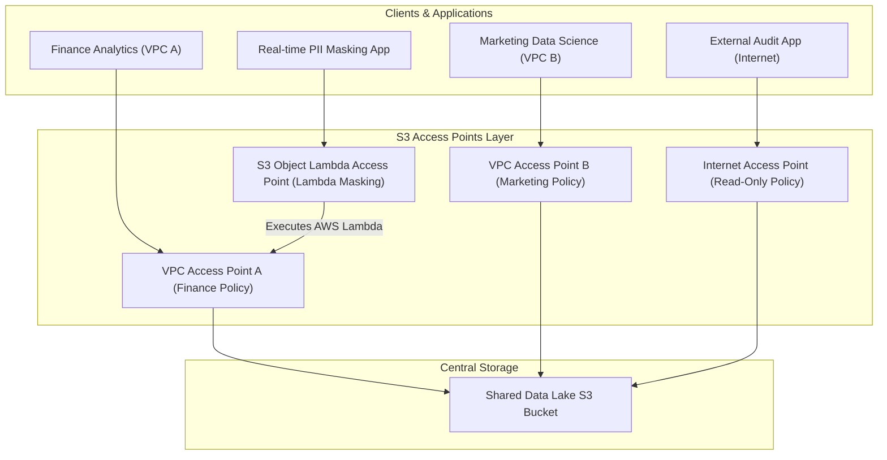
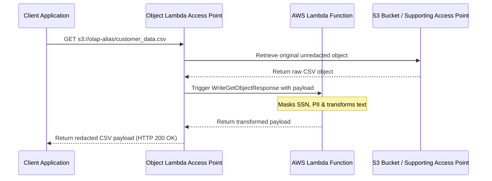

# 🌐 Amazon S3 Access Points & Object Lambda

- **Category**: Storage Governance & Access Management
- **Language / ဘာသာစကား**: [English (Original)](/en/02-services/storage/s3/s3-access-points) | **မြန်မာဘာသာ (Burmese)**
- **Primary Use Case**: Simplified Large-Scale Access Control, Multi-Tenant Data Lakes, In-Transit Data Transformation
- **Slide Reference**: Pages 77–138 in [AWSCertifiedDataEngineerSlides.pdf](/docs/AWSCertifiedDataEngineerSlides.pdf)
- **Hub Links**: [[mm/index|index]] | [[mm/00-hub/service-catalog|service-catalog]] | [[mm/02-services/storage/s3/s3|s3]] | [[mm/02-services/storage/s3/s3-encryption|s3-encryption]] | [[mm/02-services/networking-monitoring/vpc-and-networking|vpc-and-networking]]

---

## 1. High-Level Summary (အခြေခံအကျဉ်းချုပ်)

Data lake များ ပိုမိုကြီးမားလာသည်နှင့်အမျှ၊ single bucket policy တစ်ခုတည်းမှတဆင့် access permission များကို စီမံခန့်ခွဲခြင်းသည် ရှုပ်ထွေးလာပြီး အမှားအယွင်းများ ဖြစ်ပေါ်ရန်လွယ်ကူလာသည်။ **Amazon S3 Access Points** သည် သီးသန့် application များ၊ team များ၊ သို့မဟုတ် VPC များအတွက် သင့်လျော်သော custom access policy များပါရှိသည့် သီးသန့် network endpoint များကို ဖန်တီးပေးခြင်းဖြင့် ဤ "single bucket policy sprawl" ပြဿနာကို ဖြေရှင်းပေးသည်။ ထို့အပြင်၊ **S3 Object Lambda Access Points** သည် S3 မှ data များကို ဆွဲယူသည့်အချိန်တွင် data များကို inline ပြောင်းလဲခြင်း (ဥပမာ PII များကို ဖျောက်ဖျက်ခြင်း သို့မဟုတ် object များကို reformat လုပ်ခြင်း) ပြုလုပ်ခွင့်ပေးသည်။

---

## 2. Architecture & Access Point Types



---

## 3. Core Access Point Variants (အဓိက Access Point အမျိုးအစားများ)

### 1. Standard S3 Access Points (VPC & Internet)

- **Problem Solved**: Monolithic ဖြစ်သော 100 KB bucket policy ကို အသုံးပြုမည့်အစား team တစ်ခုချင်းစီ သို့မဟုတ် dataset consumer တစ်ခုချင်းစီအတွက် ခွဲထုတ်ထားသော၊ တိကျသည့် policy များဖြင့် အစားထိုးပေးသည်။
- **VPC-Restricted Access Points**: Data request များအားလုံးသည် **VPC Interface Endpoint** (`com.amazonaws.<region>.s3-global.accesspoint`) မှတဆင့် တိကျသော Virtual Private Cloud (VPC) တစ်ခုမှသာ စတင်လာစေရန် ကန့်သတ်ပေးသည်။
- **Addressing**: Access Point တစ်ခုစီသည် သီးခြား hostname နှင့် ARN တစ်ခုကို ရရှိသည်-
  - **ARN**: `arn:aws:s3:<region>:<account-id>:accesspoint/<access-point-name>`
  - **DNS Alias**: `s3://<access-point-alias>/` သို့မဟုတ် `https://<access-point-name>-<account-id>.s3-accesspoint.<region>.amazonaws.com`

### 2. S3 Multi-Region Access Points (MRAP)

- **Mechanism**: AWS Region အများအပြားရှိ အနိမ့်ဆုံး latency ရှိသော S3 bucket သို့ application request များကို အလိုအလျောက် route လုပ်ပေးသည့် single global endpoint (`https://<mrap-alias>.accesspoint.s3-global.amazonaws.com`) တစ်ခုကို ပံ့ပိုးပေးသည်။
- **Powered by AWS Global Accelerator**: Public internet ကို ကျော်ဖြတ်ကာ AWS global network backbone ပေါ်မှ traffic ကို လမ်းကြောင်းလွှဲပေးခြင်းဖြင့် request performance ကို **60% အထိ** ပိုမိုကောင်းမွန်စေသည်။
- **Active-Passive / Active-Active Failover**: High availability နှင့် disaster recovery အတွက် ချို့ယွင်းနေသော region မှ traffic များကို အခြား region ရှိ secondary bucket များသို့ အလိုအလျောက် route လုပ်ပေးသည်။

---

## 4. S3 Object Lambda Access Points

S3 Object Lambda သည် `s3:GetObject` request များတွင် custom code (AWS Lambda) ကို ထည့်သွင်းနိုင်စေပြီး၊ ခေါ်ယူနေသော application ထံသို့ data မပြန်ပို့မီ ကြားဖြတ်၍ (inline) data များကို process နှင့် transform လုပ်ပေးနိုင်သည်။



### High-Yield Use Cases for Object Lambda (Object Lambda ၏ အဓိက အသုံးပြုနိုင်သော အခြေအနေများ)

- **PII Redaction & Data Masking**: Request ပြုလုပ်သူ၏ identity အပေါ်မူတည်၍ personally identifiable information (SSN, credit card numbers, email) များကို dynamic အနေဖြင့် ဖုံးကွယ်ပေးသည်။
- **Format Conversion**: S3 တွင် ပြောင်းလဲထားသော file များကို ပွားပြီး (duplicate) မသိမ်းဆည်းဘဲ၊ လိုအပ်သည့်အချိန်မှာပင် legacy XML သို့မဟုတ် CSV file များကို JSON သို့ ချက်ချင်းပြောင်းပေးသည်။
- **Dynamic Image Resizing & Watermarking**: Mobile သို့မဟုတ် web client များအတွက် ပုံများကို dynamic အနေဖြင့် resize လုပ်ခြင်း သို့မဟုတ် watermark များထည့်ခြင်း ပြုလုပ်ပေးသည်။
- **Data Filtering & Enriched Row Stripping**: မတူညီသော regulatory compliance အဆင့်များအတွက် ကိုက်ညီစေရန် sensitive column များ သို့မဟုတ် row များကို ဖယ်ရှားပေးသည်။

---

## 5. Security & Delegation Architecture (လုံခြုံရေး နှင့် Delegation ဗိသုကာ)

Access Point များမှတဆင့် access control ကို အသက်ဝင်စေရန်၊ permission များကို အဆင့်နှစ်ဆင့်ဖြင့် ချိတ်ဆက်ရမည်-

1. **Access Point Policy**: သတ်မှတ်ထားသော IAM principal များအား prefix များ သို့မဟုတ် action များ (ဥပမာ `s3:GetObject`) ကို အသုံးပြုခွင့်ပေးရန် Access Point ကိုယ်တိုင်တွင် ချိတ်ဆက်ထားသည်။
2. **Bucket Policy Delegation**: အရင်းခံဖြစ်သော S3 Bucket Policy သည် Access Point ထံသို့ အာဏာလွှဲပြောင်းပေးရမည် (delegate)၊ သို့မဟုတ် `s3:DataAccessPointAccount` condition ကို အသုံးပြုရမည်-

```json
{
  "Version": "2012-10-17",
  "Statement": [
    {
      "Sid": "DelegateAccessToAccessPoints",
      "Effect": "Allow",
      "Principal": "*",
      "Action": "s3:*",
      "Resource": [
        "arn:aws:s3:::central-data-lake-bucket",
        "arn:aws:s3:::central-data-lake-bucket/*"
      ],
      "Condition": {
        "StringEquals": {
          "s3:DataAccessPointAccount": "123456789012"
        }
      }
    }
  ]
}
```

> [!TIP]
> **Block Public Access per Access Point**: Access Point တစ်ခုစီသည် ၎င်း၏ကိုယ်ပိုင် Block Public Access setting များကို ထိန်းသိမ်းထားရှိသဖြင့်၊ bucket အဆင့်ရှိ setting များနှင့် ကွဲလွဲနေလျှင်တောင်မှ တင်းကြပ်သော ခွဲခြားမှုကို ရရှိစေသည်။

---

## 6. S3 Access Points vs. Lake Formation & VPC Endpoints

| Feature               | S3 Access Points                      | AWS Lake Formation              | S3 VPC Endpoints                    |
| --------------------- | ------------------------------------- | ------------------------------- | ----------------------------------- |
| **Primary Level**     | Storage / Bucket level                | Data Catalog & Column/Row level | Networking level                    |
| **Control Mechanism** | Access Point JSON Policies            | LF-TBAC & Fine-grained IAM      | VPC Route Tables & Gateway Policies |
| **Inline Processing** | Supported via **Object Lambda**       | Not supported inline            | Not supported inline                |
| **Multi-Region**      | **Multi-Region Access Points (MRAP)** | Single-region metastore         | Single-region networking            |

---

## 7. DEA-C01 Exam Tips & Decision Triggers

> [!IMPORTANT]
> **Key Exam Decision Rules (စာမေးပွဲအတွက် အဓိက ဆုံးဖြတ်ရမည့် စည်းမျဉ်းများ)**:
>
> - **Bucket policy too large / complex for multiple teams (Team အများအပြားအတွက် Bucket policy သည် အလွန်ကြီးမား/ရှုပ်ထွေးနေလျှင်)**: သီးခြား access policy များပါဝင်သော **S3 Access Points** များကို ခွဲ၍ ဖန်တီးပါ။
> - **Restrict S3 access to requests coming from a specific VPC (တိကျသော VPC တစ်ခုမှလာသော request များကိုသာ S3 အသုံးပြုခွင့် ကန့်သတ်လိုလျှင်)**: S3 VPC Interface Endpoint နှင့် ချိတ်ဆက်ထားသော **VPC-restricted S3 Access Point** ကို ဖန်တီးပါ။
> - **Dynamic data transformation on read (PII redaction, format conversion, masking) without duplicate storage (Duplicate file မသိမ်းဘဲ ဖတ်ယူစဉ်မှာပင် Dynamic data ပြောင်းလဲမှုများပြုလုပ်လိုလျှင်)**: **S3 Object Lambda Access Points** ကို ရွေးချယ်ပါ။
> - **Single global endpoint for multi-region active-active S3 data lakes with low latency routing (Low latency routing ပါဝင်သော multi-region active-active S3 data lake များအတွက် Single global endpoint လိုအပ်လျှင်)**: **S3 Multi-Region Access Points (MRAP)** ကို ရွေးချယ်ပါ။
> - **Failover between primary and secondary S3 regions for disaster recovery (Disaster recovery အတွက် primary နှင့် secondary S3 region များအကြား Failover လုပ်လိုလျှင်)**: **S3 Multi-Region Access Points (MRAP) failover controls** ကို အသုံးပြုပါ။

---

## 📌 Related Notes

- [[mm/02-services/storage/s3/s3|s3]] — Amazon S3 Overview & Storage Classes
- [[mm/02-services/storage/s3/s3-encryption|s3-encryption]] — S3 Encryption & Bucket Policies
- [[mm/02-services/storage/s3/s3-performance|s3-performance]] — S3 Request Limits & Performance
- [[mm/02-services/networking-monitoring/vpc-and-networking|vpc-and-networking]] — S3 VPC Gateway & Interface Endpoints
- [[mm/02-services/compute-containers/lambda|lambda]] — AWS Lambda Event Triggers & Function Compute
- [[mm/02-services/security-governance/lake-formation|lake-formation]] — Fine-Grained Column/Row Governance
