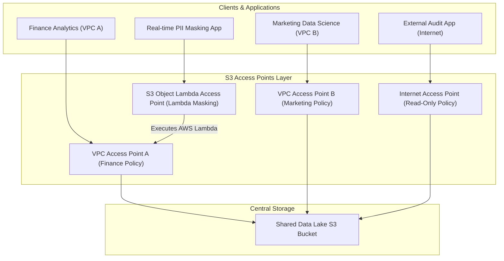

# 🌐 Amazon S3 Access Points & Object Lambda (အသုံးပြုခွင့် အမှတ်များနှင့် Object Lambda)

- **Category**: Storage Governance & Access Management
- **Language / ဘာသာစကား**: [English Version](file:///home/monetine/Workspace/Wathon/aws-dea-c01/content/en/02-services/storage/s3/s3-access-points.md) | **မြန်မာဘာသာ (Burmese)**
- **အဓိက အသုံးပြုမှု**: ကြီးမားသော Data Lake များတွင် Application အလိုက် သီးခြား Endpoint နှင့် Policy များဖြင့် စီမံခန့်ခွဲခြင်း (Access Points) နှင့် ဒေတာဖတ်ယူချိန်တွင် AWS Lambda ဖြင့် PII Data များကို ကြားဖြတ် Masking/Transform ပြုလုပ်ပေးခြင်း (Object Lambda)။
- **Slide Reference**: Pages 77–138 in `[[AWSCertifiedDataEngineerSlides.pdf]]`
- **Hub Links**: `[[mm/index]]` | `[[en/index]]` | `[[s3]]` | `[[s3-encryption]]` | `[[vpc-and-networking]]`

---

## ၁။ အကျဉ်းချုပ် (High-Level Summary)

Data Lake ကြီးမားလာသည်နှင့်အမျှ Single S3 Bucket Policy တစ်ခုတည်းတွင် အဖွဲ့အစည်းပေါင်းစုံ၏ Access Control များကို ရေးသားထိန်းချုပ်ခြင်းသည် အလွန်ရှုပ်ထွေးစေသည်။ **Amazon S3 Access Points** သည် Application၊ Team သို့မဟုတ် VPC တစ်ခုချင်းစီအတွက် သီးသန့် Network Endpoints များနှင့် Access Policies များကို ခွဲခြားဖန်တီးပေးသည်။ **S3 Object Lambda** သည် ဒေတာကို S3 မှ ဖတ်ယူသည့်အချိန်တွင် အလယ်မှ ကြားဖြတ်၍ PII Redaction သို့မဟုတ် Format Conversion များကို အလိုအလျောက် ဆောင်ရွက်ပေးသည်။

---

## ၂။ Multi-Region Access Points (MRAP)

- **Amazon S3 Multi-Region Access Points (MRAP)**: ကမ္ဘာတစ်ဝှမ်းရှိ AWS Regions များစွာတွင်ရှိသော S3 Buckets များကို Single Global Endpoint (`*.mrap.accesspoint.s3-global.amazonaws.com`) တစ်ခုတည်းအဖြစ် ပေါင်းစည်းပေးသည်။
- **AWS Global Accelerator**: အနီးဆုံး S3 Bucket ဆီသို့ Network Latency အနည်းဆုံး လမ်းကြောင်းမှ အလိုအလျောက် Route လုပ်ပေးပြီး Routing Performance ကို ၆၀% အထိ မြှင့်တင်ပေးသည်။

---

## ၃။ DEA-C01 စာမေးပွဲ အဓိက အချက်အလက်များ (Exam Tips)

> [!IMPORTANT]
> **Key Exam Trigger Keywords**:
> - **"Manage complex bucket policies for hundreds of different applications and VPCs on a single data lake"** $\rightarrow$ **Amazon S3 Access Points**.
> - **"Dynamically transform, mask PII, or redact sensitive data on-the-fly when retrieved from S3"** $\rightarrow$ **Amazon S3 Object Lambda**.
> - **"Single global endpoint routing requests to the closest S3 bucket across multiple AWS regions"** $\rightarrow$ **Amazon S3 Multi-Region Access Points (MRAP)**.

---

## 📌 ဆက်စပ် မှတ်စုများ (Related Notes)

- `[[s3]]` — Amazon S3 Overview
- `[[s3-security]]` — S3 Security & Bucket Policies
- `[[vpc-and-networking]]` — VPC Gateway & Interface Endpoints
