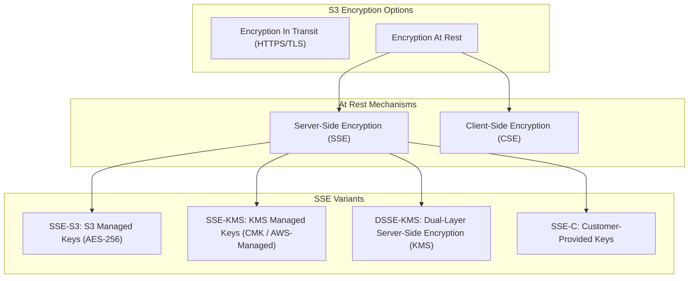

# 🔒 Amazon S3 Encryption (S3 ဒေတာ လျှို့ဝှက်ကုဒ်ပြုလုပ်ခြင်း)

- **Category**: Security & Storage Governance
- **Language / ဘာသာစကား**: [English Version](file:///home/monetine/Workspace/Wathon/aws-dea-c01/content/en/02-services/storage/s3/s3-encryption.md) | **မြန်မာဘာသာ (Burmese)**
- **အဓိက အသုံးပြုမှု**: Network ပေါ်တွင် ဒေတာလွှဲပြောင်းချိန် (In-Transit) နှင့် S3 ပေါ်တွင် သိမ်းဆည်းချိန် (At-Rest) လျှို့ဝှက်ကုဒ် (Encryption) ဖြင့် ကာကွယ်ခြင်း၊ S3 Bucket Keys ဖြင့် KMS API Cost လျှော့ချခြင်း။
- **Slide Reference**: Pages 77–138 in `[[AWSCertifiedDataEngineerSlides.pdf]]`
- **Hub Links**: `[[mm/index]]` | `[[en/index]]` | `[[s3]]` | `[[kms-and-secrets]]`

---

## ၁။ အကျဉ်းချုပ် (High-Level Summary)

Amazon S3 တွင် ဒေတာလုံခြုံရေးအတွက် **Encryption in Transit** (Network ပေါ်တွင် HTTPS/TLS ဖြင့် ကာကွယ်ခြင်း) နှင့် **Encryption at Rest** (S3 Disk ပေါ်တွင် သိမ်းဆည်းချိန် လျှို့ဝှက်ကုဒ် ပြုလုပ်ခြင်း) နည်းလမ်း ၂ မျိုး ရှိပါသည်-

---

## ၂။ Server-Side Encryption နည်းလမ်း ၄ မျိုး နှိုင်းယှဉ်ချက်

| Encryption Scheme | Key ကို မည်သူက စီမံသနည်း | အဓိက အချက်အလက်များ |
| :--- | :--- | :--- |
| **SSE-S3 (`AES256`)** | **Amazon S3** (အခမဲ့/Default) | AWS S3 မှ အလိုအလျောက် သော့စီမံပေးပြီး အပိုကုန်ကျစရိတ် မရှိပါ။ |
| **SSE-KMS (`aws:kms`)** | **AWS KMS** (Customer/AWS Key) | **Audit Trail (CloudTrail)** ရရှိပြီး User တစ်ဦးချင်းစီအတွက် Key Permission သတ်မှတ်နိုင်သည်။ **S3 Bucket Keys** ဖြင့် KMS Call ကုန်ကျစရိတ် ၉၉% လျှော့ချနိုင်သည်။ |
| **DSSE-KMS** | **Dual-Layer KMS Keys** | အလွှာ ၂ ထပ် Encryption ပြုလုပ်ပေးသည့် အဆင့်မြင့် စံနှုန်း (CNSS Policy 15 လိုက်နာမှု)။ |
| **SSE-C** | **Customer ကိုယ်တိုင်** | သော့ကို AWS ပေါ်သို့ မတင်ဘဲ Client က HTTPS Header တွင် သော့ထည့်သွင်း ပို့ဆောင်ရသည်။ |
| **Client-Side (CSE)** | **Client App Code** | S3 သို့ မတင်မီ Client ဘက်မှ ကြိုတင် Encrypt လုပ်ပြီးမှ တင်သည်။ |

---

## ၃။ S3 Bucket Keys (KMS API Cost ချွေတာခြင်း - Core Exam Topic)

- S3 သို့ File သန်းချီ ဖတ်/ရေး ပြုလုပ်သည့်အခါတိုင်း KMS `kms:GenerateDataKey` / `kms:Decrypt` API Requests ခေါ်ယူရသဖြင့် KMS Throttling နှင့် ကုန်ကျစရိတ် ကြီးမြင့်နိုင်သည်။
- **S3 Bucket Key ဖွင့်ထားပါက**: S3 သည် Bucket-level Intermediate Key ကို အသုံးပြု၍ S3 အတွင်း ဒေသတွင်း သော့များထုတ်ပေးသဖြင့် **KMS API Calls နှင့် ကုန်ကျစရိတ်ကို ၉၉% အထိ လျှော့ချပေးသည်**။

---

## ၄။ DEA-C01 စာမေးပွဲ အဓိက အချက်အလက်များ (Exam Tips)

> [!IMPORTANT]
> **Key Exam Trigger Keywords**:
> - **"Enforce encryption for all objects in transit (HTTPS)"** $\rightarrow$ **S3 Bucket Policy with `"aws:SecureTransport": "false"` and `Effect: Deny`**.
> - **"Track which user accessed encrypted objects in S3 data lake with audit logging"** $\rightarrow$ **Server-Side Encryption with AWS KMS (SSE-KMS)**.
> - **"Reduce KMS API costs and eliminate KMS throttling when reading millions of S3 objects in Athena/EMR"** $\rightarrow$ **Enable S3 Bucket Keys for SSE-KMS**.
> - **"Encrypt data using customer-managed keys where AWS never stores the encryption key"** $\rightarrow$ **SSE-C (Server-Side Encryption with Customer-Provided Keys)**.

---

## 📌 ဆက်စပ် မှတ်စုများ (Related Notes)

- `[[s3]]` — Amazon S3 Overview
- `[[kms-and-secrets]]` — AWS KMS Key Management & Envelope Encryption
- `[[s3-security]]` — S3 Security & Bucket Policies
