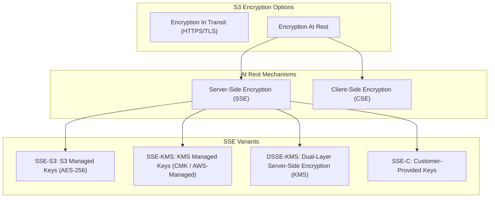
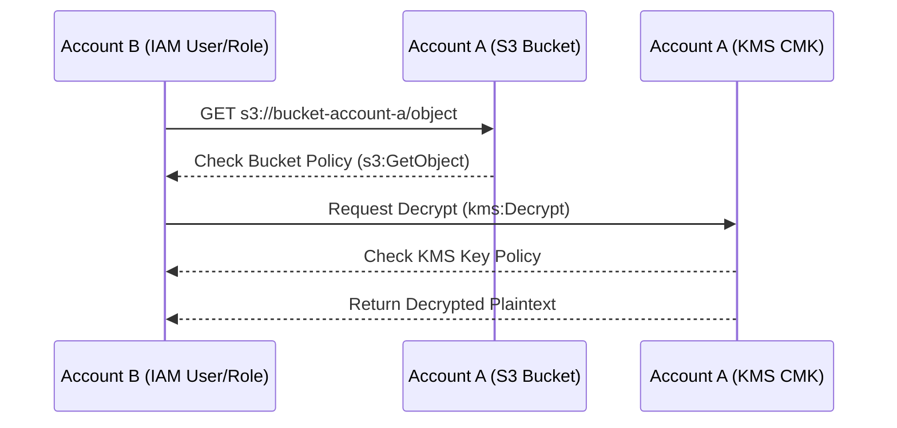

# 🔒 Amazon S3 Encryption

- **Category**: Security & Storage Governance
- **Language / ဘာသာစကား**: [English (Original)](/en/02-services/storage/s3/s3-encryption) | **မြန်မာဘာသာ (Burmese)**
- **Primary Use Case**: Data Protection at Rest & In Transit, Compliance, Fine-Grained Access Control
- **Slide Reference**: Pages 77–138 in [[AWSCertifiedDataEngineerSlides.pdf]]
- **Hub Links**: [[mm/index]] | [[mm/service-catalog]] | [[mm/s3]] | [[mm/s3-performance]] | [[mm/kms-and-secrets]]

---

## 1. High-Level Summary (အကျဉ်းချုပ်)

Data security နှင့် encryption သည် **AWS Certified Data Engineer – Associate (DEA-C01)** စာမေးပွဲ၏ အခြေခံအကျဆုံး အစိတ်အပိုင်းများ ဖြစ်ပါသည်။ Amazon S3 သည် **Encryption in Transit** (ကွန်ရက်ပေါ်တွင် သွားလာနေသော data ကို ကာကွယ်ခြင်း) နှင့် **Encryption at Rest** (သိမ်းဆည်းထားသော object data ကို ကာကွယ်ခြင်း) နှစ်မျိုးစလုံးကို ထောက်ပံ့ပေးပါသည်။ **SSE-S3**, **SSE-KMS**, **SSE-C**, နှင့် **Client-Side Encryption** တို့၏ ကွာခြားချက်များကို နားလည်ထားခြင်းအပြင်၊ cross-account KMS permissions နှင့် S3 Bucket Keys တို့ကိုပါ သိရှိထားခြင်းသည် လုံခြုံရေးစည်းမျဉ်းများ (compliance) နှင့် ညီညွတ်သော data lake များ တည်ဆောက်ရာတွင် အလွန်အရေးကြီးပါသည်။

---

## 2. Encryption Types Architecture (Encryption အမျိုးအစားများ တည်ဆောက်ပုံ)



---

## 3. Server-Side Encryption (SSE) Breakdown (SSE အသေးစိတ် ရှင်းလင်းချက်)

Server-Side Encryption တွင်၊ Amazon S3 သည် data center ရှိ disk များပေါ်သို့ ရေးသားသည့်အခါ data ကို object အဆင့်တွင် encrypt လုပ်ပေးပြီး၊ access လုပ်သည့်အခါ decrypt လုပ်ပေးပါသည်။

| Encryption Method | Key Manager | Key Rotation & Audit | Header Required | Cost | Exam Use Case |
| ----------------- | ----------- | -------------------- | --------------- | ---- | ------------- |
| **SSE-S3** | Amazon S3 | Automatic key rotation (AWS managed) | `x-amz-server-side-encryption: AES256` | Free (Default for all buckets) | အခြေခံ encryption at rest လိုအပ်ပြီး၊ အထူး audit လုပ်ရန်မလိုအပ်သော ကိစ္စများ |
| **SSE-KMS** | AWS KMS | Configurable rotation, **CloudTrail audit logging** | `x-amz-server-side-encryption: aws:kms` | KMS key fees + request fees | Audit trails နှင့် သီးခြား key permissions လိုအပ်သော compliance ကိစ္စများ |
| **DSSE-KMS** | AWS KMS | Configurable rotation, CloudTrail logging | `x-amz-server-side-encryption: aws:kms:dsse` | KMS key fees + request fees | တင်းကျပ်သော compliance အတွက် **Dual-Layer Server-Side Encryption** လိုအပ်သည့် ကိစ္စများ |
| **SSE-C** | Customer | Customer managed (S3 does NOT store key) | `x-amz-server-side-encryption-customer-algorithm` | Free (No KMS fees) | Customer ကိုယ်တိုင် key များကို သိမ်းဆည်းကိုင်တွယ်ရမည့် တင်းကျပ်သော စည်းမျဉ်းဆိုင်ရာ သတ်မှတ်ချက်များ |

---

### 1. SSE-S3 (S3-Managed Keys)

- **Mechanism**: S3 သည် **AES-256** ဖြင့် ထူးခြားသော key ကို အသုံးပြု၍ object တိုင်းကို encrypt လုပ်ပါသည်။
- **Default Encryption**: ၂၀၂၃ ခုနှစ် ဇန်နဝါရီလမှ စတင်၍၊ S3 bucket အသစ်များအားလုံးအတွက် **SSE-S3 သည် default အနေဖြင့် အပိုကုန်ကျစရိတ်မရှိဘဲ ဖွင့်ထားပြီး** ဖြစ်ပါသည်။
- **Key Access**: AWS မှ အပြည့်အဝ စီမံခန့်ခွဲပါသည်။ အသုံးပြုသူများသည် key policies သို့မဟုတ် rotation intervals များကို ထိန်းချုပ်ခွင့် မရှိပါ။

### 2. SSE-KMS (AWS KMS-Managed Keys)

- **Mechanism**: S3 သည် AWS KMS Customer Master Key (CMK) သို့မဟုတ် AWS-managed key (`aws/s3`) ကို အခြေခံသော data keys များကို အသုံးပြု၍ object များကို encrypt လုပ်ပါသည်။
- **Key Advantages**:
  - **Audit Logging**: Encrypt/decrypt လုပ်ဆောင်ချက်တိုင်းကို **AWS CloudTrail** တွင် မှတ်တမ်းတင် (log) ထားပါသည်။
  - **Granular Control**: S3 bucket access (`s3:GetObject`) နှင့် KMS key အသုံးပြုမှု (`kms:Decrypt`) တို့အတွက် သီးခြား IAM permissions ခွဲခြား သတ်မှတ်နိုင်ပါသည်။
- **KMS API Quota Limits & S3 Bucket Keys**:
  - **Issue**: Object အရေအတွက် များပြားစွာ upload/download ပြုလုပ်ခြင်းသည် KMS APIs (`GenerateDataKey` / `Decrypt`) များကို ခေါ်ယူစေပြီး၊ KMS request limits (တစ်စက္ကန့်လျှင် ၅,၅၀၀ မှ ၃၀,၀၀၀) ကို ကျော်လွန်သွားစေနိုင်ကာ ကုန်ကျစရိတ်များ မြင့်မားစေပါသည်။
  - **Solution**: **S3 Bucket Keys** ကို ဖွင့် (enable) ပါ။ S3 သည် အချိန်အကန့်အသတ်ရှိသော bucket အဆင့် key ကို ဖန်တီးပေးမည်ဖြစ်ပြီး၊ KMS API ခေါ်ယူမှုနှင့် ကုန်ကျစရိတ်များကို **၉၉% အထိ** လျှော့ချပေးပါသည်။

### 3. DSSE-KMS (Dual-Layer Server-Side Encryption with AWS KMS)

- **Definition**: **KMS ကို အခြေခံထားသည့် Dual-Layer Server-Side Encryption** ဖြစ်ပါသည်။
- **Mechanism**: KMS keys များကို အသုံးပြု၍ server အဆင့်တွင် **လွတ်လပ်သော AES-256 encryption အလွှာနှစ်ခု (two independent layers)** ကို အသုံးပြုပါသည်။
- **Use Case**: Client-side encryption လုပ်ဆောင်ရသည့် ဝန်ထုပ်ဝန်ပိုးမရှိဘဲ dual-layer cryptographic protection မဖြစ်မနေလိုအပ်သော (ကာကွယ်ရေး၊ ဖက်ဒရယ်၊ ဘဏ္ဍာရေး စည်းမျဉ်းများ) high-compliance workloads များအတွက် ရည်ရွယ်ထုတ်လုပ်ထားခြင်း ဖြစ်ပါသည်။

### 4. SSE-C (Customer-Provided Keys)

- **Mechanism**: Client သည် upload (`PUT`) နှင့် download (`GET`) request တိုင်း၏ HTTP headers များတွင် encryption key ကို ထည့်သွင်းပေးရပါသည်။ S3 သည် ၎င်း key ကို အသုံးပြု၍ encrypt/decrypt ပြုလုပ်ပြီးနောက်၊ မှတ်ဉာဏ် (memory) မှ ချက်ချင်း ဖျက်ပစ်ပါသည်။
- **Critical Considerations**:
  - AWS သည် SSE-C keys များကို သိမ်းဆည်းခြင်း သို့မဟုတ် ခြေရာခံခြင်း **မပြုလုပ်**ပါ။ **အကယ်၍ key ပျောက်ဆုံးသွားပါက၊ data ပြန်လည်ရယူရန် လုံးဝမဖြစ်နိုင်ပါ။**
  - **No S3 Console Support**: SSE-C ဖြင့် သိမ်းဆည်းထားသော object များကို AWS Management Console မှတစ်ဆင့် ကြည့်ရှုခြင်း သို့မဟုတ် download ပြုလုပ်ခြင်း မရနိုင်ပါ။ AWS CLI သို့မဟုတ် SDK ကိုသာ အသုံးပြုရပါမည်။

---

## 4. Client-Side Encryption (CSE)

- **Mechanism**: Data ကို S3 သို့ မပို့ဆောင်မီ (before) client စနစ်တွင် ကြိုတင်၍ encrypt လုပ်ထားခြင်း ဖြစ်ပါသည်။
- **Workflow**:
  1. Client သည် data key တစ်ခုကို ဖန်တီးရန် **Amazon S3 Encryption Client** (SDK) သို့မဟုတ် custom library ကို အသုံးပြုပါသည်။
  2. Plaintext ကို local တွင် encrypt လုပ်ပါသည်။
  3. Encrypt လုပ်ထားသော object ကို S3 သို့ upload လုပ်ပါသည်။ S3 သည် raw ciphertext ကိုသာ သိမ်းဆည်းပါသည်။
- **Use Case**: Plaintext data သည် AWS infrastructure ပေါ်သို့ unencrypted အနေဖြင့် လုံးဝ မရောက်ရှိစေရမည့် အမြင့်ဆုံး လုံခြုံရေး လိုအပ်ချက်များအတွက် အသုံးပြုပါသည်။

---

## 5. Security Enforcements & Bucket Policies (လုံခြုံရေး စည်းမျဉ်းများ သတ်မှတ်ခြင်း နှင့် Bucket Policies)

### 1. Enforcing Encryption in Transit (HTTPS / TLS)

Data သည် in transit အနေဖြင့် သွားလာရာတွင် encrypt ဖြစ်စေရန် သေချာစေရန်နှင့်၊ encrypt မလုပ်ထားသော HTTP requests များကို ငြင်းပယ် (reject) ရန်အတွက်၊ `"aws:SecureTransport": "false"` နှင့် `Effect: Deny` ပါဝင်သော S3 Bucket Policy ကို တွဲချိတ်ပါ (attach) -

```json
{
  "Version": "2012-10-17",
  "Statement": [
    {
      "Sid": "EnforceTLSRequestsOnly",
      "Effect": "Deny",
      "Principal": "*",
      "Action": "s3:*",
      "Resource": ["arn:aws:s3:::my-secure-bucket", "arn:aws:s3:::my-secure-bucket/*"],
      "Condition": {
        "Bool": {
          "aws:SecureTransport": "false"
        }
      }
    }
  ]
}
```

### 2. Enforcing SSE-KMS at Rest via Bucket Policy

Upload လုပ်မည့် object များသည် SSE-KMS ကို မဖြစ်မနေ အသုံးပြုရန် (MUST use) သတ်မှတ်လိုပါက -

```json
{
  "Version": "2012-10-17",
  "Statement": [
    {
      "Sid": "DenyNonKMSUploads",
      "Effect": "Deny",
      "Principal": "*",
      "Action": "s3:PutObject",
      "Resource": "arn:aws:s3:::my-secure-bucket/*",
      "Condition": {
        "StringNotEquals": {
          "s3:x-amz-server-side-encryption": "aws:kms"
        }
      }
    }
  ]
}
```

---

## 6. Cross-Account S3 Access with SSE-KMS

Encrypt လုပ်ထားသော S3 object များကို AWS accounts များအကြား မျှဝေအသုံးပြုသည့်အခါ (Account A က S3 bucket နှင့် KMS key ကို ပိုင်ဆိုင်ပြီး၊ Account B က data ကို ရယူအသုံးပြုသည်) -



> [!IMPORTANT]
> **Cross-Account Requirement Checklist**:
>
> 1. **S3 Bucket Policy / IAM Policy**: Account B အား `s3:GetObject` permission ခွင့်ပြုပေးပါ။
> 2. **KMS Key Policy**: Account B အား `kms:Decrypt` နှင့် `kms:GenerateDataKey` permissions များ ခွင့်ပြုပေးပါ။
> 3. **Customer Managed Key (CMK) Mandatory**: Default AWS-managed key (`aws/s3`) ကို accounts များအကြား မျှဝေအသုံးပြု၍ **မရနိုင်**ပါ။ Cross-account SSE-KMS access အတွက် **Customer Managed Key (CMK)** ကို မဖြစ်မနေ အသုံးပြုရပါမည်။

---

## 7. DEA-C01 Exam Tips & Decision Triggers (စာမေးပွဲအတွက် အကြံပြုချက်များ)

> [!IMPORTANT]
> **Key Exam Decision Rules**:
>
> - **Enforce encryption in transit (HTTPS)**: `"aws:SecureTransport": "false"` နှင့် `Effect: Deny` ပါဝင်သော S3 Bucket Policy ကို အသုံးပြုပါ။
> - **Audit trail of who accessed/encrypted S3 data**: S3 data ကို မည်သူ ရယူသုံးစွဲ/encrypt လုပ်ခဲ့ကြောင်း audit trail လိုအပ်ပါက **SSE-KMS** ကို ရွေးချယ်ပါ (**CloudTrail** သို့ မှတ်တမ်းတင်ပေးသည်)။
> - **Dual-layer encryption required for strict regulatory compliance**: တင်းကျပ်သော စည်းမျဉ်းစည်းကမ်းများအရ dual-layer encryption လိုအပ်ပါက **DSSE-KMS** (KMS ကို အခြေခံထားသည့် Dual-Layer Server-Side Encryption) ကို ရွေးချယ်ပါ။
> - **Cross-account access to encrypted S3 bucket**: **SSE-KMS with Customer Managed Key (CMK)** ကို အသုံးပြုပြီး၊ Bucket Policy နှင့် KMS Key Policy နှစ်ခုလုံးကို update လုပ်ပါ။ (AWS-managed `aws/s3` key သည် cross-account အလုပ်မလုပ်ပါ!)။
> - **High S3 request volume causing KMS throttling / high KMS costs**: S3 request များလွန်းသဖြင့် KMS throttling ဖြစ်ခြင်း / KMS ကုန်ကျစရိတ် မြင့်မားခြင်းတို့ ကြုံတွေ့ရပါက **S3 Bucket Keys** ကို ဖွင့်ပါ။
> - **Must manage encryption keys without AWS holding keys**: AWS ထံတွင် key များ မသိမ်းဆည်းဘဲ မိမိဘာသာ encryption keys များကို စီမံခန့်ခွဲရမည်ဆိုပါက **SSE-C** သို့မဟုတ် **Client-Side Encryption (CSE)** ကို ရွေးချယ်ပါ။
> - **Console access not working for S3 objects**: S3 objects များကို Console မှ ဝင်ရောက်မရခြင်း၏ အဓိကအကြောင်းရင်းမှာ **SSE-C** ဖြင့် encrypt လုပ်ထားသောကြောင့် ဖြစ်နိုင်သည် (S3 console သည် client-side headers များကို မထောက်ပံ့ပေးနိုင်ပါ)။

---

## 📌 Related Notes

- [[mm/s3]] — Amazon S3 Overview & Storage Classes
- [[mm/s3-performance]] — S3 Bucket Keys & Request Performance
- [[mm/kms-and-secrets]] — AWS KMS Key Policies, Symmetric vs Asymmetric Keys & CloudTrail Audit
- [[mm/lake-formation]] — Data Lake Access Control & Encryption Governance
