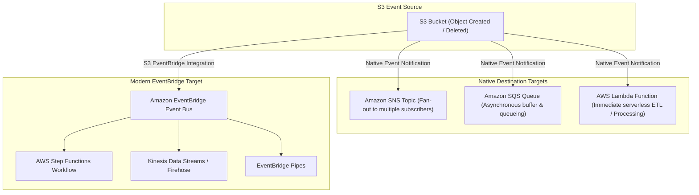

# ⚡ Amazon S3 Event Notifications & EventBridge Integration

- **Category**: Event-Driven Architecture & Integration
- **Language / ဘာသာစကား**: [English (Original)](/en/02-services/storage/s3/s3-event-notifications) | **မြန်မာဘာသာ (Burmese)**
- **Primary Use Case**: Automated Data Pipeline Triggering, Asynchronous ETL Ingestion, Decoupled Processing
- **Slide Reference**: Pages 77–138 in [AWSCertifiedDataEngineerSlides.pdf](/docs/AWSCertifiedDataEngineerSlides.pdf)
- **Hub Links**: [[mm/index]] | [[service-catalog]] | [[s3]] | [[lambda]] | [[sqs-and-sns]] | [[cloudwatch-and-eventbridge]]

---

## 1. High-Level Summary

**Amazon S3 Event Notifications** သည် S3 bucket အတွင်းရှိ သတ်မှတ်ထားသော object event များ (ဥပမာ - object အသစ်ဖန်တီးခြင်း၊ ဖျက်ခြင်း၊ သို့မဟုတ် ပြန်လည်ရယူခြင်း) ဖြစ်ပေါ်သည့်အခါ notification message များကို အလိုအလျောက် ပေးပို့ပေးပါသည်။ **AWS Certified Data Engineer – Associate (DEA-C01)** စာမေးပွဲတွင်၊ S3 Event Notifications များသည် **AWS Lambda** တွင် downstream processing ကို စတင်စေခြင်း၊ **Amazon SQS** တွင် message များကို တန်းစီစောင့်ဆိုင်းစေခြင်း (queuing)၊ **Amazon SNS** သို့ အများသိစေရန် ထုတ်လွှင့်ခြင်း (broadcasting)၊ သို့မဟုတ် **Amazon EventBridge** သို့ ပြည့်စုံသော event များ ပေးပို့ခြင်း အစရှိသော **event-driven data pipelines** များ၏ အခြေခံအုတ်မြစ် ဖြစ်ပါသည်။

---

## 2. Event Notification Destinations Architecture



---

## 3. Supported S3 Event Types & Filters

### 1. Common Event Types

- `s3:ObjectCreated:*`: `Put`, `Post`, `Copy`, သို့မဟုတ် `CompleteMultipartUpload` လုပ်ဆောင်မှုများတွင် အလုပ်လုပ် (trigger) ပါသည်။
- `s3:ObjectRemoved:*`: `Delete` သို့မဟုတ် `DeleteMarkerCreated` လုပ်ဆောင်မှုများတွင် အလုပ်လုပ်ပါသည်။
- `s3:ObjectRestore:*`: (Glacier မှ) `Post` (စတင်ခြင်း) သို့မဟုတ် `Completed` ဖြစ်စဉ်များတွင် အလုပ်လုပ်ပါသည်။
- `s3:Replication:*`: Replication ကျရှုံးခြင်း၊ သတ်မှတ်ချက် (threshold) ကျော်လွန်ခြင်း၊ သို့မဟုတ် ပြီးစီးခြင်းများတွင် အလုပ်လုပ်ပါသည်။
- `s3:LifecycleExpiration:*`: Lifecycle rule များမှတစ်ဆင့် object များ သက်တမ်းကုန်ဆုံးသည့်အခါ အလုပ်လုပ်ပါသည်။

### 2. Prefix & Suffix Filtering

Native S3 event notification များသည် နာမည်အလိုက် စစ်ထုတ်ခြင်း (filtering) ကို ခွင့်ပြုပါသည်-

- **Prefix Filter**: သတ်မှတ်ထားသော ဖိုင်တွဲများ (folders) အတွက်သာ event များကို ကန့်သတ်ရန် (ဥပမာ - `Prefix: raw/` သို့မဟုတ် `Prefix: incoming/`)။
- **Suffix Filter**: သတ်မှတ်ထားသော ဖိုင်အမျိုးအစားများ (extensions) အတွက်သာ event များကို ကန့်သတ်ရန် (ဥပမာ - `Suffix: .csv` သို့မဟုတ် `Suffix: .parquet`)။

> [!CAUTION]
> **Infinite Loop Prevention**:  
> အကယ်၍ S3 event သည်ဖိုင်ကို ပြုပြင်ပြောင်းလဲပေးသော Lambda function ကို trigger လုပ်ပြီး၊ ထို output ကို **မူလ bucket ၏ တူညီသော prefix နေရာသို့** ပြန်လည်သိမ်းဆည်းမည်ဆိုလျှင် အဆုံးမရှိသော recursive execution loop ကို ဖြစ်စေပါသည်!  
> **Solution**: Output ဖိုင်များကို အခြား bucket တစ်ခု (သို့) မတူညီသော prefix တစ်ခု (ဥပမာ - `raw/` မှ input ယူ၍ `processed/` သို့ output ထုတ်ခြင်း) တွင် ရေးရန်ဖြစ်ပါသည်။

---

## 4. Native S3 Notifications vs. S3 EventBridge Integration

AWS သည် S3 event များကို လုပ်ဆောင်ရန် ကွဲပြားသော နည်းလမ်းနှစ်ခုကို ထောက်ပံ့ပေးထားပါသည်-

| Feature                    | Native S3 Event Notifications                  | S3 EventBridge Integration                                                            |
| -------------------------- | ---------------------------------------------- | ------------------------------------------------------------------------------------- |
| **Supported Targets**      | **SNS, SQS, AWS Lambda**                       | **Any EventBridge Target** (Step Functions, Kinesis, Firehose, ECS, API Destinations) |
| **Target Limit**           | Prefix/suffix filter တစ်ခုလျှင် အများဆုံး target ၁ ခု | EventBridge Rules များမှတစ်ဆင့် **သီးခြား target အများအပြား**                                |
| **Advanced Filtering**     | အခြေခံ prefix/suffix တိုက်စစ်ခြင်းသာ ရနိုင်ပါသည်              | အဆင့်မြင့် JSON pattern တိုက်စစ်ခြင်း (ဖိုင်အရွယ်အစား၊ tags၊ metadata)                            |
| **Event Replay / Archive** | ❌ အထောက်အပံ့မပေးပါ                               | **ထောက်ပံ့ပေးပါသည်** (EventBridge Event Archiving & Replay)                                  |
| **Cross-Account Routing**  | ရှုပ်ထွေးသော resource policy များ လိုအပ်ပါသည်             | EventBridge Cross-Account Event Buses များမှတစ်ဆင့် **ထောက်ပံ့ပေးပါသည်**                               |
| **Delivery Guarantee**     | At-least-once delivery (ပုံမှန်အားဖြင့် $<1$ second) | At-least-once delivery (ပုံမှန်အားဖြင့် $<1$ second)                                        |

---

## 5. Required Resource Permissions (Destination Policies)

စာမေးပွဲတွင် အများဆုံးတွေ့ရလေ့ရှိသော ထောင်ချောက်တစ်ခုမှာ **resource-based policies မရှိခြင်း** ကြောင့် S3 event notification များ message ပေးပို့ရန် ကျရှုံးခြင်း ဖြစ်ပါသည်။ သတ်မှတ်ထားသော target သို့ invoke လုပ်ရန် (သို့) message ပေးပို့ရန် S3 ကို permission ပေးထားရမည်ဖြစ်သည်-

### 1. AWS Lambda Resource Policy

```json
{
  "Effect": "Allow",
  "Principal": { "Service": "s3.amazonaws.com" },
  "Action": "lambda:InvokeFunction",
  "Resource": "arn:aws:lambda:region:account-id:function:my-etl-function",
  "Condition": {
    "ArnLike": { "aws:SourceArn": "arn:aws:s3:::my-ingestion-bucket" }
  }
}
```

### 2. Amazon SQS Queue Policy

```json
{
  "Effect": "Allow",
  "Principal": { "Service": "s3.amazonaws.com" },
  "Action": "sqs:SendMessage",
  "Resource": "arn:aws:sqs:region:account-id:my-s3-queue",
  "Condition": {
    "ArnLike": { "aws:SourceArn": "arn:aws:s3:::my-ingestion-bucket" }
  }
}
```

### 3. Amazon SNS Topic Policy

```json
{
  "Effect": "Allow",
  "Principal": { "Service": "s3.amazonaws.com" },
  "Action": "sns:Publish",
  "Resource": "arn:aws:sns:region:account-id:my-s3-topic",
  "Condition": {
    "ArnLike": { "aws:SourceArn": "arn:aws:s3:::my-ingestion-bucket" }
  }
}
```

---

## 6. DEA-C01 Exam Tips & Decision Triggers

> [!IMPORTANT]
> **Key Exam Decision Rules**:
>
> - **ဖိုင်တစ်ခု S3 တွင် ရောက်ရှိလာချိန်၌ serverless transformation script ကို ချက်ချင်း trigger လုပ်ရန်**: S3 Event Notification $\rightarrow$ **AWS Lambda** ကို အသုံးပြုပါ။
> - **ပမာဏများပြားသော S3 event များကို process မလုပ်မီ asynchronous အဖြစ် ကြားခံ (buffer) သိမ်းဆည်းထားရန်**: S3 Event Notification $\rightarrow$ **Amazon SQS Queue** ကို အသုံးပြုပါ။
> - **S3 ဖန်တီးမှု event များကို သီးခြား အက်ပ်လီကေးရှင်း အများအပြားထံ တစ်ပြိုင်နက်တည်း အကြောင်းကြားရန်**: S3 Event Notification $\rightarrow$ **Amazon SNS Topic** (Fan-out pattern) ကို အသုံးပြုပါ။
> - **S3 မှတစ်ဆင့် AWS Step Functions state machine သို့မဟုတ် Kinesis stream ကို trigger လုပ်ရန်**: **S3 EventBridge Integration** ကို ဖွင့်ပြီး EventBridge Rules များကို ဖန်တီးပါ။
> - **ယခင် S3 event များကို ပြန်လည်ဖွင့်ရန် (replay) သို့မဟုတ် object အရွယ်အစား/tags များဖြင့် စစ်ထုတ်ရန် လိုအပ်ပါက**: **S3 EventBridge Integration** ကို ရွေးချယ်ပါ။
> - **S3 event notification ပေးပို့မှု ကျရှုံးခြင်းကို ပြင်ဆင်ရန်**: `aws:SourceArn` ကို အသုံးပြု၍ `s3.amazonaws.com` အား permission ပေးရန်အတွက် target resource policy (Lambda / SQS / SNS) ကို update ပြုလုပ်ပါ။
> - **အဆုံးမရှိသော Lambda execution loop များကို တားဆီးရန်**: Lambda မှ output များကို အခြား prefix တစ်ခု (`processed/`) တွင် ရေးသားနိုင်ရန် S3 prefix filter များကို သတ်မှတ် (configure) ပါ။

---

## 📌 Related Notes

- [[s3]] — Main Amazon S3 Overview & Storage Classes
- [[lambda]] — Serverless Event Processing & Execution Timeouts
- [[sqs-and-sns]] — Decoupling Data Pipelines & Fan-Out Architecture
- [[cloudwatch-and-eventbridge]] — EventBridge Event Buses, Rules, Archive & Replay
- [[step-functions]] — Orchestrating Complex Serverless ETL Workflows
