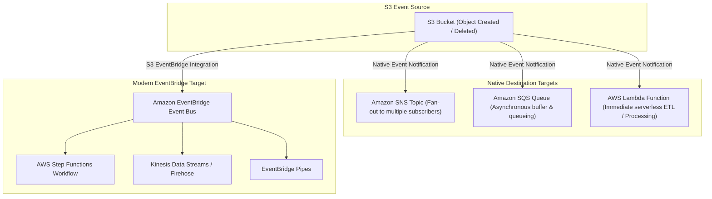

# ⚡ Amazon S3 Event Notifications & EventBridge Integration (S3 အစီအစဉ် အကြောင်းကြားမှုများနှင့် EventBridge)

- **Category**: Event-Driven Architecture & Integration
- **Language / ဘာသာစကား**: [English Version](file:///home/monetine/Workspace/Wathon/aws-dea-c01/content/en/02-services/storage/s3/s3-event-notifications.md) | **မြန်မာဘာသာ (Burmese)**
- **အဓိက အသုံးပြုမှု**: S3 ပေါ်သို့ ဖိုင်အသစ် ရောက်ရှိလာချိန်တွင် Data Pipeline များကို အလိုအလျောက် Trigger လုပ်ခြင်း (Event-Driven ETL)၊ Amazon SNS/SQS သို့ ပေးပို့ခြင်း သို့မဟုတ် Amazon EventBridge မှတစ်ဆင့် Step Functions များကို မောင်းနှင်ခြင်း။
- **Slide Reference**: Pages 77–138 in `[[AWSCertifiedDataEngineerSlides.pdf]]`
- **Hub Links**: `[[mm/index]]` | `[[en/index]]` | `[[s3]]` | `[[lambda]]` | `[[sqs-and-sns]]` | `[[cloudwatch-and-eventbridge]]`

---

## ၁။ အကျဉ်းချုပ် (High-Level Summary)

**Amazon S3 Event Notifications** သည် S3 Bucket အတွင်း အရာဝတ္ထုများ ဖန်တီးခြင်း (`s3:ObjectCreated:*`)၊ ဖျက်ပစ်ခြင်း သို့မဟုတ် Restore လုပ်ခြင်း စသည့် ဖြစ်ရပ်များ ဖြစ်ပေါ်ချိန်တွင် အကြောင်းကြားစာ (Notification Message) များကို အလိုအလျောက် ထုတ်ပေးသည်။ AWS Data Engineering စနစ်များတွင် **Event-Driven Data Pipelines** များ တည်ဆောက်ရန်အတွက် အခြေခံအကျဆုံး ဝန်ဆောင်မှု ဖြစ်သည်။

---

## ၂။ Native Destinations vs. Amazon EventBridge Integration

| Feature | S3 Native Event Notifications | S3 EventBridge Integration |
| :--- | :--- | :--- |
| **Supported Targets** | **SNS, SQS, AWS Lambda သာ ရရှိသည်** | **Target ဝန်ဆောင်မှု ၂၀ ကျော်** (Step Functions, Kinesis, CodePipeline, API Destinations) |
| **Advanced Filtering** | Prefix / Suffix သာ ရရှိသည် (e.g. `.parquet`) | **Advanced JSON Pattern Matching** (Size, Metadata, Specific Users) |
| **Delivery Reliability** | Best-effort (No built-in archive) | **Event Replay / Archive & Dead-Letter Queues** |

---

## ၃။ DEA-C01 စာမေးပွဲ အဓိက အချက်အလက်များ (Exam Tips)

> [!IMPORTANT]
> **Key Exam Trigger Keywords**:
> - **"Trigger a serverless transformation pipeline immediately upon S3 upload"** $\rightarrow$ **S3 Event Notification targeting AWS Lambda**.
> - **"Trigger an AWS Step Functions state machine when a file is uploaded to S3"** $\rightarrow$ **Enable S3 EventBridge integration and create an EventBridge rule targeting Step Functions**.
> - **"Buffer and decouple high-throughput S3 file ingestion events to prevent Lambda throttling"** $\rightarrow$ **S3 Event Notification $\rightarrow$ Amazon SQS FIFO/Standard $\rightarrow$ AWS Lambda**.

---

## 📌 ဆက်စပ် မှတ်စုများ (Related Notes)

- `[[s3]]` — Amazon S3 Overview
- `[[lambda]]` — AWS Lambda Serverless Processing
- `[[sqs-and-sns]]` — Amazon SQS & SNS Messaging
- `[[cloudwatch-and-eventbridge]]` — Amazon EventBridge Integration
