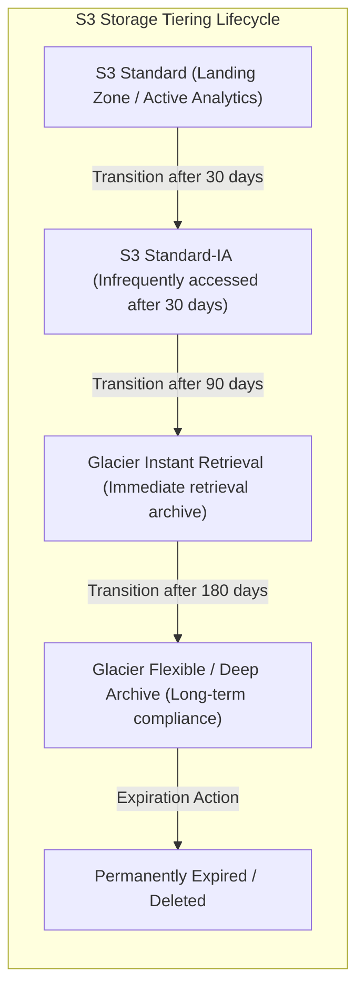
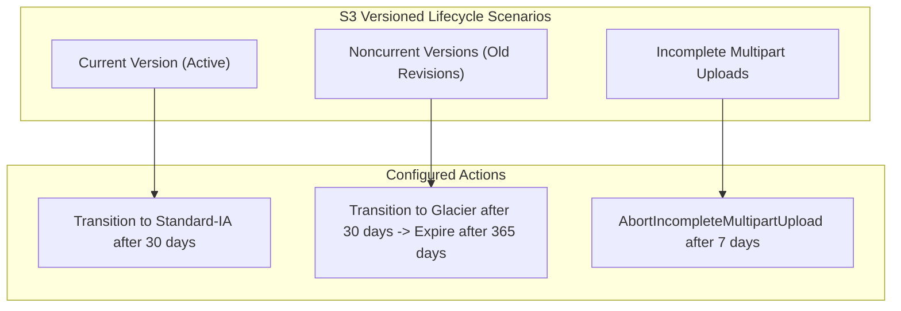

# ⏳ Amazon S3 Lifecycle Rules

- **Category**: Storage Governance & Cost Optimization
- **Language / ဘာသာစကား**: [English (Original)](/en/02-services/storage/s3/s3-lifecycle-rules) | **မြန်မာဘာသာ (Burmese)**
- **Primary Use Case**: Automated Data Tiering, Retention Management, Storage Cost Reduction, Cleanup of Noncurrent Versions & Incomplete Multipart Uploads
- **Slide Reference**: Pages 77–138 in [AWSCertifiedDataEngineerSlides.pdf](/docs/AWSCertifiedDataEngineerSlides.pdf)
- **Hub Links**: [[mm/index|index]] | [[mm/00-hub/service-catalog|service-catalog]] | [[mm/02-services/storage/s3/s3|s3]] | [[mm/02-services/storage/s3/s3-versioning|s3-versioning]] | [[mm/02-services/ml-dev-cost/cost-management|cost-management]] | [[mm/02-services/storage/s3/s3-storage-lens|s3-storage-lens]]

---

## 1. High-Level Summary

**Amazon S3 Lifecycle Rules** သည် object များကို ၎င်းတို့၏ lifecycle တစ်လျှောက် စီမံခန့်ခွဲခြင်းကို automate လုပ်ပေးပါသည်။ **AWS Certified Data Engineer – Associate (DEA-C01)** စာမေးပွဲတွင်၊ S3 Lifecycle rules များကို **automated cost optimization** (ကုန်ကျစရိတ်ကို အလိုအလျောက် ပိုမိုကောင်းမွန်အောင် ပြုလုပ်ခြင်း) ကို အကောင်အထည်ဖော်ရန် အဓိက ယန္တရားအဖြစ် အသုံးပြုပါသည်။ ၎င်းတို့သည် object များကို ၎င်းတို့၏ သက်တမ်း၊ prefix များ၊ object tag များ သို့မဟုတ် versioning အခြေအနေများအပေါ် မူတည်၍ ဈေးသက်သာသော storage class များ (ဥပမာ- S3 Standard $\rightarrow$ Standard-IA $\rightarrow$ Glacier $\rightarrow$ Deep Archive) သို့ အလိုအလျောက် transition လုပ်ပေးခြင်း သို့မဟုတ် expire (ဖျက်ပစ်ခြင်း) လုပ်ပေးခြင်းများကို ဆောင်ရွက်ပေးပါသည်။

---

## 2. Transition & Expiration Flow



---

## 3. Core Lifecycle Actions

### 1. Transition Actions

Object များ သက်တမ်းရင့်လာသည်နှင့်အမျှ တစ်ခုသော storage class မှ အခြားတစ်ခုသို့ မည်သည့်အချိန်တွင် transition လုပ်မည်ကို သတ်မှတ်ပေးပါသည်။

- **Storage Class Transition Constraints**:
  - **S3 Standard $\rightarrow$ S3 Standard-IA**: Object များသည် Standard-IA သို့မဟုတ် One Zone-IA သို့ transition မလုပ်မီ S3 Standard တွင် **အနည်းဆုံး ရက် ၃၀** ရှိနေရပါမည်။
  - **Minimum File Size**: Object တစ်ခုချင်းစီ၏ metadata ကုန်ကျစရိတ်များကြောင့် $128\text{ KB}$ ထက်သေးငယ်သော object များကို IA/Glacier သို့ transition လုပ်ရန် ယေဘုယျအားဖြင့် အကြံမပြုပါ။
  - **S3 Intelligent-Tiering**: Object များကို Intelligent-Tiering သို့ အချိန်မရွေး တိုက်ရိုက် transition လုပ်နိုင်ပါသည်။

| Storage Class Transition Path                      | Min Days in Prior Tier | Billing Retention Requirement     | Primary Use Case                                    |
| -------------------------------------------------- | ---------------------- | --------------------------------- | --------------------------------------------------- |
| **Standard $\rightarrow$ Standard-IA**             | 30 days                | 30-day minimum billable duration  | Infrequent reads, immediate access needed           |
| **Standard-IA $\rightarrow$ Glacier Instant**      | 30 days                | 90-day minimum billable duration  | Archival data requiring millisecond retrieval       |
| **Glacier Instant $\rightarrow$ Glacier Flexible** | 90 days                | 90-day minimum billable duration  | Backup archives (3–5 hr retrieval acceptable)       |
| **Glacier Flexible $\rightarrow$ Deep Archive**    | 90 days                | 180-day minimum billable duration | Lowest cost compliance archive (12–48 hr retrieval) |

### 2. Expiration Actions

Object များ expire မည်သည့်အချိန်တွင် ဖြစ်မည်နှင့် bucket မှနေ၍ အပြီးတိုင် ဖျက်ပစ်မည်ကို သတ်မှတ်ပေးပါသည်။

- **Unversioned Buckets**: Expiration days ကန့်သတ်ချက်သို့ ရောက်ရှိသောအခါ object ကို အပြီးတိုင် ဖျက်ပစ်ပါသည်။
- **Versioning-Enabled Buckets**: Expiration action သည် လက်ရှိ version (current version) အဖြစ် **Delete Marker** တစ်ခုကို ဖန်တီးပေးပါသည်။ (သတ်မှတ်ထားသော noncurrent version များကို ဖျက်ပစ်ခြင်း မဟုတ်ပါက)

---

## 4. Lifecycle Rules for Versioned Buckets

Version-enabled bucket များတွင် storage ကုန်ကျစရိတ်များကို စီမံခန့်ခွဲရန် **Current** နှင့် **Noncurrent** object version များကို သီးသန့် ပစ်မှတ်ထားသည့် rule များ လိုအပ်ပါသည်။



### Key Noncurrent Version Rules

1. **`NoncurrentVersionTransitions`**: အသစ်ထပ်ရေးခံရသော object version အဟောင်းများကို ဈေးသက်သာသော storage class များသို့ ရွှေ့ပေးပါသည်။ (ဥပမာ- ရက် ၃၀ အကြာတွင် Standard-IA သို့၊ ရက် ၉၀ အကြာတွင် Glacier Deep Archive သို့)
2. **`NoncurrentVersionExpiration`**: သတ်မှတ်ထားသော ရက်အရေအတွက် (ဥပမာ- ၃၆၅ ရက်) အကြာတွင် noncurrent version အဟောင်းများကို အပြီးတိုင် ဖျက်ပစ်ပါသည်။
3. **`NewerNoncurrentVersions`**: Expiration rule များ မသက်ရောက်မီ သိမ်းဆည်းထားရမည့် မကြာသေးမီက noncurrent version အရေအတွက်ကို သတ်မှတ်ပေးပါသည်။ (ဥပမာ- noncurrent version ၃ ခုကို သိမ်းဆည်းပြီး ပိုဟောင်းသော version အားလုံးကို expire လုပ်ပါ)

---

## 5. Critical Maintenance Actions (Cost Killers)

### 1. Abort Incomplete Multipart Uploads (`AbortIncompleteMultipartUpload`)

- **Problem**: ဖိုင်အကြီးကြီးများ upload လုပ်ခြင်း မအောင်မြင်သောအခါ သို့မဟုတ် ပြတ်တောက်သွားသောအခါ၊ upload လုပ်ထားသော အစိတ်အပိုင်းများသည် S3 တွင် နေရာယူထားပြီး သတိမပြုမိဘဲ S3 storage ကုန်ကျစရိတ်များ ဆက်လက်ဖြစ်ပေါ်နေပါသည်။
- **Solution**: မပြည့်စုံသော multipart upload များကို သတ်မှတ်ထားသော ရက်အရေအတွက် (ဥပမာ- ၇ ရက်) အကြာတွင် အလိုအလျောက် abort လုပ်ရန် Lifecycle rule တစ်ခုကို configure လုပ်ပါ-

```json
{
  "Rules": [
    {
      "ID": "AbortFailedUploads",
      "Status": "Enabled",
      "Filter": {},
      "AbortIncompleteMultipartUpload": {
        "DaysAfterInitiation": 7
      }
    }
  ]
}
```

### 2. Expired Object Delete Markers Cleanup (`ExpiredObjectDeleteMarkers`)

- **Problem**: Versioned bucket များတွင်၊ object တစ်ခုကို ဖျက်လိုက်ပါက **Delete Marker** တစ်ခု ကျန်ရစ်ပါသည်။ ထို object ၏ noncurrent version အားလုံး expire ဖြစ်သွားသောအခါ၊ မိဘမဲ့ Delete Marker သည် ကျန်ရှိနေပြီး list performance ကို အနည်းငယ် ကျဆင်းစေပါသည်။
- **Solution**: Noncurrent version များ မကျန်တော့သည်နှင့် တစ်ပြိုင်နက် မိဘမဲ့ delete marker များကို အလိုအလျောက် ရှင်းလင်းရန် Lifecycle rule တွင် `ExpiredObjectDeleteMarkers: true` ကို သတ်မှတ်ပါ။

---

## 6. Lifecycle Filters & Scope

Lifecycle rule များကို bucket တစ်ခုလုံးအပေါ် သက်ရောက်စေနိုင်သည် သို့မဟုတ် filter များကို အသုံးပြု၍ ကျဉ်းမြောင်းစွာ သတ်မှတ်နိုင်သည်-

- **Filter by Prefix**: Rule များကို သတ်မှတ်ထားသော folder path များ (ဥပမာ- `raw-logs/`, `staging/`, `temp/`) တွင် သက်ရောက်စေပါသည်။
- **Filter by Object Tags**: Rule များကို သတ်မှတ်ထားသော key-value tag များ (ဥပမာ- `Project=Analytics`, `Status=Archived`) ပါဝင်သည့် object များတွင် သက်ရောက်စေပါသည်။
- **Filter by Object Size**: `ObjectSizeGreaterThan` သို့မဟုတ် `ObjectSizeLessThan` ကို သတ်မှတ်နိုင်ပါသည်။ (ဥပမာ- $> 128\text{ KB}$ ရှိသော ဖိုင်များတွင်သာ transition rule များကို သက်ရောက်စေပါ)

---

## 7. DEA-C01 Exam Tips & Decision Triggers

> [!IMPORTANT]
> **Key Exam Decision Rules**:
>
> - **Automate transitioning old data to cheaper storage classes**: **S3 Lifecycle Transition Rules** များကို ဖန်တီးပါ။
> - **Stop uncompleted large file uploads from incurring silent storage costs**: **`AbortIncompleteMultipartUpload`** lifecycle rule ကို configure လုပ်ပါ။ (ဥပမာ- ၇ ရက်အကြာတွင် abort လုပ်ပါ)
> - **Reduce storage costs in a versioned bucket with accumulated old versions**: **`NoncurrentVersionTransitions`** နှင့် **`NoncurrentVersionExpiration`** rule များကို configure လုပ်ပါ။
> - **Retain a specific number of old versions while deleting older ones**: **`NewerNoncurrentVersions`** parameter ကို အသုံးပြုပါ။
> - **Transition data from S3 Standard to S3 Standard-IA**: S3 Standard တွင် **အနည်းဆုံး ရက် ၃၀** စောင့်ရပါမည်။
> - **Clean up orphan Delete Markers**: Lifecycle rule များတွင် **`ExpiredObjectDeleteMarkers: true`** ကို သတ်မှတ်ပါ။
> - **Automatically optimize storage costs for unpredictable access patterns**: Manual lifecycle rule များအစား **S3 Intelligent-Tiering** ကို ရွေးချယ်ပါ။

---

## 📌 Related Notes

- [[mm/02-services/storage/s3/s3|s3]] — Main Amazon S3 Overview & Storage Classes
- [[mm/02-services/storage/s3/s3-versioning|s3-versioning]] — S3 Versioning, Delete Markers & MFA Delete
- [[mm/02-services/storage/s3/s3-storage-lens|s3-storage-lens]] — Identifying Incomplete Multipart Uploads & Cost Analytics
- [[mm/02-services/ml-dev-cost/cost-management|cost-management]] — AWS Cost Explorer & Cost Optimization Strategies
