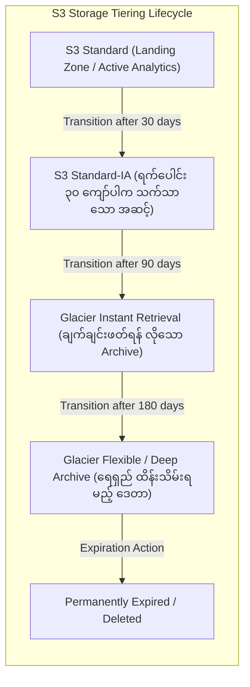

# ⏳ Amazon S3 Lifecycle Rules (S3 သက်တမ်း စည်းမျဉ်းများနှင့် ကုန်ကျစရိတ် ချွေတာခြင်း)

- **Category**: Storage Governance & Cost Optimization
- **Language / ဘာသာစကား**: [English Version](file:///home/monetine/Workspace/Wathon/aws-dea-c01/content/en/02-services/storage/s3/s3-lifecycle-rules.md) | **မြန်မာဘာသာ (Burmese)**
- **အဓိက အသုံးပြုမှု**: ဒေတာများကို သက်တမ်းအလိုက် စျေးသက်သာသော Storage Class များသို့ အလိုအလျောက် ရွှေ့ပြောင်းခြင်း (Transition)၊ သက်တမ်းကုန်ပါက အပြီးတိုင် ဖျက်ပစ်ခြင်း (Expiration)၊ နှင့် မပြီးပြတ်သော Multipart Uploads များကို ရှင်းလင်းခြင်း။
- **Slide Reference**: Pages 77–138 in `[[AWSCertifiedDataEngineerSlides.pdf]]`
- **Hub Links**: `[[mm/index]]` | `[[en/index]]` | `[[s3]]` | `[[s3-versioning]]` | `[[cost-management]]` | `[[s3-storage-lens]]`

---

## ၁။ အကျဉ်းချုပ် (High-Level Summary)

**Amazon S3 Lifecycle Rules** သည် S3 Bucket အတွင်းရှိ အရာဝတ္ထုများကို လူကိုယ်တိုင် စီမံစရာမလိုဘဲ သက်တမ်းအလိုက် အလိုအလျောက် စီမံခန့်ခွဲပေးသည့် စနစ်ဖြစ်သည်။ AWS Data Engineering တွင် Storage Cost ကို အထိရောက်ဆုံး ချွေတာနိုင်ရန်အတွက် မကြာခဏ အသုံးမပြုတော့သော ဒေတာများကို စျေးသက်သာသည့် Storage Classes များ (Standard $\rightarrow$ Standard-IA $\rightarrow$ Glacier $\rightarrow$ Deep Archive) သို့ အဆင့်ဆင့် ရွှေ့ပြောင်းပေးသည်။

---

## ၂။ အဓိက Lifecycle လုပ်ဆောင်ချက်များ

1. **Transition Actions**: ဒေတာအဟောင်းများကို စျေးသက်သာသော Tier များသို့ အလိုအလျောက် ပြောင်းလဲခြင်း။
   - Standard မှ Standard-IA သို့ ကူးပြောင်းရန် **အနည်းဆုံး ရက် ၃၀** စောင့်ဆိုင်းရမည်။
2. **Expiration Actions**: သတ်မှတ်ရက် ကျော်လွန်ပါက ဒေတာများကို အပြီးတိုင် ဖျက်ပစ်ခြင်း သို့မဟုတ် Noncurrent Versions များကို ရှင်းလင်းခြင်း။
3. **Abort Incomplete Multipart Uploads (Exam Critical)**: အကြောင်းအမျိုးမျိုးကြောင့် တင်လက်စ မပြီးပြတ်ဘဲ ကျန်နေခဲ့သော Multipart Upload Blobs များကို သတ်မှတ်ရက် (ဥပမာ ၇ ရက်) အတွင်း အလိုအလျောက် ဖျက်ပစ်ပေးခြင်းဖြင့် **Hidden Storage Costs များကို ရပ်တန့်စေသည်**။

---

## ၃။ DEA-C01 စာမေးပွဲ အဓိက အချက်အလက်များ (Exam Tips)

> [!IMPORTANT]
> **Key Exam Trigger Keywords**:
> - **"Automatically delete incomplete multipart upload parts after 7 days to eliminate storage charges"** $\rightarrow$ **S3 Lifecycle configuration with `AbortIncompleteMultipartUpload`**.
> - **"Cost-effective lifecycle rule: Active for 30 days, accessed rarely for 90 days, archived for 5 years"** $\rightarrow$ **S3 Standard $\rightarrow$ S3 Standard-IA (day 30) $\rightarrow$ S3 Glacier Flexible/Deep Archive (day 90) $\rightarrow$ Expire (year 5)**.
> - **"Automatically manage noncurrent object versions in version-enabled bucket"** $\rightarrow$ **Lifecycle Rule targeting `NoncurrentVersionTransitions` and `NoncurrentVersionExpiration`**.

---

## 📌 ဆက်စပ် မှတ်စုများ (Related Notes)

- `[[s3]]` — Amazon S3 Overview
- `[[s3-versioning]]` — S3 Versioning & Noncurrent Lifecycle
- `[[s3-storage-lens]]` — S3 Storage Lens Cost Metrics
