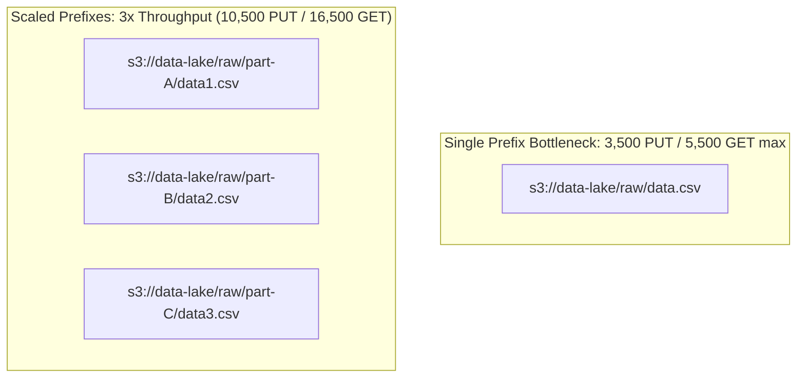
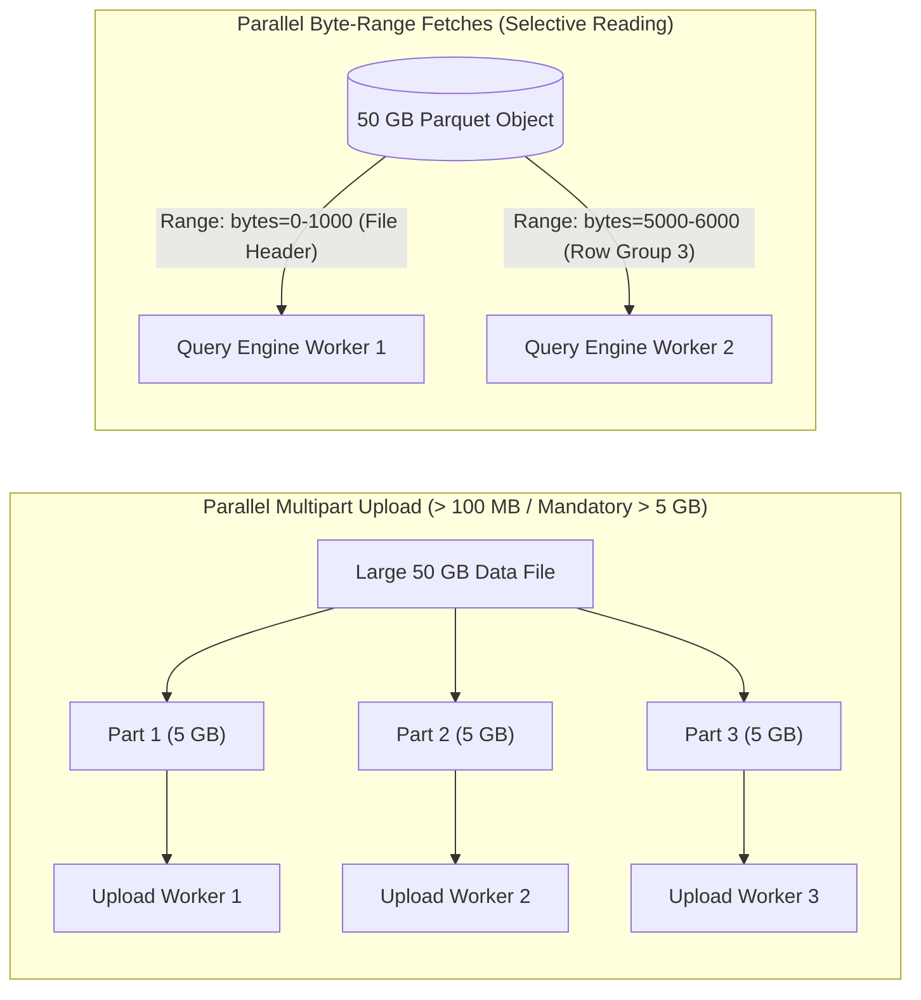

# ⚡ Amazon S3 Performance & Optimization (S3 စွမ်းဆောင်ရည် မြှင့်တင်ခြင်း)

- **Category**: Storage / Performance Engineering
- **Language / ဘာသာစကား**: [English Version](file:///home/monetine/Workspace/Wathon/aws-dea-c01/content/en/02-services/storage/s3/s3-performance.md) | **မြန်မာဘာသာ (Burmese)**
- **အဓိက အသုံးပြုမှု**: S3 Request Limits များကို ကျော်လွန်၍ Throughput အမြင့်ဆုံး ရယူခြင်း၊ Multipart Upload & Byte-Range Fetches ဖြင့် Parallel ဖတ်/ရေး ပြုလုပ်ခြင်း၊ S3 Express One Zone ဖြင့် Single-digit ms Latency ရယူခြင်း။
- **Slide Reference**: Pages 77–138 in `[[AWSCertifiedDataEngineerSlides.pdf]]`
- **Hub Links**: `[[mm/index]]` | `[[en/index]]` | `[[s3]]` | `[[domain-2-data-store-management]]`

---

## ၁။ S3 Prefix Request Limits (Prefix အလိုက် Request ကန့်သတ်ချက်များ)

Amazon S3 တွင် Request Limits များကို **Prefix တစ်ခုချင်းစီအလိုက်** တွက်ချက်သည်-

| Operation Type | Request Limit per Second per Prefix |
| :--- | :--- |
| **`GET` / `HEAD`** | **5,500 requests/sec** |
| **`PUT` / `POST` / `DELETE`** | **3,500 requests/sec** |

- **Horizontal Scaling**: အကယ်၍ Application သည် 11,000 `GET` requests/sec လိုအပ်ပါက အရာဝတ္ထုများကို Prefix ၂ ခုခွဲ၍ သိမ်းဆည်းခြင်းဖြင့် $2 \times 5,500 = 11,000$ requests/sec ကို ရရှိနိုင်သည်။

---

## ၂။ Multipart Uploads & Byte-Range Fetches

1. **Multipart Upload**: **100 MB ထက်ကြီးသော ဖိုင်များအတွက် အကြံပြုပြီး 5 GB ထက်ကြီးပါက မဖြစ်မနေ အသုံးပြုရမည်**။ ဖိုင်ကို အစိတ်အပိုင်းများခွဲ၍ တစ်ပြိုင်နက်တင်သဖြင့် အမြန်နှုန်း အဆမတန် တိုးတက်စေသည်။
2. **Byte-Range Fetches**: ဖိုင်တစ်ခုလုံးကို ဒေါင်းလုဒ်မဆွဲဘဲ သီးခြား Header သို့မဟုတ် Data Block Range (ဥပမာ Parquet Footer) ကိုသာ ရွေးချယ်ဖတ်ယူနိုင်သည်။

---

## ၃။ DEA-C01 စာမေးပွဲ အဓိက အချက်အလက်များ (Exam Tips)

> [!IMPORTANT]
> **Key Exam Trigger Keywords**:
> - **"Scale S3 read/write throughput beyond 5,500 GET / 3,500 PUT per second"** $\rightarrow$ **Distribute files across multiple S3 prefixes (Prefix Partitioning / Hash Prefixing)**.
> - **"Optimize upload performance for files larger than 100 MB (mandatory for > 5 GB)"** $\rightarrow$ **S3 Multipart Upload**.
> - **"Download only the footer metadata or specific byte range of large Parquet/ORC file in S3"** $\rightarrow$ **S3 Byte-Range Fetches**.
> - **"Single-digit millisecond latency data access for compute-intensive EMR/Spark/ML"** $\rightarrow$ **S3 Express One Zone**.

---

## 📌 ဆက်စပ် မှတ်စုများ (Related Notes)

- `[[s3]]` — Amazon S3 Overview
- `[[data-modeling-and-partitioning]]` — S3 Prefix Directory Structures
- `[[s3-tables]]` — S3 Tables with Automated Compaction
