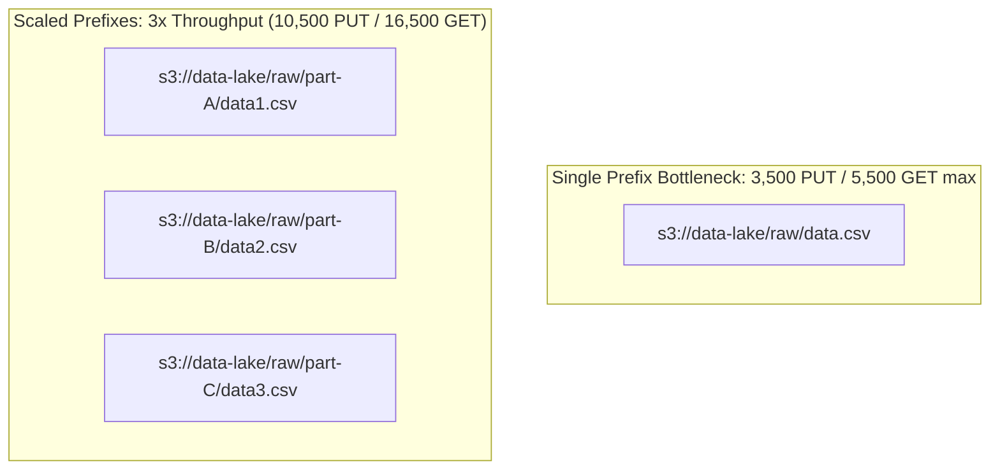
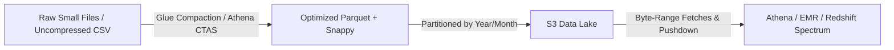

# ⚡ Amazon S3 Performance & Optimization

- **Category**: Storage / Performance Engineering
- **Language / ဘာသာစကား**: [English (Original)](/en/02-services/storage/s3/s3-performance) | **မြန်မာဘာသာ (Burmese)**
- **Primary Use Case**: High-Throughput Analytics, Low-Latency Data Lake I/O, Large File Transfers
- **Slide Reference**: Pages 77–138 in [AWSCertifiedDataEngineerSlides.pdf](/docs/AWSCertifiedDataEngineerSlides.pdf)
- **Hub Links**: [[mm/index|index]] | [[mm/00-hub/service-catalog|service-catalog]] | [[mm/02-services/storage/s3/s3|s3]] | [[mm/01-domains/domain-2-data-store-management|domain-2-data-store-management]]

---

## 1. High-Level Summary (အကျဉ်းချုပ်)

Amazon S3 performance ကို အကောင်းဆုံးဖြစ်အောင် ပြုလုပ်ခြင်း (optimizing) သည် **AWS DEA-C01** စာမေးပွဲတွင် စစ်ဆေးမည့် အရေးကြီးသော ကျွမ်းကျင်မှုတစ်ခု ဖြစ်ပါသည်။ S3 သည် အကန့်အသတ်မရှိနီးပါး storage နှင့် throughput များကို လက်ခံကိုင်တွယ်နိုင်ရန် အလိုအလျောက် scale လုပ်နိုင်သော်လည်း၊ အမြင့်ဆုံး performance ကို ရရှိရန်အတွက် **prefix request limits**, **parallelization techniques** (Multipart Upload နှင့် Byte-Range Fetches), **storage class selection** (ဥပမာအားဖြင့် S3 Express One Zone), နှင့် **data lake formatting patterns** (compaction, Parquet/ORC, partitioning) စသည်တို့ကို နားလည်ထားရန် လိုအပ်ပါသည်။

---

## 2. Prefix Request Limits & Prefix Partitioning

### S3 Baseline Limits per Prefix

Amazon S3 သည် အလွန်မြင့်မားသော request rates များကို အထောက်အပံ့ပေးရန် အလိုအလျောက် scale လုပ်ပေးပါသည်။ Request limits များသည် S3 bucket အတွင်းရှိ **prefix တစ်ခုစီအလိုက်** သက်ရောက်မှုရှိပါသည်:

| Operation Type                | Request Limit per Second per Prefix (Prefix တစ်ခုလျှင် တစ်စက္ကန့်အတွင်း Request Limit) |
| ----------------------------- | ----------------------------------- |
| **`GET` / `HEAD`**            | **5,500 requests/sec**              |
| **`PUT` / `POST` / `DELETE`** | **3,500 requests/sec**              |

> [!IMPORTANT]
> **S3 Prefix ဆိုတာ ဘာလဲ?**  
> S3 prefix ဆိုသည်မှာ bucket name နှင့် object name အကြားရှိ မည်သည့် string ကိုမဆို ခေါ်ဆိုခြင်း ဖြစ်ပါသည်။  
> `s3://my-bucket/logs/2026/08/07/app.log` တွင် prefix သည် `logs/2026/08/07/` ဖြစ်ပါသည်။

### Horizontal Scaling via Prefix Distribution (Prefix ဖြန့်ခွဲခြင်းဖြင့် Horizontal Scaling ပြုလုပ်ခြင်း)

- **Parallel Prefixes**: အကယ်၍ applications များသည် 10,000 `GET` requests/sec လိုအပ်ပါက၊ objects များကို မတူညီသော prefix ၂ ခုခွဲ၍ ဖြန့်ကျက်ထားခြင်းဖြင့် $2 \times 5,500 = 11,000$ `GET` requests/sec အထိ ရရှိနိုင်ပါသည်။
- **Hash-based Prefix Naming**: Hash prefix တစ်ခု ထည့်သွင်းခြင်း (ဥပမာ- `s3://bucket/a1b2-2026-08-07/file.json` သို့မဟုတ် customer ID/UUID ဖြင့် partition ခွဲခြင်း) သည် traffic ကို prefix partitions အများအပြားသို့ ဖြန့်ခွဲပေးပါသည်။
- **Auto-Sharding**: Request rates များ မြင့်တက်လာသည့်အခါ၊ S3 သည် နောက်ကွယ်တွင် partition များခွဲထုတ်ခြင်းဖြင့် prefixes များကို အလိုအလျောက် scale လုပ်ပေးပါသည်။

---

## 3. Acceleration Techniques & Data Transfer Optimization (အမြန်နှုန်းမြှင့်တင်ခြင်း နည်းလမ်းများနှင့် Data လွှဲပြောင်းခြင်းအား အကောင်းဆုံးဖြစ်အောင် ပြုလုပ်ခြင်း)

### 1. S3 Multipart Upload

- **How it works**: ဖိုင်အကြီးများကို အပိုင်းလေးများ (တစ်ပိုင်းလျှင် 5 MB မှ 5 GB အထိ) ခွဲ၍ အပြိုင် (parallel) upload ပြုလုပ်ပါသည်။
- **Thresholds (ကန့်သတ်ချက်များ)**:
  - **> 100 MB** ထက်ကြီးသော objects များအတွက် အကြံပြုထားပါသည်။
  - **> 5 GB** ထက်ကြီးသော objects များအတွက် **မဖြစ်မနေ (Mandatory)** အသုံးပြုရပါမည် (S3 တွင် object တစ်ခု၏ အကြီးဆုံးဆိုဒ်မှာ **5 TB** ဖြစ်သည်)။
- **Benefits (အကျိုးကျေးဇူးများ)**:
  - **Higher Throughput**: အပိုင်းများကို connections အများအပြားမှ တစ်ပြိုင်နက် upload လုပ်နိုင်ပါသည်။
  - **Fault Tolerance**: အပိုင်းတစ်ခု upload လုပ်ရာတွင် ကျရှုံးခဲ့ပါက (fails)၊ ထိုအပိုင်းကိုသာ ပြန်လည်ပို့ဆောင်ရန် လိုအပ်သည် (ဖိုင်တစ်ခုလုံး ပြန်ပို့ရန် မလိုပါ)။
  - **Pause & Resume**: Upload လုပ်နေခြင်းကို ခေတ္တရပ်ထားနိုင်ပြီး နောက်မှ ပြန်ဆက်လုပ်နိုင်ပါသည်။

### 2. S3 Byte-Range Fetches (Parallel Downloads)

- **How it works**: Object တစ်ခု၏ သတ်မှတ်ထားသော byte ranges များကို အပြိုင် download ဆွဲရန် HTTP `Range` header (`Range: bytes=0-1048576`) ကို အသုံးပြုပါသည်။
- **Use Cases (အသုံးပြုနိုင်သော အခြေအနေများ)**:
  - ဖိုင်အကြီးစားများကို threads/connections အများအပြားအသုံးပြု၍ အပြိုင် downloads ဆွဲခြင်း။
  - **Footer Reads in Columnar Files**: Analytical engines ဖွဲ့စည်းမှုများ ([[mm/02-services/analytics-streaming/athena/athena|athena]], [[mm/02-services/analytics-streaming/emr/emr|emr]] Spark) သည် object တစ်ခုလုံးကို download မဆွဲဘဲ Parquet/ORC files များ၏ metadata/footers များကို ဖတ်ရန် byte-range fetches ကို အသုံးပြုကြသည်။

### 3. S3 Transfer Acceleration

- **How it works**: အဝေးမှ uploads/downloads ပြုလုပ်ခြင်းများကို AWS **CloudFront Global Edge Locations** များမှတစ်ဆင့် လမ်းကြောင်းလွှဲပြီး (routing) အကောင်းဆုံးပြင်ဆင်ထားသော AWS private network backbone ကို အသုံးပြု၍ အရှိန်မြှင့်တင်ပေးပါသည်။
- **Use Cases (အသုံးပြုနိုင်သော အခြေအနေများ)**: နိုင်ငံဖြတ်ကျော် uploads များ၊ အဝေးမှ data များကို ဗဟိုကျသော AWS region သို့ သွင်းယူခြင်း (ingestion)။

### 4. S3 Bucket Keys (SSE-KMS Encryption Throttling Mitigation)

- **Problem**: ပုံမှန် SSE-KMS encryption သည် object operation တစ်ခုချင်းစီအတွက် AWS KMS သို့ calls (`GenerateDataKey` / `Decrypt`) ခေါ်ယူပါသည်။ KMS API limits (5,500–30,000 req/sec) သည် `KMS.KMSInvalidStateException` သို့မဟုတ် throttling exceptions ကို ဖြစ်စေနိုင်ပါသည်။
- **Solution**: **S3 Bucket Keys** သည် KMS တွင် bucket-level key တစ်ခုကို ဖန်တီးပေးပြီး၊ S3 ကို encryption အတွက် local data keys များ ဖန်တီးခွင့်ပြုပါသည်။
- **Impact**: KMS request costs နှင့် API call rates များကို **99% အထိ** လျှော့ချပေးပါသည်။

---

## 4. High-Performance Storage Class: S3 Express One Zone

အနိမ့်ဆုံး latency လိုအပ်သော compute-intensive analytics များအတွက် AWS သည် **S3 Express One Zone** ကို ထောက်ပံ့ပေးထားပါသည်။

| Feature (လုပ်ဆောင်ချက်) | S3 Standard                        | S3 Express One Zone                                         |
| ---------------------- | ---------------------------------- | ----------------------------------------------------------- |
| **Availability Zones** | Multi-AZ ($\ge 3$ AZs)             | Single AZ (Directory Bucket)                                |
| **Latency**            | Double-digit milliseconds          | **Single-digit milliseconds (consistent)**                  |
| **Throughput & RPS**   | Standard prefix limits             | Hundreds of thousands of RPS                                |
| **Authentication**     | Standard IAM per request           | **Session-based auth (`CreateSession`)**                    |
| **Ideal Use Case**     | Data Lake Landing Zone / Long-term | **EMR Spark jobs, SageMaker checkpointing, Athena queries** |

---

## 5. Analytics Data Lake Performance Best Practices

### 1. Small File Problem & Compaction (ဖိုင်ငယ်ပြဿနာနှင့် ပေါင်းစည်းခြင်း)

- **Problem**: ဖိုင်ငယ်သန်းပေါင်းများစွာ (< 128 MB) ရှိခြင်းသည် S3 API overhead၊ Glue crawler indexing latency နှင့် Spark/Athena task scheduling overhead တို့ကြောင့် performance ကို ကျဆင်းစေပါသည်။
- **Target File Size**: **128 MB မှ 512 MB** အထိ (ကြီးမားသော analytical scans များအတွက် 1 GB အထိ)။
- **Solutions**:
  - ဖိုင်ငယ်များကို ပိုကြီးသောဖိုင်များအဖြစ် ပေါင်းစည်းရန် (merge/compact) [[mm/02-services/analytics-streaming/glue/glue|glue]] ETL jobs သို့မဟုတ် AWS Lambda scripts များကို run ပါ။
  - ဖိုင်ငယ်များကို target sizes များအဖြစ် ပြန်ရေးရန် [[mm/02-services/analytics-streaming/athena/athena|athena]] `CREATE TABLE AS SELECT` (`CTAS`) ကို အသုံးပြုပါ။
  - Spark / [[mm/02-services/analytics-streaming/emr/emr|emr]] တွင် S3 သို့ မရေးမီ `coalesce()` သို့မဟုတ် `repartition()` ကို အသုံးပြုပါ။

### 2. Compression & Columnar Formats (ချုံ့ခြင်းနှင့် Columnar Formats များ)

- **Parquet / ORC**: Columnar formats များသည် **column projection** (တောင်းဆိုထားသော columns များကိုသာ ဖတ်ခြင်း) နှင့် **predicate pushdown** (မကိုက်ညီသော row groups များကို ကျော်သွားခြင်း) ကို လုပ်ဆောင်နိုင်စေပါသည်။
- **Splittable Compression**: Analytical engines များအနေဖြင့် ဖိုင်ကြီးများကို worker nodes များအကြား အပြိုင် (parallel) tasks များအဖြစ် ခွဲထုတ်နိုင်ရန် Parquet နှင့်အတူ **Snappy** သို့မဟုတ် **Zstd** codecs များကို အသုံးပြုပါ။

### 3. Hive-Style Partitioning & Partition Projection

- မကြာခဏ filter လုပ်လေ့ရှိသော columns များဖြင့် data များကို partition ခွဲပါ (ဥပမာ- `s3://bucket/table/year=2026/month=08/day=07/`)။
- Metastore latency ကို ရှောင်ရှားရန် Glue Data Catalog ကို query လုပ်မည့်အစား rules များမှတစ်ဆင့် partition locations များကို တွက်ချက်ရန် **Athena Partition Projection** ကို အသုံးပြုပါ။

### 4. S3 Select

- Applications များအား ရိုးရှင်းသော SQL expressions (`SELECT * FROM S3Object s WHERE s.status = 'ACTIVE'`) ကို အသုံးပြု၍ server-side တွင် object content (CSV, JSON, Parquet) များကို filter လုပ်နိုင်စေပါသည်။
- လိုအပ်သော data အစိတ်အပိုင်း (subset) ကိုသာ ပြန်ပေးခြင်းဖြင့် network bandwidth နှင့် I/O payload ကို လျှော့ချပေးပါသည်။

---

## 6. S3 Performance Anti-Patterns vs. Best Practices

| Anti-Pattern ❌                               | Best Practice ✅                                                | DEA-C01 Exam Context                                  |
| --------------------------------------------- | --------------------------------------------------------------- | ----------------------------------------------------- |
| Single-threaded upload of files > 5 GB        | **S3 Multipart Upload** (parallel upload of parts)              | Mandatory for files > 5 GB (ဖိုင် > 5 GB အတွက် မဖြစ်မနေလိုအပ်သည်)                           |
| Millions of tiny files (< 10 MB)              | **File Compaction** (Glue/Athena/Spark into 128–512 MB Parquet) | Eliminates GET overhead & speeds up query planning (GET overhead ကို ဖယ်ရှားပေးပြီး query planning ကို မြန်ဆန်စေသည်)    |
| KMS API throttling on high-RPS SSE-KMS        | Enable **S3 Bucket Keys**                                       | Reduces KMS API calls by up to 99% (KMS API calls များကို 99% အထိ လျှော့ချပေးသည်)                    |
| High request rate bottleneck on 1 date prefix | Distribute prefixes with **random hash / high cardinality key** | Scales throughput past 3,500 PUT / 5,500 GET limit (Throughput ကို 3,500 PUT / 5,500 GET ကန့်သတ်ချက်ထက် ကျော်လွန်၍ scale လုပ်ပေးသည်)   |
| Reading whole objects to get metadata         | **Byte-Range Fetches** (`Range` header)                         | Parallel reads & reading Parquet footers (Parallel reads လုပ်ခြင်းနှင့် Parquet footers များ ဖတ်ခြင်း)              |
| Long-distance cross-border S3 ingestion       | **S3 Transfer Acceleration**                                    | Edge location caching/routing via CloudFront backbone |

---

## 7. DEA-C01 Exam Tips & Scenario Triggers

> [!IMPORTANT]
> **Key Exam Decision Rules (စာမေးပွဲအတွက် အဓိက ဆုံးဖြတ်ရမည့် စည်းမျဉ်းများ)**:
>
> - **Consistent single-digit millisecond latency for analytics/EMR**: **S3 Express One Zone** ကို ရွေးချယ်ပါ။
> - **Upload file $> 5\text{ GB}$**: **S3 Multipart Upload** ကို မဖြစ်မနေ အသုံးပြုရပါမည်။
> - **SSE-KMS call limit reached or KMS cost reduction needed**: **S3 Bucket Keys** ကို ဖွင့်ပါ (Enable)။
> - **Speed up queries on S3 with Athena/EMR**: Data ကို **Parquet + Snappy** သို့ ပြောင်းလဲပြီး ဖိုင်များကို **128 MB–512 MB** သို့ ပေါင်းစည်းပါ (compact)။
> - **Cross-geography fast data ingestion to S3**: **S3 Transfer Acceleration** ကို အသုံးပြုပါ။
> - **Query metadata/footers of large objects fast**: **Byte-Range Fetches** ကို အသုံးပြုပါ။
> - **Avoid metastore lookup overhead in Athena**: **Partition Projection** ကို ဖွင့်ပါ (Enable)။

---

## 📌 Related Notes

- [[mm/02-services/storage/s3/s3|s3]] — Main Amazon S3 Overview & Storage Classes
- [[mm/03-concepts/data-formats-and-compression|data-formats-and-compression]] — Parquet, ORC, Snappy & Zstd details
- [[mm/03-concepts/data-modeling-and-partitioning|data-modeling-and-partitioning]] — Partition strategies for S3 & Athena
- [[mm/02-services/analytics-streaming/athena/athena|athena]] — Athena query optimization & CTAS
- [[mm/02-services/analytics-streaming/glue/glue|glue]] — Glue compaction ETL jobs
- [[mm/02-services/analytics-streaming/emr/emr|emr]] — EMR Spark tuning on S3
- [[mm/02-services/security-governance/kms-and-secrets|kms-and-secrets]] — SSE-KMS & S3 Bucket Keys
