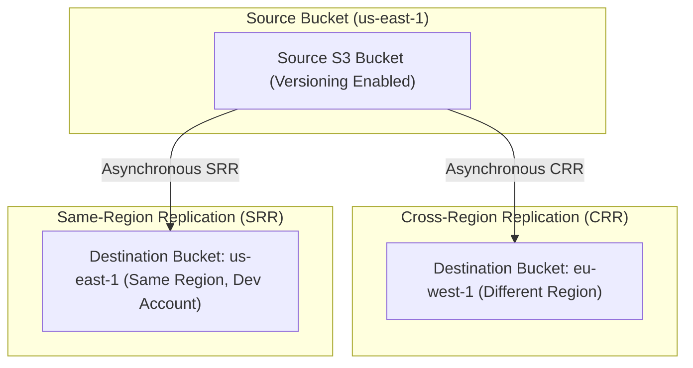
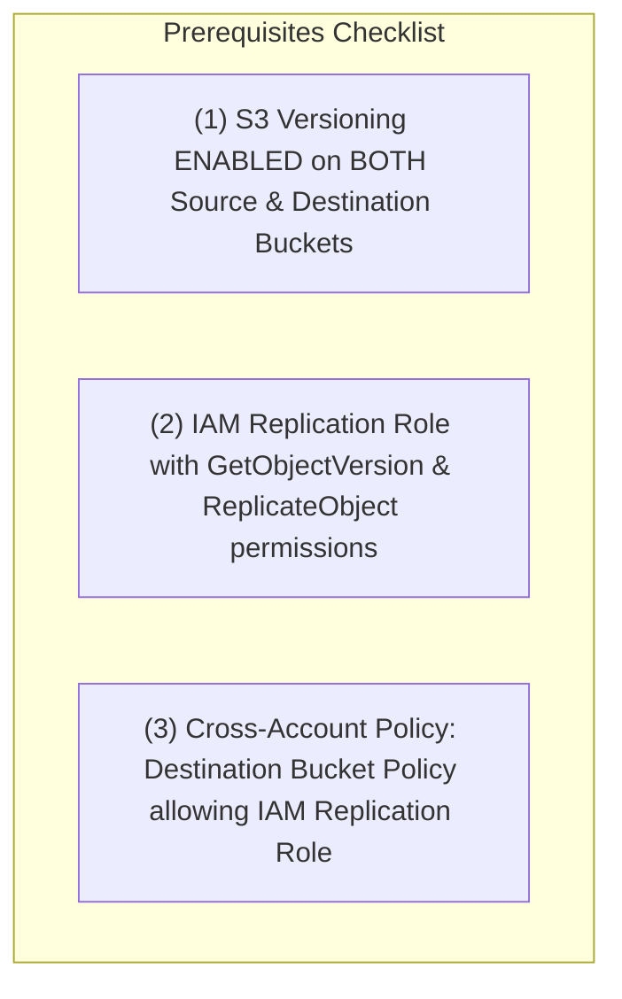

# 🔁 Amazon S3 Replication (CRR & SRR)

- **Category**: Storage Resilience & Data Availability
- **Language / ဘာသာစကား**: [English (Original)](/en/02-services/storage/s3/s3-replication) | **မြန်မာဘာသာ (Burmese)**
- **Primary Use Case**: Disaster Recovery (DR), Cross-Region Data Distribution, Compliance Data Residency, Log Aggregation
- **Slide Reference**: Pages 77–138 in [AWSCertifiedDataEngineerSlides.pdf](/docs/AWSCertifiedDataEngineerSlides.pdf)
- **Hub Links**: [[mm/index|index]] | [[mm/00-hub/service-catalog|service-catalog]] | [[mm/02-services/storage/s3/s3|s3]] | [[mm/02-services/storage/s3/s3-versioning|s3-versioning]] | [[mm/02-services/storage/s3/s3-security|s3-security]] | [[mm/02-services/storage/s3/s3-encryption|s3-encryption]]

---

## 1. High-Level Summary

**Amazon S3 Replication** သည် Amazon S3 bucket များအကြား object များကို အလိုအလျောက်၊ asynchronous ပုံစံဖြင့် ကူးယူခြင်း (copying) ကို ထောက်ပံ့ပေးပါသည်။ **AWS Certified Data Engineer – Associate (DEA-C01)** စာမေးပွဲတွင် S3 Replication သည် အလွန်အမေးများသော အကြောင်းအရာဖြစ်ပြီး၊ disaster recovery နှင့် latency လျှော့ချရန်အတွက် **Cross-Region Replication (CRR)**၊ log aggregation နှင့် account boundaries များအတွက် **Same-Region Replication (SRR)**၊ ၁၅ မိနစ် SLAs များအတွက် **Replication Time Control (RTC)** နှင့် ယခင်ရှိပြီးသား object အဟောင်းများကို ကူးယူရန်အတွက် **S3 Batch Replication** တို့ပါဝင်လေ့ရှိပါသည်။

---

## 2. Replication Types Architecture

### CRR vs. SRR Comparison Matrix

| Feature | Cross-Region Replication (CRR) | Same-Region Replication (SRR) |
| --- | --- | --- |
| **Region Scope** | မတူညီသော AWS Regions များ (ဥပမာ `us-east-1` $\rightarrow$ `eu-west-1`) | တူညီသော AWS Region (ဥပမာ `us-east-1` $\rightarrow$ `us-east-1`) |
| **Primary Use Cases** | Disaster Recovery (DR), compliance data residency, global low-latency access | Account များအကြား Log aggregation ပြုလုပ်ခြင်း, live dev/test environment ကို sync လုပ်ခြင်း, account isolation |
| **KMS Key Requirements** | Target region ရှိ KMS key mapping လိုအပ်ပါသည် | Same region KMS key သို့မဟုတ် CMK ကို အသုံးပြုပါသည် |
| **Versioning Requirement** | Source နှင့် destination တို့တွင် **မဖြစ်မနေ (Mandatory)** လိုအပ်ပါသည် | Source နှင့် destination တို့တွင် **မဖြစ်မနေ (Mandatory)** လိုအပ်ပါသည် |

---

## 3. Mandatory Technical Prerequisites

S3 Replication အလုပ်မလုပ်မီ အောက်ပါ တင်းကျပ်သော ကြိုတင်သတ်မှတ်ချက် (prerequisites) သုံးခု ပြည့်စုံရန် လိုအပ်ပါသည် -

### 1. S3 Versioning Enabled

- **S3 Versioning MUST be enabled** (S3 Versioning အား ဖွင့်ထားရန် မဖြစ်မနေ လိုအပ်သည်) Source bucket နှင့် destination bucket နှစ်ခုလုံးတွင် ဖြစ်ရပါမည်။
- Versioning သည် S3 ၏ asynchronous အပြောင်းအလဲများကို ခြေရာခံရန်နှင့် replicate လုပ်ရန် လိုအပ်သော ပြောင်းလဲ၍မရသည့် `versionId` identifiers များကို ထောက်ပံ့ပေးပါသည်။

### 2. IAM Replication Role

S3 သည် `s3.amazonaws.com` မှ assume လုပ်ထားသော သီးသန့် IAM service role တစ်ခု လိုအပ်ပြီး၊ ၎င်းတွင် အောက်ပါ permissions များကို တိတိကျကျ သတ်မှတ်ပေးရမည် -

- **Read from source**: `s3:GetObjectVersion`, `s3:GetObjectVersionAcl`, `s3:GetObjectVersionTagging`.
- **Write to destination**: `s3:ReplicateObject`, `s3:ReplicateDelete`, `s3:ReplicateTags`.

### 3. Cross-Account Destination Bucket Policy

- အကယ်၍ destination bucket သည် မတူညီသော AWS account တွင် ရှိနေပါက၊ destination ၏ **Bucket Policy** တွင် source account ၏ IAM Replication Role ကို write permissions (`s3:ReplicateObject`) ပေးထားရန် တိတိကျကျ သတ်မှတ်ပေးရပါမည်။

---

## 4. What Is & Is NOT Replicated

စာမေးပွဲမေးခွန်းများရှိ အခြေအနေ (scenarios) များကို နားလည်ရန် default အားဖြင့် မည်သည်တို့က replicate ဖြစ်၍ မည်သည်တို့က မဖြစ်သည်ကို သိထားရန် အလွန်အရေးကြီးပါသည် -

### Replicated by Default ✅

- Replication rule ဖန်တီးပြီး **နောက် (after)** မှ upload လုပ်လိုက်သော object အသစ်များ (`PUT`, `POST`, `COPY`).
- Object metadata, tags နှင့် Access Control Lists (ACLs).
- Unencrypted objects နှင့် **SSE-S3** encrypted objects.
- **SSE-KMS** encrypted objects (replication configuration တွင် KMS key mappings ဖြင့် တိတိကျကျ ဖွင့်ထားလျှင်).

### NOT Replicated by Default ❌

- **Existing Objects**: Replication rule မဖန်တီးမီ **အရင်ကတည်းက (before)** upload လုပ်ထားသော object အဟောင်းများ (**S3 Batch Replication** လိုအပ်ပါသည်).
- **Simple Delete Requests**: မှားယွင်းဖျက်မိခြင်းများမှ ကာကွယ်ရန် သာမန် `DELETE` calls များကို (Delete Marker ထည့်ခြင်း) default အားဖြင့် replicate မလုပ်ပါ။ (`DeleteMarkerReplication` ကို သုံး၍ ဖွင့်နိုင်ပါသည်).
- **Permanent Deletions**: `versionId` ကို သတ်မှတ်၍ အပြီးအပိုင်ဖျက်ခြင်းများသည် ဒေတာများ မတော်တဆ ပျက်စီးခြင်းမှ ကာကွယ်ရန်အတွက် မည်သည့်အခါမျှ replicate မလုပ်ပါ။
- **SSE-C Encrypted Objects**: Customer-provided keys (SSE-C) ဖြင့် အသွင်ဝှက်ထားသော object များကို replicate မလုပ်နိုင်ပါ။
- **Objects Without Read Permission**: Source bucket တွင် bucket owner မှ `s3:GetObjectVersion` အခွင့်အရေး မရှိသော object များ (ဥပမာ ပြင်ပ account များမှ upload လုပ်ထားသော အရာများ).

---

## 5. S3 Replication Time Control (RTC) & Batch Replication

### 1. S3 Replication Time Control (RTC)

- **SLA Guarantee**: **Object အသစ်များ၏ 99.9% သည် ၁၅ မိနစ်အတွင်း replicate ဖြစ်ရမည်** ဟူသော Service Level Agreement (SLA) အာမခံချက် ပါရှိပါသည်။
- **Real-Time CloudWatch Monitoring**: အောက်ပါ CloudWatch metrics များကို ထုတ်လွှင့်ပေးသည် -
  - `BytesPendingReplication`
  - `OperationsPendingReplication`
  - `ReplicationLatency` (replicate လုပ်ရန်ကြာချိန်ကို ခြေရာခံခြင်း)
- **Use Case**: တင်းကျပ်သော RPO (Recovery Point Objective) အာမခံချက်များ လိုအပ်သည့် ငွေကြေးဆိုင်ရာနှင့် စည်းမျဉ်းဆိုင်ရာ (Financial & regulatory compliance) ကိစ္စများအတွက် အသုံးပြုပါသည်။

### 2. S3 Batch Replication

- **Problem**: Standard S3 Replication rules များသည် rule ဖွင့်ပြီး **နောက်မှ (after)** upload လုပ်သော object အသစ်များကိုသာ replicate လုပ်ပါသည်။
- **Solution**: **S3 Batch Replication** သည် အောက်ပါတို့ကို replicate လုပ်ရန်အတွက် asynchronous batch job (S3 Batch Operations ဖြင့် အလုပ်လုပ်သည်) တစ်ခုကို run ပေးပါသည် -
  - Replication rule မရှိခင်ကတည်းက ရှိနေသော ယခင် object အဟောင်းများ။
  - ယခင်က replication မအောင်မြင်ခဲ့သော object များ။
  - Account များ သို့မဟုတ် region များအကြား object များကို ပြန်လည် replicate လုပ်ခြင်း။

---

## 6. S3 Ownership & Storage Class Override

Account များအကြား replicate လုပ်သည့်အခါ၊ destination ၏ object settings များကို သင်စိတ်ကြိုက်ပြောင်းလဲနိုင်ပါသည် -

- **Change Object Ownership to Destination Account**: Cross-account setups များတွင် source account မှ replicate လုပ်ထားသော object များကို ဆက်လက်ပိုင်ဆိုင်နေခြင်းမှ တားဆီးပေးပါသည် (`--replica-modifications-sync`).
- **Destination Storage Class Override**: Replicate လုပ်ထားသော object များကို destination တွင် ပိုမိုသက်သာသော storage class သို့ အလိုအလျောက် ပြောင်းလဲပေးပါသည် (ဥပမာ - source သည် **S3 Standard** ဖြစ်ပြီး၊ destination တွင် **S3 Standard-IA** သို့မဟုတ် **S3 Glacier** သို့ တိုက်ရိုက် replicate လုပ်ခြင်း)။

---

## 7. DEA-C01 Exam Tips & Decision Triggers

> [!IMPORTANT]
> **Key Exam Decision Rules**:
>
> - **Disaster Recovery (DR) သို့မဟုတ် compliance အတွက် region များအကြား ဒေတာကို replicate လုပ်လိုလျှင်**: **S3 Cross-Region Replication (CRR)** ကို ရွေးချယ်ပါ။
> - **Account ပေါင်းစုံမှ log များကို region တစ်ခုတည်းရှိ bucket တစ်ခုတည်းသို့ စုစည်းလိုလျှင်**: **S3 Same-Region Replication (SRR)** ကို ရွေးချယ်ပါ။
> - **S3 Replication ကို ဖွင့်ရာတွင် prerequisite error တက်နေလျှင်**: Source နှင့် destination buckets နှစ်ခုလုံးတွင် **S3 Versioning** ကို ဖွင့်ထားခြင်း ရှိ/မရှိ စစ်ဆေးပါ။
> - **Rule မဖန်တီးမီက ရှိနေသော object အဟောင်းများကို replicate လုပ်လိုလျှင်**: **S3 Batch Replication** ကို အသုံးပြုပါ။
> - **Compliance အတွက် တင်းကျပ်သော ၁၅ မိနစ် replication SLA လိုအပ်လျှင်**: **S3 Replication Time Control (RTC)** ကို ဖွင့်ပါ။
> - **SSE-KMS encrypted objects များကို account များအကြား replicate လုပ်လိုလျှင်**: Replication rule တွင် KMS key mapping ကို ထည့်သွင်းပေးပါ + destination account ၏ KMS key policy တွင် KMS permissions များကို ခွင့်ပြုပေးပါ။
> - **သာမန် ဖျက်ခြင်းများကြောင့် destination bucket မှ ဒေတာများပါ လိုက်ပျက်ခြင်းမှ ကာကွယ်လိုလျှင်**: **Delete Marker Replication** ကို ပိတ်ထားခဲ့ပါ (default)။

---

## 📌 Related Notes

- [[mm/02-services/storage/s3/s3|s3]] — Main Amazon S3 Overview & Storage Classes
- [[mm/02-services/storage/s3/s3-versioning|s3-versioning]] — S3 Versioning, Delete Markers & MFA Delete
- [[mm/02-services/storage/s3/s3-security|s3-security]] — S3 Security & Cross-Account Access
- [[mm/02-services/storage/s3/s3-encryption|s3-encryption]] — SSE-S3, SSE-KMS & Cross-Account KMS CMK Setup
- [[mm/02-services/security-governance/kms-and-secrets|kms-and-secrets]] — AWS KMS Key Policies & Cross-Account Access
