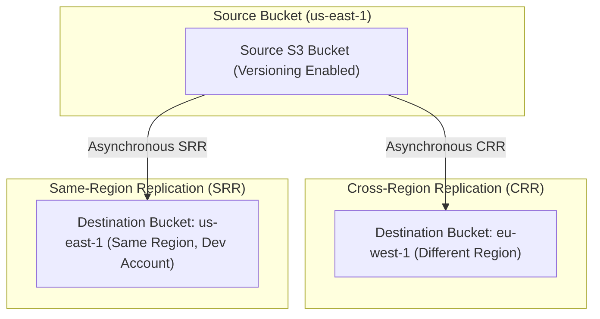

# 🔁 Amazon S3 Replication (CRR & SRR) (S3 အလိုအလျောက် ဒေတာကူးယူခြင်း)

- **Category**: Storage Resilience & Data Availability
- **Language / ဘာသာစကား**: [English Version](file:///home/monetine/Workspace/Wathon/aws-dea-c01/content/en/02-services/storage/s3/s3-replication.md) | **မြန်မာဘာသာ (Burmese)**
- **အဓိက အသုံးပြုမှု**: Disaster Recovery (DR) နှင့် အခြား Region များသို့ ဒေတာဖြန့်ဝေခြင်း (CRR)၊ Log Aggregation နှင့် Dev/Test Accounts များနှင့် ဒေတာ Sync ပြုလုပ်ခြင်း (SRR)၊ ၁၅ မိနစ်အတွင်း အရောက်ပို့ SLA (RTC)။
- **Slide Reference**: Pages 77–138 in `[[AWSCertifiedDataEngineerSlides.pdf]]`
- **Hub Links**: `[[mm/index]]` | `[[en/index]]` | `[[s3]]` | `[[s3-versioning]]` | `[[s3-security]]` | `[[s3-encryption]]`

---

## ၁။ အကျဉ်းချုပ် (High-Level Summary)

**Amazon S3 Replication** သည် S3 Buckets အချင်းချင်း အရာဝတ္ထုများကို အလိုအလျောက် Asynchronous နည်းဖြင့် ကူးယူပေးသည့် စနစ်ဖြစ်သည်။

---

## ၂။ မဖြစ်မနေ လိုအပ်ချက်များနှင့် အဓိက စွမ်းဆောင်ချက်များ

1. **Versioning မဖြစ်မနေ လိုအပ်ခြင်း**: Source နှင့် Destination Bucket **နှစ်ခုစလုံးတွင် S3 Versioning ကို မဖြစ်မနေ Enable လုပ်ထားရမည်**။
2. **S3 Replication Time Control (S3 RTC)**: အရာဝတ္ထုအသစ် ၉၉.၉၉% ကို **၁၅ မိနစ်အတွင်း** ကူးယူပြီးစီးရန် SLA အာမခံပေးသည်။
3. **S3 Batch Replication**: Replication Rule မဆောက်မီကတည်းက ရှိနှင့်ပြီးသား **Historical Objects (ဒေတာအဟောင်းများ)** ကို အသုတ်လိုက် ကူးယူရန် အသုံးပြုသည်။

---

## ၃။ DEA-C01 စာမေးပွဲ အဓိက အချက်အလက်များ (Exam Tips)

> [!IMPORTANT]
> **Key Exam Trigger Keywords**:
> - **"Replicate S3 data across different AWS regions for Disaster Recovery"** $\rightarrow$ **S3 Cross-Region Replication (CRR)** (Versioning required on both buckets).
> - **"Replicate S3 objects within a 15-minute predictable SLA for compliance"** $\rightarrow$ **S3 Replication Time Control (RTC)**.
> - **"Replicate existing historical objects that were created prior to replication rule"** $\rightarrow$ **S3 Batch Replication**.

---

## 📌 ဆက်စပ် မှတ်စုများ (Related Notes)

- `[[s3]]` — Amazon S3 Overview
- `[[s3-versioning]]` — S3 Versioning Prerequisites
- `[[s3-encryption]]` — Cross-Region KMS Replication
