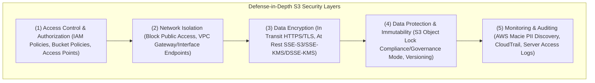

# 🛡️ Amazon S3 Security & Access Management (S3 လုံခြုံရေးနှင့် ဝင်ရောက်ခွင့် စီမံခန့်ခွဲမှု)

- **Category**: Storage Security & Data Protection
- **Language / ဘာသာစကား**: [English Version](file:///home/monetine/Workspace/Wathon/aws-dea-c01/content/en/02-services/storage/s3/s3-security.md) | **မြန်မာဘာသာ (Burmese)**
- **အဓိက အသုံးပြုမှု**: Defense-in-Depth လုံခြုံရေးစနစ်၊ IAM & Bucket Policies ဖြင့် အသုံးပြုခွင့် ကန့်သတ်ခြင်း၊ Block Public Access ဖြင့် ဒေတာ ပေါက်ကြားမှု တားဆီးခြင်း၊ S3 Object Lock ဖြင့် မဖျက်နိုင်သော WORM Storage ပြုလုပ်ခြင်း။
- **Slide Reference**: Pages 77–138 in `[[AWSCertifiedDataEngineerSlides.pdf]]`
- **Hub Links**: `[[mm/index]]` | `[[en/index]]` | `[[s3]]` | `[[s3-encryption]]` | `[[iam]]` | `[[macie-and-cloudtrail]]`

---

## ၁။ အကျဉ်းချုပ် (High-Level Summary)

Amazon S3 သည် ဒေတာလုံခြုံရေးအတွက် **Defense-in-Depth** အလွှာလိုက် ကာကွယ်ရေး မော်ဒယ်ကို အသုံးပြုထားပါသည်-

---

## ၂။ S3 Object Lock (WORM - Write Once Read Many Immutability)

ဒေတာများကို မတော်တဆ သို့မဟုတ် ရည်ရွယ်ချက်ရှိရှိ ဖျက်ဆီးခြင်းနှင့် ပြင်ဆင်ခြင်း မပြုနိုင်စေရန်အတွက် Object Lock ကို အသုံးပြုသည်-

| Mode | မည်သူက ဖျက်နိုင်သနည်း (Who Can Delete / Overwrite?) | အဓိက အသုံးချမှု (Use Case) |
| :--- | :--- | :--- |
| **Governance Mode** | `s3:BypassGovernanceRetention` permission ရှိသော အထူး User များကသာ ဖျက်နိုင်သည် | စမ်းသပ်ရန်နှင့် အဖွဲ့အစည်းတွင်း စည်းမျဉ်းများအတွက် |
| **Compliance Mode** | **မည်သူမျှ (Root User အပါအဝင်) Retention Period မပြည့်မချင်း လုံးဝ ဖျက်၍/ပြင်၍ မရပါ!** | **SEC Rule 17a-4, FINRA, HIPAA စသည့် ဘဏ္ဍာရေးနှင့် ဥပဒေရေးရာ တင်းကျပ်သော စည်းမျဉ်းများ** |
| **Legal Hold** | သက်တမ်း ကန့်သတ်ချက် မရှိဘဲ ပိတ်ထား/ဖွင့်ထား ပြုလုပ်နိုင်သည်။ | တရားရင်ဆိုင်နေချိန် စစ်ဆေးရန် သက်သေအထောက်အထားများ ထိန်းသိမ်းခြင်း |

---

## ၃။ DEA-C01 စာမေးပွဲ အဓိက အချက်အလက်များ (Exam Tips)

> [!IMPORTANT]
> **Key Exam Trigger Keywords**:
> - **"Strict regulatory compliance where no one including the AWS root account can delete objects"** $\rightarrow$ **S3 Object Lock in Compliance Mode**.
> - **"Prevent accidental public exposure of all S3 buckets across an AWS Organization"** $\rightarrow$ **Enable S3 Block Public Access at the Account / Organization level**.
> - **"Scan S3 data lake for sensitive PII data (credit cards, social security numbers)"** $\rightarrow$ **Amazon Macie**.

---

## 📌 ဆက်စပ် မှတ်စုများ (Related Notes)

- `[[s3]]` — Amazon S3 Overview
- `[[s3-encryption]]` — S3 Server-Side Encryption
- `[[iam]]` — AWS IAM Policies & Roles
- `[[macie-and-cloudtrail]]` — Amazon Macie PII Discovery
