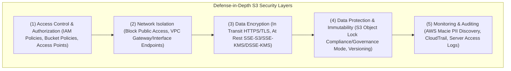
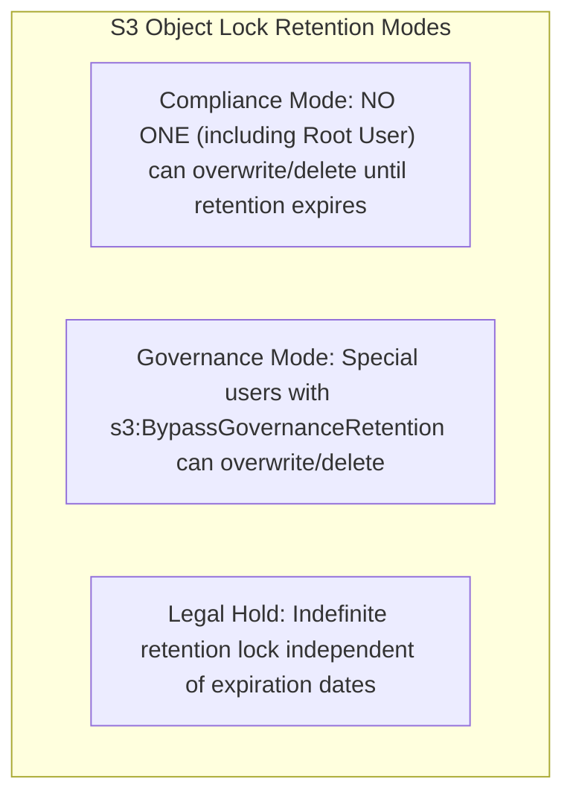

# 🛡️ Amazon S3 Security & Access Management

- **Category**: Storage Security & Data Protection
- **Language / ဘာသာစကား**: [English (Original)](/en/02-services/storage/s3/s3-security) | **မြန်မာဘာသာ (Burmese)**
- **Primary Use Case**: Defense-in-Depth Security, Access Control, Regulatory Compliance, Data Immutability & Auditing
- **Slide Reference**: Pages 77–138 in [AWSCertifiedDataEngineerSlides.pdf](/docs/AWSCertifiedDataEngineerSlides.pdf)
- **Hub Links**: [[mm/index]] | [[mm/00-hub/service-catalog|service-catalog]] | [[mm/02-services/storage/s3/s3|s3]] | [[mm/02-services/storage/s3/s3-encryption|s3-encryption]] | [[mm/02-services/storage/s3/s3-access-points|s3-access-points]] | [[mm/02-services/security-governance/iam|iam]] | [[mm/02-services/security-governance/lake-formation|lake-formation]] | [[mm/02-services/security-governance/macie-and-cloudtrail|macie-and-cloudtrail]]

---

## 1. High-Level Summary

လုံခြုံရေးသည် **AWS Certified Data Engineer – Associate (DEA-C01)** စာမေးပွဲတွင် အဓိက အာရုံစိုက်ရမည့် အပိုင်းတစ်ခုဖြစ်သည်။ Amazon S3 သည် identity authorization (IAM policies)၊ resource authorization (Bucket Policies & Access Points)၊ network isolation (Block Public Access & VPC Endpoints)၊ data encryption (SSE-S3, SSE-KMS, DSSE-KMS, TLS)၊ data immutability (S3 Object Lock WORM) နှင့် automated PII discovery (AWS Macie) တို့ကို ပေါင်းစပ်ထားသော ပြည့်စုံသည့် **Defense-in-Depth** လုံခြုံရေး မော်ဒယ်တစ်ခုကို အသုံးပြုထားသည်။

---

## 2. S3 Security Control Pillars



---

## 3. Pillar 1: Access Control & Authorization

### 1. IAM Policies vs. S3 Bucket Policies

- **IAM Policies**: IAM Users, Roles သို့မဟုတ် Groups များတွင် ချိတ်ဆက်ထားသော User အပေါ် အခြေခံသည့် policies များဖြစ်သည်။ Identity တစ်ခုအနေဖြင့် AWS resources များတစ်လျှောက် မည်သည့်အရာများကို အသုံးပြုခွင့်ရှိသည်ကို သတ်မှတ်ပေးသည်။
- **S3 Bucket Policies**: S3 bucket တွင် တိုက်ရိုက်ချိတ်ဆက်ထားသော Resource အပေါ် အခြေခံသည့် JSON policies များဖြစ်သည်။ Bucket နှင့် ၎င်း၏ objects များအပေါ် မည်သူက (Principals) မည်သည့် actions များကို လုပ်ဆောင်ခွင့်ရှိသည်ကို သတ်မှတ်ပေးသည်။
- **Policy Evaluation Logic**:
  $$\text{Access Granted} = (\text{IAM Allow} \lor \text{Bucket Policy Allow}) \land \neg (\text{Explicit Deny anywhere})$$
  - Policy တစ်ခုခုတွင် **Explicit DENY** ပါရှိပါက အခြား `ALLOW` statements အားလုံးကို လွှမ်းမိုးသွားမည်ဖြစ်သည်။
  - Cross-account access အတွက်၊ IAM policy (Account B) နှင့် S3 bucket policy (Account A) **နှစ်ခုစလုံး** တွင် `ALLOW` ကို ရှင်းလင်းစွာ ခွင့်ပြုထားရမည်ဖြစ်သည်။

### 2. Disabling Legacy S3 ACLs (Bucket Owner Enforced)

- **S3 Access Control Lists (ACLs)**: အရင်ခေတ်က အသုံးပြုခဲ့သော access control ယန္တရားဖြစ်သည်။
- **Best Practice (Recommended by AWS)**: **Bucket Owner Enforced** ကို သတ်မှတ်ခြင်းဖြင့် ACLs ကို ပိတ်ထားရန် အကြံပြုသည်။ ၎င်းကို ဖွင့်ထားပါက:
  - ACLs များကို လုံးဝ ပိတ်ထားမည်ဖြစ်သည်။
  - Bucket သို့ upload လုပ်သမျှ objects အားလုံးသည် bucket owner account ၏ ပိုင်ဆိုင်မှုအဖြစ် အလိုအလျောက် သတ်မှတ်ခံရမည်ဖြစ်သည်။
  - Access control ကို IAM policies၊ Bucket Policies နှင့် Access Points များမှတစ်ဆင့်သာ သီးသန့် စီမံခန့်ခွဲရန် ပိုမိုရိုးရှင်းသွားမည်ဖြစ်သည်။

---

## 4. Pillar 2: Network Isolation & Block Public Access

### 1. S3 Block Public Access

Bucket policies သို့မဟုတ် ACL settings များ မည်သို့ပင်ရှိစေကာမူ အများပြည်သူ ဝင်ရောက်အသုံးပြုခွင့်ကို တားဆီးပေးသည့် Account အဆင့်နှင့် Bucket အဆင့် လုံခြုံရေး safety override တစ်ခုဖြစ်သည်။ အောက်ပါ settings ၄ ခု ပါဝင်သည်:

1. `BlockPublicAcls`: အသစ်ပြုလုပ်မည့် public ACLs များကို ပိတ်ပင်သည်။
2. `IgnorePublicAcls`: လက်ရှိရှိနေသော public ACLs များကို လျစ်လျူရှုသည်။
3. `BlockPublicPolicy`: Public access ခွင့်ပြုထားသော bucket policies အသစ်များကို ပိတ်ပင်သည်။
4. `RestrictPublicBuckets`: Public bucket access ကို AWS service principals များအတွက်သာ ကန့်သတ်ထားသည်။

### 2. VPC Endpoints for S3 (Private Network Isolation)

S3 အသွားအလာများကို public internet မှတစ်ဆင့် ဖြတ်သန်းသွားခြင်းကို တားဆီးရန်:

- **VPC Gateway Endpoints**: S3 အတွက် အခမဲ့ VPC routing configuration ဖြစ်သည်။ VPC route tables များတွင် ထည့်သွင်းပေးသည်။
- **VPC Interface Endpoints (AWS PrivateLink)**: သင့် subnets များရှိ Private IP addresses များဖြစ်သည်။ (`com.amazonaws.<region>.s3`)။ On-premises networks များမှ S3 သို့ AWS Direct Connect သို့မဟုတ် VPN မှတစ်ဆင့် private အသုံးပြုခွင့်ကို ရရှိစေသည်။

---

## 5. Pillar 3: Encryption & In-Transit Security

အသေးစိတ်ကို [[mm/02-services/storage/s3/s3-encryption|s3-encryption]] မှတ်စုတွင် ကြည့်ပါ။

- **Encryption in Transit (HTTPS/TLS)**: Bucket policy မှတစ်ဆင့် မဖြစ်မနေ လိုက်နာရန် သတ်မှတ်ခြင်း:
  ```json
  "Condition": { "Bool": { "aws:SecureTransport": "false" } }
  ```
- **Encryption at Rest**:
  - **SSE-S3**: AWS မှ အခမဲ့ စီမံပေးသော default encryption (AES-256) ဖြစ်သည်။
  - **SSE-KMS**: **CloudTrail audit logging** နှင့် သီးခြား key policies များ ပါဝင်သော Managed keys ဖြစ်သည်။
  - **DSSE-KMS**: KMS ကို အခြေခံထားသော **Dual-Layer Server-Side Encryption** (လုံခြုံရေး အထူးလိုအပ်ချက်များအတွက် သီးခြားလွတ်လပ်သော AES-256 layers နှစ်ထပ်) ဖြစ်သည်။
  - **SSE-C**: Customer ကိုယ်တိုင် ထောက်ပံ့ပေးသော encryption keys ဖြစ်သည်။
  - **S3 Bucket Keys**: KMS API requests များနှင့် ကုန်ကျစရိတ်များကို ၉၉% အထိ လျှော့ချပေးသည်။

---

## 6. Pillar 4: Data Protection & Immutability (WORM)

### S3 Object Lock (Write Once Read Many)

Compliance နှင့် ransomware အန္တရာယ်မှ ကာကွယ်ရန်အတွက် object ကို ဖျက်ခြင်း သို့မဟုတ် ပြင်ဆင်ခြင်းမှ တားဆီးပေးသည်။ S3 Versioning ကို ဖွင့်ထားရန် လိုအပ်သည်။



| Object Lock Mode    | Overwrite / Delete Allowed?                         | Can Root User Override?              | Primary Use Case                        |
| ------------------- | --------------------------------------------------- | ------------------------------------ | --------------------------------------- |
| **Compliance Mode** | ❌ သတ်မှတ်ချိန်မကုန်မချင်း လုံးဝ ခွင့်မပြုပါ                 | ❌ မရပါ (ပြင်ဆင်ခြင်း၊ ဖျက်ခြင်း မပြုလုပ်နိုင်ပါ) | SEC Rule 17a-4, FINRA, regulatory WORM  |
| **Governance Mode** | ⚠️ `s3:BypassGovernanceRetention` ရှိသူများသာ ခွင့်ပြုသည် | ✔️ ရပါသည် (ခွင့်ပြုချက် ရရှိထားပါက)            | Internal policy enforcement, testing    |
| **Legal Hold**      | ❌ ဖွင့်ထားစဉ်အတွင်း လုံးဝ ခွင့်မပြုပါ                       | ❌ မရပါ (ကိုယ်တိုင် ပြန်လည်ပိတ်ပေးရမည်)         | Ongoing legal proceedings / audit holds |

---

## 7. Pillar 5: Auditing, Monitoring & PII Scanning

### 1. AWS Macie (Automated PII Discovery)

- S3 buckets များအတွင်း သိမ်းဆည်းထားသော **Personally Identifiable Information (PII)** များကို ရှာဖွေခြင်း၊ ခွဲခြားသတ်မှတ်ခြင်းနှင့် ကာကွယ်ပေးခြင်းတို့အတွက် machine learning နှင့် pattern matching ကို အသုံးပြုသည်။
- Social Security Numbers (SSN)၊ credit card numbers၊ passport data နှင့် private API keys များကို အလိုအလျောက် ရှာဖွေထောက်လှမ်းပေးသည်။
- EventBridge နှင့် AWS Security Hub တို့တွင် လုံခြုံရေးတွေ့ရှိချက် (findings) များကို ထုတ်ပြန်ပေးသည်။

### 2. AWS CloudTrail & S3 Server Access Logging

- **CloudTrail Data Events**: စစ်ဆေးမှု (auditing) အတွက် API calls များ (`s3:GetObject`, `s3:PutObject`, `s3:DeleteObject`) ကို မှတ်တမ်းတင်ပေးသည်။
- **S3 Server Access Logs**: [[mm/02-services/analytics-streaming/athena/athena|athena]] ဖြင့် ခွဲခြမ်းစိတ်ဖြာနိုင်ရန် အသေးစိတ် request မှတ်တမ်းများ (requester, bucket, time, response status) ကို target S3 bucket အတွင်းသို့ ပေးပို့သည်။

---

## 8. S3 Security Summary & Comparison Matrix

| Security Mechanism        | Primary Security Function              | Enforcement Level       | DEA-C01 Key Benefit                                 |
| ------------------------- | -------------------------------------- | ----------------------- | --------------------------------------------------- |
| **Bucket Policy**         | Resource အခြေပြု ခွင့်ပြုချက် သတ်မှတ်ခြင်း     | Bucket level            | IP, VPC, HTTPS သို့မဟုတ် IAM principal ဖြင့် တားဆီးနိုင်ခြင်း |
| **Block Public Access**   | အများပြည်သူ ပေါက်ကြားမှုအတွက် အရေးပေါ်ပိတ်ပင်မှု | Account / Bucket level  | မှားယွင်းသော public policies/ACLs များကို ကျော်လွန်တားဆီးနိုင်ခြင်း |
| **S3 Object Lock**        | Data immutability (WORM)               | Object / Version level  | Regulatory WORM compliance နှင့် ransomware protection  |
| **SSE-KMS + Bucket Keys** | Encryption at rest + audit logging     | Bucket / Object level   | CloudTrail audit trail + ကုန်ကျစရိတ် ၉၉% လျှော့ချပေးခြင်း        |
| **AWS Macie**             | အလိုအလျောက် PII ရှာဖွေပေးခြင်း                | Bucket level            | S3 အတွင်းရှိ SSN, credit cards နှင့် အရေးကြီးဒေတာများကို ရှာဖွေပေးခြင်း   |
| **Lake Formation**        | Column-, Row-, နှင့် Cell-level လုံခြုံရေး   | Data Catalog / S3 level | အသေးစိတ်ကျသော analytical data governance စီမံခန့်ခွဲမှု             |

---

## 9. DEA-C01 Exam Tips & Decision Triggers

> [!IMPORTANT]
> **Key Exam Decision Rules**:
>
> - **Enforce HTTPS/TLS for all S3 requests**: `"aws:SecureTransport": "false"` နှင့် `Effect: Deny` ပါဝင်သော S3 Bucket Policy ကို ထည့်ပါ။
> - **Strict regulatory requirement where NO ONE (including root user) can delete objects**: **S3 Object Lock Compliance Mode** ကို ရွေးချယ်ပါ။
> - **Discover sensitive PII (SSNs, Credit Cards) stored in S3**: **AWS Macie** ကို ရွေးချယ်ပါ။
> - **Disable legacy ACLs and ensure bucket owner owns all objects**: S3 Object Ownership ကို **Bucket Owner Enforced** အဖြစ် သတ်မှတ်ပါ။
> - **Audit trail of who accessed or encrypted S3 objects**: **CloudTrail Data Events** နှင့် **SSE-KMS** ကို ဖွင့်ပါ။
> - **Cross-account access to encrypted S3 bucket**: **SSE-KMS with Customer Managed Key (CMK)** ကို အသုံးပြုပြီး Bucket Policy နှင့် KMS Key Policy များကို ပြင်ဆင်ပါ။

---

## 📌 Related Notes

- [[mm/02-services/storage/s3/s3|s3]] — Main Amazon S3 Overview & Storage Classes
- [[mm/02-services/storage/s3/s3-encryption|s3-encryption]] — Deep-dive on SSE-S3, SSE-KMS, DSSE-KMS & SSE-C
- [[mm/02-services/storage/s3/s3-access-points|s3-access-points]] — VPC Access Points & S3 Object Lambda
- [[mm/02-services/storage/s3/s3-performance|s3-performance]] — S3 Request Limits & Performance Optimization
- [[mm/02-services/security-governance/iam|iam]] — IAM Roles, Policies & Service-Linked Roles
- [[mm/02-services/security-governance/lake-formation|lake-formation]] — Fine-Grained Column/Row Governance
- [[mm/02-services/security-governance/macie-and-cloudtrail|macie-and-cloudtrail]] — AWS Macie PII Scanning & CloudTrail Audit Logs
