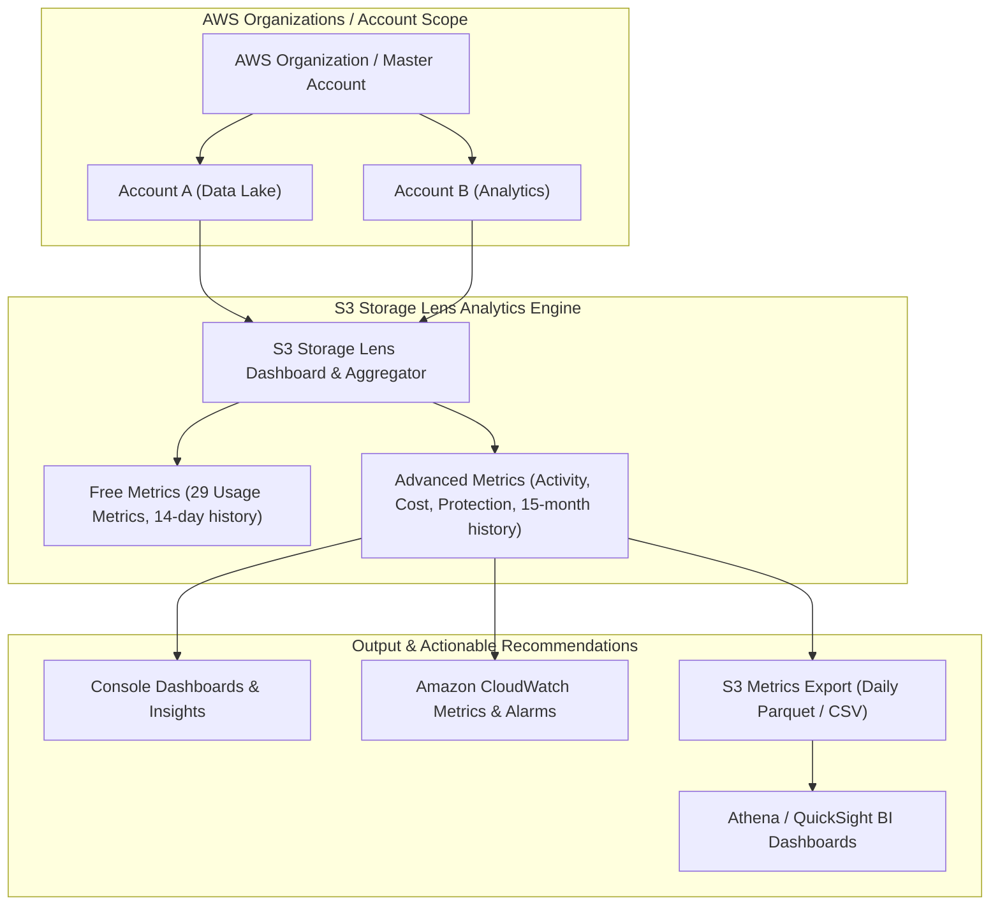

# 🔍 Amazon S3 Storage Lens

- **Category**: Storage Analytics & Governance
- **Language / ဘာသာစကား**: [English (Original)](/en/02-services/storage/s3/s3-storage-lens) | **မြန်မာဘာသာ (Burmese)**
- **Primary Use Case**: Organization-Wide Storage Visibility, Cost Optimization, Security & Protection Auditing
- **Slide Reference**: Pages 77–138 in [AWSCertifiedDataEngineerSlides.pdf](/docs/AWSCertifiedDataEngineerSlides.pdf)
- **Hub Links**: [[mm/index|index]] | [[mm/00-hub/service-catalog|service-catalog]] | [[mm/02-services/storage/s3/s3|s3]] | [[mm/02-services/storage/s3/s3-performance|s3-performance]] | [[mm/02-services/storage/s3/s3-encryption|s3-encryption]] | [[mm/02-services/ml-dev-cost/cost-management|cost-management]]

---

## 1. High-Level Summary

**Amazon S3 Storage Lens** သည် AWS S3 Console တွင် တိုက်ရိုက်ထည့်သွင်းပေးထားသော organization-wide (အဖွဲ့အစည်းတစ်ခုလုံးဆိုင်ရာ) cloud storage analytics လုပ်ဆောင်ချက်တစ်ခုဖြစ်သည်။ AWS Data Engineering နှင့် **DEA-C01** exam တို့တွင်, S3 Storage Lens ကို **cost-optimization opportunities** (ကုန်ကျစရိတ်သက်သာစေမည့် အခွင့်အလမ်းများ) အား ရှာဖွေဖော်ထုတ်ရန် (ဥပမာ- ပြီးဆုံးခြင်းမရှိသော multipart upload များ သို့မဟုတ် S3 Standard တွင်ရှိသော အသုံးနည်းသည့် data များ)၊ **data protection and security posture** (ဒေတာလုံခြုံရေးနှင့် ကာကွယ်မှုအခြေအနေ) များကို စစ်ဆေးရန် (ဥပမာ- encrypt မလုပ်ထားသော bucket များ သို့မဟုတ် replication မရှိခြင်း) နှင့်၊ ၎င်းစစ်ဆေးချက်များကို [[mm/02-services/analytics-streaming/athena/athena|athena]] နှင့် [[mm/02-services/analytics-streaming/quicksight/quicksight|quicksight]] တို့ကိုအသုံးပြုပြီး analytics ပြုလုပ်နိုင်ရန်အတွက် **Parquet** format ဖြင့် S3 သို့ အသေးစိတ် storage metric များ export လုပ်ရန် အဓိကအသုံးပြုလေ့ရှိသည်။

---

## 2. Architecture & Metrics Hierarchy



---

## 3. Storage Lens Tiers: Free vs. Advanced

| Feature                       | S3 Storage Lens Free                   | S3 Storage Lens Advanced (Paid)                               |
| ----------------------------- | -------------------------------------- | ------------------------------------------------------------- |
| **Availability**              | AWS account အားလုံးတွင် အလိုအလျောက်ဖွင့်ထားသည်      | Account/Organization တစ်ခုချင်းစီတွင် လိုအပ်သလိုသတ်မှတ်နိုင်သည်                         |
| **Usage Metrics**             | 29 usage metrics (Bytes, Object Count) | 29 usage metrics ပါဝင်သည်                                     |
| **Activity Metrics**          | မပါဝင်ပါ                           | `GET`, `PUT`, `LIST`, `4xx`/`5xx` error rates, download bytes |
| **Cost Optimization Metrics** | အခြေခံ storage class ခွဲခြားမှုများ          | **Uncompleted multipart uploads**, non-current version bytes  |
| **Data Protection Metrics**   | အခြေခံ encryption အခြေအနေ                | **S3 Object Lock**, replication အခြေအနေ, အသေးစိတ် KMS audit    |
| **Historical Data**           | **14 days**                            | **15 months (500+ days)** trend analysis အတွက်                  |
| **Granularity**               | Account, Region, Bucket                | Account, Region, Bucket, **Prefix**, **Storage Lens Groups**  |
| **Metrics Export**            | Console တွင်သာ                           | **S3 Metrics Export (Parquet / CSV)** & CloudWatch publishing |

---

## 4. Key Metric Categories & Cost Optimization Insights

### 1. Cost Optimization Recommendations

- **Incomplete Multipart Upload Bytes**: တစပိုင်းတစ ပြတ်တောက်သွားပြီး အဆုံးသတ်နိုင်ခြင်း (completed) မရှိသလို ဖျက်သိမ်းခြင်း (aborted) လည်း မရှိသော ကြီးမားသည့် upload များကို ဖော်ထုတ်ပေးသည်။ ၎င်းတို့သည် S3 storage နေရာကို တိတ်တဆိတ်ရယူထားပြီး အမြဲတမ်းကုန်ကျစရိတ်ဖြစ်ပေါ်စေသည်။
- **Non-Current Version Bytes**: S3 Lifecycle expiration rule များ မသတ်မှတ်ထားဘဲ ရေးทับ (overwritten) ခံထားရပြီး အဟောင်းဖြစ်နေသော object version ပေါင်း terabyte များစွာကို သိမ်းဆည်းထားသည့် S3 version-enabled bucket များကို ဖော်ထုတ်ပေးသည်။
- **Unfrequently Accessed Data in Standard**: $>30$ ရက်ထက်ကျော်လွန်ပြီး မည်သည့်ဖတ်ရှုမှု (read activity) မှမရှိသော အသုံးနည်းသည့် S3 Standard bucket များကို ဖော်ထုတ်ပေးပြီး **S3 Standard-IA**, **Intelligent-Tiering**, သို့မဟုတ် **Glacier** သို့ အလိုအလျောက်ရွှေ့ပြောင်းရန် အကြံပြုပေးသည်။

### 2. Security & Data Protection Auditing

- **Unencrypted Buckets**: Server-side encryption (SSE-S3 / SSE-KMS) ကို default အနေဖြင့် သတ်မှတ်မထားသော၊ သို့မဟုတ် encryption လုပ်ရန်အတွက် bucket policy များ မရှိသော bucket များကို စစ်ဆေးပေးသည်။
- **Block Public Access Status**: S3 Block Public Access ကို ပိတ်ထားသော account သို့မဟုတ် bucket များကို အချက်ပြပေးသည်။
- **Replication Status**: Disaster recovery လိုအပ်ချက်များအတွက် Cross-Region Replication (CRR) နှင့် Same-Region Replication (SRR) တို့၏ အချက်အလက်လွှမ်းခြုံမှုကို စောင့်ကြည့်ပေးသည်။

### 3. S3 Storage Lens Groups

- အောက်ပါတို့အပေါ်အခြေခံ၍ metric များကို စိတ်ကြိုက် filter လုပ်ခွင့်ပေးသည်:
  - **Object Tags** (ဥပမာ- `Environment=Production`).
  - **Prefixes** (ဥပမာ- `raw/`, `analytics/`).
  - **Object Creation Dates** သို့မဟုတ် **File Extensions** (`.parquet`, `.csv`, `.log`).

---

## 5. Metrics Export & Downstream Analytics

S3 Storage Lens Advanced သည် နေ့စဉ် metric ဖိုင်များကို သတ်မှတ်ထားသော S3 bucket သို့ တိုက်ရိုက် export လုပ်ခွင့်ပေးသည်:

- **Supported Formats**: **Apache Parquet** (query အမြန်နှုန်းနှင့် storage ကုန်ကျစရိတ် သက်သာစေရန်အတွက် အကြံပြုသည်) သို့မဟုတ် **CSV**.
- **Querying with Athena**: Export လုပ်ထားသော Storage Lens Parquet metric များကို [[mm/02-services/analytics-streaming/athena/athena|athena]] အသုံးပြုပြီး query လုပ်ကာ နေ့စဉ် cost reporting ကို အလိုအလျောက်ထုတ်ယူနိုင်သည်:

```sql
SELECT
  account_id,
  bucket_name,
  sum(storage_bytes) / 1073741824 AS storage_gb,
  sum(incomplete_multipart_upload_bytes) / 1073741824 AS incomplete_mpu_gb
FROM s3_storage_lens_db.storage_lens_table
WHERE date = '2026-08-07'
GROUP BY account_id, bucket_name
HAVING sum(incomplete_multipart_upload_bytes) > 0
ORDER BY incomplete_mpu_gb DESC;
```

- **Visualizing with QuickSight**: Athena dataset နှင့် တိုက်ရိုက်ချိတ်ဆက်ထားသော [[mm/02-services/analytics-streaming/quicksight/quicksight|quicksight]] တွင် storage ကုန်ကျစရိတ် dashboard များနှင့် trend visualization များကို တည်ဆောက်နိုင်သည်။

---

## 6. S3 Storage Lens vs. S3 Inventory vs. Storage Class Analysis

| Feature                 | S3 Storage Lens                             | S3 Inventory                                   | S3 Storage Class Analysis                      |
| ----------------------- | ------------------------------------------- | ---------------------------------------------- | ---------------------------------------------- |
| **Scope**               | **Organization-wide / Account-wide**        | Single Bucket / Prefix                         | Single Bucket / Prefix                         |
| **Output Type**         | Visual Console, CloudWatch, Parquet/CSV     | CSV, ORC, Parquet object list                  | Recommendations in Console                     |
| **Primary Focus**       | Storage trends, cost optimization, security | Detailed list of individual objects & metadata | Access pattern analysis for IA lifecycle rules |
| **Object-Level Detail** | Aggregated (Prefix / Bucket level)          | **Individual Object level** (1 row per object) | Aggregated bucket level                        |

---

## 7. DEA-C01 Exam Tips & Decision Triggers

> [!IMPORTANT]
> **Key Exam Decision Rules**:
>
> - **S3 storage costs, security, နှင့် usage များကို organization-wide (အဖွဲ့အစည်းတစ်ခုလုံး) ကြည့်ရှုလိုလျှင်**: **S3 Storage Lens** ကို ရွေးချယ်ပါ။
> - **Bucket ရာပေါင်းများစွာရှိ incomplete multipart upload များ သို့မဟုတ် non-current object version များကို ရှာဖွေလိုလျှင်**: **S3 Storage Lens Advanced metrics** ကို အသုံးပြုပါ။
> - **Athena တွင် SQL ဖြင့် query လုပ်ရန် Parquet format ဖြင့် နေ့စဉ် S3 metric များကို S3 သို့ export လုပ်လိုလျှင်**: **S3 Storage Lens Metrics Export** ကို ပြင်ဆင်သတ်မှတ်ပါ။
> - **S3 metric များကို object tag များ၊ file extension များ၊ သို့မဟုတ် တိကျသော prefix များဖြင့် စစ်ထုတ် (filter) လိုလျှင်**: **S3 Storage Lens Groups** ကို အသုံးပြုပါ။
> - **Auditing လုပ်ရန်အတွက် သန်းပေါင်းများစွာသော object တစ်ခုချင်းစီ၏ အချက်အလက်များနှင့် metadata စာရင်းအပြည့်အစုံ လိုအပ်လျှင်**: **S3 Inventory** (Storage Lens မဟုတ်ပါ) ကို ရွေးချယ်ပါ။
> - **Standard-IA သို့ ပြောင်းရွှေ့ရမည့်ရက်ကို ဆုံးဖြတ်ရန်အတွက် bucket တစ်ခုတည်း၏ access pattern များကို ခွဲခြမ်းစိတ်ဖြာလိုလျှင်**: **S3 Storage Class Analysis** ကို ရွေးချယ်ပါ။

---

## 📌 Related Notes

- [[mm/02-services/storage/s3/s3|s3]] — Amazon S3 Overview & Storage Classes
- [[mm/02-services/storage/s3/s3-performance|s3-performance]] — S3 Request Limits & Performance Optimization
- [[mm/02-services/storage/s3/s3-encryption|s3-encryption]] — S3 Encryption & Bucket Security Auditing
- [[mm/02-services/ml-dev-cost/cost-management|cost-management]] — AWS Cost Explorer, AWS Budgets & Cost Optimization
- [[mm/02-services/analytics-streaming/athena/athena|athena]] — Querying Parquet Exports with SQL
- [[mm/02-services/analytics-streaming/quicksight/quicksight|quicksight]] — BI Dashboards & Visualizations for Storage Lens
