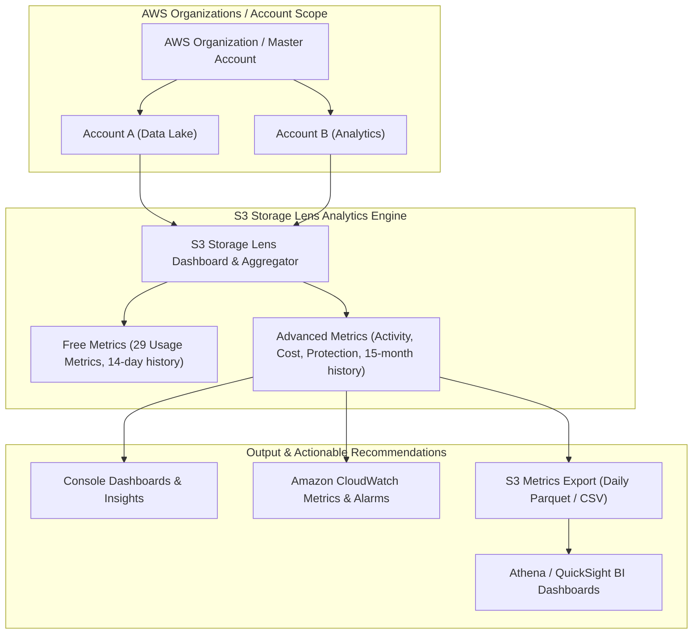

# 🔍 Amazon S3 Storage Lens (S3 သိုလှောင်မှု ဆန်းစစ်လေ့လာရေးနှင့် စီမံခန့်ခွဲမှု)

- **Category**: Storage Analytics & Governance
- **Language / ဘာသာစကား**: [English Version](file:///home/monetine/Workspace/Wathon/aws-dea-c01/content/en/02-services/storage/s3/s3-storage-lens.md) | **မြန်မာဘာသာ (Burmese)**
- **အဓိက အသုံးပြုမှု**: AWS Organization တစ်ခုလုံးရှိ S3 Storage အသုံးပြုမှုများကို Single Dashboard မှ မြင်တွေ့ခြင်း၊ ကုန်ကျစရိတ် ချွေတာရန် အကြံပြုချက်များ ရယူခြင်း၊ လုံခြုံရေး အားနည်းချက်များ စစ်ဆေးခြင်း၊ နှင့် နေ့စဉ် Metrics များကို S3 သို့ **Apache Parquet** ဖြင့် Export လုပ်ခြင်း။
- **Slide Reference**: Pages 77–138 in `[[AWSCertifiedDataEngineerSlides.pdf]]`
- **Hub Links**: `[[mm/index]]` | `[[en/index]]` | `[[s3]]` | `[[s3-performance]]` | `[[s3-encryption]]` | `[[cost-management]]`

---

## ၁။ အကျဉ်းချုပ် (High-Level Summary)

**Amazon S3 Storage Lens** သည် AWS Organization အတွင်းရှိ Accounts ရာထောင်ချီနှင့် S3 Buckets သန်းပေါင်းများစွာ၏ Storage Metrics များကို ဗဟိုမှ လေ့လာဆန်းစစ်ပေးသည့် Analytics ဝန်ဆောင်မှု ဖြစ်သည်။

---

## ၂။ အဓိက စွမ်းဆောင်ရည် ၃ ရပ်

1. **Cost Optimization**: အသုံးမပြုဘဲ ကျန်နေသော Incomplete Multipart Uploads များနှင့် Standard Storage ထဲတွင် ရောက်နေသော Cold Datasets များကို ရှာဖွေဖော်ထုတ်ပေးသည်။
2. **Security & Protection Auditing**: Encryption မလုပ်ထားသော Buckets များ၊ Replication မရှိသော အရေးကြီးဒေတာများကို အလိုအလျောက် သတိပေးသည်။
3. **Daily S3 Metrics Export**: နေ့စဉ် Metrics အချက်အလက်များကို **Apache Parquet** ဖော်မတ်ဖြင့် S3 သို့ Export လုပ်ပေးသဖြင့် `[[athena]]` နှင့် `[[quicksight]]` ဖြင့် BI Dashboard များ တည်ဆောက်နိုင်သည်။

---

## ၃။ DEA-C01 စာမေးပွဲ အဓိက အချက်အလက်များ (Exam Tips)

> [!IMPORTANT]
> **Key Exam Trigger Keywords**:
> - **"Organization-wide visibility into S3 storage usage and cost-optimization recommendations"** $\rightarrow$ **Amazon S3 Storage Lens**.
> - **"Export daily storage analytics metrics in Apache Parquet format to S3 for Athena SQL analysis"** $\rightarrow$ **S3 Storage Lens Metrics Export**.

---

## 📌 ဆက်စပ် မှတ်စုများ (Related Notes)

- `[[s3]]` — Amazon S3 Overview
- `[[s3-lifecycle-rules]]` — Lifecycle Cost Optimization
- `[[athena]]` — Querying Storage Lens Parquet Exports
