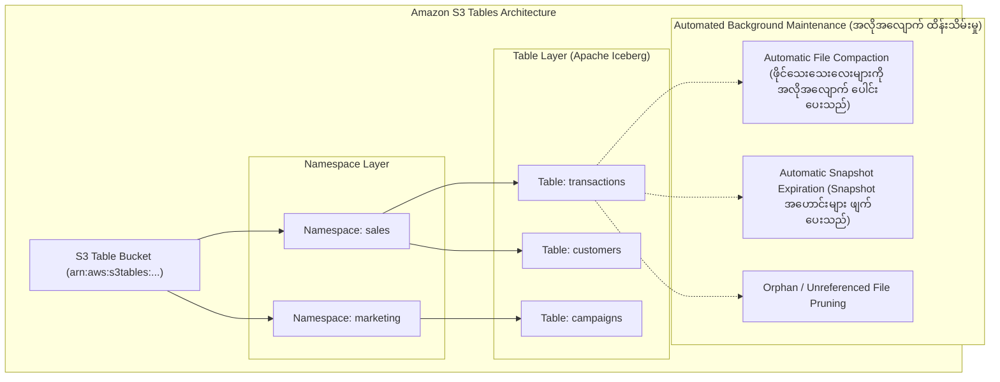

# 📊 Amazon S3 Tables (Apache Iceberg အတွက် သီးသန့် S3 Table Buckets)

- **Category**: Tabular Object Storage & Data Lake Architecture
- **Language / ဘာသာစကား**: [English Version](file:///home/monetine/Workspace/Wathon/aws-dea-c01/content/en/02-services/storage/s3/s3-tables.md) | **မြန်မာဘာသာ (Burmese)**
- **အဓိက အသုံးပြုမှု**: **Apache Iceberg** Tabular Data များအတွက် သီးသန့် ဖန်တီးထားသော Bucket အမျိုးအစား၊ အလိုအလျောက် File Compaction၊ Snapshot Expiration၊ နှင့် 3x ပိုမိုမြန်ဆန်သော Query Performance။
- **Slide Reference**: Pages 77–138 in `[[AWSCertifiedDataEngineerSlides.pdf]]`
- **Hub Links**: `[[mm/index]]` | `[[en/index]]` | `[[s3]]` | `[[athena]]` | `[[lake-formation]]` | `[[glue]]`

---

## ၁။ အကျဉ်းချုပ် (High-Level Summary)

**Amazon S3 Tables** သည် **Apache Iceberg** Table ဖော်မတ်ဖြင့် သိမ်းဆည်းသော Tabular ဒေတာများအတွက် သီးသန့် ဒီဇိုင်းထုတ်ထားသည့် S3 Table Bucket အမျိုးအစား ဖြစ်သည်။ သမားရိုးကျ S3 General-purpose Buckets များနှင့် နှိုင်းယှဉ်ပါက **၃ ဆ ပိုမိုမြန်ဆန်သော Query Performance** နှင့် **၁၀ ဆ ပိုမိုမြင့်မားသော Transactions per second (TPS)** ကို ပေးစွမ်းသည်။

---

## ၂။ အလိုအလျောက် Maintenance ပြုလုပ်ပေးခြင်း (Automated Optimization)

1. **Automatic File Compaction**: Streaming သို့မဟုတ် မကြာခဏ အသစ်ထည့်သွင်းမှုကြောင့် ဖြစ်ပေါ်လာသော ဖိုင်ငယ်လေးများစွာ (Small Files) ကို Background မှနေ၍ ကြီးမားသော Parquet ဖိုင်များအဖြစ် အလိုအလျောက် ပေါင်းစည်းပေးသည်။
2. **Snapshot Expiration & Orphan File Pruning**: အသုံးမလိုတော့သော Table Snapshots များနှင့် ပျက်စီးနေသော Unreferenced Data Files များကို အလိုအလျောက် ရှင်းလင်းပေးသဖြင့် သိုလှောင်မှု ကုန်ကျစရိတ်ကို ထိန်းချုပ်ပေးသည်။

---

## ၃။ DEA-C01 စာမေးပွဲ အဓိက အချက်အလက်များ (Exam Tips)

> [!IMPORTANT]
> **Key Exam Trigger Keywords**:
> - **"Purpose-built S3 storage bucket optimized specifically for Apache Iceberg tables"** $\rightarrow$ **Amazon S3 Tables**.
> - **"Automated background compaction and maintenance of Iceberg tables in S3 data lake"** $\rightarrow$ **Amazon S3 Tables maintenance**.

---

## 📌 ဆက်စပ် မှတ်စုများ (Related Notes)

- `[[s3]]` — Amazon S3 Overview
- `[[athena]]` — Querying Apache Iceberg Tables with Amazon Athena
- `[[data-formats-and-compression]]` — Parquet & Iceberg Formats
