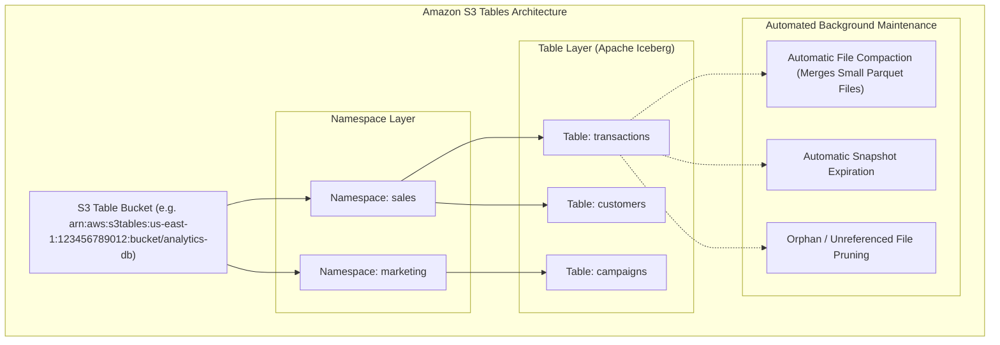
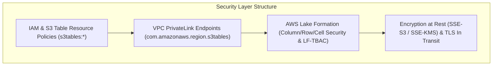

# 📊 Amazon S3 Tables

- **Category**: Tabular Object Storage & Data Lake Architecture
- **Language / ဘာသာစကား**: [English (Original)](/en/02-services/storage/s3/s3-tables) | **မြန်မာဘာသာ (Burmese)**
- **Primary Use Case**: Managed Apache Iceberg Tables, Automated Data Lake Maintenance, High-Throughput ACID Transactions
- **Slide Reference**: Pages 77–138 in [AWSCertifiedDataEngineerSlides.pdf](/docs/AWSCertifiedDataEngineerSlides.pdf)
- **Hub Links**: [[mm/index]] | [[service-catalog]] | [[s3]] | [[athena]] | [[lake-formation]] | [[glue]]

---

## 1. High-Level Summary

**Amazon S3 Tables** သည် **Apache Iceberg** table ပုံစံဖြင့် ဖွဲ့စည်းထားသော tabular data များကို သိမ်းဆည်းရန် သီးသန့်ရည်ရွယ်တည်ဆောက်ထားသော storage bucket အမျိုးအစားတစ်ခုဖြစ်ပါသည်။ ၎င်းသည် table-based analytics အတွက် သီးသန့် optimized လုပ်ထားသော ပထမဆုံး object storage ဖြစ်ပြီး၊ သာမန် general-purpose S3 bucket များနှင့်ယှဉ်လျှင် **query performance ကို 3 ဆ ပိုမြန်စေပြီး** **transactions per second (TPS) ကို 10 ဆ ပိုမိုရရှိစေပါသည်။** S3 Tables သည် နောက်ကွယ်မှနေ၍ table optimization လုပ်ငန်းစဉ်များဖြစ်သည့် (compaction, snapshot expiration, unreferenced file pruning များကို) အလိုအလျောက်လုပ်ဆောင်ပေးသောကြောင့် Apache Iceberg data lake များကို manual စီမံခန့်ခွဲရသည့် operational ဝန်ထုပ်ဝန်ပိုးကို ဖယ်ရှားပေးပါသည်။

---

## 2. Architecture & Hierarchy

### Table Bucket Hierarchy

1. **Table Bucket**: Table များကိုသိမ်းဆည်းရန်အတွက် သီးသန့်သတ်မှတ်ထားသော အထူးပြု S3 bucket အမျိုးအစားဖြစ်သည် (`s3tables`)။
2. **Namespace**: Table Bucket အတွင်းရှိ table များကို logical grouping ပြုလုပ်ပေးသော container (ရိုးရာ relational database များရှိ schema သို့မဟုတ် database များနှင့် တူညီသည်) ဖြစ်ပါသည်။
3. **Table**: Iceberg metadata၊ manifest များနှင့် snapshot history များပါဝင်သော Parquet ဖိုင်များအဖြစ် သိမ်းဆည်းထားသည့် သီးခြား **Apache Iceberg** table တစ်ခုဖြစ်ပါသည်။

---

## 3. Core Features & Capabilities

### 1. Automated Table Maintenance (Zero Operational Overhead)

ပုံမှန် S3 bucket များတွင်၊ Apache Iceberg table များသည် အချိန်ကြာလာသည်နှင့်အမျှ သေးငယ်သော data ဖိုင်ပေါင်း သန်းချီ၍ စုဆောင်းမိလာပြီး သက်တမ်းကုန်နေသော metadata snapshot များကြောင့် manual Glue ETL / EMR compaction script များကို run မပေးပါက query performance ကို ကျဆင်းစေပါသည်။  
**S3 Tables သည် နောက်ကွယ်မှ optimization ကို အလိုအလျောက်လုပ်ဆောင်ပေးပါသည်**:

- **Automatic File Compaction**: Active query များကို မထိခိုက်စေဘဲ နောက်ကွယ်မှနေ၍ အစဉ်မပြတ် သေးငယ်သော Parquet data ဖိုင်များကို အကောင်းဆုံးအရွယ်အစားများဖြစ်သည့် ($128\text{ MB}$–$512\text{ MB}$) သို့ ပေါင်းစည်းပေးပါသည်။
- **Snapshot Expiration**: သတ်မှတ်ထားသော retention policy များနှင့်အညီ အဟောင်းဖြစ်နေသော Iceberg snapshot များကို အလိုအလျောက် ဖယ်ရှားပေးပါသည်။
- **Unreferenced File Cleanup (Vacuum)**: Active ဖြစ်နေသော Iceberg metadata manifest များနှင့် ချိတ်ဆက်မထားသော orphan data ဖိုင်များကို ရှာဖွေဖျက်ဆီးပေးပါသည်။

### 2. High-Concurrency ACID Transactions & Performance

- **10x Higher Transactions per Second (TPS)**: Metadata lock များနှင့် commit လုပ်ငန်းစဉ်များကို optimized လုပ်ပေးပြီး commit conflict failure များမရှိဘဲ တစ်ပြိုင်နက်တည်းရေးသားခြင်း/ပြင်ဆင်ခြင်း (concurrent writes/updates) ထောင်ပေါင်းများစွာကို ထောက်ပံ့ပေးပါသည်။
- **Up to 3x Faster Query Performance**: Built-in metadata indexing နှင့် automated layout optimization တို့က [[athena]], [[redshift]], နှင့် [[emr]] Spark ကဲ့သို့သော engine များတွင် query planning ကို ပိုမိုမြန်ဆန်စေပါသည်။

### 3. Integrated Governance with AWS Lake Formation

- S3 Tables သည် **AWS Lake Formation** နှင့် အပြန်အလှန်ချိတ်ဆက် (natively integrate) လုပ်ဆောင်နိုင်ပါသည်။
- Lake Formation Tag-Based Access Control (LF-TBAC) ကိုအသုံးပြု၍ **column-level**, **row-level**, နှင့် **cell-level** အထိ အသေးစိတ်ကျသော access control များကို ပြဋ္ဌာန်းနိုင်ပါသည်။

### 4. Built-in S3 Intelligent-Tiering Integration

- **Native Storage Tiering**: Amazon S3 Tables သည် ၎င်းတို့၏ object data ဖိုင်များ (Parquet) အတွက် အခြေခံ storage အဖြစ် **S3 Intelligent-Tiering** ကို အသုံးပြုထားပါသည်။
- **Automated Cost Optimization**:
  - လက်တွေ့အချိန် query pattern များအပေါ် အခြေခံ၍ data ဖိုင်များကို access tier များအကြား အလိုအလျောက် ရွှေ့ပြောင်းပေးသည်:
    - **Frequent Access Tier**: အသစ်ရေးသားထားသော object များနှင့် လတ်တလော query လုပ်ထားသော partition များအတွက် မူလ tier ဖြစ်ပါသည်။
    - **Infrequent Access Tier**: ရက်ပေါင်း 30 ဆက်တိုက် အသုံးပြုခြင်းမရှိသော ဖိုင်များကို အလိုအလျောက် ရွှေ့ပြောင်းပေးသည် (ကုန်ကျစရိတ် 40% အထိ သက်သာစေသည်)။
    - **Archive Instant Retrieval Tier**: ရက်ပေါင်း 90 ဆက်တိုက် အသုံးပြုခြင်းမရှိသော ဖိုင်များကို အလိုအလျောက် ရွှေ့ပြောင်းပေးသည် (ကုန်ကျစရိတ် 68% အထိ သက်သာစေသည်)။
  - **Zero Retrieval Fees & Millisecond Performance**: Retrieval fee ဒဏ်ကြေးများမပါဘဲ access tier အားလုံးတွင် တစ်ပြေးညီ millisecond retrieval performance ကို ထိန်းသိမ်းပေးထားပြီး အဟောင်းဖြစ်နေသော table partition များကို အလိုအလျောက်သက်တမ်းကုန်စေသော်လည်း ချက်ချင်း query လုပ်နိုင်စေပါသည်။
  - **Zero Lifecycle Rule Overhead**: Custom S3 Lifecycle rule များ ရေးသားရန်မလိုအပ်ဘဲ S3 Tables မှ အပြည့်အဝ စီမံခန့်ခွဲပေးပါသည်။

### 5. Table Replication (CRR & SRR)

- **Cross-Region (CRR) & Same-Region Replication (SRR)**: S3 Tables သည် AWS Region များအကြား သို့မဟုတ် Region တစ်ခုတည်းအတွင်း Table Bucket များကို asynchronous replication လုပ်ပေးနိုင်ပါသည်။
- **Iceberg Catalog & Data Sync**: Parquet data ဖိုင်များနှင့် Apache Iceberg table metadata/snapshot history များ နှစ်ခုစလုံးကို transactional consistency ကို ထိန်းသိမ်းထားရင်း လိုရာ Table Bucket များသို့ replicate လုပ်ပေးပါသည်။
- **Use Cases**: Disaster recovery၊ multi-region analytical data distribution၊ compliance data residency နှင့် ကမ္ဘာတစ်ဝှမ်းရှိ အဖွဲ့များအတွက် low-latency ဖြင့် local query ပြုလုပ်ခြင်းတို့အတွက် အသုံးပြုနိုင်ပါသည်။

---

## 4. Security & Access Control Architecture

### 1. Multi-Layer Security Model

### 2. Detailed Security Breakdown

- **S3 Table Resource Policies**: Table Bucket သို့မဟုတ် Namespace level တွင် သတ်မှတ်ထားသော JSON access control policy များ (`s3tables:CreateTable`, `s3tables:GetTableData`, `s3tables:PutTableData`) ဖြစ်ပါသည်။
- **AWS Lake Formation Governance**: Tag-Based Access Control (LF-TBAC) ကိုအသုံးပြု၍ အသေးစိတ်ကျသော row-level filtering၊ column masking နှင့် cell-level security တို့ကို ပြဋ္ဌာန်းပေးပါသည်။
- **Encryption at Rest & In Transit**: Data ဖိုင်များနှင့် metadata manifest များကို SSE-S3 သို့မဟုတ် SSE-KMS ကိုအသုံးပြု၍ rest အခြေအနေတွင် encrypt လုပ်ထားပါသည်။ Network ဆက်သွယ်မှုများအားလုံးသည် HTTPS/TLS 1.3 ကို တင်းကြပ်စွာ အသုံးပြုပါသည်။
- **VPC Endpoints (PrivateLink)**: Data lake traffic များကို public internet မှတစ်ဆင့် ဖြတ်သန်းသွားလာခြင်းမှ ကာကွယ်ရန် AWS PrivateLink endpoint များ (`com.amazonaws.<region>.s3tables`) မှတစ်ဆင့် Amazon VPC များမှ S3 Tables သို့ private connectivity ချိတ်ဆက်မှု ပြုလုပ်ပေးပါသည်။

| Feature                 | S3 Standard                  | S3 Express One Zone             | Amazon S3 Tables                                |
| ----------------------- | ---------------------------- | ------------------------------- | ----------------------------------------------- |
| **Primary Format**      | General Unstructured Objects | High-Throughput Objects         | **Apache Iceberg Tabular Data**                 |
| **Latency**             | Double-digit ms              | **Single-digit ms (Single AZ)** | Millisecond analytics I/O                       |
| **Compaction**          | Manual (Glue/Athena CTAS)    | Manual                          | **Fully Automatic Background Compaction**       |
| **Metadata Management** | Object Key Prefixes          | Object Key Prefixes             | **Native Iceberg Catalog & Snapshot Pruning**   |
| **Ideal Query Engines** | Athena, Glue, Redshift, EMR  | SageMaker, Spark Checkpoints    | **Athena, Spark, Redshift, Snowflake, Iceberg** |

---

## 5. Analytics Ecosystem Integration

Amazon S3 Tables သည် standard Apache Iceberg REST catalog interface များမှတစ်ဆင့် AWS native service များနှင့် open-source analytical tool များ နှစ်ခုစလုံးနှင့် ချောမွေ့စွာ integrate လုပ်ဆောင်နိုင်ပါသည်:

- **[[athena]]**: Standard ANSI SQL (`SELECT`, `INSERT`, `UPDATE`, `MERGE INTO`) ကိုအသုံးပြု၍ S3 Tables ကို တိုက်ရိုက် query ပြုလုပ်နိုင်ပါသည်။
- **AWS Glue Data Catalog**: S3 Tables သည် ၎င်းတို့၏ schema များကို AWS Glue Data Catalog တွင် အလိုအလျောက် မှတ်ပုံတင် (register) ပေးပါသည်။
- **[[redshift]]**: Redshift Spectrum သို့မဟုတ် Serverless zero-copy integration ကိုအသုံးပြု၍ S3 Tables ကို query ပြုလုပ်နိုင်ပါသည်။
- **[[emr]] & Apache Spark**: Native pushdown optimization များနှင့်အတူ `pyspark` သို့မဟုတ် Spark SQL ကိုအသုံးပြု၍ Iceberg table များကို ဖတ်ခြင်းနှင့် ရေးခြင်းပြုလုပ်နိုင်ပါသည်။
- **Third-Party Engines**: Standard Apache Iceberg endpoint များမှတစ်ဆင့် Snowflake, Starburst/Trino, Databricks စသည်တို့နှင့် အသုံးပြုနိုင်ပါသည်။

---

## 6. DEA-C01 Exam Tips & Decision Triggers

> [!IMPORTANT]
> **Key Exam Decision Rules**:
>
> - **Store Apache Iceberg tables in S3 with automated file compaction & snapshot maintenance**: **Amazon S3 Tables** ကိုရွေးချယ်ပါ။
> - **High-concurrency streaming ingestion into Apache Iceberg on S3**: **Amazon S3 Tables** ကိုရွေးချယ်ပါ (10x higher commit TPS ကို ထောက်ပံ့ပေးသည်)။
> - **Eliminate manual Glue ETL compaction scripts for data lake tables**: Table များကို **Amazon S3 Tables** သို့ migrate လုပ်ပါ။
> - **Automatic cost optimization for aging table partitions without retrieval fees**: S3 Tables သည် နောက်ကွယ်ရှိ data object များအတွက် **S3 Intelligent-Tiering** ကို အလိုအလျောက် အသုံးပြုပါသည်။
> - **Row- and Column-level security on S3 Tables**: **AWS Lake Formation integration** မှတစ်ဆင့် ပြဋ္ဌာန်းပါ။
> - **Replicate Apache Iceberg tables across AWS regions for DR & compliance**: **S3 Tables Cross-Region Replication (CRR)** ကို ဖွင့်ပါ (data ဖိုင်များ + Iceberg catalog metadata များကို replicate လုပ်ပေးသည်)။
> - **Private connectivity to S3 Tables from VPC without public internet routing**: **AWS PrivateLink VPC Endpoints (`com.amazonaws.<region>.s3tables`)** ကို အသုံးပြုပါ။

---

## 📌 Related Notes

- [[s3]] — Amazon S3 Overview & Storage Classes
- [[s3-performance]] — S3 Request Limits & Compaction Techniques
- [[athena]] — Querying Iceberg & S3 Data Lakes
- [[glue]] — Glue Data Catalog & ETL Compaction
- [[lake-formation]] — Fine-Grained Governance for Data Lakes
