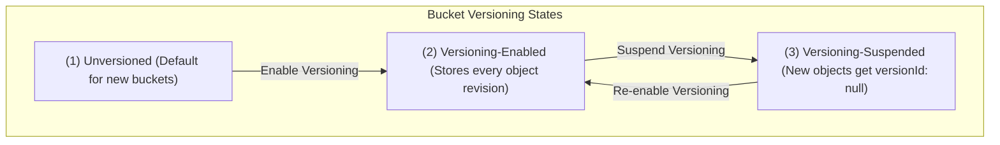
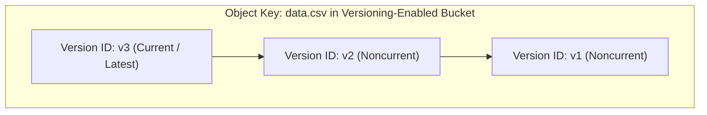
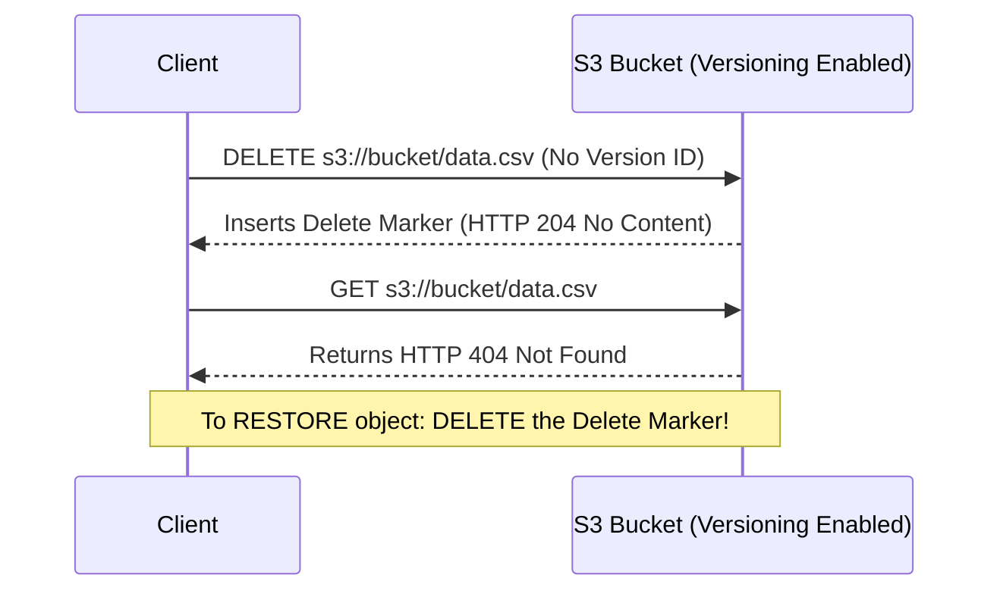
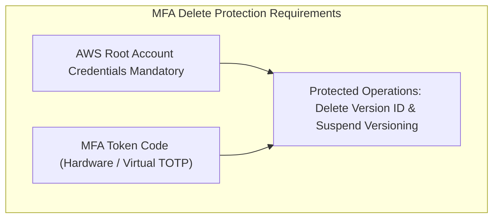

# 🔄 Amazon S3 Versioning & MFA Delete

- **Category**: Storage Protection & Data Governance
- **Language / ဘာသာစကား**: [English (Original)](/en/02-services/storage/s3/s3-versioning) | **မြန်မာဘာသာ (Burmese)**
- **Primary Use Case**: အမှတ်တမဲ့ ဖျက်မိခြင်းနှင့် အပေါ်မှထပ်ရေးမိခြင်းများမှ ကာကွယ်ခြင်း (Protection Against Accidental Overwrites & Deletions), ဘေးအန္တရာယ်မှ ပြန်လည်ကုစားခြင်း (Disaster Recovery), S3 Replication & Object Lock အတွက် ကြိုတင်လိုအပ်ချက်
- **Slide Reference**: Pages 77–138 in [[AWSCertifiedDataEngineerSlides.pdf]]
- **Hub Links**: [[mm/index]] | [[service-catalog]] | [[s3]] | [[s3-security]] | [[s3-encryption]]

---

## 1. High-Level Summary

**Amazon S3 Versioning** သည် S3 bucket တွင် သိမ်းဆည်းထားသော object တိုင်း၏ version တိုင်းကို ထိန်းသိမ်းခြင်း၊ ပြန်လည်ရယူခြင်းနှင့် restore လုပ်ခြင်းများ လုပ်ဆောင်ပေးသည့် bucket-level အင်္ဂါရပ်တစ်ခု ဖြစ်သည်။ **AWS Certified Data Engineer – Associate (DEA-C01)** စာမေးပွဲတွင် S3 Versioning ကို အဓိက data protection နည်းလမ်းတစ်ခုအဖြစ် လည်းကောင်း၊ **S3 Cross-Region Replication (CRR)** နှင့် **S3 Object Lock (WORM)** တို့အတွက် မရှိမဖြစ်လိုအပ်သော ကြိုတင်လိုအပ်ချက်တစ်ခုအဖြစ် လည်းကောင်း၊ **Lifecycle noncurrent version rules** များမှတစ်ဆင့် storage ကုန်ကျစရိတ်ကို လျှော့ချရာတွင် အရေးပါသော အကြောင်းရင်းတစ်ခုအဖြစ် လည်းကောင်း စစ်ဆေးလေ့ရှိသည်။

---

## 2. Bucket Versioning States & Workflow



> [!IMPORTANT]
> **Versioning State Rule**:  
> Bucket တစ်ခုကို **Versioning-Enabled** အဖြစ် ဖွင့်လိုက်ပြီးပါက ၎င်းသည် **Unversioned** အခြေအနေသို့ **ဘယ်တော့မှ** ပြန်လည်ရောက်ရှိနိုင်မည် မဟုတ်ပါ။ ၎င်းကို **Versioning-Suspended** အခြေအနေသို့သာ ပြောင်းလဲနိုင်ပါသည်။

---

## 3. How S3 Versioning Works

### 1. Object Overwrites (PUT Requests)

လက်ရှိ key တစ်ခုရှိနေသော object တစ်ခုကို versioning-enabled bucket သို့ upload လုပ်သောအခါ -

- S3 သည် object အသစ်အတွက် သီးသန့်ဖြစ်သော **Version ID** string တစ်ခု (ဥပမာ- `3/L4bqtJlcpXVkfdA9jspM2kR378Pt2a`) ကို သတ်မှတ်ပေးသည်။
- Object အသစ်သည် **Current Version** (`latest`) ဖြစ်လာသည်။
- ယခင် object များကို **Noncurrent Versions** များအဖြစ် ဆက်လက်ထိန်းသိမ်းထားသည်။



### 2. Object Deletions & Delete Markers (DELETE Requests)

Object တစ်ခုအတွက် ရိုးရှင်းသော `DELETE` request တစ်ခု ပေးပို့သောအခါ (Version ID မသတ်မှတ်ဘဲ) -

- S3 သည် မည်သည့် object data ကိုမျှ အပြီးအပိုင် **မဖျက်ပါ**။
- ၎င်းအစား S3 သည် **Current Version** အသစ်အဖြစ် **Delete Marker** (0-byte placeholder တစ်ခု) ကို ထည့်သွင်းပေးသည်။
- ထို့နောက် အဆိုပါ object အတွက် `GET` request များ ပေးပို့ပါက **HTTP 404 Not Found** ကို ပြန်လည်ပေးပို့မည် ဖြစ်သည်။



### 3. Restoring & Permanently Deleting Objects

- **Restoring a Deleted Object**: ဖျက်လိုက်သော object ကို ပြန်ယူရန် **Delete Marker ၏ Version ID** ကို သတ်မှတ်ပြီး `DELETE` request ပေးပို့ရုံသာ ဖြစ်သည်။ S3 သည် Delete Marker ကို ဖယ်ရှားလိုက်ပြီး ယခင် noncurrent version သည် current version အဖြစ် အလိုအလျောက် ပြန်လည်ရောက်ရှိလာမည် ဖြစ်သည်။
- **Permanent Deletion**: Object တစ်ခုကို အပြီးအပိုင် ဖျက်ရန် `DELETE` request တွင် ပစ်မှတ်ထားသည့် `versionId` ကို မဖြစ်မနေ ထည့်သွင်းပေးရမည် (ဥပမာ- `DELETE /data.csv?versionId=v1`)။

---

## 4. MFA Delete (Multi-Factor Authentication Delete)

ပေါက်ကြားသွားသော IAM credentials များ သို့မဟုတ် အတွင်းလူအန္တရာယ်များမှ အပိုဆောင်းလုံခြုံရေး လိုအပ်သော အရေးကြီး data lake များအတွက် AWS သည် **MFA Delete** ကို ထောက်ပံ့ပေးထားသည်။



- **Protected Operations**: အောက်ပါတို့ကို လုပ်ဆောင်ရန် MFA token code လိုအပ်သည် -
  1. Object version တစ်ခု (`versionId`) ကို အပြီးအပိုင်ဖျက်ရန်။
  2. Bucket ပေါ်ရှိ versioning ကို ဆိုင်းငံ့ရန် (Suspend လုပ်ရန်)။
- **Enablement Rule**: MFA Delete ကို AWS Management Console သို့မဟုတ် IAM users များမှတစ်ဆင့် ဖွင့်၍ **မရနိုင်ပါ**။ ၎င်းကို **AWS Account Root User** မှ AWS CLI သို့မဟုတ် API ကို အသုံးပြု၍သာ မဖြစ်မနေ ဖွင့်ရမည် ဖြစ်သည် -

```bash
aws s3api put-bucket-versioning \
  --bucket my-secure-data-lake \
  --versioning-configuration Status=Enabled,MFADelete=Enabled \
  --mfa "arn:aws:iam::123456789012:mfa/root-account-mfa-token 123456"
```

---

## 5. S3 Versioning & Lifecycle Rules (Cost Management)

Object ၏ version တိုင်းကို ဖိုင်အပြည့်အဖြစ် သိမ်းဆည်းထားသောကြောင့် versioning ကို စနစ်တကျ မစီမံပါက S3 storage ကုန်ကျစရိတ်များကို အဆမတန် ကြီးထွားလာစေနိုင်သည်။

### Lifecycle Noncurrent Version Transitions & Expiration

S3 Lifecycle rule များသည် **Noncurrent Versions** များကို ပစ်မှတ်ထား၍ အောက်ပါအတိုင်း လုပ်ဆောင်နိုင်သည် -

```json
{
  "Rules": [
    {
      "ID": "ManageNoncurrentVersions",
      "Status": "Enabled",
      "NoncurrentVersionTransitions": [
        {
          "NoncurrentDays": 30,
          "StorageClass": "STANDARD_IA"
        },
        {
          "NoncurrentDays": 90,
          "StorageClass": "GLACIER"
        }
      ],
      "NoncurrentVersionExpiration": {
        "NoncurrentDays": 365
      }
    }
  ]
}
```

### Expired Object Delete Markers Cleanup

Object တစ်ခု၏ noncurrent version များအားလုံး သက်တမ်းကုန်ဆုံးပြီး ဖျက်လိုက်သောအခါ၊ အထီးကျန် **Delete Marker** တစ်ခု ကျန်ရှိနေမည်ဖြစ်သည်။ Bucket ၏ query စွမ်းဆောင်ရည်ကို တိုးတက်စေရန် အဆိုပါ အထီးကျန် delete marker များကို အလိုအလျောက် ရှင်းလင်းပေးမည့် `ExpiredObjectDeleteMarkers: true` ဖြင့် Lifecycle rule တစ်ခုကို ပြင်ဆင်သတ်မှတ်နိုင်သည်။

---

## 6. S3 Versioning Prerequisite Matrix

S3 Versioning သည် အဓိက S3 အင်္ဂါရပ်အချို့အတွက် မရှိမဖြစ်လိုအပ်သော နည်းပညာပိုင်းဆိုင်ရာ ကြိုတင်လိုအပ်ချက်တစ်ခု ဖြစ်သည် -

| AWS S3 Feature                     | Requires Versioning Enabled? | Key Technical Reason                                                           |
| ---------------------------------- | ---------------------------- | ------------------------------------------------------------------------------ |
| **Cross-Region Replication (CRR)** | **Yes (Mandatory)**          | ဒေသအသီးသီးရှိ asynchronous ပြောင်းလဲမှုများကို ခြေရာခံရန်နှင့် replicate လုပ်ရန် version IDs များ လိုအပ်သည်။ |
| **Same-Region Replication (SRR)**  | **Yes (Mandatory)**          | ဒေသတစ်ခုတည်းအတွင်းရှိ object အခြေအနေပြောင်းလဲမှုများကို replicate လုပ်ရန် လိုအပ်သည်။ |
| **S3 Object Lock (WORM)**          | **Yes (Mandatory)**          | သီးခြား object version ID အလိုက် retention lock များကို အသက်ဝင်စေရန် လိုအပ်သည်။ |
| **MFA Delete**                     | **Yes (Mandatory)**          | Version ID တစ်ခုချင်းစီကို အပြီးအပိုင်ဖျက်ခြင်းမှ ကာကွယ်ရန် လိုအပ်သည်။ |

---

## 7. DEA-C01 Exam Tips & Decision Triggers

> [!IMPORTANT]
> **Key Exam Decision Rules**:
>
> - **Protect data lake objects against accidental deletion or overwritten data**: **S3 Versioning** ကို ဖွင့်ပါ။
> - **Re-activate a deleted file in a version-enabled bucket**: **Delete Marker** ကို ဖျက်ပါ။
> - **Require extra authentication (MFA) to permanently delete object versions**: **MFA Delete** ကို ဖွင့်ပါ (CLI မှတစ်ဆင့် **Root Account** ကို အသုံးပြုရမည်)။
> - **Prerequisite for S3 Replication (CRR/SRR) or S3 Object Lock**: Source နှင့် destination bucket များတွင် **S3 Versioning** ကို ဖွင့်ပါ။
> - **Reduce storage costs in a versioned bucket**: **Noncurrent Versions** များကို ပစ်မှတ်ထားသည့် **S3 Lifecycle rules** ကို ပြင်ဆင်ပါ (Standard-IA/Glacier သို့ transition လုပ်ပြီးနောက် $X$ ရက်အကြာတွင် expire လုပ်ပါ)။
> - **Remove orphan delete markers**: S3 Lifecycle rules တွင် `ExpiredObjectDeleteMarkers` ရှင်းလင်းခြင်းကို ဖွင့်ပါ။

---

## 📌 Related Notes

- [[s3]] — Main Amazon S3 Overview & Storage Classes
- [[s3-security]] — S3 Security, Object Lock Compliance & Access Management
- [[s3-encryption]] — S3 Encryption (SSE-S3, SSE-KMS, DSSE-KMS, SSE-C)
- [[s3-performance]] — Request Performance & S3 Bucket Keys
- [[cost-management]] — Cost Optimization & Lifecycle Tiering
