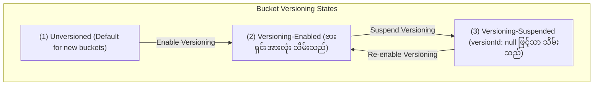
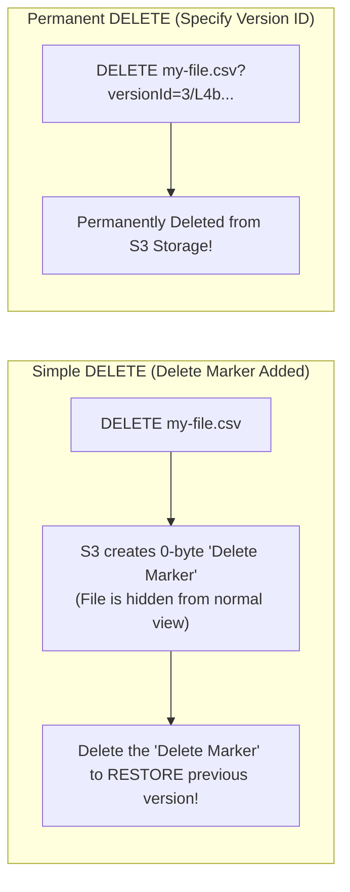

# 🔄 Amazon S3 Versioning & MFA Delete (S3 ဗားရှင်းထိန်းသိမ်းမှုနှင့် MFA Delete)

- **Category**: Storage Protection & Data Governance
- **Language / ဘာသာစကား**: [English Version](file:///home/monetine/Workspace/Wathon/aws-dea-c01/content/en/02-services/storage/s3/s3-versioning.md) | **မြန်မာဘာသာ (Burmese)**
- **အဓိက အသုံးပြုမှု**: မတော်တဆ ဖျက်မိခြင်း/ထပ်ရေးမိခြင်းမှ ကာကွယ်ခြင်း၊ S3 Replication နှင့် Object Lock တို့အတွက် မဖြစ်မနေ လိုအပ်ချက်၊ Delete Markers များဖြင့် လုံခြုံစွာ စီမံခြင်း၊ Root Account MFA ဖြင့်သာ အပြီးတိုင် ဖျက်ခွင့်ပြုခြင်း (MFA Delete)။
- **Slide Reference**: Pages 77–138 in `[[AWSCertifiedDataEngineerSlides.pdf]]`
- **Hub Links**: `[[mm/index]]` | `[[en/index]]` | `[[s3]]` | `[[s3-security]]` | `[[s3-encryption]]`

---

## ၁။ အကျဉ်းချုပ် (High-Level Summary)

**Amazon S3 Versioning** သည် S3 Bucket အတွင်းရှိ အရာဝတ္ထုများ၏ မူကွဲဗားရှင်းအားလုံးကို ထိန်းသိမ်းပေးသည့် စနစ်ဖြစ်သည်။ မတော်တဆ Overwrite သို့မဟုတ် Delete လုပ်မိသည့်တိုင် အရာဝတ္ထုများကို မူလဗားရှင်းအတိုင်း ပြန်လည် Restore လုပ်နိုင်သည်။

> [!IMPORTANT]
> **သတိပြုရန် အချက်**: S3 Bucket တစ်ခုတွင် Versioning ကို တစ်ကြိမ် Enable လုပ်ပြီးပါက **Unversioned အခြေအနေသို့ လုံးဝ ပြန်ပြောင်း၍ မရတော့ပါ** (Versioning-Suspended အဖြစ်သာ ထားရှိနိုင်သည်)။

---

## ၂။ Delete Markers နှင့် အပြီးတိုင် ဖျက်ခြင်း (Delete Mechanics)

1. **Delete Marker (Soft Delete)**: Version ID မပါဘဲ ရိုးရိုး `DELETE` command ခေါ်ယူပါက S3 သည် ဒေတာကို မဖျက်ဘဲ **Delete Marker** တစ်ခုကိုသာ ထိပ်ဆုံးတွင် တပ်ဆင်ပေးသည်။ Delete Marker ကို ပြန်ဖျက်လိုက်ပါက မူရင်းဖိုင် ပြန်လည် ပေါ်လာသည်။
2. **Permanent Delete (Hard Delete)**: တိကျသော `versionId` ကို သတ်မှတ်၍ ဖျက်ပါက ဒေတာသည် အပြီးတိုင် ပျက်စီးသွားသည်။
3. **MFA Delete (Exam Critical)**: အရာဝတ္ထု ဗားရှင်းများကို အပြီးတိုင် ဖျက်ခြင်း သို့မဟုတ် Versioning State ပြောင်းလဲခြင်းတို့ကို **AWS Account Root User ၏ MFA Code (Hardware/Virtual)** ထည့်သွင်းမှသာ ခွင့်ပြုသည့် အဆင့်မြင့် လုံခြုံရေး စနစ် ဖြစ်သည်။

---

## ၃။ DEA-C01 စာမေးပွဲ အဓိက အချက်အလက်များ (Exam Tips)

> [!IMPORTANT]
> **Key Exam Trigger Keywords**:
> - **"Recover from accidental deletion or overwrite of objects in S3 data lake"** $\rightarrow$ **Enable S3 Versioning**.
> - **"Strict security control preventing permanent deletion of S3 versions without multi-factor authentication"** $\rightarrow$ **Enable S3 MFA Delete (configured via AWS CLI / Root account only)**.
> - **"Prerequisite for enabling S3 Cross-Region Replication (CRR) or S3 Object Lock"** $\rightarrow$ **S3 Versioning MUST be enabled on the bucket**.

---

## 📌 ဆက်စပ် မှတ်စုများ (Related Notes)

- `[[s3]]` — Amazon S3 Overview
- `[[s3-replication]]` — S3 Replication Prerequisites
- `[[s3-lifecycle-rules]]` — Cleaning up noncurrent versions
