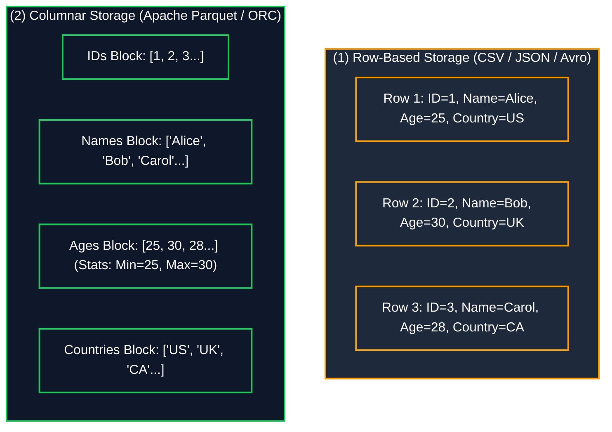
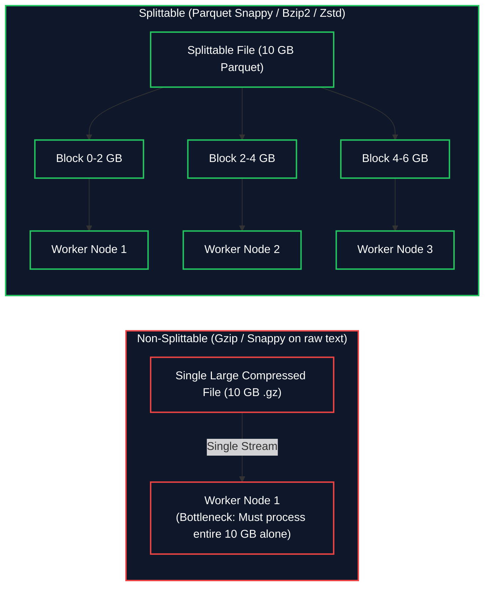

# 📄 Data Formats & Compression Codecs (ဒေတာဖော်မတ်များနှင့် ဖိသိပ်မှုစနစ်များ)

- **Category**: Fundamentals / Storage & Query Optimization
- **Language / ဘာသာစကား**: [English Version](/en/03-concepts/data-formats-and-compression) | **မြန်မာဘာသာ (Burmese)**
- **Slide Reference**: Pages 38–48 in `[[AWSCertifiedDataEngineerSlides.pdf]]`
- **Hub Links**: `[[index]]` | `[[service-catalog]]` | `[[athena]]` | `[[glue]]` | `[[redshift]]` | `[[emr]]` | `[[s3]]`

---

## ၁။ Row-Based vs. Columnar Storage Formats (အတန်းလိုက် vs ကော်လံလိုက် သိမ်းဆည်းမှု ပုံစံများ)

Big Data Analytics တွင် သိုလှောင်မှု ကုန်ကျစရိတ်၊ I/O Bandwidth နှင့် Query တွက်ချက်မှု အမြန်နှုန်းတို့သည် ဒေတာဖော်မတ် ရွေးချယ်မှုအပေါ် များစွာ မူတည်ပါသည်-

### အဓိက ကွာခြားချက်များနှင့် သဘောတရားများ:
1. **Row-Based Storage (အတန်းလိုက် သိမ်းဆည်းခြင်း - CSV, JSON, Avro)**:
   - ဒေတာ Record တစ်ခုလုံးကို Memory / Disk ပေါ်တွင် ဆက်တိုက်သိမ်းဆည်းသည်။
   - **အားသာချက်**: Record အသစ်များ အဆက်မပြတ် ထည့်သွင်းခြင်း (High-write transaction / Append-heavy OLTP) အတွက် မြန်ဆန်သည်။
   - **အားနည်းချက်**: ကော်လံ ၁ ခုတည်းကို ခွဲခြမ်းစိတ်ဖြာ တွက်ချက်ရန် (ဥပမာ `SELECT AVG(Age)`) ဒေတာဖိုင်တစ်ခုလုံးရှိ ကော်လံအားလုံးကို ဖတ်ရှုရသဖြင့် I/O ကုန်ကျစရိတ် မြင့်မားသည်။
2. **Columnar Storage (ကော်လံလိုက် သိမ်းဆည်းခြင်း - Apache Parquet, Apache ORC)**:
   - တူညီသော Column မှ Data များကို Disk ပေါ်တွင် အတူတကွ စုစည်းသိမ်းဆည်းသည်။
   - **အားသာချက်များ**:
     - **Column Projection**: မေးမြန်းထားသော ကော်လံများကိုသာ ရွေးချယ်ဖတ်ရှုနိုင်သည် (Selective reading)။
     - **Superior Compression**: တူညီသော ဒေတာအမျိုးအစား (Data types) များ စုစည်းနေသဖြင့် Compression ပိုမိုကောင်းမွန်ပြီး သိုလှောင်မှု ၇၅% မှ ၉၀% အထိ သက်သာစေသည်။
     - **Predicate Pushdown & Statistics**: Data Block တစ်ခုချင်းစီတွင် Min/Max တန်ဖိုးများ ပါရှိသဖြင့် `WHERE` clause နှင့် မသက်ဆိုင်သော Block များကို ကျော်ဖတ်နိုင်သည်။

---

## ၂။ Data Formats နှိုင်းယှဉ်ချက် ဇယား (Complete Format Matrix)

| Data Format | Storage Layout | Schema Type | Splittable? (ခွဲခြမ်းနိုင်မှု) | အဓိက အသုံးပြုသည့်နေရာ (Best AWS Fit) |
| :--- | :--- | :--- | :--- | :--- |
| **CSV / TSV** | Row-based (Plain Text) | Schema-on-Read | ✅ Yes (Uncompressed ဖြစ်ပါက) | Raw Data Landing၊ လူကိုယ်တိုင် စစ်ဆေးရန်ဖိုင်များ |
| **JSON** | Row-based (Plain Text) | Semi-Structured | ⚠️ Multiline (No) / JSON Lines (Yes) | API Payload များ၊ Web Logs၊ Event Streaming |
| **Apache Avro** | Row-based (Binary) | Schema In-File Header | ✅ **Yes** | **Amazon MSK (Kafka)** Streaming၊ Schema Evolution၊ High-write Row Ops |
| **Apache Parquet** | **Columnar** (Binary) | Self-describing schema | ✅ **Yes** | **Amazon Athena, AWS Glue, EMR Spark, Redshift Spectrum (Default Analytical Choice)** |
| **Apache ORC** | **Columnar** (Binary) | Self-describing schema | ✅ **Yes** | Apache Hive၊ Presto on Amazon EMR၊ အဆင့်မြင့် Indexing |

---

## ၃။ Compression Codecs & Splittability Mechanics (ဖိသိပ်မှုနှင့် ခွဲခြမ်းနိုင်မှု သဘောတရား)

Distributed Computing (Hadoop, Spark, Athena) တွင် ဖိုင်ကြီးများကို Worker Node များစွာပေါ်သို့ ခွဲခြမ်းကာ **Parallel Computing** ဖြင့် တွက်ချက်ရသဖြင့် Compression Codec ၏ **Splittability** သည် အလွန်အရေးကြီးပါသည်-

### Compression Codecs နှိုင်းယှဉ်ချက် ဇယား:

| Compression Codec | Splittable? | Compression Ratio | CPU Processing Speed | အကြံပြုထားသော AWS အသုံးချမှု |
| :--- | :--- | :--- | :--- | :--- |
| **Snappy** | ❌ No *(Parquet အတွင်း Row Group အလိုက် Split ရပါသည်)* | အသင့်အတင့် (Moderate) | ⚡ **Ultra Fast (အလွန်မြန်)** | **Parquet / Glue / Athena / Spark အတွက် Default ရွေးချယ်မှု** |
| **Gzip** | ❌ **No (လုံးဝ Splittable မဟုတ်ပါ)** | မြင့်မားသည် (High) | အသင့်အတင့် (Moderate) | Single-file Log Archiving၊ HTTP Payload များ |
| **Zstandard (Zstd)** | ✅ **Yes (Splittable)** | အလွန်မြင့်မားသည် (High) | 🚀 Fast (အလွန်မြန်) | ခေတ်မီ Parquet ဖိုင်များနှင့် S3 Cold Storage |
| **Bzip2** | ✅ **Yes (Splittable)** | အမြင့်ဆုံး (Maximum) | 🐢 Slow (နှေးကွေးသည်) | Raw Text ဖိုင်ကြီးများကို Split လုပ်ရန် မဖြစ်မနေ လိုအပ်သည့်နေရာများ |

---

## ၄။ DEA-C01 စာမေးပွဲ အဓိက မေးခွန်းပုံစံများနှင့် ထောင်ချောက်များ (Exam Tips & Traps)

> [!IMPORTANT]
> **စာမေးပွဲတွင် မဖြစ်မနေ မှတ်သားရမည့် အချက်များ (Top Exam Triggers)**:
> - **"Convert S3 data to optimize Athena query performance and reduce S3 scan costs"** $\rightarrow$ **Apache Parquet + Snappy compression**.
> - **"Streaming ingestion format for Kafka / Amazon MSK with evolving schema"** $\rightarrow$ **Apache Avro**.
> - **"Parallel processing of large compressed text datasets"** $\rightarrow$ **Bzip2** (သို့မဟုတ် Parquet with Snappy/Zstd သို့ ပြောင်းလဲခြင်း)။

> [!WARNING]
> **Exam Traps (သတိထားရမည့် ထောင်ချောက်များ)**:
> - **The Gzip Splittability Trap**: Raw CSV/JSON ဖိုင်ကြီးများကို **Gzip** ဖြင့် Compress လုပ်ထားပါက Spark နှင့် Athena တို့သည် ဖိုင်ကို Worker Node များစွာသို့ ခွဲခြမ်းမဖတ်နိုင်ဘဲ Core ၁ ခုတည်းကသာ Sequential ဖတ်ရသဖြင့် အလွန်နှေးကွေးစေသည်။
> - **Snappy on Raw Text Trap**: Snappy ကို Raw Text ပေါ်တွင် အသုံးပြုပါက Splittable မဖြစ်ပါ။ Parquet/ORC Block Container အတွင်း ထည့်သွင်းမှသာ Splittable ဖြစ်သည်။

---

## 📌 ဆက်စပ် မှတ်စုများ (Related Notes)

- `[[big-data-fundamentals]]` — Big Data 5 V's နှင့် Data Lake Architecture
- `[[data-modeling-and-partitioning]]` — S3 Partition Prefix များနှင့် Data Modeling
- `[[athena]]` — Amazon Athena ဖြင့် Parquet ဒေတာများကို Query ပြုလုပ်ခြင်း
- `[[glue]]` — AWS Glue ETL ဖြင့် ဖော်မတ်ပြောင်းလဲခြင်း (CSV $\rightarrow$ Parquet)
- `[[msk-kafka]]` — Amazon MSK Avro Serialization နှင့် Schema Registry
