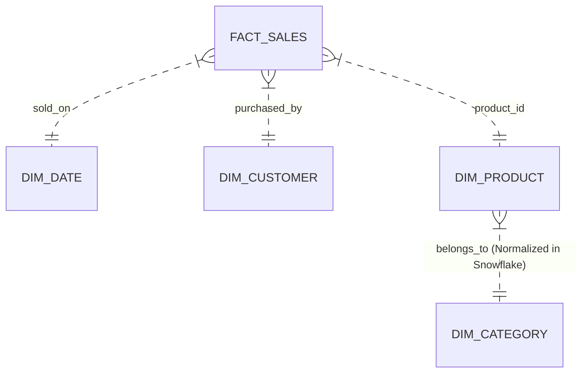
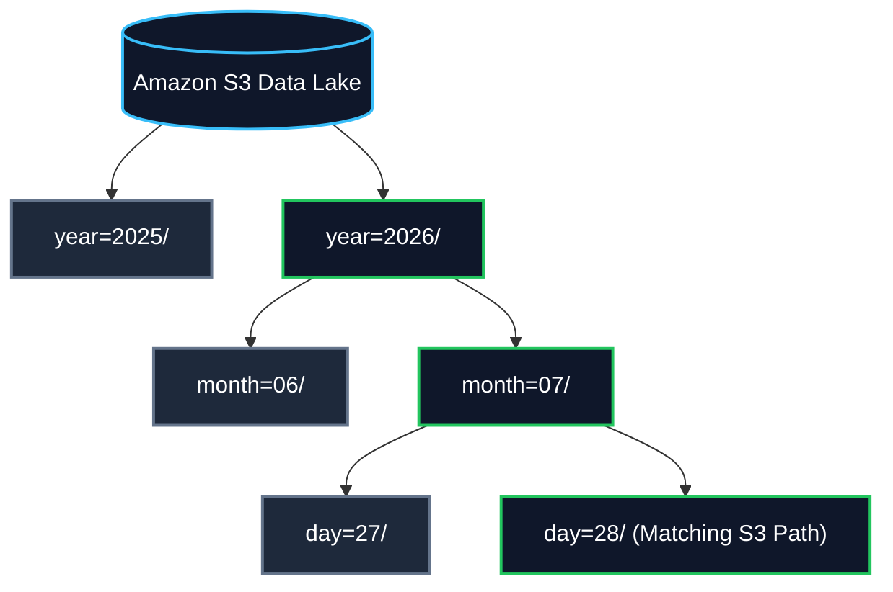
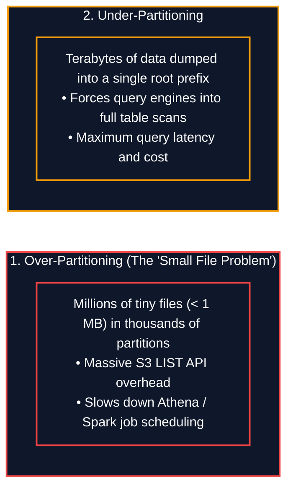

# 📐 Data Modeling & Partitioning Strategies (ဒေတာပုံစံတည်ဆောက်ခြင်းနှင့် အပိုင်းခွဲခြင်း)

- **Category**: Fundamentals / Data Architecture & Storage Optimization
- **Language / ဘာသာစကား**: [English Version](file:///home/monetine/Workspace/Wathon/aws-dea-c01/content/03-concepts/data-modeling-and-partitioning.md) | **မြန်မာဘာသာ (Burmese)**
- **Slide Reference**: Pages 49–75 in `[[AWSCertifiedDataEngineerSlides.pdf]]`
- **Hub Links**: `[[index]]` | `[[service-catalog]]` | `[[athena]]` | `[[redshift]]` | `[[glue]]` | `[[s3]]`

---

## ၁။ Dimensional Modeling (Star Schema vs. Snowflake Schema)

ခွဲခြမ်းစိတ်ဖြာ ဒေတာစနစ်များ (Data Warehouses & Analytical Lakes) တွင် ဒေတာများကို ပုံစံချရန်အတွက် အောက်ပါ Schema ၂ မျိုးကို အဓိက အသုံးပြုပါသည်-



### ၁. Star Schema (ကြယ်ပွင့်ပုံစံ - Denormalized)
- ဗဟိုတွင် တိုင်းတာရရှိသော ဂဏန်းတန်ဖိုးများ (Metrics/Measures) ပါရှိသည့် **Fact Table** (ဥပမာ `FACT_SALES`: revenue, quantity sold) တည်ရှိပြီး ပတ်လည်တွင် ရှင်းလင်းချက်များ ပါရှိသည့် **Dimension Tables** (`DIM_DATE`, `DIM_CUSTOMER`, `DIM_PRODUCT`) တိုက်ရိုက် ချိတ်ဆက်ထားသည်။
- **အားသာချက်**: Join လုပ်ရသည့် အဆင့် နည်းပါးသဖြင့် **Amazon Redshift** နှင့် OLAP စနစ်များတွင် **Query Performance အလွန်မြန်ဆန်**သည်။
- **အသုံးပြုမှု**: Cloud Data Warehousing တွင် အကြံပြုထားသော အဓိက စံပုံစံဖြစ်သည်။

### ၂. Snowflake Schema (နှင်းပွင့်ပုံစံ - Normalized)
- Dimension Table များကို ထပ်မံ၍ Third Normal Form (3NF) အထိ ခွဲထုတ်ထားသော ပုံစံဖြစ်သည် (ဥပမာ `DIM_PRODUCT` မှတစ်ဆင့် `DIM_CATEGORY` နှင့် `DIM_SUPPLIER` သို့ ထပ်ဆင့် Join ရခြင်း)။
- **အားသာချက်**: Data Redundancy (ဒေတာ ထပ်နေမှု) ကို လျှော့ချပေးပြီး သိုလှောင်မှု သက်သာစေသည်။
- **အားနည်းချက်**: Multi-table Joins များပြားသဖြင့် Query တွက်ချက်မှု ကြန့်ကြာနိုင်သည်။

---

## ၂။ Partitioning Strategies & Hive-Style S3 Prefix Structures

Partitioning ဆိုသည်မှာ ကြီးမားသော Dataset ကြီးတစ်ခုလုံးကို ကော်လံတန်ဖိုးများ (ဥပမာ ရက်စွဲ `year/month/day`၊ ဒေသ `region` သို့မဟုတ် ဌာန `department`) အပေါ် အခြေခံ၍ သီးခြား Folder / S3 Prefix များအဖြစ် ခွဲခြားသိမ်းဆည်းခြင်း ဖြစ်သည်။

### Hive-Style S3 Partition Prefix ပုံစံ
AWS Glue Crawlers နှင့် Amazon Athena တို့ Auto-detect ပြုလုပ်နိုင်သော စံသတ်မှတ်ချက်မှာ-
```text
s3://my-analytics-lake/sales/year=2026/month=07/day=28/data_part001.snappy.parquet
```



---

## ၃။ Partition Pruning Mechanics & Query Optimization

Query Engine များဖြစ်သည့် **Amazon Athena**၊ **Amazon EMR (Spark)** နှင့် **Redshift Spectrum** တို့သည် အောက်ပါ SQL ကို Run သည့်အခါ-
```sql
SELECT customer_id, SUM(amount)
FROM sales_table
WHERE year = '2026' AND month = '07'
GROUP BY customer_id;
```

- **Partition Pruning နည်းလမ်း**: Query Engine သည် Glue Data Catalog ရှိ Metadata ကို စစ်ဆေးပြီး `year=2026/month=07/` အောက်ရှိ ဖိုင်များကိုသာ ရွေးချယ်ဖတ်ရှုကာ ကျန်ရှိသော Terabytes နှင့်ချီသည့် Data Folder များကို **လုံးဝ ကျော်သွား (Skip)** ပါသည်။
- **ရလဒ်**: S3 Scan Data ပမာဏကို ၉၅% အထိ လျှော့ချပေးပြီး **Athena ကုန်ကျစရိတ်ကို အလွန်သက်သာစေကာ စက္ကန့်ပိုင်းအတွင်း အဖြေထွက်စေသည်**။

---

## ၄။ Partitioning ပြုလုပ်ရာတွင် သတိထားရမည့် အမှားများ (Pitfalls)



### ၁. Over-Partitioning (The Small File Problem):
- တန်ဖိုး မတူညီမှု အလွန်များသော ကော်လံများ (ဥပမာ `user_id`၊ `timestamp_ms`) ဖြင့် Partition ခွဲခြင်း။
- အကျိုးဆက်- S3 Prefix သန်းပေါင်းများစွာအတွင်း ဖိုင်သေးသေးလေးများ (< 1 MB) သန်းချီဖြစ်ပေါ်လာပြီး Query Engine သည် Data ဖတ်ရသည်ထက် `ListBucket` API Call ခေါ်ယူရာတွင် အချိန်ပိုကုန်ပြီး Query စွမ်းဆောင်ရည် ကျဆင်းစေသည်။
- **အကြံပြုချက်**: Partition တစ်ခုစီအတွင်း ဖိုင်အရွယ်အစားကို **128 MB မှ 512 MB** ကြား ရှိစေရန် စီမံရမည်။

### ၂. Under-Partitioning (အပိုင်းမခွဲဘဲ ထားရှိခြင်း):
- Terabyte နှင့်ချီသော ဒေတာများကို Prefix ၁ ခုတည်းအောက်တွင် စုပြုံထားခြင်းကြောင့် Query Engine မှ Full Table Scan ဖတ်ရပြီး ကုန်ကျစရိတ် မြင့်မားစေသည်။

### ၃. Amazon Athena Partition Projection:
- Partition အရေအတွက် သောင်းနှင့်ချီ ရှိလာပါက Glue Data Catalog သို့ Metadata မေးမြန်းသည့် ကြန့်ကြာမှုကို ရှောင်ရှားရန် **Partition Projection** ဖြင့် S3 Prefix Pattern များကို ကြိုတင်သတ်မှတ်ထားနိုင်သည်။

---

## ၅။ DEA-C01 စာမေးပွဲ အဓိက အချက်အလက်များ (Exam Tips & Traps)

> [!IMPORTANT]
> **Key Exam Trigger Keywords**:
> - **"Improve Athena query performance and reduce S3 scan volume"** $\rightarrow$ **Partition data by Date / Region using Hive-style prefixes + Parquet format**။
> - **"Eliminate Glue Catalog partition throttling and speed up queries on highly partitioned tables"** $\rightarrow$ **Enable Amazon Athena Partition Projection**။
> - **"Dimensional modeling for Amazon Redshift OLAP data warehousing"** $\rightarrow$ **Star Schema** (denormalized tables for fewer joins)။

---

## 📌 ဆက်စပ် မှတ်စုများ (Related Notes)

- `[[big-data-fundamentals]]` — Big Data 5 V's နှင့် Data Lake Architecture
- `[[data-formats-and-compression]]` — Parquet file formatting inside S3 partitions
- `[[athena]]` — Amazon Athena Partition Projection ဖွဲ့စည်းပုံ
- `[[redshift]]` — Redshift Distribution Keys နှင့် Sort Keys
