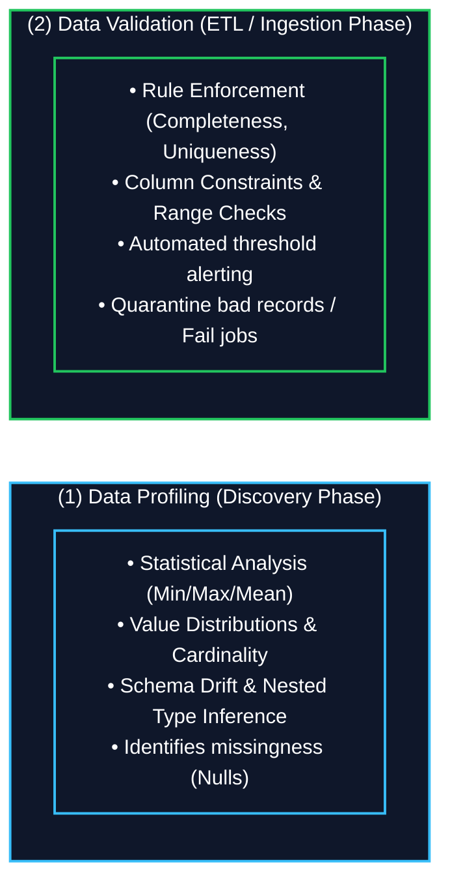
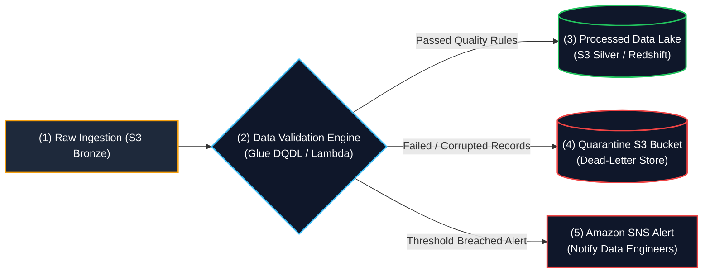

# 🔍 Data Validation and Profiling (ဒေတာအရည်အသွေး စစ်ဆေးခြင်းနှင့် ပုံစံလေ့လာဆန်းစစ်ခြင်း)

- **Category**: Data Quality & Governance (ဒေတာ အရည်အသွေး စီမံခန့်ခွဲမှု)
- **Language / ဘာသာစကား**: [English Version](/en/03-concepts/data-validation-and-profiling) | **မြန်မာဘာသာ (Burmese)**
- **Slide Reference**: Data Quality & Governance in `[AWSCertifiedDataEngineerSlides.pdf](/docs/AWSCertifiedDataEngineerSlides.pdf)`
- **Hub Links**: `[[index]]` | `[[service-catalog]]` | `[[glue]]` | `[[sagemaker-and-ai]]` | `[[lambda]]` | `[[s3]]`

---

## ၁။ အကျဉ်းချုပ် နှိုင်းယှဉ်ချက် (High-Level Summary: Profiling vs. Validation)

ခေတ်မီ Cloud Data Architecture များတွင် Data Quality ထိန်းသိမ်းရန်အတွက် **Data Profiling** နှင့် **Data Validation** ကို အဆင့်လိုက် အသုံးပြုပါသည်-

| သဘောတရား (Concept) | အဓိက ရည်ရွယ်ချက် (Primary Purpose) | မည်သည့်အဆင့်တွင် ပြုလုပ်သနည်း | အဓိက အသုံးပြုသော AWS Services |
| :--- | :--- | :--- | :--- |
| **Data Profiling** | ဒေတာ၏ ဖွဲ့စည်းပုံ၊ ကိန်းဂဏန်းပျံ့နှံ့မှု (Distributions)၊ Data Types၊ Null/Missing Values နှင့် ပုံမမှန်မှုများကို **လေ့လာဆန်းစစ်ခြင်း**။ | **Data Discovery & Ingestion အဆင့်** | **AWS Glue DataBrew**, Amazon SageMaker Data Wrangler, AWS Glue Crawlers |
| **Data Validation** | စီးပွားရေးဆိုင်ရာ စည်းမျဉ်းများ (Business Rules)၊ ကန့်သတ်ချက်များ (Uniqueness, Range, Completeness, Regex) နှင့် ကိုက်ညီမှုရှိမရှိ **စစ်ဆေးအတည်ပြုခြင်း**။ | **ETL / Transformation အဆင့်** | **AWS Glue Data Quality (DQDL)**, PyDeequ (EMR/Spark), AWS Lambda |

---

## ၂။ Core Frameworks & စစ်ဆေးမှု စည်းမျဉ်းများ

### ၁. Data Profiling တွင် ပါဝင်သော အချက်များ:
- **Statistical Summaries**: အနည်းဆုံး (Min)၊ အများဆုံး (Max)၊ ပျမ်းမျှ (Mean/Median)၊ Standard Deviation နှင့် စုစုပေါင်း Row အရေအတွက် တွက်ချက်ခြင်း။
- **Structural Inspection**: Nested JSON များ၊ Data types ပြောင်းလဲမှု (Schema Drift) ကို စောင့်ကြည့်ခြင်း။
- **Quality Metrics**: Null တန်ဖိုး ရာခိုင်နှုန်း၊ တန်ဖိုးထပ်နေမှု (Duplicates) များနှင့် Outlier Anomalies များကို ဖော်ထုတ်ခြင်း။

### ၂. Data Validation Rules (AWS Glue DQDL ဥပမာများ):
- **Completeness (ပြည့်စုံမှု)**: `Completeness "customer_id" >= 0.98` (Null value ၂% ထက် မကျော်ရ)။
- **Uniqueness (သီးသန့်ဖြစ်မှု)**: `IsUnique "transaction_id"` (Primary key ထပ်မနေရ)။
- **Range Constraints (ကိန်းဂဏန်း အပိုင်းအခြား)**: `ColumnValues "age" between 18 and 120`။
- **Format Assertions**: ISO-8601 Timestamps ကိုက်ညီမှု၊ အီးမေးလ် Regex ပုံစံများကို စစ်ဆေးခြင်း။

---

## ၃။ AWS Data Quality Services (DEA-C01 Focus)

### ၁. AWS Glue Data Quality (DQDL)
- Serverless Glue ETL Pipeline များအတွင်း **Data Quality Definition Language (DQDL)** ဖြင့် Declarative Rules များ ရေးသားနိုင်ခြင်း။
- **အဓိက စွမ်းဆောင်ရည်များ**:
  - Dataset ၏ သမိုင်းကြောင်းကို လေ့လာပြီး Quality Rules များကို အလိုအလျောက် အကြံပြုပေးနိုင်ခြင်း။
  - သတ်မှတ်ချက် မပြည့်မီပါက **Glue ETL Job ကို အလိုအလျောက် ရပ်တန့် (Fail) စေနိုင်ခြင်း**။
  - **AWS Glue Data Catalog** နှင့် Amazon CloudWatch သို့ Quality Score များကို မှတ်တမ်းတင်ပေးခြင်း။

### ၂. AWS Glue DataBrew
- Code ရေးစရာမလိုသော **No-code Visual Data Profiling & Preparation Tool** ဖြစ်သည်။
- **အဓိက စွမ်းဆောင်ရည်များ**:
  - စာရင်းဇယား မက်ထရစ် ၈၀ ကျော်ပါဝင်သည့် **Data Quality Profiles** များကို Visual Charts များဖြင့် ဖော်ပြပေးသည်။
  - Data Analysts များနှင့် Data Engineers များ Code မရေးဘဲ မြန်ဆန်စွာ Data Distribution ကို စစ်ဆေးရန် အသုံးပြုသည်။

### ၃. PyDeequ / Deequ (Amazon EMR & Apache Spark)
- AWS မှ Apache Spark ပေါ်တွင် Big Data Unit Test ပြုလုပ်ရန် ဖန်တီးထားသော Open-Source Library ဖြစ်သည်။
- **အဓိက စွမ်းဆောင်ရည်များ**:
  - **Amazon EMR** ပေါ်ရှိ ကြီးမားသော PySpark ETL Pipeline များတွင် အသုံးပြုသည်။
  - Metric Repository များ ထိန်းသိမ်းခြင်း၊ Constraint Suggestions နှင့် Automated Anomaly Detection များကို လုပ်ဆောင်ပေးသည်။

---

## ၄။ ပျက်စီးနေသော ဒေတာများကို ကိုင်တွယ်သည့် ပုံစံများ (Quarantine Architecture)

| Architecture Pattern | အလုပ်လုပ်ပုံ (Mechanism) | အသုံးပြုသည့် အခြေအနေ (Use Case) |
| :--- | :--- | :--- |
| **Quarantine Bucket / DLQ** | စည်းမျဉ်းမကိုက်ညီသော Record များကို **S3 Quarantine Bucket** သို့မဟုတ် **Amazon SQS Dead-Letter Queue** သို့ ခွဲထုတ်ပို့ပြီး မှန်ကန်သော Record များကိုသာ ဆက်လက် Process လုပ်စေခြင်း။ | High-throughput Streaming (Kinesis/Kafka) သို့မဟုတ် Batch ETL စနစ်များ။ |
| **Fail-Fast (ချက်ချင်း ရပ်တန့်ခြင်း)** | Data Quality မပြည့်မီပါက Glue Job သို့မဟုတ် Step Function ကို ချက်ချင်း ရပ်တန့်စေခြင်း။ | ဘဏ္ဍာရေးစာရင်းများ (Financial Ledger)၊ တိကျမှု အရေးကြီးသော Compliance Pipelines။ |
| **Remediation & Masking** | Null တန်ဖိုးများကို Default တန်ဖိုးဖြင့် အစားထိုးခြင်း သို့မဟုတ် PII Data များကို Mask ပြုလုပ်ခြင်း။ | စာရင်းအင်း သုတေသန ပြုလုပ်မည့် Data Lake များ။ |

---

## ၅။ DEA-C01 စာမေးပွဲ အဓိက မေးခွန်းပုံစံများ (Exam Scenarios)

> [!IMPORTANT]
> **Key Exam Decision Matrix**:
> - **Scenario 1: "Visual, no-code data profiling reports with 80+ statistical metrics"** $\rightarrow$ **AWS Glue DataBrew** ကို ရွေးပါ။
> - **Scenario 2: "Declarative data quality rules inside serverless Glue ETL jobs with auto-fail threshold"** $\rightarrow$ **AWS Glue Data Quality (DQDL)** ကို ရွေးပါ။
> - **Scenario 3: "Unit testing and anomaly detection on distributed Amazon EMR PySpark jobs"** $\rightarrow$ **PyDeequ / Deequ** ကို ရွေးပါ။
> - **Scenario 4: "Alert engineering team when null value count exceeds threshold in S3 table"** $\rightarrow$ **AWS Glue Data Quality + Amazon CloudWatch Alarm + Amazon SNS notification**။

---

## 📌 ဆက်စပ် မှတ်စုများ (Related Notes)

- `[[glue]]` — AWS Glue Data Catalog, Crawlers, ETL နှင့် Glue Data Quality
- `[[sagemaker-and-ai]]` — SageMaker Data Wrangler profiling စနစ်များ
- `[[data-formats-and-compression]]` — File formats နှင့် Schema Validation
- `[[service-comparisons]]` — Glue Data Quality vs. Glue DataBrew နှိုင်းယှဉ်ချက်
