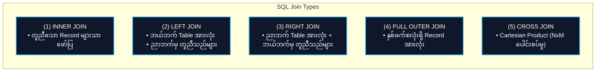

# 📊 SQL Review & Version Control (Git) (SQL နှင့် Version Control အခြေခံ)

- **Category**: Fundamentals (ခွဲခြမ်းစိတ်ဖြာ SQL နှင့် Pipeline Version Control)
- **Language / ဘာသာစကား**: [English Version](file:///home/monetine/Workspace/Wathon/aws-dea-c01/content/03-concepts/sql-and-version-control-review.md) | **မြန်မာဘာသာ (Burmese)**
- **Slide Reference**: Pages 51–75 in `[[AWSCertifiedDataEngineerSlides.pdf]]`
- **Hub Links**: `[[index]]` | `[[service-catalog]]` | `[[athena]]` | `[[redshift]]` | `[[cdk-cloudformation]]`

---

## ၁။ SQL Window Functions Review (ခွဲခြမ်းစိတ်ဖြာ SQL လုပ်ဆောင်ချက်များ)

Window Functions များသည် `GROUP BY` ကဲ့သို့ Row များကို ပေါင်းစည်းမပစ်ဘဲ သက်ဆိုင်ရာ Partition အလိုက် အဆင့်သတ်မှတ်ခြင်းနှင့် တွက်ချက်ခြင်းများကို လုပ်ဆောင်ပေးပါသည်-

```sql
SELECT 
    employee_id,
    department_id,
    salary,
    RANK() OVER (PARTITION BY department_id ORDER BY salary DESC) as salary_rank,
    DENSE_RANK() OVER (PARTITION BY department_id ORDER BY salary DESC) as dense_rank,
    AVG(salary) OVER (PARTITION BY department_id) as dept_avg_salary
FROM employees;
```

### အဓိက Window Functions များ နှိုင်းယှဉ်ချက် ဇယား:

| Function | တန်ဖိုးတူညီပါက အလုပ်လုပ်ပုံ (Behavior on Ties) | နမူနာ ထွက်ရှိချက် (Example Sequence) | Data Engineering အဓိက အသုံးပြုမှု |
| :--- | :--- | :--- | :--- |
| **`ROW_NUMBER()`** | Row တစ်ခုချင်းစီကို ၁ မှစ၍ ထူးခြားသော အစဉ်လိုက်နံပါတ် သတ်မှတ်သည်။ | `1, 2, 3, 4, 5` | **Deduplication** (ဥပမာ `ROW_NUMBER() = 1` ဖြင့် နောက်ဆုံး Record ရယူခြင်း) |
| **`RANK()`** | တန်ဖိုးတူပါက အဆင့်တူပေးပြီး နောက်နံပါတ်ကို ကျော်ခွသွားသည်။ | `1, 2, 2, 4, 5` | Top-N Ranking (နေရာလွတ် ချန်ထားသည့် စနစ်) |
| **`DENSE_RANK()`** | တန်ဖိုးတူပါက အဆင့်တူပေးသော်လည်း နောက်နံပါတ်ကို မကျော်ဘဲ ဆက်တိုက်ပေးသည်။ | `1, 2, 2, 3, 4` | Continuous Tier Ranking (ဥပမာ လစာအဆင့် သတ်မှတ်ခြင်း) |
| **`LAG(col, offset)`** | လက်ရှိ Row ၏ အထက်/ရှေ့ရှိ Row တန်ဖိုးကို ယူဆောင်သည်။ | `Previous row value` | Period-over-Period တိုးတက်မှု တွက်ချက်ခြင်း (MoM, YoY) |
| **`LEAD(col, offset)`**| လက်ရှိ Row ၏ အောက်/နောက်ရှိ Row တန်ဖိုးကို ယူဆောင်သည်။ | `Next row value` | Churn Analysis၊ Session ကြာချိန် တွက်ချက်ခြင်း |

---

## ၂။ SQL Join Types Matrix (ဇယားများ ပေါင်းစပ်ခြင်း)



| Join အမျိုးအစား | ရှင်းလင်းချက် (Description) | Distributed Big Data Performance သတိပြုရန် |
| :--- | :--- | :--- |
| **INNER JOIN** | Table နှစ်ခုစလုံးတွင် Key ကိုက်ညီသော Record များကိုသာ ထုတ်ပေးသည်။ | အမြန်ဆုံး Join အမျိုးအစားဖြစ်ပြီး Spark တွင် Broadcast Hash Join နှင့် တွဲသုံးနိုင်သည်။ |
| **LEFT OUTER JOIN** | ဘယ်ဘက် Table ရှိ Record အားလုံးနှင့် ညာဘက်မှ ကိုက်ညီသည်များကို ထုတ်ပေးသည် (မကိုက်ညီပါက NULL ဖြစ်သည်)။ | Star Schema တွင် Fact Table မှ Dimension Table သို့ Join ရာတွင် အသုံးများသည်။ |
| **FULL OUTER JOIN** | မည်သည့်ဘက်တွင်မဆို ကိုက်ညီမှုရှိသော Record အားလုံးကို ထုတ်ပေးသည်။ | Data reconciliation နှင့် mismatch စစ်ဆေးရာတွင် သုံးပြီး Data Shuffle များပြားသည်။ |
| **CROSS JOIN** | Table A ရှိ Row တိုင်းကို Table B ရှိ Row တိုင်းနှင့် ပေါင်းစပ်သည် ($N \times M$)။ | **Big Data တွင် အသုံးမပြုသင့်သော Anti-Pattern** (Spark/Redshift တွင် OOM ဖြစ်စေသည်)။ |

---

## ၃။ AWS Data Engineering တွင် Git Version Control အသုံးပြုမှု

ခေတ်မီ Data Engineering တွင် Continuous Integration & Continuous Deployment (CI/CD) နှင့် Disaster Recovery အတွက် Git ကို အသုံးပြုပါသည်-

```mermaid
graph LR
    Dev["Data Engineer"] -->|"git commit & push"| Repo["Git Repository (CodeCommit / GitHub)"]
    Repo -->|"Trigger Webhook"| Pipeline["AWS CodePipeline / GitHub Actions"]
    Pipeline --> Test["Automated PySpark & SQL Unit Tests"]
    Test --> Deploy["Deploy to AWS (Glue, Lambda, MWAA, Redshift)"]

    classDef dev fill:#1e293b,stroke:#f59e0b,stroke-width:2px,color:#fff;
    classDef git fill:#0f172a,stroke:#38bdf8,stroke-width:2px,color:#fff;
    classDef cicd fill:#0f172a,stroke:#22c55e,stroke-width:2px,color:#fff;

    class Dev dev;
    class Repo git;
    class Pipeline,Test,Deploy cicd;
```



### Git ဖြင့် ထိန်းသိမ်းရသော Data Assets များ:
- **Infrastructure as Code (IaC)**: AWS CloudFormation Templates၊ AWS SAM Templates၊ AWS CDK Stacks။
- **Pipeline Logic**: AWS Glue PySpark Scripts၊ AWS Lambda Handlers၊ Amazon MWAA (Airflow) DAGs။
- **Database Migrations & Schemas**: SQL DDL Schemas၊ Flyway / Liquibase Database Migration Scripts။

---

## ၄။ DEA-C01 စာမေးပွဲ အဓိက အချက်အလက်များ (Exam Tips & Traps)

> [!IMPORTANT]
> **Key Exam Trigger Keywords**:
> - **"Deduplicate records within a partition while retaining the latest record"** $\rightarrow$ **`ROW_NUMBER() OVER (PARTITION BY id ORDER BY timestamp DESC)`** ကို သုံးပြီး `row_num = 1` ဖြင့် Filter လုပ်ပါ။
> - **"Track month-over-month growth metrics in SQL"** $\rightarrow$ **`LAG()`** Window Function ကို ရွေးပါ။
> - **"Version control and automate serverless data pipeline deployments"** $\rightarrow$ **AWS CodePipeline + AWS SAM / CloudFormation**။

---

## 📌 ဆက်စပ် မှတ်စုများ (Related Notes)

- `[[athena]]` — Amazon Athena တွင် ANSI SQL Window Functions များ အသုံးပြုခြင်း
- `[[redshift]]` — Amazon Redshift SQL Optimization၊ Sort Keys နှင့် Distribution Keys
- `[[cdk-cloudformation]]` — AWS CloudFormation နှင့် CDK ဖြင့် Infrastructure Versioning ပြုလုပ်ခြင်း
