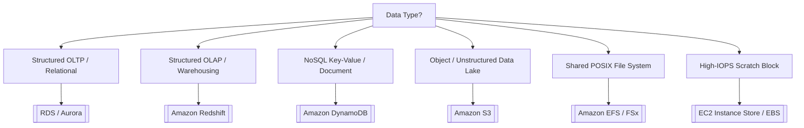
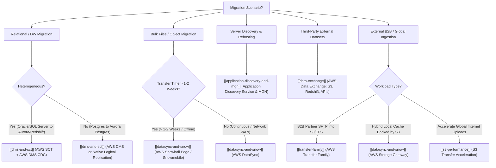
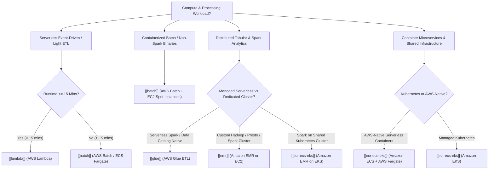

# ⚡ DEA-C01 Service Decision Matrix & Comparisons

- **Language / ဘာသာစကား**: [English (Original)](/en/04-exam-tips/service-comparisons) | **မြန်မာဘာသာ (Burmese)**

AWS Certified Data Engineer Associate (DEA-C01) စာမေးပွဲတွင် architectural choices (ဗိသုကာဆိုင်ရာ ရွေးချယ်မှုများ) ကို ဆုံးဖြတ်ရာတွင် အမြန်ကိုးကားနိုင်သော decision guide ဖြစ်သည်။

---

## 1. Storage & Database Choice Matrix

### Storage Decision Matrix: S3 vs EBS vs EFS vs Instance Store vs FSx for Lustre

| Storage Service | Protocol / Model | Scope / Durability | Persistence on STOP (ရပ်တန့်ချိန်တွင် ဒေတာတည်မြဲမှု) | Primary Data Engineering Role (အဓိက Data Engineering အခန်းကဏ္ဍ) |
| :--- | :--- | :--- | :--- | :--- |
| **Amazon S3** | Object (REST API) | Multi-AZ (11 9's) | ✅ Persistent | Central Data Lake, Bronze/Silver/Gold analytics tables |
| **Amazon EBS** | Block device (Network) | Single-AZ (99.9%+) | ✅ Persistent | Hosted relational databases, Kafka commit logs, OS boot |
| **EC2 Instance Store** | Block device (PCIe Bus) | Host Server (Single Disk) | ❌ **WIPED (ပျက်ပြယ်သွားမည်)** | **Spark shuffle partition cache, MapReduce spills, temp buffers** |
| **Amazon EFS** | POSIX File (NFSv4.1) | Multi-AZ (11 9's) | ✅ Persistent | **Multi-AZ shared directories, Lambda model storage, EKS/ECS PVs** |
| **AWS FSx for Lustre** | High-Perf Parallel File | Single-AZ (Linked S3) | ✅ Persistent in S3 | **Sub-ms HPC processing, distributed ML training, EMR staging** |

> 🔗 **Deep Dive Reference**: အသေးစိတ် lifecycle၊ throughput နှင့် architecture အချက်အလက်များအတွက် [[mm/02-services/storage/ebs-vs-efs-vs-instance-store|ebs-vs-efs-vs-instance-store]] ကို ကြည့်ရှုပါ။

---

## 2. Ingestion & Streaming Matrix

| Use Case (အသုံးပြုမည့် လုပ်ငန်းလိုအပ်ချက်) | AWS Service Choice (ရွေးချယ်ရမည့် AWS Service) | Key Keyword Trigger (စာမေးပွဲ အဓိက Keyword များ) |
| --- | --- | --- |
| **Real-time custom stream processing (Data Retention ရက် ၃၆၅ အထိ)** | [[mm/02-services/analytics-streaming/kinesis/kinesis|kinesis]] (Data Streams) | Multi-consumer, sub-second latency, custom processing code |
| **S3 / Redshift / OpenSearch သို့ Zero-code streaming delivery ပြုလုပ်ခြင်း** | [[mm/02-services/analytics-streaming/kinesis/kinesis|kinesis]] (Data Firehose) | Micro-batching, direct delivery, automatic Parquet transformation |
| **Open-source Kafka streaming ecosystem အသုံးပြုခြင်း** | [[mm/02-services/analytics-streaming/msk/msk|msk]] (Amazon MSK) | Apache Kafka compatibility, Kafka Connect |
| **SaaS (Salesforce, ServiceNow) များမှ data များ ingest ပြုလုပ်ခြင်း** | [[mm/02-services/integration/appflow/appflow|appflow]] (AWS AppFlow) | No-code SaaS connector, PrivateLink security |
| **Continuous replication ဖြင့် database များကို migrate ပြုလုပ်ခြင်း** | [[mm/02-services/migration/dms-and-sct|dms-and-sct]] (AWS DMS + CDC) | Heterogeneous database migration, minimal downtime |

---

## 3. Query Engine Matrix: Athena vs Redshift Spectrum vs EMR

| Feature (လုပ်ဆောင်ချက်) | Amazon Athena | Redshift Spectrum | Amazon EMR |
| --- | --- | --- | --- |
| **Infrastructure** | Fully Serverless | Redshift cluster node များပေါ်တွင် run သည် | Provisioned EC2 သို့မဟုတ် EMR Serverless |
| **Query Engine** | Trino / Presto | Redshift MPP Engine | Apache Spark / Hive / Presto |
| **Data Location** | Amazon S3 | S3 + Redshift Local Tables | S3 (EMRFS မှတစ်ဆင့်) သို့မဟုတ် HDFS |
| **Pricing** | Scan ပြုလုပ်သော 1 TB လျှင် $5 | Scan ပြုလုပ်သော 1 TB လျှင် $5 (+ Redshift cluster ကုန်ကျစရိတ်) | တစ်စက္ကန့်လျှင် ကျသင့်သော cluster node စျေးနှုန်း (Per-second cluster node pricing) |
| **Best For (အသင့်တော်ဆုံးနေရာ)** | S3 ပေါ်ရှိ Ad-hoc SQL queries များအတွက် | S3 data lake နှင့် Redshift DW tables များကို join ပြုလုပ်ရန်အတွက် | Heavy custom Spark processing နှင့် machine learning အတွက် |

---

## 4. Security & Governance Matrix

| Security Goal (လုံခြုံရေးဆိုင်ရာ ရည်မှန်းချက်) | Primary AWS Service (အဓိက AWS Service) |
| --- | --- |
| **S3 Data Lake ပေါ်တွင် Column & Row-Level Security သတ်မှတ်ခြင်း** | [[mm/02-services/security-governance/lake-formation|lake-formation]] (AWS Lake Formation) |
| **S3 အတွင်း PII (SSNs, Credit Cards) များကို Automated Scanning ပြုလုပ်ခြင်း** | [[mm/02-services/security-governance/macie-and-cloudtrail|macie-and-cloudtrail]] (Amazon Macie) |
| **Database Credential များ အလိုအလျောက် Rotate ပြုလုပ်ခြင်း** | [[mm/02-services/security-governance/kms-and-secrets|kms-and-secrets]] (AWS Secrets Manager) |
| **Internet Gateway မလိုဘဲ Private S3 access ပြုလုပ်ခြင်း** | [[mm/02-services/networking-monitoring/vpc-and-networking|vpc-and-networking]] (S3 Gateway VPC Endpoint) |
| **Centralized Cross-Service Backup & WORM Immutability ရရှိစေခြင်း** | [[mm/02-services/security-governance/aws-backup|aws-backup]] (AWS Backup & Vault Lock) |

---

## 5. Migration & Data Transfer Decision Matrix

| Migration & Transfer Requirement (လိုအပ်ချက်) | Recommended Service (အကြံပြုထားသော Service) | Key Keyword / Criteria (အဓိက သတ်မှတ်ချက်များ) | Deep Dive Link |
| :--- | :--- | :--- | :--- |
| **မတူညီသော (Heterogeneous) DB schema နှင့် code များကို convert ပြုလုပ်ခြင်း** | **AWS SCT** | PL/SQL, stored procedures, data types များကို ပြောင်းလဲခြင်း | [[mm/02-services/migration/dms-and-sct|dms-and-sct]] |
| **Live database replication နှင့် S3/Kinesis သို့ CDC streaming ပြုလုပ်ခြင်း** | **AWS DMS** | Minimal downtime, full load + CDC, `Op` column | [[mm/02-services/migration/dms-and-sct|dms-and-sct]] |
| **Mass data warehouse unload (Teradata/Oracle မှ Redshift သို့)** | **SCT Data Extraction Agents** | S3/Snowball သို့ Multi-TB/PB parallel unloads ပြုလုပ်ခြင်း | [[mm/02-services/migration/dms-and-sct|dms-and-sct]] |
| **S3/EFS/FSx သို့ အလိုအလျောက် NFS/SMB/HDFS scheduled sync ပြုလုပ်ခြင်း** | **AWS DataSync** | POSIX metadata များကို ထိန်းသိမ်းပေးခြင်း၊ rsync ထက် 10 ဆ ပိုမြန်ခြင်း | [[mm/02-services/migration/datasync-and-snow|datasync-and-snow]] |
| **ကြီးမားသော offline physical migration (>10 TB မှ Petabytes အထိ)** | **AWS Snowball Edge** | Network transfer ကြာချိန် ၁-၂ ပတ်ထက် ကျော်လွန်နေခြင်း | [[mm/02-services/migration/datasync-and-snow|datasync-and-snow]] |
| **Exabyte-scale data center evacuation (တစ်ခုလုံး ရွှေ့ပြောင်းခြင်း)** | **AWS Snowmobile** | 45ft shipping container ကုန်တင်ကားတစ်စီးလျှင် 100 PB | [[mm/02-services/migration/datasync-and-snow|datasync-and-snow]] |
| **On-premises server discovery နှင့် dependency mapping ပြုလုပ်ခြင်း** | **Application Discovery Service** | Migrations စီစဉ်ခြင်း၊ agentless vCenter vs agent-based | [[mm/02-services/migration/application-discovery-and-mgn|application-discovery-and-mgn]] |
| **EC2 သို့ Automated lift-and-shift server rehosting ပြုလုပ်ခြင်း** | **AWS MGN (Application Migration Service)** | Continuous block replication, low-cost staging | [[mm/02-services/migration/application-discovery-and-mgn|application-discovery-and-mgn]] |
| **ETL မလိုဘဲ Redshift အတွင်း Third-party datasets များကို တိုက်ရိုက်အသုံးပြုခြင်း** | **AWS Data Exchange for Redshift** | SQL မှတစ်ဆင့် external vendor tables များကို ချက်ချင်း query ပြုလုပ်နိုင်ခြင်း | [[mm/02-services/migration/data-exchange|data-exchange]] |
| **External commercial datasets များကို S3 သို့မဟုတ် APIs သို့ load ပြုလုပ်ခြင်း** | **AWS Data Exchange (S3 / APIs)** | Native IAM SigV4 auth, automated S3 revisions | [[mm/02-services/migration/data-exchange|data-exchange]] |
| **Legacy SFTP/FTPS file exchange ကို S3/EFS အတွင်းသို့ တိုက်ရိုက် ပို့ဆောင်ခြင်း** | **AWS Transfer Family** | Client ဘက်မှ ပြင်ဆင်ရန်မလိုခြင်း (Zero client modification), Active Directory auth | [[mm/02-services/migration/transfer-family|transfer-family]] |
| **S3 ဖြင့် ထောက်ပံ့ထားသော On-premises local file share cache ပြုလုပ်ခြင်း** | **AWS Storage Gateway** | Real-time hybrid cached NFS/SMB access | [[mm/02-services/migration/datasync-and-snow|datasync-and-snow]] |

---

## 6. Compute & Batch Processing Engine Matrix

| Workload Type / Requirement (လုပ်ငန်းအမျိုးအစား / လိုအပ်ချက်) | Recommended Service (အကြံပြုထားသော Service) | Key Keyword / Decision Rule (အဓိက သတ်မှတ်ချက်နှင့် စည်းမျဉ်းများ) | Deep Dive Link |
| :--- | :--- | :--- | :--- |
| **Event-driven streaming micro-batch / S3 trigger (< 15 မိနစ်)** | **AWS Lambda** | 15-min timeout, `/tmp` (10 GB), EFS mount | [[mm/02-services/compute-containers/lambda|lambda]] |
| **Custom binaries / C++ / R များဖြင့် Long-running batch compute ပြုလုပ်ခြင်း** | **AWS Batch** | Docker containers, Spot instances, Array jobs | [[mm/02-services/compute-containers/batch|batch]] |
| **S3 Data Lakes များအတွက် Serverless Apache Spark ETL** | **AWS Glue ETL** | PySpark/Scala, Data Catalog integration | [[mm/02-services/analytics-streaming/glue/glue|glue]] |
| **Petabyte-scale distributed Hadoop / Presto / Spark cluster** | **Amazon EMR (EC2)** | Master (On-Demand), Core, Task (Spot) | [[mm/02-services/analytics-streaming/emr/emr|emr]], [[mm/02-services/compute-containers/ec2-and-graviton|ec2-and-graviton]] |
| **ရှိပြီးသား Kubernetes cluster ပေါ်တွင် Spark analytics များ run ပြုလုပ်ခြင်း** | **Amazon EMR on EKS** | Multi-tenant cluster sharing, dynamic pod scaling | [[mm/02-services/compute-containers/ecr-ecs-eks|ecr-ecs-eks]], [[mm/02-services/analytics-streaming/emr/emr|emr]] |
| **AWS-native serverless containerized applications များ** | **Amazon ECS (AWS Fargate)** | Zero server management, Task IAM role | [[mm/02-services/compute-containers/ecr-ecs-eks|ecr-ecs-eks]] |
| **Analytics services များအကြား ကုန်ကျစရိတ် အသက်သာဆုံး Arm-based compute** | **AWS Graviton** | 40% ပိုမိုကောင်းမွန်သော price-performance (`m7g`, `c7g`, `r7g`) | [[mm/02-services/compute-containers/ec2-and-graviton|ec2-and-graviton]] |

---

## 📌 Master Hub Link
ပင်မစာမျက်နှာသို့ ပြန်သွားရန် (Return to main hub): [[mm/index|index]]
