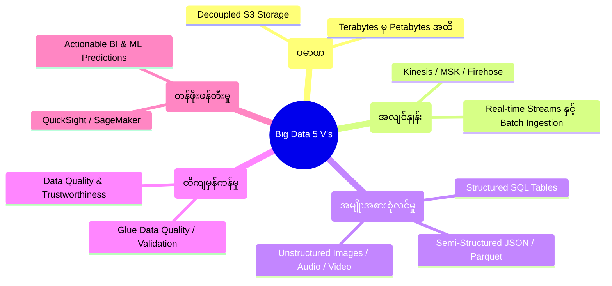
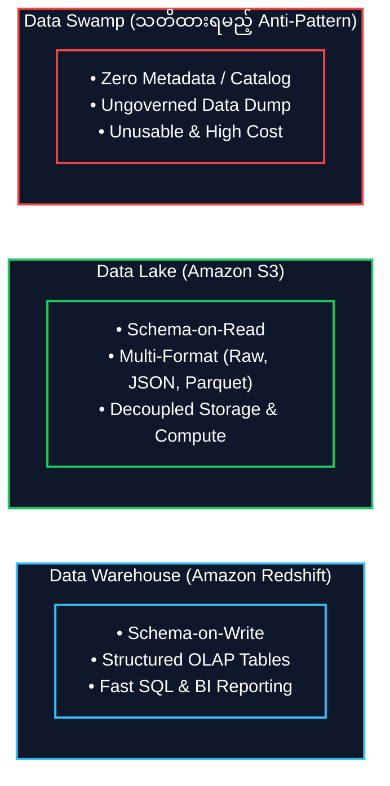
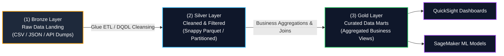

# 🌐 Big Data Fundamentals & Data Lake Architecture (ဘစ်ဒေတာ အခြေခံနှင့် Data Lake တည်ဆောက်ပုံ)

- **Category**: Fundamentals (အခြေခံ သဘောတရားများ)
- **ဘာသာစကား လမ်းညွှန်**: [English Version](file:///home/monetine/Workspace/Wathon/aws-dea-c01/content/03-concepts/big-data-fundamentals.md) | **မြန်မာဘာသာ (Burmese)**
- **Slide Reference**: Pages 12–37 in `[[AWSCertifiedDataEngineerSlides.pdf]]`
- **Hub Links**: `[[index]]` | `[[service-catalog]]` | `[[domain-1-ingestion-and-processing]]` | `[[domain-2-data-store-management]]`

---

## ၁။ Big Data ၏ အခြေခံ ဝိသေသလက္ခဏာ ၅ ရပ် (The 5 V's of Big Data)

Big Data ဆိုသည်မှာ ရိုးရိုး Database များ (RDBMS) ဖြင့် ကိုင်တွယ်ဖြေရှင်းရန် မဖြစ်နိုင်သော ပမာဏကြီးမားသည့် ဒေတာများကို ရည်ညွှန်းပြီး အောက်ပါ **5 V's** ဖြင့် အဓိပ္ပာယ်ဖွင့်ဆိုပါသည်-

1. **Volume (ပမာဏ)**: ဒေတာပမာဏသည် Gigabytes မှ Terabytes နှင့် Petabytes အထိ များပြားလာခြင်း။ AWS တွင် စျေးသက်သာပြီး အကန့်အသတ်မရှိ သိမ်းဆည်းနိုင်သော **Amazon S3** ကို Decoupled Storage အဖြစ် အသုံးပြုသည်။
2. **Velocity (စီးဆင်းမှု အလျင်နှုန်း)**: ဒေတာများ ဝင်ရောက်လာသည့် အမြန်နှုန်း။ ဥပမာ - IoT Sensors များနှင့် Clickstream ဒေတာများကို **Amazon Kinesis** သို့မဟုတ် **Amazon MSK (Kafka)** ဖြင့် Real-time ရယူခြင်း။
3. **Variety (အမျိုးအစား စုံလင်မှု)**: 
   - **Structured (ပုံစံတကျ)**: RDBMS၊ CSV၊ SQL Tables။
   - **Semi-Structured (တစ်စိတ်တစ်ပိုင်း ပုံစံရှိ)**: JSON၊ XML၊ Apache Parquet၊ ORC။
   - **Unstructured (ပုံစံမဲ့)**: ရုပ်ပုံများ၊ ဗီဒီယိုများ၊ Log ဖိုင်အကြမ်းများ။
4. **Veracity (ဒေတာ တိကျမှန်ကန်မှုနှင့် ယုံကြည်စိတ်ချရမှု)**: ဒေတာများအတွင်း Null values များ၊ ပျက်စီးနေသော ဒေတာများကို **AWS Glue Data Quality** ဖြင့် စစ်ဆေးသန့်စင်ခြင်း။
5. **Value (စီးပွားရေးဆိုင်ရာ တန်ဖိုး)**: သန့်စင်ပြီး ဒေတာများမှ Business Intelligence (BI) နှင့် Machine Learning (ML) အသုံးချမှုများ ရယူဖန်တီးခြင်း (**Amazon QuickSight**, **Amazon SageMaker**).

---

## ၂။ Data Warehouse vs. Data Lake vs. Data Swamp နှိုင်းယှဉ်ချက်

| အချက်အလက် (Characteristic) | Data Warehouse (e.g. `[[redshift]]`) | Data Lake (e.g. `[[s3]]`) | Data Swamp (အမှိုက်ပုံသဖွယ် ဖြစ်နေသော Data) |
| :--- | :--- | :--- | :--- |
| **Data Structure** | **Schema-on-Write**: ဒေတာမထည့်မီ Table Schema ကို ကြိုတင်သတ်မှတ်ရသည်။ | **Schema-on-Read**: မူရင်းဒေတာကို ကြိုတင်သိမ်းဆည်းပြီး ဖတ်ယူသည့်အခါမှ Schema သတ်မှတ်သည်။ | Governance မရှိဘဲ စည်းမဲ့ကမ်းမဲ့ စုပုံထားသော ဒေတာများ။ |
| **Storage & Compute** | Compute နှင့် Storage ကို အတူတကွ သို့မဟုတ် Managed Cluster အနေဖြင့် စီမံသည်။ | **Decoupled**: သိုလှောင်မှု (S3) နှင့် တွက်ချက်မှု (Athena/Spark) ကို သီးခြားစီ ခွဲထုတ်ထားသည်။ | Decoupled ဖြစ်သော်လည်း ရှာဖွေရယူရန် မဖြစ်နိုင်။ |
| **Data Types** | Structured (Relational / Tabular) ဒေတာများသာ။ | Structured၊ Semi-structured (JSON, Parquet)၊ Unstructured ဒေတာအားလုံး။ | မည်သည့်ဒေတာမဆို ရောထွေးနေသည်။ |
| **Governance & Catalog** | Strict ACID Transactions & Table Constraints | `[[lake-formation]]` နှင့် `[[glue]]` Data Catalog ဖြင့် စီမံခန့်ခွဲသည်။ | Catalog နှင့် Metadata မရှိပါ။ |
| **အဓိက အသုံးပြုသူများ** | Business Analysts, BI Developers, SQL Users | Data Engineers, Data Scientists, ML Engineers | မည်သူမျှ အသုံးမပြုနိုင် (Unusable)။ |

---

## ၃။ Medallion Data Lake Architecture (Tiering Strategy)

Data Lake တစ်ခုအတွင်း ဒေတာအရည်အသွေးကို အဆင့်ဆင့် မြှင့်တင်ရန်အတွက် **Bronze $\rightarrow$ Silver $\rightarrow$ Gold** အဆင့် ၃ ဆင့်ပါဝင်သော Medallion Architecture ကို အသုံးပြုပါသည်-

1. **Bronze Zone (Raw Landing Layer)**:
   - ပြင်ပ System များမှ မူရင်းအတိုင်း ဝင်ရောက်လာသော မပြုပြင်ရသေးသည့် ဒေတာအကြမ်းများ (Raw CSV, JSON, Log files)။
   - မူရင်းဒေတာကို ပြင်ဆင်ဖျက်ဆီးခွင့်မရှိပါ (Immutable Raw Storage)။
2. **Silver Zone (Processed / Standardized Layer)**:
   - Data Cleansing ပြုလုပ်ထားပြီး၊ Duplicate များကို ဖယ်ရှားကာ Schema စစ်ဆေးပြီးသော ဒေတာများ။
   - ဖတ်ရှုမှု မြန်ဆန်စေရန်အတွက် **Apache Parquet (Snappy Compressed)** ဖော်မတ်သို့ ပြောင်းလဲပြီး Date/Region အလိုက် Partition ခွဲထားသည်။
3. **Gold Zone (Curated / Business Data Marts)**:
   - လုပ်ငန်းသုံး Report များ၊ Dashboard များနှင့် ML Models များအတွက် လိုအပ်သော Aggregations (စုစုပေါင်းတွက်ချက်မှုများ) နှင့် Business Rules များကို ကြိုတင်တွက်ချက်ထားသည့် အဆင့်မြင့် ဒေတာအလွှာ။

---

## ၄။ DEA-C01 စာမေးပွဲ အဓိက အချက်အလက်များ (Exam Tips)

> [!IMPORTANT]
> **Key Exam Trigger Keywords**:
> - **"Decoupled Storage and Compute for Big Data"** $\rightarrow$ **Amazon S3 (Storage) + Amazon Athena / Amazon EMR / AWS Glue (Compute)**။
> - **"Preventing Data Swamp"** $\rightarrow$ **AWS Glue Crawlers** ဖြင့် Catalog ပြုလုပ်ခြင်း နှင့် **AWS Lake Formation** ဖြင့် ဗဟိုမှ Access Control ထိန်းချုပ်ခြင်း။
> - **"Cost-effective analytical querying over S3 data lake"** $\rightarrow$ Raw ဒေတာများကို **Apache Parquet + Snappy Compression** သို့ ပြောင်းလဲသိမ်းဆည်းခြင်း။

---

## 📌 ဆက်စပ် မှတ်စုများ (Related Notes)

- `[[data-formats-and-compression]]` — Parquet, ORC, Avro နှင့် Compression စနစ်များ
- `[[data-modeling-and-partitioning]]` — S3 Partitioning နှင့် Star Schema ပုံစံများ
- `[[data-validation-and-profiling]]` — Glue Data Quality (DQDL) ဖြင့် ဒေတာအရည်အသွေး စစ်ဆေးခြင်း
- `[[s3]]` — Amazon S3 Data Lake ဗိသုကာ
- `[[redshift]]` — Amazon Redshift Data Warehouse
