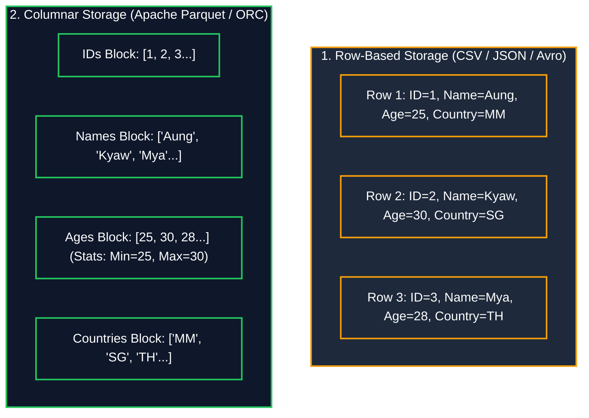

# 📄 Data Formats & Compression Codecs (ဒေတာဖော်မတ်များနှင့် ဖိသိပ်မှုစနစ်များ)

- **Category**: Fundamentals / Storage & Query Optimization
- **ဘာသာစကား လမ်းညွှန်**: [English Version](file:///home/monetine/Workspace/Wathon/aws-dea-c01/content/03-concepts/data-formats-and-compression.md) | **မြန်မာဘာသာ (Burmese)**
- **Slide Reference**: Pages 38–48 in `[[AWSCertifiedDataEngineerSlides.pdf]]`
- **Hub Links**: `[[index]]` | `[[service-catalog]]` | `[[athena]]` | `[[glue]]` | `[[redshift]]` | `[[emr]]`

---

## ၁။ Row-Based vs. Columnar Storage Formats (အတန်းလိုက် vs ကော်လံလိုက် သိမ်းဆည်းမှု ပုံစံများ)

Big Data Analytics တွင် သိုလှောင်မှု ကုန်ကျစရိတ်နှင့် Query တွက်ချက်မှု အမြန်နှုန်းတို့သည် ဒေတာဖော်မတ် ရွေးချယ်မှုအပေါ် များစွာ မူတည်ပါသည်-

### အဓိက ကွာခြားချက်များနှင့် သဘောတရားများ
1. **Row-Based Storage (အတန်းလိုက် သိမ်းဆည်းခြင်း)**:
   - ဒေတာ Record တစ်ခုလုံးကို Memory / Disk ပေါ်တွင် ဆက်တိုက်သိမ်းဆည်းသည်။
   - **အားသာချက်**: Record အသစ်များ အဆက်မပြတ် ထည့်သွင်းခြင်း (High-write transaction / Append-heavy) အတွက် မြန်ဆန်သည်။
   - **အားနည်းချက်**: ကော်လံ ၁ ခုတည်းကို တွက်ချက်ရန် (ဥပမာ `SELECT AVG(Age)`) ဒေတာဖိုင်တစ်ခုလုံးရှိ ကော်လံအားလုံးကို ဖတ်ရှုရသဖြင့် I/O ကုန်ကျစရိတ် မြင့်မားသည်။
2. **Columnar Storage (ကော်လံလိုက် သိမ်းဆည်းခြင်း - Parquet / ORC)**:
   - တူညီသော Column မှ Data များကို Disk ပေါ်တွင် အတူတကွ စုစည်းသိမ်းဆည်းသည်။
   - **အားသာချက်**:
     - **Column Projection**: မေးမြန်းထားသော ကော်လံများကိုသာ ရွေးချယ်ဖတ်ရှုနိုင်သည် (Selective reading)။
     - **High Compression Ratio**: တူညီသော ဒေတာအမျိုးအစား (Data types) များ စုစည်းနေသဖြင့် Compression ပိုမိုကောင်းမွန်ပြီး သိုလှောင်မှု ၇၅% မှ ၉၀% အထိ သက်သာစေသည်။
     - **Predicate Pushdown / Statistics**: Data Block တစ်ခုချင်းစီတွင် Min/Max တန်ဖိုးများ ပါရှိသဖြင့် မသက်ဆိုင်သော Block များကို ကျော်ဖတ်နိုင်သည်။

---

## ၂။ Data Formats နှိုင်းယှဉ်ချက် ဇယား (Complete Format Matrix)

| Data Format | Storage Layout | Schema Type | Splittable? (ခွဲခြမ်းနိုင်မှု) | အဓိက အသုံးပြုသည့်နေရာ (Best AWS Fit) |
| :--- | :--- | :--- | :--- | :--- |
| **CSV / TSV** | Row-based (Text) | Schema-on-Read | ✅ Yes (Uncompressed ဖြစ်ပါက) | ပြင်ပဒေတာ အကြမ်းများ၊ စစ်ဆေးရန်ဖိုင်များ |
| **JSON** | Row-based (Text) | Semi-Structured | ⚠️ Multiline (No) / JSON Lines (Yes) | API Payload များ၊ Web Logs၊ Event Messages |
| **Apache Avro** | Row-based (Binary) | Schema In-File (JSON) | ✅ **Yes** | **Amazon MSK (Kafka)** Streaming၊ Row-level Write များ |
| **Apache Parquet** | **Columnar** (Binary) | Self-Describing | ✅ **Yes** | **Amazon Athena, AWS Glue, EMR Spark, Redshift Spectrum** |
| **Apache ORC** | **Columnar** (Binary) | Self-Describing | ✅ **Yes** | Apache Hive၊ Presto နှင့် EMR Big Data Workloads |

---

## ၃။ Compression Codecs နှိုင်းယှဉ်ချက် (ဖိသိပ်မှု စနစ်များ)

Data Processing Engine များ (Spark, Athena, MapReduce) သည် ဖိုင်ကြီးများကို Worker Node များစွာပေါ်သို့ ခွဲခြမ်းကာ **Parallel Computing** ဖြင့် တွက်ချက်ရသဖြင့် Compression Codec ၏ **Splittability** သည် အလွန်အရေးကြီးပါသည်-

| Compression Codec | Splittable? | Compression Ratio | CPU Processing Speed | အကြံပြုထားသော AWS အသုံးချမှု |
| :--- | :--- | :--- | :--- | :--- |
| **Snappy** | ❌ No *(Parquet အတွင်း Block ပိုင်းထားပါက Split ရပါသည်)* | အသင့်အတင့် (Moderate) | ⚡ **Ultra Fast (အလွန်မြန်)** | **Parquet / Glue / Athena / Spark အတွက် Default ရွေးချယ်မှု** |
| **Gzip** | ❌ **No (Splittable မဟုတ်ပါ)** | မြင့်မားသည် (High) | အသင့်အတင့် (Moderate) | Single-file Log Archiving၊ HTTP Payload များ |
| **Zstandard (Zstd)** | ✅ **Yes (Splittable)** | အလွန်မြင့်မားသည် (High) | 🚀 Fast (အလွန်မြန်) | ခေတ်မီ Parquet ဖိုင်များနှင့် S3 Cold Storage |
| **Bzip2** | ✅ **Yes (Splittable)** | အမြင့်ဆုံး (Maximum) | 🐢 Slow (နှေးကွေးသည်) | Raw Text ဖိုင်ကြီးများကို Split လုပ်ရန် မဖြစ်မနေ လိုအပ်သည့်နေရာများ |

---

## ၄။ DEA-C01 စာမေးပွဲ အဓိက မေးခွန်းပုံစံများနှင့် ထောင်ချောက်များ

> [!IMPORTANT]
> **စာမေးပွဲတွင် မဖြစ်မနေ မှတ်သားရမည့် အချက်များ (Top Exam Patterns)**:
> 1. **Parquet + Snappy Optimization**:
>    - DEA-C01 တွင် အမေးအများဆုံး မေးခွန်းမှာ **"How to minimize Amazon Athena query costs and optimize S3 storage?"** ဖြစ်သည်။
>    - အဖြေမှာ အမြဲတစေ ဒေတာများကို **Apache Parquet ဖော်မတ်သို့ ပြောင်းလဲပြီး Snappy compression အသုံးပြုခြင်း** ဖြစ်သည်။
> 2. **Splittable Compression Rule**:
>    - အကယ်၍ Raw Text / CSV ဖိုင်ကြီးများကို S3 တွင်ထားပြီး Parallel Processing ဖြင့် ဖတ်လိုပါက **Gzip မသုံးရပါ** (Gzip သည် Splittable မဟုတ်သဖြင့် Worker Node ၁ ခုတည်းကသာ ဖတ်ရပြီး နှေးကွေးစေသည်)။ Splittable ဖြစ်သော **Bzip2** သို့မဟုတ် **Parquet (Snappy)** သို့ ပြောင်းလဲရမည်။

---

## 📌 ဆက်စပ် မှတ်စုများ (Related Notes)

- `[[big-data-fundamentals]]` — Big Data နှင့် Data Lake အခြေခံသဘောတရားများ
- `[[data-modeling-and-partitioning]]` — S3 Partition Prefix များနှင့် Data Modeling
- `[[athena]]` — Amazon Athena ဖြင့် Parquet ဒေတာများကို Query ပြုလုပ်ခြင်း
- `[[glue]]` — AWS Glue ETL ဖြင့် ဖော်မတ်ပြောင်းလဲခြင်း (CSV $\rightarrow$ Parquet)
