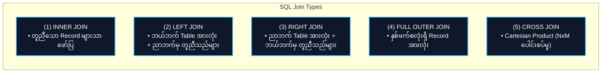

# 📊 SQL Review & Version Control (Git) (SQL နှင့် Version Control အခြေခံ)

- **Category**: Fundamentals (အခြေခံ သဘောတရားများ)
- **ဘာသာစကား လမ်းညွှန်**: [English Version](file:///home/monetine/Workspace/Wathon/aws-dea-c01/content/03-concepts/sql-and-version-control-review.md) | **မြန်မာဘာသာ (Burmese)**
- **Slide Reference**: Pages 51–75 in `[[AWSCertifiedDataEngineerSlides.pdf]]`
- **Hub Links**: `[[index]]` | `[[service-catalog]]` | `[[athena]]` | `[[redshift]]`

---

## ၁။ SQL Window Functions Review (ခွဲခြမ်းစိတ်ဖြာ SQL လုပ်ဆောင်ချက်များ)

Window Functions များသည် `GROUP BY` ကဲ့သို့ Row များကို ပေါင်းစည်းမပစ်ဘဲ သက်ဆိုင်ရာ Partition အလိုက် အဆင့်သတ်မှတ်ခြင်းနှင့် တွက်ချက်ခြင်းများကို လုပ်ဆောင်ပေးပါသည်-

```sql
SELECT 
    employee_id,
    department_id,
    salary,
    RANK() OVER (PARTITION BY department_id ORDER BY salary DESC) as salary_rank,
    DENSE_RANK() OVER (PARTITION BY department_id ORDER BY salary DESC) as dense_rank,
    AVG(salary) OVER (PARTITION BY department_id) as dept_avg_salary
FROM employees;
```

### အသုံးများသော Window Functions များနှင့် ကွာခြားချက်များ
1. **`ROW_NUMBER()`**: Partition တစ်ခုအတွင်းရှိ Row တစ်ခုချင်းစီကို ၁ မှ စတင်၍ ထူးခြားသော အစဉ်လိုက်နံပါတ် သတ်မှတ်ပေးသည်။
2. **`RANK()`**: တန်ဖိုးတူညီပါက အဆင့်တူပေးသော်လည်း နောက်နံပါတ်ကို ကျော်ခွသွားသည် (ဥပမာ `1, 2, 2, 4`)။
3. **`DENSE_RANK()`**: တန်ဖိုးတူညီသော်လည်း အဆင့်နံပါတ်ကို ကျော်မသွားဘဲ ဆက်တိုက်သတ်မှတ်သည် (ဥပမာ `1, 2, 2, 3`)။
4. **`LAG(col, offset)` / `LEAD(col, offset)`**: လက်ရှိ Row ၏ ရှေ့ သို့မဟုတ် နောက်တွင် ရှိသော Row တန်ဖိုးများကို ယူဆောင်နှိုင်းယှဉ်ခြင်း (ဥပမာ ပြီးခဲ့သည့်လနှင့် ယခုလ အရောင်းပမာဏ နှိုင်းယှဉ်ခြင်း)။

---

## ၂။ SQL Join Types Matrix (ဇယားများ ပေါင်းစပ်ခြင်း)



| Join အမျိုးအစား | ရှင်းလင်းချက် (Description) | Data Engineering သတိပြုရန် |
| :--- | :--- | :--- |
| **INNER JOIN** | Table နှစ်ခုစလုံးတွင် Key ကိုက်ညီသော Record များကိုသာ ထုတ်ပေးသည်။ | Data loss မဖြစ်စေရန် Data types ကိုက်ညီရမည်။ |
| **LEFT OUTER JOIN** | ဘယ်ဘက် Table ရှိ Record အားလုံးနှင့် ညာဘက်မှ ကိုက်ညီသည်များကို ထုတ်ပေးသည် (မကိုက်ညီပါက NULL ဖြစ်သည်)။ | Dimension Table များနှင့် ချိတ်ဆက်ရာတွင် အသုံးများသည်။ |
| **FULL OUTER JOIN** | မည်သည့်ဘက်တွင်မဆို ကိုက်ညီမှုရှိသော Record အားလုံးကို ထုတ်ပေးသည်။ | Data reconciliation နှင့် mismatch စစ်ဆေးရာတွင် သုံးသည်။ |
| **CROSS JOIN** | Table A ရှိ Row တိုင်းကို Table B ရှိ Row တိုင်းနှင့် ပေါင်းစပ်သည် ($N \times M$)။ | ကြီးမားသော Dataset များတွင် ရှောင်ရှားရမည် (Out of Memory ဖြစ်စေနိုင်သည်)။ |

---

## ၃။ Data Engineering တွင် Git Version Control အသုံးပြုမှု

AWS Data Engineering ပရောဂျက်များတွင် အောက်ပါ အရာများကို Git ဖြင့် Version Control ပြုလုပ်ထိန်းသိမ်းရပါသည်-
- **Infrastructure as Code (IaC)**: AWS CloudFormation၊ AWS SAM Templates၊ AWS CDK Stacks။
- **Data Pipeline Code**: AWS Glue PySpark Scripts၊ AWS Lambda Handlers၊ Amazon MWAA (Airflow) DAGs။
- **Database Migrations & Schemas**: DDL Scripts၊ Flyway/Liquibase migration files။

### မကြာခဏ အသုံးပြုသော Git Commands များ
- `git commit` / `git push`: ပြင်ဆင်ချက်များကို Local မှ Remote Repository သို့ တင်ပို့ခြင်း။
- `git branch` / `git merge`: Feature အသစ်များကို ခွဲထုတ်ရေးသားပြီး Main Pipeline သို့ ပေါင်းစည်းခြင်း။
- `git rebase`: Commit History ကို သပ်ရပ်ရှင်းလင်းစေရန် ပေါင်းစည်းခြင်း။

---

## 📌 ဆက်စပ် မှတ်စုများ (Related Notes)

- `[[athena]]` — Amazon Athena တွင် ANSI SQL Window Functions များ အသုံးပြုခြင်း
- `[[redshift]]` — Amazon Redshift SQL Optimization နှင့် Join Performance
- `[[cdk-cloudformation]]` — CloudFormation & AWS CDK ဖြင့် Infrastructure Versioning ပြုလုပ်ခြင်း
